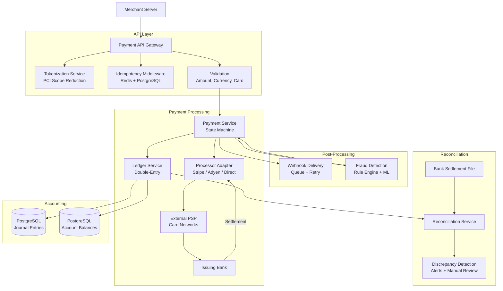
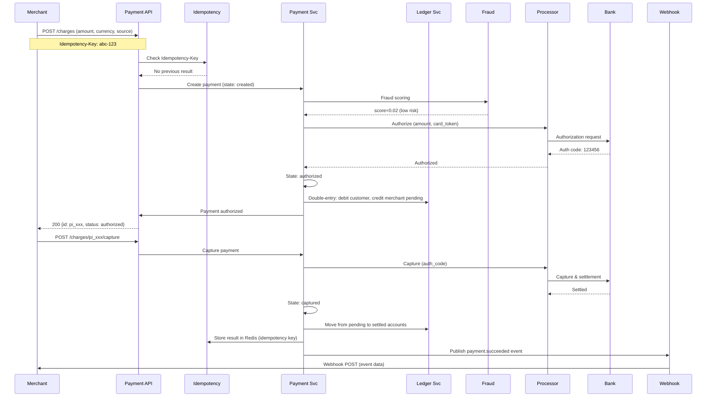

# Design a Payment System (Stripe-like)

## Requirements

- Payment processing flow: API → processor → bank (authorization + capture + settlement)
- Idempotency via Idempotency-Key header, retry safety
- Double-entry ledger system for accounting accuracy
- Reconciliation: batch settlement, discrepancy detection
- Webhook delivery with retry and deduplication
- Fraud detection: rule engine + ML scoring
- Multi-currency support with FX conversion
- PCI compliance scope reduction via tokenization
- 10M transactions/day, 99.999% durability, < 100ms p95 latency

## Architecture Diagram



## Core Components

| Component | Description |
|-----------|-------------|
| **Tokenization Service** | Replaces raw PAN with a Stripe-like `tok_xxx` token; PCI DSS scope is reduced since raw card data never reaches merchant servers |
| **Idempotency Middleware** | Checks Redis for a previous result keyed by `Idempotency-Key`; returns cached response on retry, ensuring safe retries |
| **Payment Service** | Finite state machine: `created → authorized → captured → settled` (or failed/refunded/chargeback) |
| **Ledger Service** | Double-entry accounting: every transaction debits one account and credits another; provides audit trail and balance integrity |
| **Processor Adapter** | Abstracts the external PSP (Stripe, Adyen, direct acquirer); handles different protocols, retries, and timeouts |
| **Fraud Detection** | Two-tier: (1) rule engine (velocity, country mismatch, amount thresholds) + (2) ML model (XGBoost/DNN scoring transaction features) |
| **Webhook Delivery** | Publisher-subscriber: events (payment.succeeded, chargeback.created) delivered to merchant webhooks; retry with exponential backoff + dead letter queue |
| **Reconciliation Service** | Compares internal ledger with bank settlement files; detects missing, duplicate, or mis-amounted transactions |
| **Multi-Currency Engine** | Handles FX conversion using real-time rates; supports settlement currency vs transaction currency separation |

## Data Flow



## Database Schema

### Payments Table (PostgreSQL)
```sql
CREATE TABLE payments (
    id                UUID PRIMARY KEY DEFAULT gen_random_uuid(),
    merchant_id       BIGINT NOT NULL,
    amount            BIGINT NOT NULL,            -- in smallest currency unit (cents)
    currency          VARCHAR(3) NOT NULL,
    status            VARCHAR(20) NOT NULL DEFAULT 'created',
    -- states: created, authorized, captured, settled, failed, refunded, chargebacked
    source_type       VARCHAR(20),                -- card, bank_account, wallet
    source_token      VARCHAR(100),
    processor         VARCHAR(50),
    processor_id      VARCHAR(100),               -- PSP transaction ID
    auth_code         VARCHAR(50),
    idempotency_key   VARCHAR(100) UNIQUE,
    metadata          JSONB,
    created_at        TIMESTAMP DEFAULT NOW(),
    updated_at        TIMESTAMP DEFAULT NOW()
);
CREATE INDEX idx_payments_merchant ON payments(merchant_id, created_at DESC);
CREATE INDEX idx_payments_idempotency ON payments(idempotency_key);
CREATE INDEX idx_payments_processor ON payments(processor, processor_id);
```

### Double-Entry Ledger (PostgreSQL)
```sql
CREATE TYPE entry_type AS ENUM ('debit', 'credit');

CREATE TABLE accounts (
    id              BIGSERIAL PRIMARY KEY,
    name            VARCHAR(100) NOT NULL,
    type            VARCHAR(20) NOT NULL,  -- asset, liability, revenue, expense, equity
    currency        VARCHAR(3) NOT NULL,
    balance         BIGINT NOT NULL DEFAULT 0,
    version         INT NOT NULL DEFAULT 1,   -- optimistic lock
    created_at      TIMESTAMP DEFAULT NOW(),
    updated_at      TIMESTAMP DEFAULT NOW()
);

CREATE TABLE journal_entries (
    id              BIGSERIAL PRIMARY KEY,
    payment_id      UUID REFERENCES payments(id),
    description     TEXT,
    entry_date      DATE NOT NULL,
    created_at      TIMESTAMP DEFAULT NOW()
);

CREATE TABLE journal_lines (
    id              BIGSERIAL PRIMARY KEY,
    journal_id      BIGINT REFERENCES journal_entries(id),
    account_id      BIGINT REFERENCES accounts(id),
    entry_type      entry_type NOT NULL,
    amount          BIGINT NOT NULL,
    currency        VARCHAR(3) NOT NULL,
    created_at      TIMESTAMP DEFAULT NOW()
);
-- Constraint: SUM(debits) = SUM(credits) per journal_id
```

### Webhook Deliveries Table (PostgreSQL)
```sql
CREATE TABLE webhook_deliveries (
    id              BIGSERIAL PRIMARY KEY,
    merchant_id     BIGINT NOT NULL,
    event_type      VARCHAR(50) NOT NULL,      -- payment.succeeded, chargeback.created
    event_data      JSONB NOT NULL,
    webhook_url     VARCHAR(500) NOT NULL,
    status          VARCHAR(20) DEFAULT 'pending',  -- pending, delivered, failed, dead_letter
    attempt_count   INT DEFAULT 0,
    last_attempt_at TIMESTAMP,
    next_attempt_at TIMESTAMP,
    created_at      TIMESTAMP DEFAULT NOW()
);
CREATE INDEX idx_webhook_pending ON webhook_deliveries(status, next_attempt_at);
```

### Fraud Rules Table (PostgreSQL)
```sql
CREATE TABLE fraud_rules (
    id              BIGSERIAL PRIMARY KEY,
    name            VARCHAR(100),
    rule_type       VARCHAR(50),  -- velocity, amount, country_mismatch, card_bin
    conditions      JSONB NOT NULL,  -- {field: "amount", op: "gt", value: 10000}
    action          VARCHAR(20) DEFAULT 'review',  -- allow, review, block
    priority        INT DEFAULT 100,
    is_active       BOOLEAN DEFAULT TRUE,
    created_at      TIMESTAMP DEFAULT NOW()
);
```

## API Design

### Payment APIs
```
POST   /api/v1/charges                   Create a charge (authorization)
POST   /api/v1/charges/{id}/capture      Capture an authorized payment
POST   /api/v1/charges/{id}/refund       Refund a captured payment
GET    /api/v1/charges/{id}              Retrieve payment details
POST   /api/v1/charges/{id}/void         Void an uncaptured authorization
```

### Tokenization
```
POST   /api/v1/tokens                    Create card token (PCI-compliant)
GET    /api/v1/tokens/{id}               Retrieve token (masked)
```

### Customers
```
POST   /api/v1/customers                 Create customer
GET    /api/v1/customers/{id}            Get customer
POST   /api/v1/customers/{id}/sources    Attach payment source
DELETE /api/v1/customers/{id}/sources/{srcId}  Detach source
```

### Webhooks
```
POST   /api/v1/webhook-endpoints         Register webhook endpoint
GET    /api/v1/webhook-endpoints         List webhooks
DELETE /api/v1/webhook-endpoints/{id}    Delete webhook
```

### Reconciliation
```
GET    /api/v1/reconciliation/settlements       List settlement files
GET    /api/v1/reconciliation/discrepancies     List discrepancies found
POST   /api/v1/reconciliation/resolve/{id}     Resolve a discrepancy
```

### Balance & Ledger
```
GET    /api/v1/balance                         Get merchant balance
GET    /api/v1/ledger/transactions             List ledger transactions
GET    /api/v1/ledger/journal-entries          List journal entries
```

## Deep Dive Questions

1. **How does idempotency work in a payment system?**
   Merchant sends `Idempotency-Key: uuid` header. The server checks if a result already exists for that key in Redis, returning the cached response. First-time requests lock on the key, process, and store the result. TTL is 24h. This prevents duplicate charges on network retries.

2. **What is double-entry accounting and why is it critical?**
   Every transaction has a debit and a credit that must balance. For a $100 sale: debit (increase) merchant receivable $100, credit (decrease) customer balance $100. This ensures total debits = total credits always. Provides a complete audit trail and prevents money from being created or destroyed.

3. **How does reconciliation detect discrepancies?**
   Batch settlement files from banks are parsed and compared against internal payment records. Mismatches flagged: missing transactions (bank has it, we don't), duplicates (we have it twice), amount mismatches, FX rate differences. Alerts trigger manual review or auto-resolve rules.

4. **How is fraud detected in real-time?**
   Two-tier: (1) Rule engine checks velocity (e.g. >5 transactions/min), amount thresholds, BIN country mismatch, AVS mismatch. (2) ML model scores each transaction on features like device fingerprint, IP reputation, user history, amount patterns. Scores > threshold = block/review.

5. **How does multi-currency support work?**
   Transactions can be in a different currency than settlement. FX rate is locked at authorization time. Ledger holds balances per currency. Conversion uses real-time rates from FX providers with a spread. Merchant can settle in their base currency.

6. **How does PCI compliance scope reduction work via tokenization?**
   Raw card numbers (PAN) are captured by the tokenization service (PCI-compliant) and replaced with a token. Merchant servers never see, store, or transmit PAN. They only store and send tokens. This shrinks PCI scope from the merchant's entire infrastructure to just the tokenization service.

7. **How does the webhook delivery system guarantee delivery?**
   Events are written to a queue with persistence. Webhook deliverer retries with exponential backoff (1min, 2min, 4min, ..., max 3 days). After max retries, events go to a dead-letter queue. Merchants can poll failed events. Each event has a unique ID for deduplication on the merchant side.

## Tradeoffs

| Decision | Tradeoff |
|----------|----------|
| **Async processing with idempotency** | Near-real-time (sub-second) vs synchronous guarantee; idempotency key solves retries safely |
| **PostgreSQL for ledger** | ACID compliance, joins, auditing vs scaling writes; partition by merchant_id |
| **Tokenization-only PCI scope** | Reduces merchant compliance cost vs need for PCI-compliant token service infrastructure |
| **Batch reconciliation (daily)** | Simple, proven pattern vs delayed discrepancy detection (up to 24h) |
| **ML fraud vs rule-only** | Lower false positives, catches novel patterns vs black-box decisions, latency for inference |
| **Ledger = all-or-nothing debit/credit** | Perfect audit trail vs contention on account rows; use optimistic locking |

## Follow-up Questions

- How would you design a subscription/billing system (recurring payments) on top of this?
- How would you handle chargebacks and dispute resolution in the ledger?
- How would you build a payment gateway that routes to multiple processors with failover?
- How do you ensure exactly-once semantics for webhook delivery?
- How would you support marketplace payments (split payments, platform fees)?
- How would you design real-time balance checking across multiple currencies?
- How do you handle bank-level reconciliation when settlement files arrive with 2-3 day lag?
