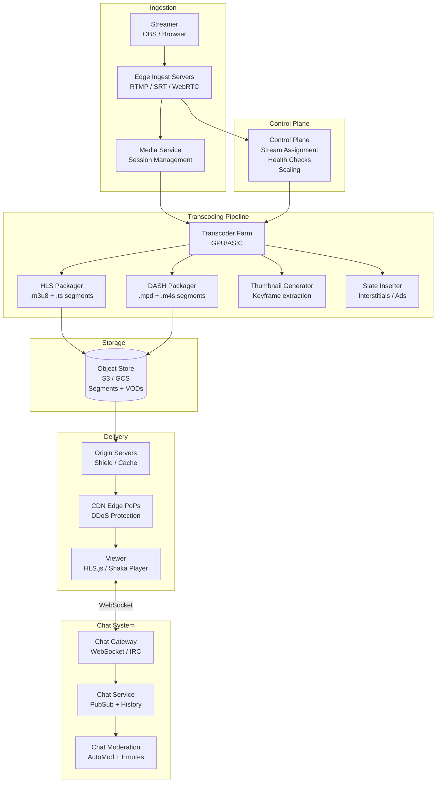
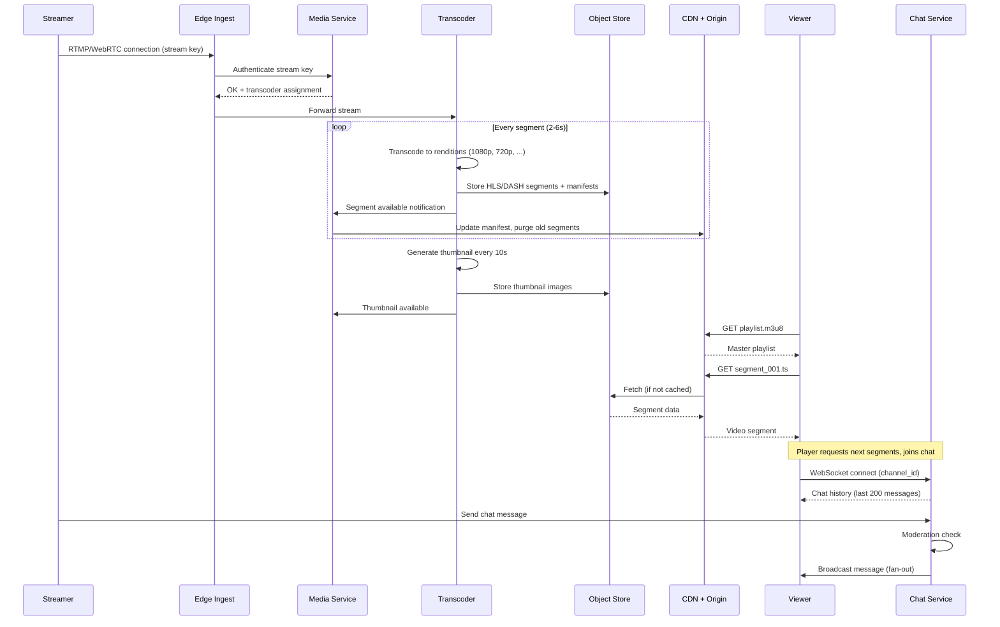

# Design a Live Streaming Platform (Twitch / YouTube Live)

## Requirements

- Video ingestion: RTMP, SRT, WebRTC
- Transcoding pipeline: adaptive bitrate (HLS/DASH), thumbnail generation, slate insertion
- CDN delivery: edge ingest, latency optimization, origin shielding
- Chat system: WebSocket, IRC-like, moderation, emotes
- Viewer count with high concurrency (1M+ concurrent viewers)
- VOD recording and archive for past broadcasts
- Latency tiers: ultra-low (< 1s), low (< 5s), normal (< 15s)
- 10M streamers, 100M daily active viewers

## Architecture Diagram



## Core Components

| Component | Description |
|-----------|-------------|
| **Edge Ingest Servers** | Accept live video from streamers via RTMP (flash), SRT (reliable UDP), or WebRTC (ultra-low latency). Terminate connections at edge PoPs close to streamers |
| **Media Service** | Manages stream sessions: authentication, key rotation, stream key validation. Routes ingest to assign transcoder. Detects stream start/stop events |
| **Transcoder Farm** | GPU/ASIC-based video transcoding pipeline. Takes single input stream and produces multiple renditions (1080p, 720p, 480p, 360p) at various bitrates. Also generates thumbnails and slates |
| **HLS/DASH Packager** | Segments transcoded video into TS or MP4 chunks (~2-6s), generates manifest files (.m3u8 / .mpd). Supports CMAF for HLS+DASH unified packaging |
| **CDN Edge PoPs** | Global CDN cache layers. Edge ingest close to streamer, origin shield to reduce load on origin. DDoS protection and hot-cache optimization |
| **VOD Recorder** | Archives transcoded segments to object storage as the stream progresses. When stream ends, concatenates segments into a VOD asset for replay |
| **Chat Gateway** | WebSocket server cluster (can also support IRC protocol). Handles millions of concurrent connections, fan-out messages per channel |
| **Chat Service** | PubSub-based message relay. Each channel has a circular buffer in Redis for history. Messages are moderated before broadcast |
| **Chat Moderation** | Rule-based AutoMod (ban words, links, spam) + ML toxicity detection. Emote parsing and substitution. Timeout/ban enforcement |
| **Control Plane** | Orchestrates ingest → transcoder assignment. Monitors health, auto-scales transcoder farms, handles failover. Provides stream status API |

## Data Flow



## Database Schema

### Stream Sessions (PostgreSQL)
```sql
CREATE TABLE stream_sessions (
    id                  UUID PRIMARY KEY DEFAULT gen_random_uuid(),
    streamer_id         BIGINT NOT NULL REFERENCES users(id),
    title               VARCHAR(200),
    game_category       VARCHAR(100),
    stream_key          VARCHAR(100) NOT NULL,
    status              VARCHAR(20) DEFAULT 'live',     -- live, ended, error
    ingest_node         VARCHAR(100),
    transcoder_id       VARCHAR(100),
    started_at          TIMESTAMP DEFAULT NOW(),
    ended_at            TIMESTAMP,
    max_viewer_count    INT DEFAULT 0,
    is_rerun            BOOLEAN DEFAULT FALSE
);
CREATE INDEX idx_sessions_status ON stream_sessions(status, started_at DESC);
CREATE INDEX idx_sessions_streamer ON stream_sessions(streamer_id, started_at DESC);
```

### Transcoding Jobs (PostgreSQL)
```sql
CREATE TABLE transcoding_jobs (
    id              BIGSERIAL PRIMARY KEY,
    session_id      UUID REFERENCES stream_sessions(id),
    status          VARCHAR(20) DEFAULT 'running',  -- running, complete, failed
    renditions      JSONB,         -- ["1080p60", "720p30", "480p30", "360p30"]
    input_codec     VARCHAR(20),
    output_bucket   VARCHAR(200),
    started_at      TIMESTAMP DEFAULT NOW(),
    completed_at    TIMESTAMP
);
```

### VOD Assets (PostgreSQL)
```sql
CREATE TABLE vod_assets (
    id              UUID PRIMARY KEY DEFAULT gen_random_uuid(),
    session_id      UUID REFERENCES stream_sessions(id),
    streamer_id     BIGINT NOT NULL REFERENCES users(id),
    title           VARCHAR(200),
    duration_secs   INT,
    storage_path    VARCHAR(500),
    thumbnails      JSONB,         -- {320x180: "url", 640x360: "url", ...}
    status          VARCHAR(20) DEFAULT 'processing',  -- processing, ready, archived
    created_at      TIMESTAMP DEFAULT NOW()
);
CREATE INDEX idx_vods_streamer ON vod_assets(streamer_id, created_at DESC);
```

### Chat Messages (Cassandra for high write throughput)
```sql
CREATE TABLE chat_messages (
    channel_id      UUID,               -- stream session ID
    message_id      TIMEUUID,           -- time-sorted UUID
    user_id         BIGINT,
    username        VARCHAR(50),
    body            TEXT,
    is_emote        BOOLEAN DEFAULT FALSE,
    is_action       BOOLEAN DEFAULT FALSE,
    moderation_action VARCHAR(20),      -- approved, removed, timed_out
    created_at      TIMESTAMP,
    PRIMARY KEY ((channel_id), message_id)
) WITH CLUSTERING ORDER BY (message_id DESC);
```

### Viewer Counts (Redis)
```
Key: stream:{session_id}:viewer_count
Type: Sorted Set (or HyperLogLog for estimated unique viewers)
Score: timestamp for time-decay counting
```

## API Design

### Stream Management
```
POST   /api/v1/streams/start              Start stream (returns ingest URL)
POST   /api/v1/streams/stop               End stream
GET    /api/v1/streams/live               List live streams
GET    /api/v1/streams/{id}               Get stream details
PUT    /api/v1/streams/{id}/metadata      Update title, category
```

### Playback
```
GET    /api/v1/streams/{id}/playlist      Get HLS master playlist URL
GET    /api/v1/streams/{id}/playlist.m3u8 Master playlist (HLS)
GET    /api/v1/streams/{id}/rendition/{name}/segment/{seq}.ts  Segment
GET    /api/v1/streams/{id}/thumbnail     Current thumbnail
```

### VOD
```
GET    /api/v1/vods/{id}                  Get VOD details
GET    /api/v1/vods/{id}/playlist         VOD HLS playlist
GET    /api/v1/streamers/{id}/vods        List streamer's VODs
DELETE /api/v1/vods/{id}                  Delete VOD
```

### Chat
```
WS     /ws/v1/chat/{channel_id}           WebSocket chat connection
GET    /api/v1/chat/{channel_id}/history  Get chat history (last N messages)
POST   /api/v1/chat/{channel_id}/message  Send message
POST   /api/v1/chat/{channel_id}/timeout  Timeout user (moderation)
POST   /api/v1/chat/{channel_id}/ban      Ban user
```

### Viewer Count
```
GET    /api/v1/streams/{id}/viewers       Current viewer count
```

## Deep Dive Questions

1. **How does adaptive bitrate streaming (HLS/DASH) work?**
   Source stream is transcoded into multiple renditions (1080p@8Mbps, 720p@5Mbps, 480p@2.5Mbps, 360p@1Mbps). A master manifest lists all renditions. The player monitors bandwidth and quality, switching renditions seamlessly at segment boundaries. HLS uses .m3u8 + .ts segments; DASH uses .mpd + .m4s segments.

2. **How do you handle ultra-low latency streaming (< 1s)?**
   Use WebRTC for ingest (eliminates RTMP buffering), shorter segments (1-2s instead of 6s), chunked transfer encoding (CMAF chunks as they're produced), and WebRTC playback. Tradeoff: higher CPU cost for transcoding, less CDN-friendly (requires WebRTC-compatible edge).

3. **How do you scale chat for 1M+ concurrent viewers on one stream?**
   Fan-out via Redis PubSub channels per stream. Chat gateway nodes share a subscription ring. For massive channels, use a tiered approach: moderation happens once, then message is broadcast to all gateway nodes which each handle ~10K WebSocket connections. Use backpressure and rate limiting per user.

4. **How is viewer count calculated accurately?**
   Edge sends heartbeat per viewer connection. The control plane aggregates heartbeats per stream using HyperLogLog (for unique count) or exact sets (for concurrent count). Both views are provided: "viewers" (concurrent) and "unique viewers" (session total). Redis sorted sets with TTL handle staleness.

5. **How does VOD recording work without gaps?**
   Transcoder writes segments directly to object storage as they're produced. The VOD recorder tracks segment sequence numbers. If the stream ends, it finalizes the manifest with `<span>` tags for gaps. If the streamer reconnects after disconnect, segments continue in the same VOD asset with a gap marker.

6. **How does origin shielding reduce CDN costs?**
   Instead of every edge PoP fetching from origin independently, a "shield" layer sits between PoPs and origin. Multiple PoPs in a region hit the same shield server, which fetches from origin once. This reduces origin load by ~10x and lowers egress costs.

7. **How does the moderation system handle chat at scale?**
   Two-tier: (1) Pre-moderation: rules applied at message ingest (blocked words, links, spam patterns using regex + allowlist). (2) Post-moderation: ML toxicity classifier scores messages asynchronously. AutoMod enforces timeouts/bans. Emotes are parsed client-side via a sprite sheet for performance.

## Tradeoffs

| Decision | Tradeoff |
|----------|----------|
| **HLS vs DASH** | HLS: Apple ecosystem, simpler; DASH: codec-agnostic, more flexible — use both via CMAF packaging |
| **WebRTC ultra-low latency** | Sub-second latency vs higher CPU cost, less CDN-friendly, more complex player requirements |
| **HyperLogLog for viewer count** | Memory efficient (12KB per stream) vs approximate (2-3% error) |
| **Object store segments vs live origin** | Scalable, cheap storage vs segment delivery latency from cold storage |
| **Transcoder GPU vs CPU** | GPU: 10x faster, lower cost per stream vs less flexibility in codec selection |
| **Single proto (RTMP) vs multi-proto** | RTMP: mature, widely supported vs WebRTC/SRT: lower latency, better reliability |

## Follow-up Questions

- How would you design a clip system (highlight extraction from live streams)?
- How would you implement ad insertion during live streams without interrupting the stream?
- How would you design a stream health monitoring system (bitrate drops, frame drops, disconnect alerts)?
- How would you support multi-track streaming (e.g. camera + screen share)?
- How does the system handle a sudden spike of viewers when a popular streamer goes live?
- How would you design a subscription/badge system that persists across chats?
