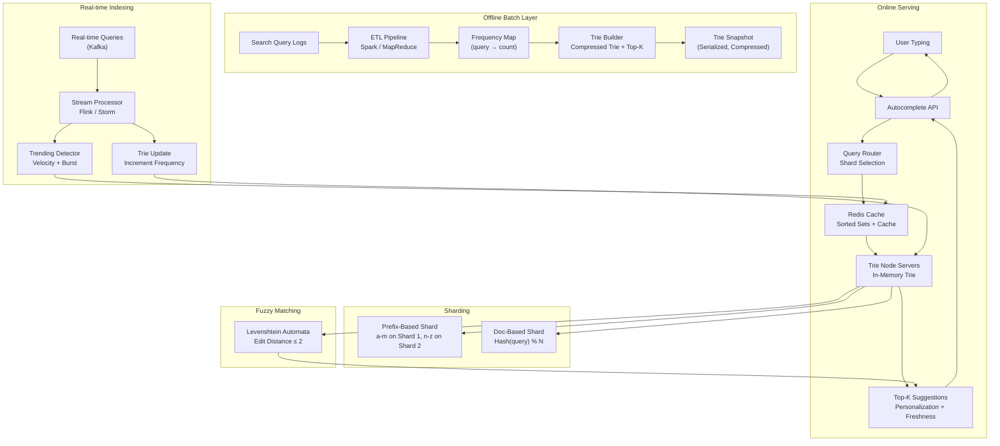
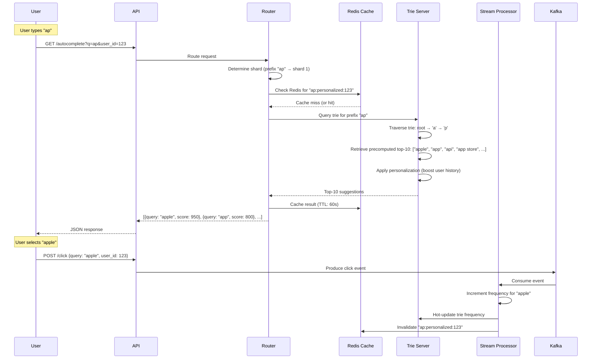

# Design Search Autocomplete / Typeahead

## Requirements

- Trie data structure (compressed trie, suffix tree) for prefix matching
- Top-K suggestions: frequency-based ranking, personalization, freshness
- Real-time indexing: new queries, trending updates
- Sharding strategies: prefix-based, doc-based, hybrid
- Redis caching (sorted sets, leaderboard pattern)
- Fuzzy matching: edit distance, Levenshtein automata
- Offline batch computation + online serving architecture
- < 50ms p99 latency, 10K QPS, 1B queries/day indexed
- Support 10M unique queries, 100K new queries/hour

## Architecture Diagram



## Core Components

| Component | Description |
|-----------|-------------|
| **ETL Pipeline** | Processes raw search logs, computes per-query frequency counts, and builds the frequency map used for trie construction |
| **Trie Builder** | Constructs a compressed trie (radix tree) from the query frequency map. Each node stores top-K suggestions precomputed for that prefix |
| **Trie Snapshot** | Serialized trie dumped to object storage (S3/GCS). Loaded into memory on server startup. Updated every 6-12 hours |
| **Trie Node Servers** | In-memory servers that hold the trie. Handle prefix traversal, top-K retrieval, and fuzzy matching via Levenshtein automata |
| **Query Router** | Routes requests to the appropriate shard based on prefix or hash. Handles fan-out for multi-shard queries |
| **Redis Cache** | Caches frequent prefix results using sorted sets (leaderboard pattern). Keyed by prefix + user context, valued by top-K query list |
| **Stream Processor** | Consumes real-time query events from Kafka. Updates in-memory trie frequencies incrementally and detects trending queries via velocity scoring |
| **Levenshtein Automata** | Finite automaton that accepts strings within a given edit distance. Used for "did you mean?" corrections and fuzzy prefix matching |

## Data Flow



## Database Schema

### Query Frequency Table (PostgreSQL / Cassandra)
```sql
CREATE TABLE query_frequencies (
    query           VARCHAR(200) PRIMARY KEY,
    frequency       BIGINT NOT NULL DEFAULT 0,
    frequency_7d    BIGINT NOT NULL DEFAULT 0,    -- last 7 days
    frequency_30d   BIGINT NOT NULL DEFAULT 0,    -- last 30 days
    first_seen      TIMESTAMP DEFAULT NOW(),
    last_seen       TIMESTAMP DEFAULT NOW(),
    updated_at      TIMESTAMP DEFAULT NOW()
);

CREATE TABLE trending_queries (
    id              BIGSERIAL PRIMARY KEY,
    query           VARCHAR(200) NOT NULL,
    velocity_score  DOUBLE PRECISION,    -- (freq_now - freq_before) / time_window
    timeframe       VARCHAR(10),         -- hour, day
    expires_at      TIMESTAMP,
    created_at      TIMESTAMP DEFAULT NOW()
);
CREATE INDEX idx_trending_score ON trending_queries(velocity_score DESC);
```

### User Query History (PostgreSQL)
```sql
CREATE TABLE user_query_history (
    id              BIGSERIAL PRIMARY KEY,
    user_id         BIGINT NOT NULL,
    query           VARCHAR(200) NOT NULL,
    click_count     INT DEFAULT 0,
    last_clicked    TIMESTAMP,
    created_at      TIMESTAMP DEFAULT NOW(),
    UNIQUE (user_id, query)
);
CREATE INDEX idx_uqh_user ON user_query_history(user_id, last_clicked DESC);
```

### Real-time Query Stream (Kafka schema)
```
Topic: search_queries
Key: query (string)
Value: {
    "query": "apple",
    "user_id": 123,
    "timestamp": 1717000000000,
    "session_id": "abc-123",
    "is_click": true
}
```

### Trie Node Snapshot Metadata (PostgreSQL)
```sql
CREATE TABLE trie_snapshots (
    id              BIGSERIAL PRIMARY KEY,
    shard_id        INT NOT NULL,
    version         INT NOT NULL,
    storage_path    VARCHAR(500),
    query_count     BIGINT,
    node_count      BIGINT,
    created_at      TIMESTAMP DEFAULT NOW(),
    is_active       BOOLEAN DEFAULT FALSE
);
```

## API Design

### Autocomplete
```
GET    /api/v1/autocomplete?q={prefix}&limit={10}&user_id={123}
```

Response:
```json
{
  "suggestions": [
    {"query": "apple", "score": 950, "type": "query"},
    {"query": "app", "score": 800, "type": "query"},
    {"query": "api", "score": 750, "type": "query"},
    {"query": "app store", "score": 700, "type": "query"},
    {"query": "application", "score": 650, "type": "query"}
  ],
  "prefix": "ap"
}
```

### Trending
```
GET    /api/v1/trending?timeframe=hour
GET    /api/v1/trending?timeframe=day
```

### Query Logging
```
POST   /api/v1/click    {query: "apple", user_id: 123, session_id: "abc"}
POST   /api/v1/search   {query: "apple", user_id: 123, results_count: 42}
```

### Admin / Indexing
```
POST   /api/v1/admin/reindex                Trigger offline trie rebuild
GET    /api/v1/admin/snapshot/status         Current snapshot version and age
POST   /api/v1/admin/shard/rebalance        Rebalance shards
```

## Deep Dive Questions

1. **How does a compressed trie (radix tree) work for autocomplete?**
   Instead of storing one character per node, a compressed trie merges single-child nodes into a single node with a string label. This reduces memory from O(alphabet × depth) to O(number of unique prefixes). Each node stores the shared prefix string and children map. Top-K suggestions are precomputed per node.

2. **How are top-K suggestions generated and ranked?**
   Offline: For each trie node, traverse all descendant leaf queries, sort by frequency, store top-K (e.g. top 10). Online: Walk to the prefix node, return its precomputed top-K list. Apply personalization boosting: if user has searched "apple" before, boost its score by a multiplier. Freshness boost: queries with high 7-day frequency get a time-decay bonus.

3. **How do you handle real-time trending query updates?**
   Stream processor computes velocity score: `(frequency_last_1h - frequency_previous_1h) / 1h`. Queries with highest velocity are flagged as trending. The trie server receives incremental updates: increment counts for the query on all relevant trie nodes. For high-traffic queries, node-level locks prevent contention.

4. **What sharding strategies work for the trie?**
   (a) Prefix-based: shard by first character (a-m on shard 1, n-z on shard 2). Simple but can be skewed. (b) Doc-based: hash(query) % N. Evenly distributes but requires fan-out for prefix queries across all shards. (c) Hybrid: use prefix-based routing with per-prefix load monitoring; hot prefixes get their own shard or sub-shard splits.

5. **How does fuzzy matching work with Levenshtein automata?**
   A Levenshtein automaton (DFA) accepts all strings within a given edit distance (e.g. ≤ 2) from a target word. Walk the trie and the automaton in parallel; prune paths where the automaton rejects. This finds "appli" when user types "aply". Precomputed for common misspellings in offline batch too.

6. **How does Redis caching improve autocomplete performance?**
   Popular prefixes (e.g. "ap", "app", "appl") are cached as Redis sorted sets: `ZADD prefix:ap "apple" 950 "app" 800 ...`. TTL of 60-300s. Cache hit avoids trie traversal. Personalization cache key: `prefix:ap:user:123`. Invalidation on new trending queries or after trie snapshot update.

7. **How is the offline batch + online serving architecture coordinated?**
   Every 6-12 hours: (1) Flink/Spark reads search logs and builds frequency map. (2) TrieBuilder constructs new compressed trie with top-K per node. (3) Trie is serialized and uploaded to S3. (4) Trie servers are notified to load the new snapshot (blue-green deployment: load new, swap, unload old). Meanwhile, the online path accepts incremental updates from the stream processor.

## Tradeoffs

| Decision | Tradeoff |
|----------|----------|
| **Offline trie rebuild vs real-time updates** | Fresh trie every 6h (stable, batch-efficient) vs incremental updates (immediately fresh, complexity in concurrency) |
| **Compressed trie vs plain trie** | 10x memory reduction vs slightly slower node splitting during construction |
| **Prefix-based sharding** | Simple routing, single-shard queries vs skew (some prefixes much hotter) — add prefix splitting for hot shards |
| **Redis cache** | Sub-millisecond hits for frequent prefixes vs cache invalidation complexity and stale suggestions |
| **Levenshtein automata online** | Accurate fuzzy matching per query vs computational cost (use precomputed corrections for top-10K queries) |
| **Personalization** | Higher relevance for logged-in users vs privacy concerns, cold-start for new users |

## Follow-up Questions

- How would you design autocomplete for multi-language / Unicode queries?
- How do you handle query deduplication and normalization (lowercase, whitespace, stemming)?
- How would you implement "category" or "entity" suggestions (e.g. searching "apple" returns products, songs, recipes)?
- How does the system recover from a trie node server crash?
- How would you design A/B testing for different ranking algorithms?
- How would you support negative queries (e.g. exclude certain results) in autocomplete?
- How would you handle malicious query injection or abusive ranking manipulation?
