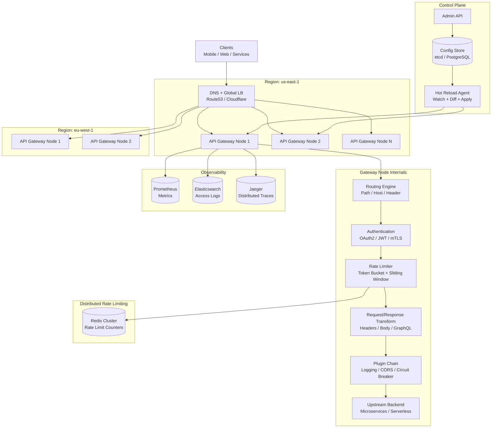
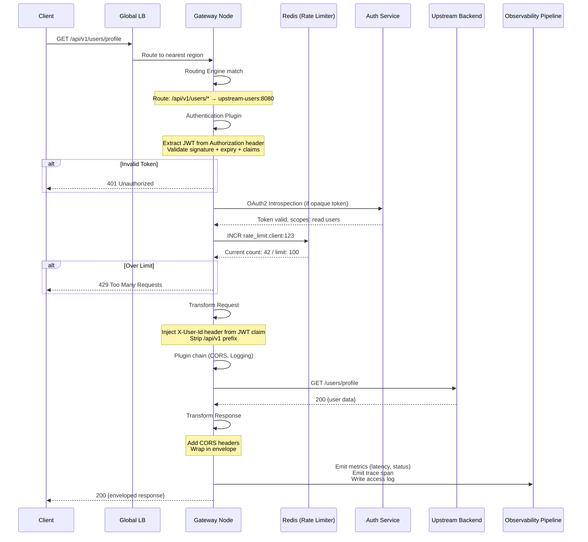

# Design an API Gateway

## Requirements

- Routing engine: path/host/header-based routing, prefix stripping
- Authentication: OAuth2/OIDC, JWT validation, API keys, mTLS
- Rate limiting: token bucket, sliding window, distributed with Redis
- Request/response transformation: header manipulation, body enrichment, graphQL batching
- Observability: request logging, metrics (latency/error rate), distributed tracing, access log
- Plugin system architecture for extensibility
- High availability: multi-region, active-active deployment
- Configuration management: hot reload, admin API, CRD-based (Kubernetes)
- 100K requests/second per gateway node, < 5ms added latency p99

## Architecture Diagram



## Core Components

| Component | Description |
|-----------|-------------|
| **Routing Engine** | Matches incoming requests to routes based on path (`/api/v1/users/*`), host (`api.example.com`), or headers (`X-Version: v2`). Supports prefix stripping, regex matching, and weighted traffic splitting for canary deployments |
| **Authn/Authz Module** | Pluggable authentication: validates JWT (RS256/ES256 signatures, expiry, claims), verifies API keys against a store, terminates mTLS connections, performs OAuth2 token introspection and OIDC userinfo lookups |
| **Rate Limiter** | Distributed rate limiting using Redis. Token bucket (burst allowance) + sliding window (smooth enforcement). Configurable per route, per client, per IP. Returns `429 Too Many Requests` with `Retry-After` header |
| **Request/Response Transformer** | Modifies requests before forwarding: add/remove headers, inject body fields (e.g. JWT claims as headers), rewrite paths, aggregate multiple backend responses into GraphQL-style bundles |
| **Plugin Chain** | Interceptor-based plugin architecture. Request/response lifecycle hooks: plugins for CORS, circuit breaker, retry, caching, IP allow/deny, body validation (JSON Schema). Loaded dynamically via config |
| **Observability Exporter** | Captures per-request metrics (latency histogram, status codes, request size), structured access logs, and distributed trace spans (OpenTelemetry). Exports to Prometheus, Elasticsearch, Jaeger |
| **Config Store + Hot Reload** | Routes, plugins, rate limits defined in a config store (etcd, PostgreSQL, or CRD in Kubernetes). Watch agent detects changes and hot-reloads into gateway nodes without restart |
| **Admin API** | CRUD for routes, upstreams, plugins, rate limit policies. Can also serve a developer portal and generate OpenAPI specs from configured routes |

## Data Flow



## Database Schema

### Routes Config (PostgreSQL / etcd document)
```sql
CREATE TABLE routes (
    id              BIGSERIAL PRIMARY KEY,
    name            VARCHAR(100),
    methods         VARCHAR(50)[] DEFAULT '{"GET", "POST", "PUT", "DELETE", "PATCH"}',
    -- match criteria
    match_type      VARCHAR(20) NOT NULL,      -- path, host, header
    match_value     VARCHAR(200) NOT NULL,      -- "/api/v1/users/*", "api.example.com"
    path_prefix     VARCHAR(200),               -- prefix to strip
    strip_prefix    BOOLEAN DEFAULT TRUE,
    -- upstream
    upstream_url    VARCHAR(500) NOT NULL,
    upstream_timeout_ms INT DEFAULT 30000,
    retry_count     INT DEFAULT 0,
    -- rate limiting
    rate_limit_config JSONB,
    -- auth config
    auth_config     JSONB,                      -- {type: "jwt", issuer: "...", required_scopes: [...]}
    -- plugin configs
    plugins         JSONB DEFAULT '[]',         -- [{name: "cors", config: {...}}, ...]
    is_active       BOOLEAN DEFAULT TRUE,
    weight          INT DEFAULT 100,            -- for traffic splitting
    created_at      TIMESTAMP DEFAULT NOW(),
    updated_at      TIMESTAMP DEFAULT NOW()
);
CREATE INDEX idx_routes_active ON routes(is_active);
```

### API Keys (PostgreSQL)
```sql
CREATE TABLE api_keys (
    id              BIGSERIAL PRIMARY KEY,
    client_name     VARCHAR(100) NOT NULL,
    key_hash        VARCHAR(64) NOT NULL,       -- SHA-256 of API key
    key_prefix      VARCHAR(10) NOT NULL,       -- "sk_live_abc..."
    permissions     JSONB,                      -- {routes: ["/api/v1/users/*"], rate_limit: 1000}
    is_active       BOOLEAN DEFAULT TRUE,
    expires_at      TIMESTAMP,
    created_at      TIMESTAMP DEFAULT NOW()
);
CREATE UNIQUE INDEX idx_apikeys_hash ON api_keys(key_hash);
```

### Rate Limit Counters (Redis)
```
Key: rl:{client_id}:{route_id}:{window_start}
Type: String (counter) or Sorted Set (sliding window)
TTL: window_seconds + 10

Sliding window pattern:
  Key: rl:{client_id}:{route_id}:sliding
  Type: Sorted Set (member = request_id, score = timestamp_ms)
  ZREMRANGEBYSCORE < key > 0 (now - window_ms)
  ZCARD < key > → count
```

### Access Logs (Elasticsearch / object store)
```
Index: api-gateway-logs-{YYYY.MM.DD}
Fields:
  timestamp, method, path, status_code, latency_ms,
  client_ip, user_agent, request_id, trace_id,
  upstream_url, upstream_latency_ms,
  rate_limited (bool), auth_type, plugin_execution
```

### Config Versioning (PostgreSQL)
```sql
CREATE TABLE config_versions (
    id              BIGSERIAL PRIMARY KEY,
    version         INT NOT NULL,
    config_snapshot JSONB NOT NULL,       -- full routes + plugins snapshot
    deployed_by     VARCHAR(100),
    deployed_at     TIMESTAMP DEFAULT NOW(),
    rollback_to     INT,
    status          VARCHAR(20) DEFAULT 'active'  -- active, rolled_back
);
```

## API Design

### Admin API (Control Plane)
```
POST   /admin/api/routes                    Create route
GET    /admin/api/routes                    List routes
GET    /admin/api/routes/{id}               Get route detail
PUT    /admin/api/routes/{id}               Update route
DELETE /admin/api/routes/{id}               Delete route
POST   /admin/api/routes/{id}/deploy        Deploy route (hot reload)

POST   /admin/api/plugins                   Register plugin
GET    /admin/api/plugins                   List active plugins

POST   /admin/api/api-keys                  Create API key
GET    /admin/api/api-keys                  List API keys
PUT    /admin/api/api-keys/{id}/revoke      Revoke API key

POST   /admin/api/rate-limits               Set rate limit policy
GET    /admin/api/rate-limits               List policies

GET    /admin/api/health                    Gateway health
GET    /admin/api/metrics                   Gateway metrics snapshot
POST   /admin/api/config/rollback           Rollback to previous config version
```

### Runtime API (via Gateway)
```
GET    /api/v1/{path}                       Standard proxied request
POST   /api/v1/{path}                       Standard proxied request
WS     /ws/v1/{path}                        WebSocket proxying (e.g. for chat)
```

### Error Response Format
```json
{
  "error": {
    "code": "RATE_LIMITED",
    "message": "Too many requests. Retry after 30 seconds.",
    "status": 429,
    "retry_after": 30,
    "request_id": "req_abc123"
  }
}
```

## Deep Dive Questions

1. **How does the routing engine efficiently match requests?**
   Routes are compiled into a trie (radix tree) keyed by path, with host and header matchers as additional dimensions. For each request, the engine walks the trie — O(length of path) — and returns the best match (longest prefix wins). Regex routes use a precompiled NFA. Traffic splitting uses weighted random selection.

2. **How does distributed rate limiting work with Redis?**
   Sliding window: each request records its timestamp in a Redis sorted set per client+route. Count = ZCARD of timestamps in [now - window, now]. Token bucket: Redis key stores remaining tokens + last refill timestamp; Lua script atomically updates both. Cluster mode ensures key affinity via hash tags `{rl:client_id}`.

3. **How does the plugin system work?**
   Plugins implement a lifecycle interface: `OnRequest(ctx, req) → (modified_req, err)` and `OnResponse(ctx, req, resp) → (modified_resp, err)`. Plugins are loaded as WASM modules or shared libraries. The plugin chain executes sequentially in config-defined order. Plugins have access to route config via a sandboxed context.

4. **How is hot-reload of configuration achieved?**
   The gateway runs a watch agent that polls the config store (etcd watch, PostgreSQL LISTEN/NOTIFY, or Kubernetes informer). On config change: (1) diff is computed, (2) new route trie is built in memory, (3) atomic pointer swap replaces the active trie. Existing in-flight requests finish with old config; new requests use new config. No downtime.

5. **How does authentication work end-to-end for JWT and mTLS?**
   JWT: Extract token from `Authorization: Bearer <token>`. Validate signature using JWKS fetched from the issuer. Check `exp`, `nbf`, `iss`, `aud` claims. Inject decoded claims as headers (e.g. `X-User-Id`, `X-Roles`). mTLS: Terminate TLS at the gateway, verify client certificate against a trusted CA, extract CN/SAN as identity. Fail-closed on invalid/missing cert.

6. **How does the gateway handle multi-region high availability?**
   Active-active per region with DNS-based global load balancing (Route53, CloudFront). Each region runs its own gateway cluster + Redis + config store. Rate limiting is per-region (or uses globally replicated Redis via CRDTs for eventual consistency). Config is replicated across regions via the control plane. Health checks remove unhealthy regions from DNS.

7. **How is observability implemented without degrading performance?**
   Metrics are aggregated in-process (atomic counters, histograms) and scraped by Prometheus every 15s. Tracing uses sampling (1% head-based, or tail-based for high-latency requests). Access logs are written asynchronously to a ring buffer and batch-flushed to Elasticsearch every second. All observability code paths use lock-free data structures.

## Tradeoffs

| Decision | Tradeoff |
|----------|----------|
| **Redis-based rate limiting** | Distributed, accurate vs. extra network hop per request (use local token bucket + sync with Redis periodically) |
| **WASM plugins** | Safe sandbox, language-agnostic vs. performance overhead compared to native Go/Rust plugins |
| **Atomic pointer swap for hot reload** | Zero-downtime config update vs. memory overhead (two configs in memory during swap) |
| **Client-side vs server-side rate limiting** | Server-side: accurate, fraud-resistant vs. client-side: no server cost, trivially bypassed |
| **Path trie routing vs. regex** | O(path_length) lookup, fast vs. less flexible than full regex; hybrid: trie for static, regex for patterns |
| **Active-active multi-region** | Lower latency, higher availability vs. cross-region rate limit inconsistency, config replication complexity |

## Follow-up Questions

- How would you implement a GraphQL federation gateway that composes schemas from multiple upstream services?
- How would you design a circuit breaker plugin that handles upstream failures and cascading protection?
- How would you implement request deduplication ("request collapsing") for cacheable GET requests?
- How does the gateway handle WebSocket upgrades and persistent connection management?
- How would you build a developer portal that auto-generates API documentation from route config?
- How would you implement canary deployments where 5% of traffic goes to a new upstream version?
- How does the gateway handle large payloads (>10MB) for file upload APIs?
