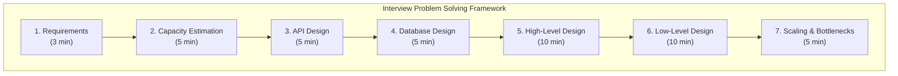

# 20 — Interview Prep

> Master the system design interview with structured practice across difficulty levels.



## Track by Difficulty

### 🟢 Beginner
Practice fundamental systems with clear constraints.

| # | Problem | Key Concepts | Est. Time |
|---|---------|-------------|-----------|
| 1 | [Design TinyURL](01-tinyurl.md) | Hashing, base62, redirection | 45 min |
| 2 | [Design Parking Lot](02-parking-lot.md) | OOP, state management | 45 min |
| 3 | [Design Rate Limiter](03-rate-limiter.md) | Token bucket, sliding window | 45 min |
| 4 | [Design a Web Crawler](04-web-crawler.md) | BFS, URL frontier, politeness | 60 min |

### 🟡 Intermediate
Real-world services with actual complexity.

| # | Problem | Key Concepts | Est. Time |
|---|---------|-------------|-----------|
| 5 | [Design Instagram](05-instagram.md) | Feed generation, media storage | 60 min |
| 6 | [Design WhatsApp](06-whatsapp.md) | Real-time messaging, presence | 60 min |
| 7 | [Design Twitter](07-twitter.md) | Fanout, timeline cache | 60 min |
| 8 | [Design Uber](08-uber.md) | Geospatial, matching | 60 min |
| 9 | [Design Dropbox](09-dropbox.md) | File sync, conflict resolution | 60 min |

### 🔴 Advanced
Systems at massive scale with complex tradeoffs.

| # | Problem | Key Concepts | Est. Time |
|---|---------|-------------|-----------|
| 10 | [Design Netflix](10-netflix.md) | CDN, recommendation, DRM | 75 min |
| 11 | [Design YouTube](11-youtube.md) | Video processing, transcoding | 75 min |
| 12 | [Design Google Search](12-google-search.md) | Indexing, PageRank, crawling | 75 min |
| 13 | [Design Amazon](13-amazon.md) | E-commerce, inventory, payments | 75 min |

### 🔵 Staff+ Level
Multi-region, cross-functional, cost-aware designs.

| # | Problem | Key Concepts | Est. Time |
|---|---------|-------------|-----------|
| 14 | [Multi-Region Banking](14-multi-region-banking.md) | Consistency, compliance, DR | 90 min |
| 15 | [Global CDN](15-global-cdn.md) | Edge computing, cache hierarchy | 90 min |
| 16 | [Real-Time Analytics Platform](16-real-time-analytics.md) | Stream processing, query engine | 90 min |
| 17 | [Event-Driven Architecture](17-event-driven-architecture.md) | Event sourcing, CQRS, saga | 90 min |

## Problem Solving Framework

```
1. Requirements (3 min)
   - Functional requirements
   - Non-functional requirements (CAP, latency, durability)
   
2. Capacity Estimation (5 min)
   - Traffic (read/write ratio)
   - Storage (10-year projection)
   - Bandwidth

3. API Design (5 min)
   - REST/gRPC endpoints
   - Request/response format

4. Database Design (5 min)
   - Schema (SQL) or documents (NoSQL)
   - Indexing strategy
   - Sharding key

5. High-Level Design (10 min)
   - System architecture diagram
   - Key components
   - Data flow

6. Low-Level Design (10 min)
   - Component details
   - Algorithms (consistency, hashing)
   - Tradeoff analysis

7. Scaling & Bottlenecks (5 min)
   - How to handle 10x traffic
   - Single points of failure
   - Cost optimization
```

## Interview Tips

| Tip | Why |
|-----|-----|
| **Clarify requirements first** | Never assume — ask about scale, features |
| **Think out loud** | Interviewers want to see your process |
| **Start simple, then optimize** | Don't jump to distributed too early |
| **Identify tradeoffs** | Every design decision has a cost |
| **Be opinionated** | Justify why you choose one approach |
| **Know your numbers** | Latency, throughput, capacity benchmarks |

---

Previous: [19 — Projects](../19-Projects/README.md)
Next: [21 — Staff Engineer](../21-Staff-Engineer/README.md)
