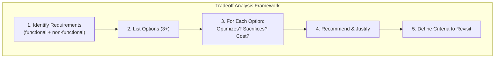

# Tradeoffs

## Definition
Tradeoffs are the essence of system design. Every decision involves balancing competing concerns — there are no "silver bullets."



## Common Tradeoffs

| Tradeoff | Consideration |
|----------|--------------|
| **Consistency vs Availability** | CAP theorem — which matters more? |
| **Latency vs Throughput** | Can we accept higher latency for more throughput? |
| **Synchronous vs Async** | Consistency vs decoupling |
| **Monolith vs Microservices** | Simplicity vs flexibility |
| **SQL vs NoSQL** | Structure vs scale |
| **Vertical vs Horizontal** | Complexity vs cost |
| **Strong vs Eventual** | Correctness vs performance |

## Tradeoff Analysis Framework

```
1. Identify the requirements (functional + non-functional)
2. List options (at least 3)
3. For each option:
   a. What does it optimize?
   b. What does it sacrifice?
   c. What's the operational cost?
4. Make a recommendation with justification
5. Define criteria to revisit this decision
```

## Example: API Design

| Pattern | Pros | Cons | Use When |
|---------|------|------|----------|
| **REST** | Simple, cacheable | Over-fetching, chatty | Public APIs |
| **GraphQL** | Flexible, efficient | Complex caching | Complex UIs |
| **gRPC** | Fast, streaming | Browser support | Internal services |
| **WebSocket** | Real-time | Stateful, complex | Live features |

## Interview Questions
1. Describe a difficult tradeoff you faced and how you resolved it
2. How do you decide between monolith and microservices?
3. When would you sacrifice consistency for availability?
4. What's the cost of choosing the wrong architecture?
5. How do you communicate tradeoffs to non-technical stakeholders?
