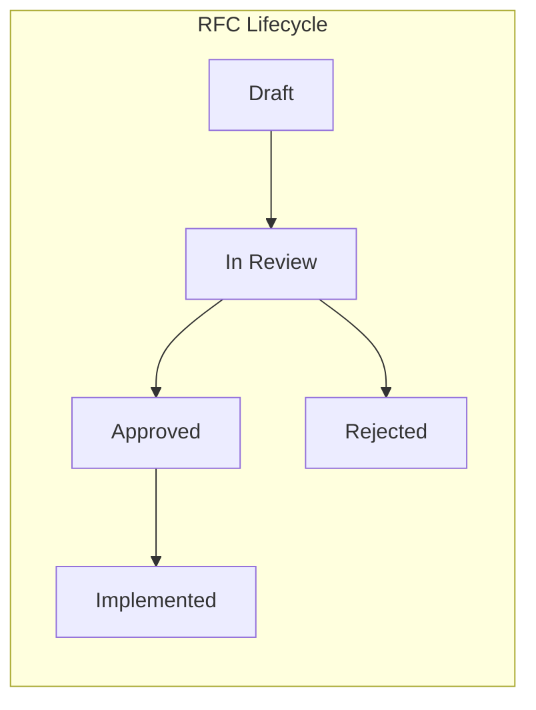

# RFC Writing

## Definition
An RFC (Request for Comments) is a structured technical design document used to propose, discuss, and document architecture decisions.



## RFC Structure

```markdown
# RFC: [Title]

## Status
[Proposed / In Review / Approved / Rejected / Implemented]

## Context
Why is this change needed? What problem does it solve?

## Goals
- Specific, measurable objectives
- What success looks like

## Non-Goals
- What this RFC explicitly does NOT address

## Proposed Design
- Architecture diagram
- Key components
- Data flow
- API changes
- Database changes

## Alternatives Considered
- Option A (chosen): Pros/cons
- Option B: Pros/cons

## Tradeoffs
- What are we sacrificing?
- What risks remain?

## Migration Plan
- How to get from current state to new state
- Backward compatibility

## Monitoring & Rollback
- How to detect issues
- How to roll back
```

## RFC Best Practices
- **Short is better** — 1-2 pages is ideal
- **Diagrams > text** — Architecture diagrams communicate faster
- **Explicit tradeoffs** — Show you've considered alternatives
- **Actionable** — Clear decision and next steps
- **Collaborative** — Invite comments, iterate

## Interview Questions
1. Write an RFC for a system you've designed
2. What makes an RFC effective?
3. How do you handle conflicting feedback on an RFC?
4. When would you NOT write an RFC?
5. How do you ensure RFCs are actually read and reviewed?
