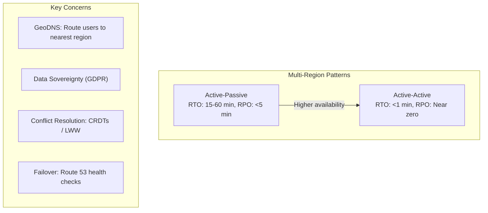

# Multi-Region Design

## Architecture Patterns



### Active-Passive
```
┌──────────────────────┐     ┌──────────────────────┐
│     Primary Region    │     │    Standby Region    │
├──────────────────────┤     ├──────────────────────┤
│  Traffic: All users   │     │  Traffic: None        │
│  DB: Primary (write)  │────►│  DB: Replica (read)   │
│  Cache: Hot           │     │  Cache: Warm          │
└──────────────────────┘     └──────────────────────┘

Failover: Manual or automated
RTO: 15-60 min
RPO: < 1 min (sync repl) or < 5 min (async)
```

### Active-Active
```
┌──────────────────────┐     ┌──────────────────────┐
│     Region A          │     │     Region B          │
├──────────────────────┤     ├──────────────────────┤
│  Traffic: 50%         │◄───►│  Traffic: 50%         │
│  DB: Multi-leader     │────►│  DB: Multi-leader     │
│  Cache: Write-through │     │  Cache: Write-through │
└──────────────────────┘     └──────────────────────┘

Pros: Lower latency for all users
Cons: Conflict resolution, complexity
```

## Key Considerations

| Concern | Strategy |
|---------|----------|
| **Data sovereignty** | Keep data in-region (GDPR) |
| **Latency** | Route users to nearest region (GeoDNS) |
| **Consistency** | Strong within region, eventual across regions |
| **Conflict resolution** | CRDTs, last-writer-wins |
| **Failover** | DNS-based (Route 53 health checks) |

## Interview Questions
1. Design a multi-region active-active architecture for a global app
2. How do you handle data conflicts in multi-region writes?
3. What's the difference between RTO and RPO in disaster recovery?
4. How do you test multi-region failover?
5. Design a geo-distributed database strategy
