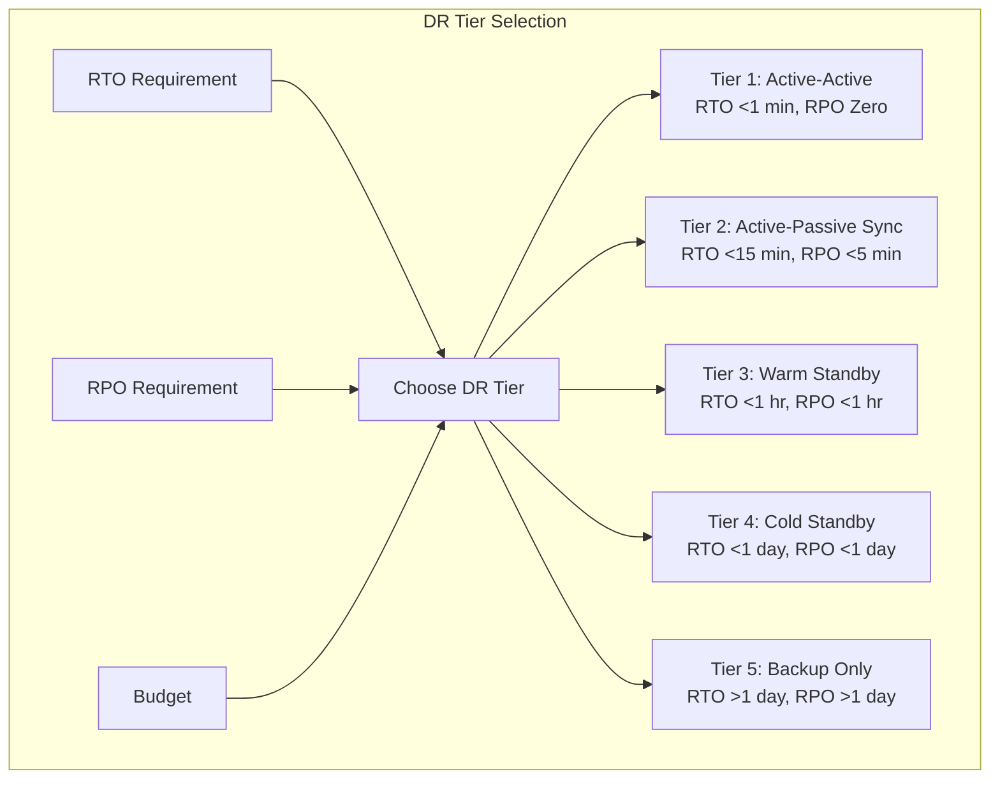

# Disaster Recovery

## Key Metrics

| Metric | Definition |
|--------|------------|
| **RTO** (Recovery Time Objective) | Max acceptable downtime |
| **RPO** (Recovery Point Objective) | Max acceptable data loss |
| **MTBF** (Mean Time Between Failures) | Average time between failures |
| **MTTR** (Mean Time To Recover) | Average recovery time |



## DR Tiers

| Tier | RTO | RPO | Cost | Strategy |
|------|-----|-----|------|----------|
| **Tier 1** | < 1 min | Zero | High | Active-active multi-region |
| **Tier 2** | < 15 min | < 5 min | Medium | Active-passive, sync repl |
| **Tier 3** | < 1 hr | < 1 hr | Medium | Warm standby, async repl |
| **Tier 4** | < 1 day | < 1 day | Low | Cold standby, periodic backup |
| **Tier 5** | > 1 day | > 1 day | Lowest | Backup only |

## DR Scenarios

| Scenario | Response |
|----------|----------|
| **Region failure** | Route traffic to secondary region |
| **Database corruption** | Point-in-time recovery (PITR) |
| **Data center flood** | Failover to alternate AZ |
| **Ransomware** | Restore from immutable backups |
| **Bad deploy** | Rollback to previous version |

## DR Testing

```yaml
Frequency:
  - Tabletop exercise: Quarterly
  - Component failover: Monthly
  - Full DR drill: Annually

Checklist:
  ☐ DNS propagation works
  ☐ Database failover succeeds
  ☐ Cache is warm (not a cold start)
  ☐ Monitoring covers secondary region
  ☐ On-call team knows the runbook
  ☐ Backup is restorable
```

## Interview Questions
1. Design a disaster recovery plan for a payment system
2. How do you validate that your DR plan actually works?
3. What's the difference between backup and disaster recovery?
4. How do you calculate the cost of downtime?
5. Design a backup strategy for a multi-region database
