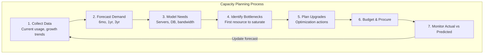

# Capacity Planning

## Definition
Capacity planning is the process of determining the infrastructure resources needed to meet future demand while optimizing cost and performance.



## Key Metrics

| Metric | What It Measures | Example |
|--------|-----------------|---------|
| **Current utilization** | How much is used now | CPU: 60% |
| **Growth rate** | How fast demand increases | 5% users/month |
| **Traffic patterns** | When peaks occur | 10x at 8PM |
| **Headroom** | Buffer for unexpected spikes | 30% over provisioned |
| **Saturation point** | When system breaks | DB at 10K TPS |

## Planning Process

```
1. Collect data (current usage, growth trends)
2. Forecast future demand (6mo, 1yr, 3yr)
3. Model infrastructure needs (servers, DB, bandwidth)
4. Identify bottlenecks (first resource to saturate)
5. Plan upgrades or optimization
6. Budget and procure
7. Monitor actual vs predicted
```

## Forecasting Methods

| Method | Timeframe | Accuracy | Example |
|--------|-----------|----------|---------|
| **Linear extrapolation** | Short-term | Low | "Traffic grows 10%/month" |
| **Trend analysis** | Medium-term | Medium | Seasonal patterns |
| **Leading indicators** | Long-term | High | User signups predict traffic |
| **Simulation** | Any | High | Load testing models |

## Bottleneck Prediction

```
System Capacity Chain:
  Users → Load Balancer → App Servers → Cache → Database

Bottleneck          Current     Max        Saturation
Load Balancer       50K RPS     100K RPS   6 months
App Servers         8K RPS      30K RPS    3 months
Redis Cache         100K ops    500K ops   12 months
Database            2K TPS      5K TPS     NOW ← Critical!
```

## Interview Questions
1. How do you estimate infrastructure costs for a new product?
2. How do you model capacity for a variable workload?
3. What happens when you hit a capacity limit in production?
4. How do you right-size infrastructure without over-provisioning?
5. Design a capacity planning process for a growing SaaS platform
