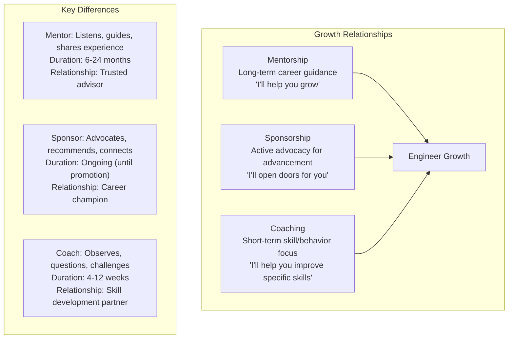

# Mentorship, Sponsorship & Coaching

## Definition

Mentorship, sponsorship, and coaching are distinct but complementary growth relationships. Mentorship focuses on career guidance and skill development, sponsorship involves advocating for someone's advancement, and coaching addresses specific behavioral or performance goals.



## Mentorship vs Sponsorship vs Coaching

| Aspect | Mentorship | Sponsorship | Coaching |
|--------|------------|-------------|----------|
| **Primary goal** | Career growth and guidance | Career advancement and visibility | Specific skill or behavior improvement |
| **Time horizon** | Long-term (6-24+ months) | Medium-term (until goal achieved) | Short-term (4-12 weeks) |
| **Relationship** | Trusted advisor | Career advocate / champion | Skill development partner |
| **Key action** | Listen, share wisdom, ask questions | Actively recommend for opportunities | Observe, provide feedback, practice |
| **Visibility** | Behind-the-scenes | Public advocacy | Private sessions |
| **Who needs it** | All engineers, especially early-career | High-performers ready for next level | Anyone working on specific gaps |
| **Power dynamic** | Senior → Junior | Senior → Junior (high stakes) | Could be peer or external |
| **Outcome** | Broader perspective, network, confidence | Promotions, stretch assignments, leadership roles | Measurable improvement in specific area |

## Growth Frameworks

```
Stretch Assignments:

  Purpose: Give engineers tasks slightly beyond their current capability.
  
  Examples:
    - Staff engineer: Lead a cross-team initiative (not just code)
    - Senior engineer: Design architecture for a new system
    - Mid-level: Own a complete feature end-to-end
  
  Shadowing:
    - Attend higher-level meetings (architecture review, product planning)
    - Review RFCs and provide feedback
    - Participate in on-call with escalation responsibilities

Promotion Packets:

  A promotion packet documents why an engineer is ready for the next level.
  
  Components:
    1. Current role accomplishments (quantified)
    2. Next-level competencies demonstrated
    3. Impact examples (projects, leadership)
    4. Peer and manager feedback
    5. Comparison to level expectations

  Best practices:
    - Write the packet 3-6 months before promotion cycle
    - Review with mentor/sponsor for blind spots
    - Collect evidence continuously (not retroactively)
    - Quantify impact wherever possible
```

## SBI Feedback Framework

```
SBI: Situation → Behavior → Impact

Situation: When and where did it happen?
  "During the architecture review for Project X last Tuesday..."

Behavior: What did the person do (observable facts)?
  "...you interrupted the presenter three times to suggest alternatives
   before they finished explaining the proposal..."

Impact: What was the effect of that behavior?
  "...this made the presenter feel their perspective wasn't valued,
   and the team missed hearing the full context of their approach."

Good SBI:
  S: "In the postmortem for last week's outage..."
  B: "...you took ownership of the monitoring gap even though it was a team issue."
  I: "...this set a great example of accountability and made others feel safe admitting mistakes."

Bad SBI (not specific):
  S: "You're always interrupting people."
  This lacks situation specificity and behavioral observation.
```

## Psychological Safety

```
Definition: The belief that one can speak up, ask questions, admit mistakes,
or challenge ideas without fear of punishment or humiliation.

Building psychological safety:

For mentors:
  - Share your own failures and lessons learned
  - Ask "what do you think?" before giving your opinion
  - Acknowledge when you don't know something

For teams:
  - Blameless postmortems (no "who did this?" language)
  - Retrospectives with "start/stop/continue" format
  - Encourage dissenting opinions in design reviews
  - Celebrate thoughtful failures (well-executed experiments that didn't work)

Signs of low psychological safety:
  - People don't speak up in meetings
  - Mistakes are hidden, not shared
  - Retrospectives are quiet or blame-focused
  - Engineers avoid taking risks or proposing new ideas

Measuring psychological safety (Google's model):
  1. "If I make a mistake on this team, it is held against me" (reverse)
  2. "Members of this team are able to bring up problems and tough issues"
  3. "People on this team sometimes reject others for being different" (reverse)
  4. "It is safe to take a risk on this team"
  5. "It is difficult to ask other members of this team for help" (reverse)
```

## Best Practices

| Practice | Detail |
|----------|--------|
| **Regular 1:1s** | Weekly for mentorship; bi-weekly for coaching |
| **Actionable goals** | Every session should end with 1-2 concrete next steps |
| **Sponsorship is earned** | Sponsors take career risk; mentees must demonstrate readiness |
| **Reverse mentorship** | Junior engineers mentor senior on new technologies, culture |
| **Feedback sandwich** | Not recommended — separates positive from constructive |
| **Measure progress** | Check in on goals quarterly; adjust approach as needed |
| **Know when to end** | Not all mentor/mentee relationships are meant to be permanent |

## Interview Questions

1. What is the difference between mentorship, sponsorship, and coaching?
2. How do you prepare a promotion packet for a senior-to-staff engineer?
3. How would you use the SBI framework to deliver constructive feedback?
4. How do you build psychological safety on a new team?
5. Design a mentorship program for a team of 20 engineers.
