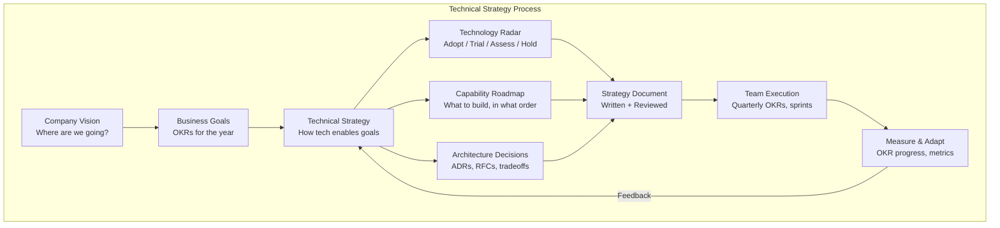

# Technical Strategy

## Definition

Technical strategy is the set of decisions that align technology investments with business outcomes. It answers: "What should we build, in what order, with what technology, and why?" A good strategy provides a decision-making framework for the engineering organization.



## Technology Radar

```
Technology Radar framework (ThoughtWorks model):

┌────────────────────────────────────────────────────────────────┐
│                    TECHNOLOGY RADAR                              │
├────────────┬────────────┬────────────┬─────────────────────────┤
│  ADOPT     │   TRIAL    │   ASSESS   │         HOLD            │
│  Proven in │ Promising, │ Worth      │ Not recommended         │
│  production│ low risk   │ exploring  │ for now                 │
│            │            │            │                         │
├────────────┼────────────┼────────────┼─────────────────────────┤
│ Go         │ Rust       │ WebGPU     │ jQuery                  │
│ Kubernetes │ eBPF       │ WebAssembly│ MongoDB (for transact)  │
│ Kafka      │ WASM       │ DuckDB     │ Monolith (if microsvc)  │
│ Prometheus │ GraphQL    │ Polars     │ Serverless (for stateful)│
│ gRPC       │ OpenTelemetry│          │                         │
└────────────┴────────────┴────────────┴─────────────────────────┘

Evaluation criteria for each technology:
  - Business value: Does it solve a real problem?
  - Maturity: Is it production-ready?
  - Team capability: Can our team use it effectively?
  - Ecosystem: Is there community support? Hiring pool?
  - Migration cost: What's the cost to adopt?
```

## Technical Strategy Document

```
Structure of a Technical Strategy Document:

# Technical Strategy: [Topic]

## Executive Summary (1 paragraph)
- What is this strategy about?
- Why now?
- What's the expected outcome?

## Current State
- What we do today
- Pain points and limitations
- Why the current approach doesn't scale

## Proposed Strategy (3-5 strategic bets)
- Bet 1: [e.g., Adopt event-driven architecture]
  * Rationale
  * Expected impact
  * Key milestones
  
- Bet 2: [e.g., Migrate to Kubernetes]
  * Rationale
  * Expected impact
  * Key milestones

## What We Will STOP Doing
- Explicitly list things that no longer align
- Avoids scope creep and resource fragmentation

## Decision Rules
- When to choose X over Y
- Tradeoff guidelines for teams
- Example: "Use PostgreSQL unless you need graph traversal, then use Neo4j"

## Timeline
- Now (0-3 months): Foundation
- Next (3-12 months): Build capability
- Future (12+ months): Optimization

## Measuring Success
- Quantitative metrics for each bet
- OKRs linked to strategy
- Review cadence (quarterly)
```

## OKR Writing for Tech Initiatives

```
OKR format:

  Objective: Achieve 99.99% platform availability (from 99.9%)
    Key Result 1: Reduce P0 incident count from 12 to 3 per quarter
    Key Result 2: Reduce MTTR from 45 min to 15 min
    Key Result 3: Implement automated failover for all critical services

  Objective: Reduce infrastructure cost by 30% without degrading performance
    Key Result 1: Rightsize 50% of over-provisioned services
    Key Result 2: Migrate 30% of storage to cold tier
    Key Result 3: Implement auto-scaling for all production services
    
Good tech OKRs:
  - Outcome-oriented (not output): "Reduce latency by 50%" not "Rewrite service X"
  - Measurable: Clear metric + target
  - Time-bound: Achievable within quarter
  - Aligned: Connected to business goals

Bad tech OKRs:
  - "Upgrade all services to Go" (output, not outcome)
  - "Improve developer productivity" (not measurable)
  - "Migrate to microservices" (unbounded scope)
```

## Capability Roadmap

```
Roadmap format:

                    Q1 2026            Q2 2026           Q3 2026            Q4 2026
Foundation    │  Implement tracing  │  SLO framework   │  Burn rate alerts │  Auto-remediation
Observability │  (OpenTelemetry)    │  (error budgets) │  (multi-window)   │  (runbooks)
              │                     │                  │                   │
Platform      │  K8s migration      │  Service mesh    │  Multi-region     │  Disaster recovery
Reliability   │  (top 10 services)  │  (Istio)         │  active-active    │  (automated DR test)
              │                     │                  │                   │
Developer     │  CI/CD pipeline     │  Dev environments│  Feature flags    │  Inner loop
Velocity      │  (GitHub Actions)   │  (ephemeral)     │  (LaunchDarkly)   │  (local dev speed)
              │                     │                  │                   │
Cost          │  Right-sizing       │  Reserved        │  Cold storage     │  Commitments
Optimization  │  (current usage)    │  instances       │  migration        │  (annual savings)

Each roadmap item has:
  - Owner: Team or individual responsible
  - Dependencies: What must be done first
  - Success metric: How we know it's done
  - Investment: Engineering weeks required
```

## Stakeholder Alignment

```
Stakeholder alignment framework:

Identify stakeholders:
  - Engineering teams (will build and maintain)
  - Product management (feature roadmap impact)
  - Executive sponsors (budget, strategic alignment)
  - Operations (on-call, reliability impact)
  - Security (compliance, risk)

Alignment process:
  1. Draft strategy (1-2 pages, diagrams)
  2. Socialize with trusted peers (feedback loop)
  3. Present to engineering leads (technical alignment)
  4. Present to product + leadership (resource alignment)
  5. Publish and communicate widely
  6. Quarterly review and update

Common objections and responses:
  - "This will slow us down" → "Short-term investment for long-term velocity"
  - "We don't have the headcount" → "Here's the cost of not doing it"
  - "The business needs X instead" → "How this enables X more effectively"
  - "We tried this before and it failed" → "What's different this time?"
```

## Best Practices

| Practice | Detail |
|----------|--------|
| **Write it down** | Strategy isn't real until it's documented |
| **Be opinionated** | Good strategy makes choices and tradeoffs explicit |
| **Focus on outcomes** | Strategy enables decisions, not dictates technology |
| **Find your 3 bets** | 3-5 strategic bets per year; everything else is tactics |
| **Kill your darlings** | Explicitly state what you will stop doing |
| **Quarterly review** | Strategy is a living document; update based on reality |
| **Communicate widely** | Strategy only works if teams know about it and buy in |

## Interview Questions

1. Write a technical strategy for improving platform reliability.
2. How do you build and maintain a technology radar for your organization?
3. How do you write OKRs that connect technical work to business outcomes?
4. How do you align stakeholders around a controversial technical strategy?
5. Design a capability roadmap for migrating from monolith to microservices.
