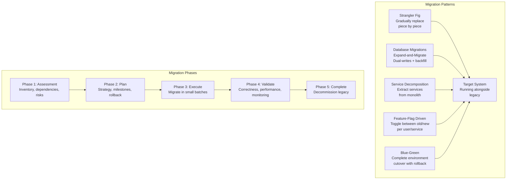

# Migration Strategies

## Definition

Migration is the process of moving from one system, architecture, or technology to another while minimizing risk and maintaining business continuity. A successful migration has a clear strategy, rollback plan, and measurable success criteria.



## Strangler Fig Pattern

```
Pattern: Incrementally replace legacy system by routing functionality
to new system piece by piece.

┌─────────────────────────────────────────────────────────┐
│                    Migration Timeline                      │
├─────────────────────────────────────────────────────────┤
│                                                           │
│  Phase 1: Coexistence (months 1-3)                       │
│                                                           │
│  ┌──────────┐     ┌──────────┐     ┌──────────┐         │
│  │ 80%      │     │ 20%      │     │ New      │         │
│  │ Legacy   │────►│ Routing  │────►│ Service  │         │
│  │ Service  │     │ Layer    │     │ (feature │         │
│  │          │     │ (proxy)  │     │  A only) │         │
│  └──────────┘     └──────────┘     └──────────┘         │
│                                                           │
│  Phase 2: Gradual Migration (months 4-8)                 │
│                                                           │
│  Feature A → new service (10% → 50% → 100% traffic)     │
│  Feature B → new service (10% → 50% → 100% traffic)     │
│  Feature C → new service (10% → 50% → 100% traffic)     │
│                                                           │
│  Phase 3: Decommission (month 9)                         │
│                                                           │
│  Remove routing layer, delete legacy service              │
│                                                           │
└─────────────────────────────────────────────────────────┘

Key principle: Never migrate more than one capability at a time.
Each migration is self-contained with its own rollback plan.
```

## Database Migrations

```
Expand-and-Migrate pattern:

┌──────────────────────────────────────────────────────────────┐
│                    Database Migration Flow                     │
├──────────────────────────────────────────────────────────────┤
│                                                               │
│  Phase 1: Expand                                              │
│  Add new tables/columns alongside existing schema             │
│  ┌──────────┐    ┌──────────┐                                 │
│  │ Old DB   │    │ New DB   │                                 │
│  │ (legacy) │    │ (target) │                                 │
│  └──────────┘    └──────────┘                                 │
│                                                               │
│  Phase 2: Dual-Writes                                         │
│  Write to both old and new on every mutation                  │
│  Reads from old (for now)                                     │
│  ┌──────────────────────┐                                     │
│  │ Write to Old + New   │                                     │
│  │ Read from Old        │                                     │
│  └──────────────────────┘                                     │
│                                                               │
│  Phase 3: Backfill                                            │
│  Copy existing data from old to new                           │
│  Validate: compare record count, checksum                     │
│                                                               │
│  Phase 4: Migrate Reads                                       │
│  Switch reads to new DB (shadow reads for validation)         │
│  ┌──────────────────────┐                                     │
│  │ Write to Old + New   │                                     │
│  │ Read from New        │                                     │
│  └──────────────────────┘                                     │
│                                                               │
│  Phase 5: Remove Old                                          │
│  Stop writing to old, decommission                            │
│  ┌──────────────────────┐                                     │
│  │ Write to New only    │                                     │
│  │ Read from New        │                                     │
│  └──────────────────────┘                                     │
│                                                               │
└──────────────────────────────────────────────────────────────┘
```

## Feature-Flag Driven Migration

```
Feature flags enable gradual, reversible migrations.

Example: Migration from Redis → Memcached for session store:

flag: "session_store_backend"
  values: ["redis", "memcached", "dual_write"]

Migration steps:
  
  Step 1: dual_write (all users)
    - Write sessions to both Redis and Memcached
    - Read from Redis (baseline)
    - Compare Memcached reads against Redis → validate correctness
  
  Step 2: canary (1% of users → Memcached)
    - If success (latency, errors, correct reads) → expand
    - If failure → rollback to Redis (single flag toggle)
  
  Step 3: ramp (5% → 25% → 50% → 100%)
    - Gradual traffic increase
    - Monitor: error rate, latency p50/p99, session expiry
  
  Step 4: cleanup
    - Remove dual-write logic
    - Decommission Redis
    - Delete feature flag

Benefits of feature-flag approach:
  - Instant rollback (toggle flag = rollback)
  - Granular control (per region, per user, per service)
  - Canary testing in production
  - Team can migrate at their own pace
```

## Blue-Green for Migrations

```
Blue-Green deployment for infrastructure migration:

┌──────────┐          ┌──────────┐
│ Blue     │          │ Green    │
│ (current)│          │ (target) │
│          │          │          │
│ Legacy   │          │ New      │
│ System   │          │ System   │
└────┬─────┘          └────┬─────┘
     │                     │
     └──────────┬──────────┘
                │
         ┌──────▼──────┐
         │  Load       │
         │  Balancer / │
         │  Router     │
         └──────┬──────┘
                │
         Traffic (100% Blue)

Migration:
  1. Deploy Green (target) alongside Blue
  2. Replicate data from Blue → Green (continuous sync)
  3. Run validation tests on Green
  4. Switch load balancer: 10% → Green (canary)
  5. Monitor for 24 hours
  6. Ramp to 100% Green
  7. Keep Blue running for 7 days (rollback window)
  8. Decommission Blue

Rollback:
  - Toggle load balancer back to Blue
  - No data loss (Blue was always receiving writes)
  - Downtime: seconds (DNS propagation / LB switch)
```

## Rollback Strategy

```
Every migration must have a rollback plan documented before execution.

Rollback plan template:

  Migration: Migrate user profile service from monolith to microservice
  Rollback trigger: >1% error rate increase or >10ms latency increase

  Rollback steps:
    1. Set feature flag "profile_service" → "monolith" (instant)
    2. DNS change if needed (TTL already lowered to 60s)
    3. Verify all traffic back on monolith
    4. Monitor for 30 minutes
    5. Investigate root cause

  Rollback criteria:
    - Migration cannot be rolled back after Phase 3 data migration
    - Data migration up to Phase 2 is fully reversible
    - Phase 4+ (decommission) is a point of no return

  Communication:
    - If rollback triggered → notify #migration-war-room Slack channel
    - Postmortem within 24 hours
```

## Best Practices

| Practice | Detail |
|----------|--------|
| **Small batches** | Migrate one service/feature at a time, not the whole system |
| **Rollback first** | Design rollback before designing the migration |
| **Dual-writes** | Validate new system correctness before switching reads |
| **Shadow traffic** | Send copy of traffic to new system without affecting users |
| **Feature flags** | Enable canary releases and instant rollback |
| **Automated validation** | Compare outputs of old vs new system automatically |
| **Clear ownership** | One team owns the migration; one person coordinates |
| **Decommission** | Don't leave legacy systems running indefinitely |

## Interview Questions

1. How would you migrate a monolithic database to a sharded database with zero downtime?
2. Explain the Strangler Fig pattern for service decomposition.
3. How does the expand-and-migrate pattern work for database migrations?
4. How do you design a rollback strategy for a critical migration?
5. How would you migrate from a legacy message queue (RabbitMQ) to Kafka?
