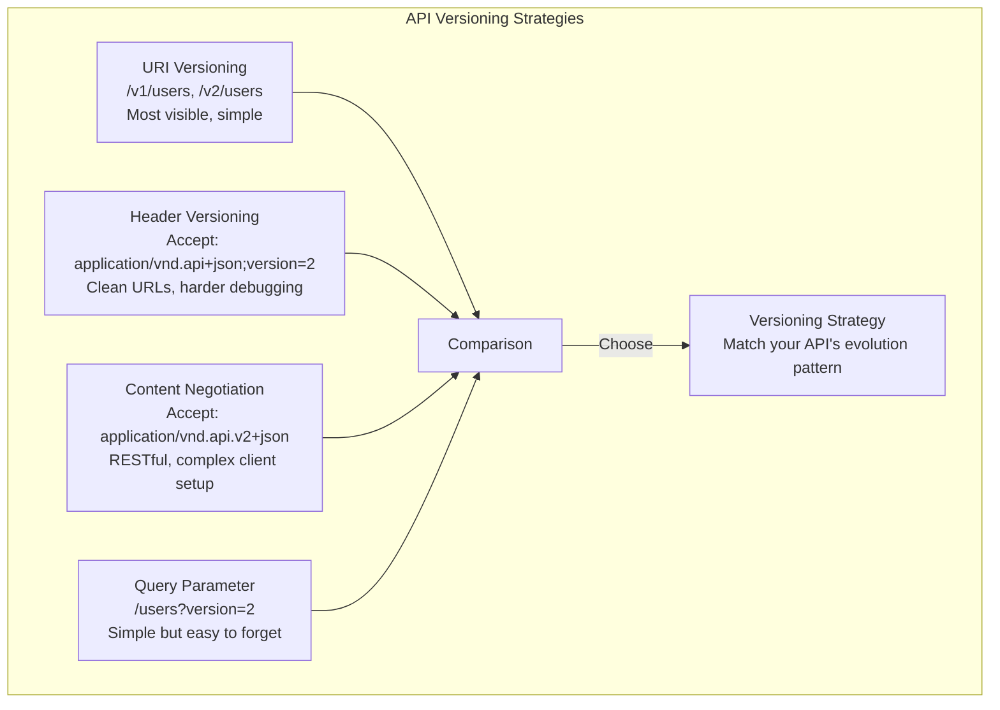

# API Versioning

## Definition

API versioning is the practice of managing changes to an API over time without breaking existing clients. A well-designed versioning strategy enables continuous evolution while maintaining backward compatibility and allowing clients to upgrade at their own pace.



## URI vs Header vs Content Negotiation vs Query Param

| Strategy | Example | Pros | Cons | Best For |
|----------|---------|------|------|----------|
| **URI Path** | `/v1/users` `/v2/users` | Visible, cacheable, simple to route | Pollutes URL space, non-semantic | Public APIs with clear major versions |
| **Custom Header** | `Accept-Version: 2` | Clean URLs, version separate from resource | Hidden (discoverability), harder to test | Internal APIs, mobile backends |
| **Content Negotiation** | `Accept: application/vnd.api.v2+json` | RESTful, semantic, content-type driven | Complex client configuration | Enterprise APIs with multiple representations |
| **Query Parameter** | `/users?version=2` | Simple, easy to test | Easy to omit, caching issues | Early-stage APIs, internal tools |

## Semver for APIs

```
Semantic versioning for APIs:

MAJOR.MINOR.PATCH (e.g., 2.1.3)

MAJOR: Breaking changes
  - Removing a field from response
  - Changing a field type
  - Requiring a previously optional field
  - Changing endpoint URL or HTTP method
  - Removing an endpoint

MINOR: Backward-compatible additions
  - Adding a new endpoint
  - Adding an optional field to request/response
  - Adding a new HTTP method for existing endpoint
  - Expanding enum values

PATCH: Backward-compatible fixes
  - Fixing a bug in response data
  - Documentation clarifications
  - Performance improvements (no behavior change)

Version lifecycle:

  API version: 1.0.0 → 1.1.0 → 1.2.0 → 2.0.0 → 2.1.0
                       ↑            ↑           ↑
                  Add new field    Breaking    New feature
                  (optional)       change      (backward compatible)
```

## Backward Compatibility Rules

```
Strict backward compatibility checklist:

Request changes (BACKWARD COMPATIBLE):
  ✅ Adding optional fields to request body
  ✅ Adding new optional query parameters
  ✅ Making required fields optional (rare, but safe)
  ✅ Extending enum values (if client handles unknown gracefully)

Request changes (BREAKING):
  ❌ Removing fields from request
  ❌ Making optional fields required
  ❌ Changing field types (string → int)
  ❌ Changing validation rules (tightening)
  ❌ Removing query parameters

Response changes (BACKWARD COMPATIBLE):
  ✅ Adding new fields to response
  ✅ Adding new enum values (client must ignore unknown)
  ✅ Extending response with new properties

Response changes (BREAKING):
  ❌ Removing fields from response
  ❌ Changing field names (rename)
  ❌ Changing field types
  ❌ Changing error response format
  ❌ Changing pagination format

Pay attention to:
  - Default values: Changing a default is a breaking change
  - Error codes: New error codes are compatible; removing is breaking
  - Rate limits: Reducing limits is breaking (even if docs said "subject to change")
  - Deprecation: Mark as deprecated, don't remove immediately
```

## Sunset Policies

```
API sunset policy template:

  Endpoint:  GET /v1/users/{id}
  Deprecated: 2026-01-15 (version 1.8.0 deprecation warning in response)
  Sunset:     2026-07-15 (6 month window)
  Alternative: GET /v2/users/{id}
  Migration guide: link to docs

Implementation:

  Response header (standard):
    Deprecation: true
    Sunset: Sat, 15 Jul 2026 00:00:00 GMT
    Link: </v2/users/{id}>; rel="successor-version"

  Response body warning:
    {
      "data": { ... },
      "warnings": [
        {
          "code": "API_VERSION_DEPRECATED",
          "message": "v1 is deprecated. Migrate to v2 by 2026-07-15.",
          "doc_url": "https://docs.example.com/migration-v1-to-v2"
        }
      ]
    }

Sunset window recommendations:
  - Public API:      12-24 months minimum
  - Partner API:     6-12 months
  - Internal API:    3-6 months
  - Mobile clients:  12+ months (app store update cycles)

Enforcement:
  - 3 months before sunset: Add warning header
  - 1 month before: Soft error (5% of requests return error)
  - Sunset date: Return 410 Gone with migration link
  - Extend if clients are actively migrating
```

## gRPC Versioning

```
gRPC approaches versioning differently than REST.

Proto file management:

  // v1/user.proto (original)
  message User {
    string user_id = 1;
    string name = 2;
  }

  // v2/user.proto (evolved)
  message User {
    string user_id = 1;
    string name = 2;
    string email = 3;    // New field (backward compatible)
    string display_name = 4; // Field 2 renamed (2 is still populated)
  }

  // Backward compatible rules for protobuf:
  ✅ Adding new fields (use new field numbers)
  ✅ Removing fields (reserve the field number, never reuse)
  ✅ Changing field names (wire format uses numbers)
  ❌ Changing field types (wire format breakage)
  ❌ Reusing field numbers

  gRPC versioning patterns:
    1. Package-level: package users.v1; package users.v2;
       Service name: users.v1.UserService, users.v2.UserService
       Server handles both packages

    2. Service-level: same package, multiple services
       service UserServiceV1 { ... }
       service UserServiceV2 { ... }

    3. Field-based (protobuf native):
       Never remove fields, always add
       Clients ignore unknown fields
       Server defaults new fields to zero/empty

  Recommendation: Package-level versioning (pattern 1)
    Most explicit, simplest to maintain
    Server runs both versions side by side
    Clients migrate by changing import path
```

## Versioning Decision Framework

```
When to create a new version:

Consider creating a new MAJOR version when:
  - Removing a field that active clients depend on
  - Restructuring the response format
  - Changing authentication/authorization model
  - Significant performance characteristics change

Consider NOT creating a new version when:
  - Adding fields to response (backward compatible)
  - Adding new endpoints (just don't break old ones)
  - Fixing bugs (unless clients depend on buggy behavior)
  - Internal refactoring (no API contract change)

Pragmatic approach:
  - Public API: Version explicitly (/v1, /v2)
  - Internal API: Version via package/namespace
  - gRPC: Package-level versioning
  - GraphQL: No versioning (evolve schema, deprecate fields)
  - WebSocket: Version on connect handshake
```

## Best Practices

| Practice | Detail |
|----------|--------|
| **Version from day one** | Add `/v1/` even for the first version |
| **Deprecation headers** | Use standard `Deprecation` and `Sunset` HTTP headers |
| **Long sunset windows** | Give clients 12+ months for public APIs |
| **Breaking = new version** | Never break backward compatibility without a major version |
| **Document changelog** | Public changelog with migration guides per version |
| **Retire old versions** | Don't maintain versions indefinitely; have a sunset policy |
| **Automate compatibility** | Run backward compatibility checks in CI/CD |

## Interview Questions

1. Compare URI versioning, header versioning, and content negotiation for APIs.
2. What makes a change "breaking" in a REST API?
3. How would you design a sunset policy for a deprecated API version?
4. How does gRPC versioning differ from REST API versioning?
5. Design an API versioning strategy for a platform experiencing rapid evolution.
