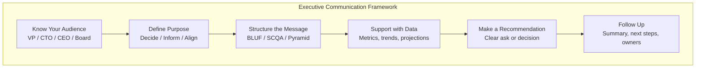

# Executive Communication

## Definition

Executive communication is the ability to convey complex technical topics to non-technical leaders clearly, concisely, and persuasively. It requires translating engineering work into business outcomes and building trust through structured, data-driven storytelling.



## One-Pager Structure

```
One-pager template for executive communication:

Title: [Clear, specific title — not "Update" but "Recommendation to adopt Kubernetes"]

1. BLUF (Bottom Line Up Front) — 1-2 sentences
   "We recommend migrating our top 10 services to Kubernetes over the next 6
   months. This will reduce infrastructure costs by 30% and improve deployment
   frequency from weekly to daily."

2. Context — 2-3 sentences
   "Our current deployment uses EC2 instances with manual provisioning.
   Engineering spends 20% of time on infrastructure, and deployments take
   3 hours. As we grow from 10 to 50 services, this approach won't scale."

3. Recommendation — 2-3 sentences
   "Adopt Kubernetes with EKS, migrating in 3 phases over 6 months.
   Phase 1: Foundation & training (month 1-2)
   Phase 2: Migrate top 5 services (month 3-4)
   Phase 3: Migrate remaining 5 services + decommission legacy (month 5-6)"

4. Why Now — 2 sentences
   "Waiting 12 months will cost $500K in additional infrastructure overhead
   and slow our feature velocity by 3x. The team is ready (2 SREs trained,
   pilot completed)."

5. Risks & Mitigations — 3-4 bullets
   - Learning curve: Training program in month 1
   - Migration downtime: Blue-green deployments, zero-downtime migrations
   - Cost overrun: Monthly cost reviews against budget

6. Resource Ask — 1 sentence
   "Requesting: 1 additional SRE (6-month contract), $50K for tooling,
   and 20% of the platform team's time."

7. Success Metrics
   - Deployment frequency: weekly → daily
   - Infrastructure cost: -30%
   - MTTR: 2 hours → 30 minutes
```

## BLUF / SCQA / Pyramid Principle

```
BLUF (Bottom Line Up Front):

  Start with the conclusion, then provide supporting details.
  
  Bad: "We've been evaluating our deployment pipeline and looking at various
  options to improve reliability. After researching Kubernetes, ECS, and
  Nomad, we found that Kubernetes has the best community support..."
  
  Good (BLUF): "We recommend adopting Kubernetes. It will reduce deployment
  time from 3 hours to 10 minutes and save $200K/year in infrastructure costs."
  
  Why BLUF works for executives:
  - Executives make many decisions — they need the bottom line first
  - Details are for validation, not for the opening
  - Saves time: if they disagree, the details are irrelevant

SCQA (Situation, Complication, Question, Answer):

  Situation: "We currently deploy services manually to EC2 instances."
  Complication: "At 10 services, this takes 20 hours/week. At 50 services,
                 it will take 100+ hours/week — an impossible bottleneck."
  Question: "How do we scale our deployment process without growing the ops team?"
  Answer: "Adopt Kubernetes with automated CI/CD pipelines."

Pyramid Principle:

  Start with the main recommendation (top of pyramid)
  Support with 3-5 key arguments (middle)
  Each argument supported by data points (base)

                    ┌─────────────────────┐
                    │     Recommendation  │
                    │   "Adopt K8s for    │
                    │    50% faster deploys"│
                    └──────────┬──────────┘
                               │
              ┌────────────────┼────────────────┐
              ▼                ▼                ▼
        ┌────────────┐  ┌────────────┐  ┌────────────┐
        │ Reliability │  │  Velocity  │  │   Cost     │
        │ +40% fewer  │  │ Deploy 10x │  │ -30% infra │
        │ incidents   │  │ more often │  │    cost    │
        └────────────┘  └────────────┘  └────────────┘
```

## Data Storytelling

```
Framework: Hook → Data → Insight → Action

Bad: "Our P99 latency increased from 200ms to 500ms last quarter."

Good: 
  Hook:  "Users in Southeast Asia are experiencing slow load times."
  Data:  "P99 latency increased from 200ms to 500ms over the last 3 months.
          Our APAC traffic grew 200% in the same period."
  Insight: "Our single-region US deployment can't serve growing APAC demand."
  Action: "We should deploy to an APAC region (Singapore) by next quarter."

Visual data rules for executive decks:
  - One metric per chart (don't cluster)
  - Trend lines over time (not snapshots)
  - Annotations for key events (deployments, incidents)
  - Red/green for good/bad (with labels for accessibility)
  - Max 3 charts per page

Quantifying technical debt:
  - "This legacy service causes 3 incidents/month × 2 hours MTTR × 5 engineers
    = 30 engineering hours/month lost"
  - "Rewriting it will take 2 months, but will save 5 hours/week ongoing"
  - Payback period: 4 months
```

## Influencing Without Authority

```
Techniques for influencing decisions when you don't have formal authority:

1. Build coalitions
   - Find 2-3 other engineers or leaders who agree
   - Pre-meet with them before the decision meeting
   - Present as a group recommendation, not individual

2. Speak their language
   - VP of Product cares about: user impact, time-to-market
   - CTO cares about: scalability, reliability, innovation
   - CFO cares about: cost, ROI, risk
   - Frame your recommendation in terms of what they care about

3. Use data, not opinions
   - "I think we should migrate to microservices" → weak
   - "Our current monolith deployment takes 6 hours with 40% failure rate,
     costing us $2M/year in lost developer productivity" → strong

4. Offer options
   - Option A: Do nothing (status quo, cost of inaction)
   - Option B: Recommended approach
   - Option C: More aggressive approach (make B look reasonable)
   - Always include a "do nothing" option with quantified cost

5. Make it easy to say yes
   - Clear recommendation, clear next steps
   - Resources already identified
   - Risks mitigated
   - "Yes" = confidence, "No" = no alternative
```

## Escalation Norms

```
When and how to escalate to executives:

Escalate when:
  - Resource decision exceeds your authority
  - Cross-org alignment needed
  - Timeline risk that impacts business commitment
  - Security or compliance vulnerability
  - Incident warrants executive awareness (SEV1)

How to escalate:
  1. State the problem clearly (BLUF)
  2. What you've already tried
  3. What you need from them
  4. What happens if we don't act

Email template:
  Subject: [ESCALATION] Database capacity reaching limit — decision needed

  BLUF: We need to approve $50K for database scaling within 2 weeks or
  we risk 30 minutes of downtime per week starting next month.

  What we've done: Optimized queries (gained 30%), architected read replicas
  (needs approval), tested vertical scaling (possible with budget)

  What we need: Approval for $50K to add read replicas

  Risk of inaction: Starting next month, we'll see 30-min weekly outages
  during peak. This affects 10% of users (the fastest-growing segment).
```

## Writing for VP+

```
Rules for writing at the executive level:

1. One page maximum
   - If you can't say it in one page, you haven't distilled it enough
   - Attach appendix for supporting details

2. Short paragraphs
   - 2-3 sentences per paragraph
   - One idea per paragraph
   - Use bullet lists for multiple points

3. Active voice
   - "We recommend migrating..." not "It is recommended that..."
   - "The team will deliver..." not "Delivery is expected by..."

4. Specific numbers
   - "Reduces cost by $500K/year" not "Reduces cost significantly"
   - "Affects 15% of users" not "Some users are affected"

5. Clear ask
   - Last paragraph: exactly what decision or action you need
   - "Approve $50K budget for Q3 migration" not "We'd appreciate your support"

Tone:
  - Confident but not arrogant
  - Data-driven but not technical
  - Specific but not overly detailed
  - Actionable but not presumptuous
```

## Best Practices

| Practice | Detail |
|----------|--------|
| **Prepare 3 versions** | Elevator pitch (30s), meeting summary (5min), deep dive (30min) |
| **Know your audience** | Frame message based on what the executive cares about |
| **Lead with conclusion** | BLUF: bottom line first, then supporting evidence |
| **One metric, one message** | Don't overwhelm with data; pick the most impactful metric |
| **Anticipate questions** | Prepare answers for the top 3 likely questions |
| **Send pre-reads** | Executives read faster than they listen in meetings |
| **Follow up in writing** | Send summary + decisions + action items after every meeting |

## Interview Questions

1. Write a one-paragraph executive summary for a migration to microservices.
2. How do you use the SCQA framework to frame a technical challenge?
3. How do you influence a decision when you don't have authority?
4. How do you communicate a SEV1 incident to the CTO?
5. What's your framework for preparing an executive presentation on a technical topic?
