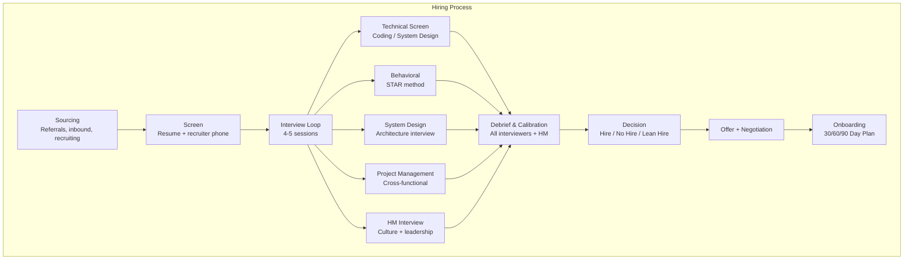

# Interviewing & Hiring

## Definition

Effective interviewing and hiring is one of the highest-leverage activities for a staff+ engineer. Great hiring raises the entire organization's bar. Poor hiring creates long-term drag. A structured, fair, and calibrated process is essential.



## Fair Rubrics

```
Rubric for System Design Interview:

Dimension           Poor (1)         Good (3)          Excellent (5)
Requirements        Misses key req   Covers most req   Comprehensive + prioritizes
Clarity             Incomplete       Structured        Clear, step-by-step, justified
Tradeoffs           No tradeoffs     Mentions some     Compares options with evidence
Scalability         Single server    Basic scale       Distributed, sharded, cached
Data model          No schema        Basic schema      Normalized + query patterns
APIs                Not defined      Some endpoints     Full API design + versioning

Overall score: 1 (Strong No Hire) to 5 (Strong Hire)
  Score >= 4: Hire
  Score = 3:  Lean hire (needs calibration)
  Score <= 2: No hire

Rubric components:
  - Each dimension has observable behaviors
  - Interviewers take notes on behaviors, not opinions
  - Score based on evidence, not feeling
  - "I liked the candidate" = subjective. "Candidate discussed 3 tradeoffs with
    data from their previous project" = evidence.
```

## System Design Interview Evaluation

```
Evaluating system design interviews:

Key aspects to assess:

1. Problem Framing
   - Did they clarify requirements or jump straight to solution?
   - Did they identify functional vs non-functional requirements?
   - Did they scope appropriately (not over-building)?

2. Structure
   - Did they present a clear high-level design first?
   - Did they go deep on the most important components?
   - Did they follow a logical flow (requirements → design → deep dive)?

3. Tradeoff Awareness
   - Did they mention alternatives?
   - Did they justify their choices?
   - Did they acknowledge downsides of their approach?

4. Deep Technical Knowledge
   - Did they understand the underlying technologies?
   - Could they discuss consistency models, partitioning, replication?
   - Did they consider failure modes?

5. Communication
   - Could they explain complex ideas clearly?
   - Did they use diagrams effectively?
   - Did they invite questions and adjust based on feedback?

Scoring guidelines:
  - Strong Hire: Clear structure, deep knowledge, multiple tradeoffs discussed,
    handles curveballs well, adjusts based on feedback
  - Hire: Good structure, reasonable depth, mentions tradeoffs
  - Lean Hire: Basic design, one approach, needs prompting
  - No Hire: Unclear structure, wrong technology choices, can't justify decisions
```

## Behavioral STAR Method

```
STAR framework for behavioral interviews:

S - Situation: Context (when, where, who)
T - Task: What needed to be done
A - Action: What YOU specifically did (not the team)
R - Result: Quantified outcome

Example:

S: "Our team was responsible for a payment service processing $10M/day.
   We had 3 SEV2 incidents in one month due to database connection leaks."

T: "I needed to identify the root cause, implement a fix, and prevent
   recurrence. The CTO wanted a solution within 2 weeks."

A: "I profiled the connection pool with a custom metrics dashboard and
   identified a missing connection release in the checkout flow. I fixed
   the bug, added connection leak detection with automated alerts, and
   introduced a read-only replica to reduce connection contention."

R: "Zero connection-related incidents in the next 6 months. Connection pool
   utilization dropped from 95% to 40%. I presented the fix in our engineering
   all-hands and it became a pattern adopted by 3 other teams."

Scoring:
  - Strong: Completed STAR, clear individual contribution, quantified impact
  - Good: STAR framework used, impact described but not quantified
  - Weak: Missing one STAR element, "we" instead of "I", vague impact
```

## Calibration / Debrief

```
Debrief meeting structure:

Attendees: All interviewers + Hiring Manager + Recruiter
Duration: 30-45 minutes per candidate

Agenda:
  1. Recruiter overview (5 min)
     - Background, why they're looking, logistics
  
  2. Each interviewer shares (5 min each)
     - What did you assess?
     - What evidence did you collect?
     - Your score + justification
  
  3. Calibration discussion (10-15 min)
     - Compare scores across interviewers
     - Resolve significant disagreements
     - Discuss overall pattern (not individual data points)
  
  4. Decision (5 min)
     - Hire / Lean Hire / No Hire
     - Strengths to leverage
     - Risks to mitigate

Calibration guidelines:
  - One score outlier: Discuss and potentially adjust
  - Two score outliers: Possible bias — re-evaluate
  - "I loved them" without evidence: Discuss with interviewer
  - "I hated them" without evidence: Same
  - Focus on patterns, not isolated examples
```

## Diverse Pipelines

```
Building diverse engineering teams:

Sourcing:
  - Use diverse job boards (Women Who Code, Tech Ladies, Out in Tech)
  - Diverse interview panels (candidates perform better with diverse panels)
  - Blind resume review (remove name, university, graduation year)
  - Structured interviews (reduce bias from unstructured conversation)

Interview process:
  - Same questions for all candidates (fair comparison)
  - Score-based decisions (reduce "gut feel" bias)
  - Take notes during interview (not from memory after)
  - Multiple interviewers assess different dimensions
  - Avoid "culture fit" (vague, bias-prone) — use "culture contribution"

Common biases to avoid:
  - Confirmation bias: Seeking evidence that confirms first impression
  - Halo effect: One strong skill overshadowing weaknesses
  - Similarity bias: Preferring candidates like yourself
  - Recency bias: Recent interview influences judgment of current one

Measuring diversity in hiring:
  - Track: application → screen → interview → offer → accept → promotion
  - Analyze by demographic group
  - Investigate drop-off points
  - Set goals but NOT quotas
```

## Onboarding 30/60/90

```
30/60/90 day plan for new hires:

First 30 Days: Learn (Observe + Ask)
  Week 1:
    - Meet team, set up dev environment, read docs
    - Meet with manager for expectations and priorities
    - Shadow on-call rotation
  
  Week 2-4:
    - Submit first PR (small bug fix or test)
    - Complete one small feature or task independently
    - Understand deployment process and CI/CD pipeline
    - Begin reading architecture docs and RFCs

  Checkpoint: Can explain the system architecture at a high level

Next 30 Days: Contribute (Build + Ship)
  Week 5-6:
    - Own a medium-sized feature or component
    - Participate in on-call rotation (with shadow support)
  
  Week 7-8:
    - Lead a small project or initiative
    - Review code for team members
    - Identify one improvement opportunity

  Checkpoint: Has shipped code to production independently

Final 30 Days: Lead (Own + Influence)
  Week 9-10:
    - Lead a significant project end-to-end
    - Propose and drive an improvement (tech debt, process, tooling)
  
  Week 11-12:
    - Mentor another team member or new hire
    - Participate in architecture discussions
    - Contribute to team strategy

  Checkpoint: Fully productive team member; can lead projects autonomously
```

## Best Practices

| Practice | Detail |
|----------|--------|
| **Structured interviews** | Same questions, same rubrics, same scoring for all |
| **Evidence over opinion** | "They said X" not "I felt Y" |
| **Diverse panels** | 3+ interviewers from different backgrounds |
| **Calibrate regularly** | Monthly calibration sessions to align scores |
| **30/60/90 onboarding** | Structured plan reduces ramp-up time by 40% |
| **Feedback to candidates** | Timely, specific, constructive (regardless of outcome) |
| **Continuous improvement** | Review interview data quarterly; adjust process |

## Interview Questions

1. Design a fair rubric for evaluating system design interviews.
2. How would you structure a debrief meeting to calibrate across interviewers?
3. How do you use the STAR method to evaluate behavioral responses?
4. What strategies do you use to build a diverse hiring pipeline?
5. Design a 30/60/90 onboarding plan for a senior engineer.
