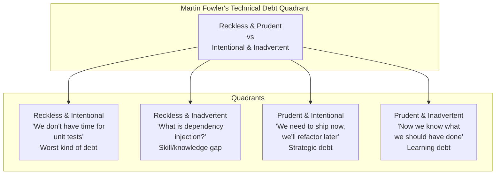

# Technical Debt Management

## Definition

Technical debt is the implied cost of future rework caused by choosing an easy or quick solution now instead of a better approach that would take longer. Like financial debt, technical debt accrues interest (slower development, more bugs) and must be managed strategically.



## Martin Fowler's Quadrant

```
Reckless & Intentional (Worst):
  - Deliberately cutting corners knowing it will cause problems
  - "We'll just skip tests to make the deadline"
  - "This hack will work for now, let's not document it"
  - Management: Set clear quality standards; don't reward shortcuts

Reckless & Inadvertent:
  - Creating debt without realizing it (inexperience)
  - Junior team without senior mentorship
  - Using unfamiliar technology incorrectly
  - Management: Invest in mentorship, code review, training

Prudent & Intentional (Strategic):
  - Conscious decision to incur debt for business value
  - "Ship now, add error handling in v2"
  - Documented debt with plan to pay it down
  - Management: This is healthy — ship fast, but track and repay

Prudent & Inadvertent (Learning):
  - Did the right thing with available knowledge
  - Later discovery: "We should have done it differently"
  - The best teams still have this kind of debt
  - Management: Celebrate learning; fix when economical
```

## Debt Tracking

```
Technical debt register:

ID       Description                     Impact           Cost to Fix    Quarterly
TD-001   No unit tests for payment      3 incidents/yr   $50K (2 wks)   $15K
        service                         ($15K/yr)                        (interest)
TD-002   Monolith deployment takes      20 eng-hours/wk  $100K (4 wks)  $104K
        6 hours, 40% failure rate       ($104K/yr)                       (interest)
TD-003   Manual database migrations     2 SEV3/month     $25K (1 wk)    $12K
        cause production errors         ($12K/yr)                        (interest)

Total annual interest: $131K
Total fix cost: $175K
Payback period: 16 months

Prioritization framework:

  Debt Value = Interest Saved - Fix Cost
  Debt ROI = Interest Saved / Fix Cost
  
  Priority 1: High interest, low fix cost (e.g., TD-003: $12K/yr for $25K fix)
  Priority 2: High interest, medium fix cost (e.g., TD-001: $15K/yr for $50K fix)
  Priority 3: Medium interest, high fix cost (e.g., TD-002: $104K/yr for $100K fix)
  Priority 4: Low interest, high fix cost (re-assess later)
```

## Budgeting Cycles

```
Technical debt budget allocation:

Allocation models:
  - 20% Rule: 20% of each sprint dedicated to debt reduction
  - Fix-It Weeks: One week per quarter dedicated to tech debt
  - Pain-Driven Fix: Fix debt when it causes an incident (reactive)
  - Boy Scout Rule: Leave code better than you found it (opportunistic)

Budget tracking:

Quarter     Debt Budget    Allocated    Spent       Impact
Q1 2026     $50K (2 wks)   TD-001      1.5 weeks   3 payments fixed
Q2 2026     $50K (2 wks)   TD-003      1 week      Automated migrations
Q3 2026     $50K (2 wks)   TD-002      3 weeks     Monolith → service extraction
Q4 2026     $50K (2 wks)   TD-004      1 week      Legacy endpoint retired

Business communication:
  - Don't say "tech debt" — say "accrued maintenance cost"
  - Quantify in terms business understands
  - Show trend: Are we getting better or worse?
  - Link to developer satisfaction (retention risk)
```

## Communication to Business

```
How to communicate technical debt to non-technical stakeholders:

Bad: "We need to fix the tech debt in the authentication service because
      the code is messy and the architecture is wrong."

Good: "The authentication service has caused 4 SEV2 incidents this year,
       taking 20 engineering hours to resolve each time. That's $40K in
       engineering time, not counting lost user trust during outages.
       
       We recommend a 2-week investment to rewrite the service with proper
       error handling and monitoring. This will reduce future incidents by
       an estimated 80% and save $32K/year in incident response time."

Translation framework:
  - Code complexity  →  Developer velocity  →  Feature delivery time
  - Missing tests     →  Bug rate            →  Customer satisfaction
  - Monolith          →  Deployment time     →  Time-to-market
  - Hard to debug     →  MTTR               →  Reliability (SLOs)

Key message: "Every dollar of debt has an interest rate. We want to pay down
the high-interest debt first."
```

## Payoff Strategies

```
Three main payoff strategies:

Strangler Fig (Incremental):
  - Gradually replace debt-laden components
  - Zero risk (piece by piece)
  - Takes longest
  - Best for: Large, critical systems that can't be taken offline

Big Bang (Rewrite):
  - Rewrite the entire debt-laden system
  - Highest risk (second-system syndrome)
  - Fastest payoff
  - Best for: Small, well-understood systems; no active development needed

Boy Scout Rule (Opportunistic):
  - Leave every file better than you found it
  - Refactor as you touch code
  - Low risk, slow payoff
  - Best for: Actively developed systems; cultural change

Strategy decision matrix:

System Size   Criticality    Active Dev     Strategy
Small         Low            No             Big Bang
Small         High           Yes            Strangler Fig / Boy Scout
Large         Low            No             Strangler Fig (if ROI positive)
Large         High           Yes            Boy Scout Rule (20% time)
Medium        High           Yes            Strangler Fig + Boy Scout
```

## Best Practices

| Practice | Detail |
|----------|--------|
| **Track debt formally** | Register with impact, cost, and interest rate |
| **Quantify interest** | "This debt costs us X hours/month" |
| **Allocate budget** | 20% rule or fix-it weeks |
| **Communicate in business terms** | Don't say "tech debt" — say "velocity tax" |
| **Boy Scout rule** | Leave code better than you found it |
| **Fix root causes** | Don't just fix the debt — fix the process that created it |
| **Celebrate debt reduction** | Track and share progress to build momentum |

## Interview Questions

1. How do you use Martin Fowler's technical debt quadrant to categorize debt?
2. How do you quantify the cost of technical debt for business stakeholders?
3. Design a technical debt register and prioritization process.
4. Compare strangler fig, big bang, and boy scout strategies for debt payoff.
5. How would you convince your VP to invest 20% of engineering time in tech debt reduction?
