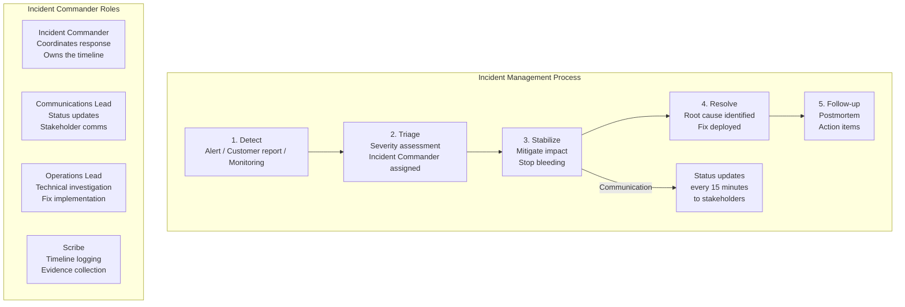
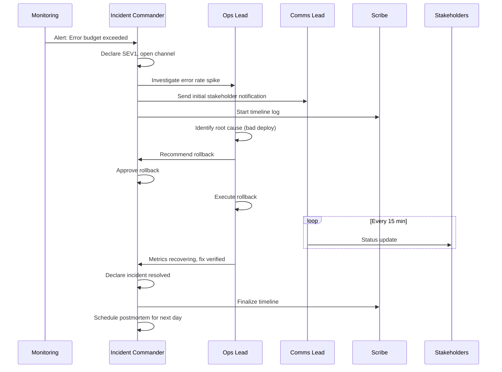

# Incident Leadership

## Definition

Incident leadership is the ability to effectively manage and coordinate the response to production incidents. The Incident Commander role is central to this process, providing clear structure, communication, and decision-making during high-stress situations.



## Incident Commander Role

```
Incident Commander (IC) responsibilities:

BEFORE the incident:
  - Ensure runbooks are up to date
  - Participate in incident drills/gamedays
  - Know who to contact for each service
  - Ensure communication channels are ready

DURING the incident:
  - Declare the incident (severity level)
  - Assign roles (operations lead, comms lead, scribe)
  - Set the communication cadence
  - Make escalation decisions
  - Approve mitigation actions (restart, rollback, disable feature)
  - Manage the timeline
  - Declare "incident resolved" when appropriate

AFTER the incident:
  - Facilitate the postmortem
  - Ensure action items are tracked
  - Identify systemic improvements

What the IC does NOT do:
  - Debug the technical issue (that's operations lead)
  - Write code to fix the problem
  - Respond to individual questions (that's comms lead)
  - Make technical decisions without input

Key IC behaviors:
  - Calm under pressure
  - Clear communication (even in uncertainty)
  - Decisive (better to make a decision and adjust than to wait)
  - Knows when to escalate and to whom
```

## Large-Scale Coordination

```
Stabilize → Triage → Resolve → Follow-up

Phase 1: STABILIZE (first 5 minutes)

  Goal: Stop the bleeding. Reduce user impact.
  
  Actions:
    - Rollback bad deployment (if recent change)
    - Disable problematic feature (feature flag)
    - Redirect traffic to healthy region
    - Scale up healthy instances
    - If data loss: stop the process that's losing data
  
  Communication:
    - Declare SEV level
    - Open incident channel (#incident-{id})
    - Assign roles
    - Send initial status: "We are investigating reports of X"

Phase 2: TRIAGE (5-15 minutes)

  Goal: Understand scope and impact.
  
  Questions to answer:
    - What's the blast radius? (users, services, regions)
    - Is it getting worse or stabilizing?
    - What changed recently? (deploys, config changes, traffic spikes)
    - Do we have a hypothesis?
  
  Communication:
    - Update stakeholders every 15 min
    - Status: "Confirmed impact to X services. Affecting Y% of users. 
               Investigating [hypothesis]."

Phase 3: RESOLVE (15 minutes - hours)

  Goal: Implement and verify fix.
  
  Actions:
    - Test fix in isolation (canary)
    - Roll out to production
    - Verify metrics recovering
    - Monitor for side effects
  
  Communication:
    - "Fix rolled out to 10% of traffic — monitoring"
    - "Fix at 100% — metrics recovering"
    - "Incident resolved — impact lasted X minutes"

Phase 4: FOLLOW-UP (next business day)

  Goal: Learn and prevent recurrence.
  
  Actions:
    - Schedule postmortem within 48 hours
    - Gather timeline evidence
    - Draft action items
    - Update runbooks
```

## Communication Templates

```
Initial notification (Slack / Email / PagerDuty):

  [SEV1] Payment service — elevated error rate
  • Impact: Payment processing failing — users cannot complete orders
  • Scope: All regions, ~50% of payment requests failing (5XX errors)
  • Started: 14:32 UTC
  • Current status: Investigating — initial hypothesis: database connection pool exhausted
  • Incident channel: #incident-2345
  • IC: @alice
  • Next update: 14:47 UTC (15 min)

Regular update template:

  [SEV1 Update] Payment service — 14:47 UTC
  • Progress: Identified slow query on orders table causing connection pool exhaustion
  • Action: Running KILL QUERY to clear blocked connections; preparing read replica
  • Impact: Still affecting 50% of payment requests
  • Risk: Adding read replica may increase DB load during sync
  • Next update: 15:02 UTC

Resolution notification:

  [SEV1 Resolved] Payment service — 15:30 UTC
  • Impact duration: 58 minutes (14:32 - 15:30)
  • Root cause: Unoptimized query on orders table (missing index on status column)
  • Fix applied: Added index + rolled out read replica connection routing
  • Verification: Error rate back to baseline (0.01%)
  • Postmortem scheduled: Tomorrow 10:00 AM
```

## Postmortem Facilitation

```
Postmortem structure:

Title: [Date] - Payment Service Outage - SEV1

Timeline:
  14:32: Alert fired (error rate > 5%)
  14:33: IC declared (@alice)
  14:35: Operations lead identified slow query pattern
  14:42: Root cause: missing index on orders.status
  14:45: Executed KILL QUERY to clear blocked connections
  14:52: Read replica added to connection pool
  15:15: Index migration completed; query performance recovered
  15:30: Error rate at baseline; incident closed

Impact:
  - 58 minutes of degraded payment processing
  - ~15,000 failed payment attempts
  - $45K in lost transactions

Root cause:
  - A recent schema migration added a new status filter to the payments
    query but did not include an index on the new status column.
  - The query scanned 500K rows per request, causing connection pool exhaustion.

Contributing factors:
  - No automated query performance regression testing
  - No index review required in schema migration checklist
  - On-call engineer: first incident; runbook didn't mention slow queries

Action items:
  Priority | Action                              | Owner   | Due
  P0       | Add index on orders.status         | Alice   | Complete
  P1       | Add query performance CI check      | Bob     | Next sprint
  P1       | Add slow query to runbook           | Carol   | This week
  P2       | Schedule gameday for database incident | Team | Next quarter

Blameless culture:
  - Focus on system failures, not individual mistakes
  - "What could the system have done better?" not "Who made the mistake?"
  - Action items are about prevention, not punishment
```

## Incident Management Process



## Best Practices

| Practice | Detail |
|----------|--------|
| **Role separation** | IC doesn't debug; Ops lead doesn't communicate |
| **Communication cadence** | Every 15 min for SEV1; 30 min for SEV2 |
| **Blame-free culture** | Postmortems focus on system, not individuals |
| **Runbooks** | Every known failure mode should have a runbook |
| **Incident drills** | Practice incident response quarterly |
| **Automate where possible** | Auto-rollback, auto-scale, auto-remediate |
| **Learn and improve** | Every incident should produce 1-3 actionable improvements |

## Interview Questions

1. What is the role of an Incident Commander and how does it differ from Operations Lead?
2. Design the incident management process for a multi-region e-commerce platform.
3. How do you facilitate a blameless postmortem?
4. How do you communicate a SEV1 incident to executives?
5. How would you build an incident response culture in a team that doesn't have one?
