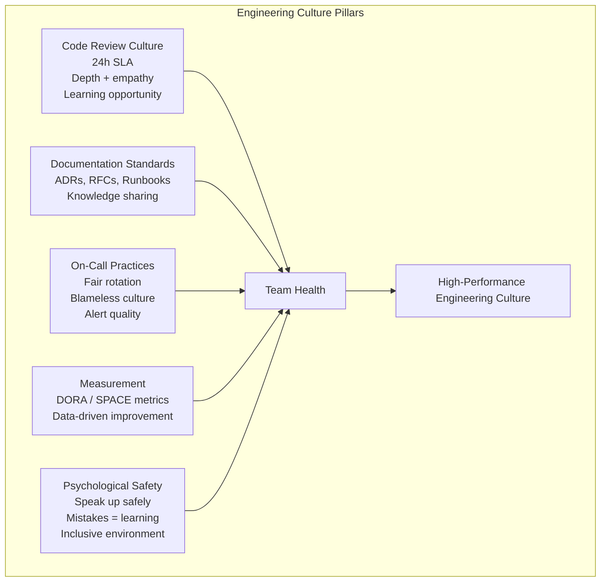

# Engineering Culture

## Definition

Engineering culture is the set of shared values, norms, and practices that shape how engineers work together. A strong culture creates psychological safety, enables high performance, and attracts and retains great engineers.



## Code Review Norms

```
Code review standards:

24-hour SLA:
  - All PRs receive first review within 24 hours (business hours)
  - Urgent fixes: "hotfix" label → 2-hour SLA
  - Friday afternoon PRs: acknowledged with expected review timeline
  - Reviewer communicates if they can't meet SLA

Review depth expectations:

  Small PR (< 200 lines):
    - Full line-by-line review
    - Check logic, edge cases, naming, tests
    - Expected: 15-30 minutes

  Medium PR (200-500 lines):
    - Architecture-level review
    - Deep dive on critical logic
    - Spot-check test coverage
    - Expected: 30-60 minutes

  Large PR (> 500 lines):
    - Should be rare (split into smaller PRs)
    - Architecture + design review
    - Check for security and performance issues
    - Expected: 45-90 minutes

Review empathy principles:
  - "This is wrong" → "I think this might not handle X edge case"
  - "Why did you do this?" → "Can you help me understand the approach?"
  - Ask questions, don't make demands
  - Explain the reasoning behind suggestions
  - Praise good solutions publicly

What to look for:
  - Correctness: Does it solve the problem?
  - Security: Any vulnerabilities?
  - Performance: Any obvious inefficiencies?
  - Maintainability: Will another engineer understand this in 6 months?
  - Test coverage: Are there tests for the critical paths?
```

## Documentation Standards

```
ADR (Architecture Decision Record):

  Title: ADR-001: Use PostgreSQL for order storage
  Status: Accepted | Proposed | Deprecated
  
  Context:
    We need a database for order storage that supports ACID transactions,
    complex queries, and high write throughput.
    
  Decision:
    Use PostgreSQL with read replicas and Citus for sharding.
    
  Options Considered:
    - PostgreSQL (chosen): ACID, familiar, proven at scale
    - Cassandra: Higher throughput, but no ACID, weak consistency
    - DynamoDB: Managed, but vendor lock-in, cost at scale
    
  Consequences:
    + Strong consistency for payments
    + Rich query capabilities
    - Need to manage sharding horizontally at scale
    - Need read replicas for analytics queries

Runbook template:

  # Runbook: High CPU on payment service

  ## Symptoms
  - Alert: "Payment Service - CPU > 90%"
  - Users: Slow payment processing
  
  ## Severity: SEV2
  
  ## Initial Diagnosis
  1. Check pod logs: `kubectl logs -l app=payment --tail=100`
  2. Check metrics dashboard: Payment CPU / Memory
  3. Check recent deploys: `kubectl rollout history deployment/payment`
  
  ## Mitigation Steps
  1. If recent deploy: Rollback to previous version
  2. If traffic spike: Increase replicas
  3. If slow queries: Run `EXPLAIN ANALYZE` on top queries
  
  ## Resolution
  1. Confirm CPU back to baseline
  2. Monitor for 15 minutes
  3. Update this runbook if anything was missing
```

## On-Call Practices

```
On-call norms for healthy teams:

Rotation:
  - 1 week primary, 1 week secondary (team of 6-8)
  - No on-call during PTO or company holidays
  - Shadow period for new members (2 weeks)
  - Easy swap policy: any team member can cover

Alert quality:
  - Target: < 3 actionable alerts per shift
  - Every alert must have a runbook
  - Monthly alert review: silence noisy alerts, add missing ones
  - False positive rate target: < 20%

Response expectations:
  - Page (phone call): Respond within 5 minutes
  - Push notification: Respond within 15 minutes
  - Slack (non-urgent): Respond within 1 hour

Support:
  - On-call handoff meeting every morning
  - Post-incident debrief within 24 hours
  - No post-mortems during on-call week (separate time)
  - Breakfast credit for overnight incidents

Culture:
  - It's okay to escalate — that's what secondary is for
  - No blame for incidents (systems fail, not people)
  - Celebrate good incident response
```

## Team Health (DORA / SPACE)

```
DORA metrics (DevOps Research & Assessment):

Metric                    Elite         High         Medium       Low
Deployment Frequency      Multiple/day  Daily        Weekly       Monthly
Lead Time for Changes     < 1 hour      < 1 day      < 1 week     > 1 month
Time to Restore Service   < 1 hour      < 1 day      < 1 week     > 1 month
Change Failure Rate       < 5%          < 10%        < 20%        > 20%

SPACE framework (additional dimensions):

  S: Satisfaction & Well-being
     - "I'm satisfied with my work" (survey score 4+/5)
     - Low burnout (no one working > 45h/week regularly)
  
  P: Performance
     - System quality (DORA metrics)
     - Business impact delivered
  
  A: Activity
     - PRs merged, code reviews completed
     - Incidents handled, on-call metrics
  
  C: Communication & Collaboration
     - Knowledge sharing (RFCs, tech talks)
     - Cross-team collaboration effectiveness
  
  E: Efficiency & Flow
     - Time spent in flow vs context switching
     - Cycle time from commit to production

Team health survey questions:
  1. I can complete my work without interruptions (flow)
  2. I receive timely, constructive code reviews
  3. I feel safe admitting mistakes on my team
  4. On-call is sustainable and fair
  5. I'm learning and growing in my role
```

## Psychological Safety

```
Building psychological safety:

Creating safety:
  - Leaders admit their own mistakes first
  - "I don't know" is an acceptable answer
  - All ideas are considered (not just senior voices)
  - Questions are encouraged, not punished

Daily practices:
  - Meeting rounds: everyone shares their thought
  - Blameless postmortems: "What can the system do better?"
  - Retrospectives: safe space for honest feedback
  - Decision logs: "Who decided what and why"

Signs of low psychological safety:
  - Only senior engineers speak in meetings
  - People don't ask questions in design reviews
  - Mistakes are hidden, not shared
  - Retrospectives are quiet
  - "That's how we've always done it" is common

Measuring:
  - Annual engagement survey
  - Quarterly team health checks
  - Anonymous feedback channels
  - Retention and promotion data by demographic

Impact:
  - Google's Project Aristotle: PS was #1 predictor of team effectiveness
  - Teams with high PS: more diverse ideas, fewer blind spots, better decisions
```

## Best Practices

| Practice | Detail |
|----------|--------|
| **Code review as learning** | Reviews are teaching opportunities, not gatekeeping |
| **Document decisions** | ADRs capture why, not just what |
| **Sustainable on-call** | Alert quality > alert quantity; fair rotation |
| **Measure what matters** | DORA for velocity; SPACE for well-being |
| **Psychological safety** | Without it, no other practice matters |
| **Continuous improvement** | Retrospectives, quarterly health checks, blameless culture |
| **Celebrate wins** | Ship something? Celebrate it. Good postmortem? Share it. |

## Interview Questions

1. How would you improve code review culture on a team with slow, shallow reviews?
2. What's more important: documentation quality or code quality? Why?
3. How do you measure and improve on-call sustainability?
4. How would you introduce DORA metrics to a team that doesn't measure velocity?
5. How do you build psychological safety on a new or struggling team?
