# Growth Paths: Staff → Principal → Distinguished → Fellow

## Definition

Engineering career progression beyond Senior typically follows a path from Staff Engineer through Principal, Distinguished, and Fellow. Each level represents increasing scope, complexity, ambiguity, and influence — not just more technical depth.

```mermaid
graph TB
    subgraph "Career Ladder: IC Track"
        SE["Senior Engineer<br/>Scope: Team<br/>Complexity: Well-defined<br/>Influence: Technical depth"] 
        
        SE --> Staff["Staff Engineer<br/>Scope: Multiple teams<br/>Complexity: Ill-defined<br/>Influence: Technical leadership"]
        
        Staff --> Principal["Principal Engineer<br/>Scope: Organization<br/>Complexity: Ambiguous<br/>Influence: Organizational strategy"]
        
        Principal --> Dist["Distinguished Engineer<br/>Scope: Company-wide<br/>Complexity: Industry-level<br/>Influence: Industry recognition"]
        
        Dist --> Fellow["Fellow<br/>Scope: Cross-industry<br/>Complexity: Uncharted<br/>Influence: Define the state of the art"]
    end
    
    subgraph "Skill Evolution"
        Depth["Technical Depth<br/>Deep code/architecture knowledge"] --> Breadth["Technical Breadth<br/>Multiple domains, patterns"]
        Breadth --> Influence["Influence & Mentorship<br/>Growing others, org change"]
        Influence --> Strategy["Technical Strategy<br/>Long-term vision, industry impact"]
    end
```



## Responsibility / Scope / Complexity / Ambiguity Changes

| Dimension | Senior | Staff | Principal | Distinguished | Fellow |
|-----------|--------|-------|-----------|---------------|--------|
| **Scope** | Single team | 2-3 teams | Organization (50-200) | Company-wide | Industry-wide |
| **Time horizon** | Weeks-months | Months-quarters | Quarters-years | Years | 5+ years |
| **Problem type** | Well-defined | Ill-defined | Ambiguous | Novel | Uncharted |
| **Technical depth** | Expert in area | Expert in multiple | Broad architecture | Technology visionary | Industry thought leader |
| **Decision type** | Implementation | Architecture | Strategy | Direction | Paradigm |
| **Communication** | Team | Cross-team | Organization | Company | Industry |
| **Mentorship** | Mentors juniors | Grows Staff candidates | Builds org capability | Develops next-gen leaders | Shapes the profession |
| **Autonomy** | Guided | Self-directed | Defines direction | Sets industry direction | Defines new fields |

## Skill Evolution: Depth → Breadth → Influence → Strategy

```
Depth (Senior → Staff):
  - Deep technical expertise in one or more domains
  - Can design and implement complex systems
  - Known as the go-to person for a specific area
  - Mentors junior engineers on technical skills

Breadth (Staff → Principal):
  - Cross-domain knowledge (infrastructure, data, frontend)
  - Can identify patterns across different teams/services
  - Spots systemic problems and solutions
  - Drives large multi-team initiatives
  - Exposed to product, business, and strategy conversations

Influence (Principal → Distinguished):
  - Grows other engineers (mentorship at scale)
  - Sets technical direction for the organization
  - Influences without authority across multiple teams
  - Builds engineering culture and standards
  - Recognized outside their immediate organization

Strategy (Distinguished → Fellow):
  - Shapes the company's technical strategy
  - Anticipates industry trends 3-5 years out
  - Makes bets on technologies before they're proven
  - External recognition (publications, conferences, patents)
  - Defines new areas of engineering practice
```

## Career Ladder Diagram

```mermaid
graph TB
    subgraph "IC Track Progression"
        subgraph "Tactical (Depth)"
            SE["Senior<br/>Depth: ★★★★<br/>Breadth: ★★<br/>Influence: ★★"]
        end
        
        subgraph "Strategic (Breadth)"
            Staff["Staff<br/>Depth: ★★★★<br/>Breadth: ★★★★<br/>Influence: ★★★"]
            Principal["Principal<br/>Depth: ★★★<br/>Breadth: ★★★★★<br/>Influence: ★★★★"]
        end
        
        subgraph "Visionary (Influence)"
            Dist["Distinguished<br/>Depth: ★★★<br/>Breadth: ★★★★★<br/>Influence: ★★★★★"]
            Fellow["Fellow<br/>Depth: ★★<br/>Breadth: ★★★★★<br/>Influence: ★★★★★★"]
        end
        
        SE --> Staff
        Staff --> Principal
        Principal --> Dist
        Dist --> Fellow
    end
    
    subgraph "Manager Track (Alternative)"
        EM["Engineering Manager"] --> SrEM["Senior EM"]
        SrEM --> Director["Director of Engineering"]
        Director --> VP["VP of Engineering"]
        VP --> CTO["CTO"]
    end
```



## Impact Expectations by Level

```
What success looks like at each level:

Staff Engineer:
  - Delivered a critical project across 2-3 teams
  - Identified and fixed a systemic technical issue
  - Mentored 2+ engineers who grew to Senior
  - Written 3+ ADRs that shaped team architecture
  - On-call rotation participant

Principal Engineer:
  - Drove technical strategy for an org of 50-200 engineers
  - Led a major migration/initiative with cross-team impact
  - Established engineering standards adopted org-wide
  - Developed multiple Staff engineers
  - External visibility (conference talks, blog posts)

Distinguished Engineer:
  - Shaped company-wide technical direction
  - Drove industry-recognized innovation
  - Built engineering culture that attracts top talent
  - Represented the company externally (keynotes, papers)
  - Patents, publications, or open-source leadership

Fellow:
  - Defined a new engineering discipline or paradigm
  - Industry-wide influence on engineering practice
  - Mentored the next generation of Distinguished engineers
  - Published influential work (books, papers, standards)
```

## Common Growth Patterns

```
Staff engineer growth patterns:

Pattern 1: Deep SME → Staff
  - Develop world-class expertise in a critical domain (storage, ML infra, networking)
  - Become the authority that teams across the company consult
  - Drive architecture decisions in your domain
  - Risk: Too narrow — may not be visible beyond your domain

Pattern 2: Fixer → Staff
  - Join struggling teams/projects and turn them around
  - Build systems, culture, and practices that stick after you leave
  - Known for delivering results in high-pressure situations
  - Risk: May burn out from constantly fighting fires

Pattern 3: Builder → Staff
  - Identify missing infrastructure/patterns and build them
  - Create platforms, frameworks, or tools that many teams use
  - Multiply the productivity of dozens of engineers
  - Risk: Build things nobody asked for (build in partnership with teams)

Pattern 4: Strategist → Staff
  - See the big picture across multiple teams
  - Write strategy docs, influence roadmaps, align stakeholders
  - Drive multi-quarter initiatives
  - Risk: May spend too much time in meetings, not enough building

Key insight: Most Staff engineers combine 2+ of these patterns.
```

## Transitioning Between Levels

```
Signs you're ready for the next level:

Senior → Staff:
  - You're solving problems that span beyond your team
  - People across teams ask for your technical opinion
  - You're frustrated by systemic issues beyond your control
  - You naturally mentor others without being asked

Staff → Principal:
  - You're thinking in quarters and years, not weeks
  - You see patterns across the entire organization
  - You can influence decisions without direct authority
  - You're developing other Staff engineers

Principal → Distinguished:
  - Your work is known outside your company
  - You're setting technical direction for the company
  - You anticipate industry trends 2-3 years out
  - You're building the next generation of technical leaders

How to transition:
  - Start doing the next level's work in your current role
  - Get feedback from people at the next level
  - Build a strong portfolio of impact examples
  - Find a sponsor who advocates for your promotion
  - Be patient — each level takes 3-7 years typically
```

## Best Practices

| Practice | Detail |
|----------|--------|
| **Know your ladder** | Every company defines levels differently; learn yours |
| **Build a portfolio** | Document your impact for promotion packets |
| **Find sponsors** | You need advocates at the level above to be promoted |
| **Develop others** | Growing Staff engineers is a requirement for Principal+ |
| **Stretch before you're ready** | Take on work slightly beyond your current level |
| **Stay technical** | Even at distinguished levels, maintain technical credibility |
| **Find your pattern** | Deep SME, Fixer, Builder, or Strategist — lean into your strength |

## Interview Questions

1. How does the scope and complexity of work change from Staff to Principal to Distinguished?
2. What skills must an engineer develop to move from Senior to Staff?
3. How do you build a promotion packet for a Staff-to-Principal candidate?
4. Compare the IC track progression with the Engineering Manager track.
5. What does "influence without authority" look like at the Staff level vs Principal level?
