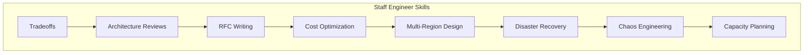

# 21 — Staff Engineer

> Think beyond code. Design systems that span teams, regions, and years.



## Topics

| # | Topic | Description |
|---|-------|-------------|
| 1 | [Tradeoffs](01-tradeoffs.md) | Systematic decision-making |
| 2 | [Architecture Reviews](02-architecture-reviews.md) | Reviewing designs effectively |
| 3 | [RFC Writing](03-rfc-writing.md) | Technical design documents |
| 4 | [Cost Optimization](04-cost-optimization.md) | Building cost-effective systems |
| 5 | [Multi-Region Design](05-multi-region-design.md) | Global architecture patterns |
| 6 | [Disaster Recovery](06-disaster-recovery.md) | Planning for the worst |
| 7 | [Chaos Engineering](07-chaos-engineering.md) | Testing reliability proactively |
| 8 | [Capacity Planning](08-capacity-planning.md) | Predicting future needs |

## Staff Engineer Mindset

```
From:                    To:
"Can we build this?"     "Should we build this?"
"How fast is it?"        "What's the total cost of ownership?"
"What tech should we use?"  "What's the right abstraction?"
"Is it correct?"         "How does it fail?"
"Ship it!"               "What's the blast radius?"
```

---

Previous: [20 — Interview Prep](../20-Interview-Prep/README.md)
