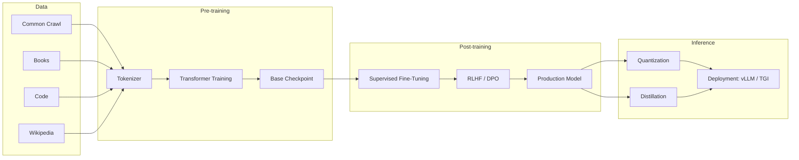

# Transformer Architecture

> The foundation of all modern LLMs — from GPT to Claude to Gemini — built on the attention mechanism.

```mermaid
graph TB
    subgraph "Transformer Block (Decoder-Only)"
        IN[Input Tokens] --> EMB[Token Embedding + Positional Encoding]
        EMB --> MHA[Masked Multi-Head Attention]
        MHA --> ADD1[Add & Norm]
        ADD1 --> FFN[Feed-Forward Network]
        FFN --> ADD2[Add & Norm]
        ADD2 --> OUT[Output Projection]
        OUT --> SOFT[Softmax]
        SOFT --> PROBS[Token Probabilities]
    end

    subgraph "Multi-Head Attention"
        Q[Query] --> SPLIT[Split into H Heads]
        K[Key] --> SPLIT
        V[Value] --> SPLIT
        SPLIT --> ATTN[Scaled Dot-Product Attention per Head]
        ATTN --> CONCAT[Concatenate Heads]
        CONCAT --> PROJ[Output Projection]
    end

    subgraph "Scaled Dot-Product Attention"
        Q2[Q] --> DOT[Q × K^T]
        K2[K] --> DOT
        DOT --> SCALE[Scale by 1/√d_k]
        SCALE --> MASK[Optional Mask]
        MASK --> SOFT2[Softmax]
        SOFT2 --> WEIGHT[Attention Weights]
        WEIGHT --> MATMUL[Weighted Sum × V]
        V2[V] --> MATMUL
        MATMUL --> RES[Context Vector]
    end
```



## What Is It?

The Transformer is a neural architecture introduced in "Attention Is All You Need" (Vaswani et al., 2017). It replaces recurrence (RNNs) and convolution (CNNs) with a pure attention mechanism, enabling parallel computation and long-range dependencies.

## Why It Was Created

- RNNs/LSTMs struggled with long sequences due to vanishing gradients and sequential processing
- CNNs required deep stacks to capture long-range dependencies
- No existing architecture could efficiently parallelize across sequence positions during training
- Scaling laws showed that larger models + more data = predictable improvement

## Key Components

| Component | Purpose | Detail |
|-----------|---------|--------|
| Token Embedding | Maps tokens to dense vectors | Usually 4096-16384 dimensions |
| Positional Encoding | Injects position information | Sinusoidal or learned RoPE (most LLMs) |
| Multi-Head Attention | Captures relationships between tokens | 8-96 heads, each attending to different patterns |
| Feed-Forward Network | Non-linear transformation | Typically 4× hidden dimension, SwiGLU activation |
| Layer Norm | Stabilizes training | Pre-norm (modern) vs Post-norm (original) |
| KV Cache | Avoids re-computing keys/values | Memory-optimized for inference |

## When to Use It

- **Foundation models**: GPT, Claude, Gemini, Llama — all decoder-only transformers
- **Encoder models**: BERT, RoBERTa — bidirectional attention for understanding
- **Encoder-decoder**: T5, BART — sequence-to-sequence tasks (translation, summarization)
- **Vision**: ViT (Vision Transformer) — patches as tokens for image classification
- **Multimodal**: Cross-attention layers fuse vision + language (Flamingo, LLaVA)

## Architecture Details

### Attention Mechanism

```
Attention(Q, K, V) = softmax(Q × K^T / √d_k) × V
```

- Q (Query): What I'm looking for
- K (Key): What I contain
- V (Value): What I should output

Scaling by `√d_k` prevents softmax saturation with large dimensions.

### Multi-Head Attention

Instead of one attention, we split Q, K, V into H heads:
- Each head learns different relationship types (syntax, semantics, coreference)
- Outputs are concatenated and projected
- Common: H=32 for 7B models, H=96 for 70B models

### Decoder-Only Architecture (GPT-style)

1. **Input**: Tokenized text → embeddings + positional encoding
2. **Causal mask**: Prevents attending to future tokens (autoregressive)
3. **Attention layers**: Alternating attention + FFN blocks
4. **Output**: Logits over vocabulary → softmax → next-token probabilities

### KV Cache

During inference, each token attends to all previous tokens. Instead of recomputing K and V for the full sequence at each step, we cache them:

- **Pre-fill phase**: Compute KV for the prompt (parallel)
- **Decode phase**: For each new token, only compute new K,V and append to cache
- **Trade-off**: Memory grows with sequence length (O(n) per layer per head)

## Hands-on Example: Mini Transformer Inference

```python
import torch
import torch.nn.functional as F

def scaled_dot_product_attention(Q, K, V, mask=None):
    d_k = Q.size(-1)
    scores = torch.matmul(Q, K.transpose(-2, -1)) / torch.sqrt(torch.tensor(d_k, dtype=torch.float32))
    if mask is not None:
        scores = scores.masked_fill(mask == 0, float('-inf'))
    weights = F.softmax(scores, dim=-1)
    return torch.matmul(weights, V)

# Simulate single-head attention for batch=1, seq=4, d_model=8
batch, seq, d_model = 1, 4, 8
x = torch.randn(batch, seq, d_model)
W_q = torch.randn(d_model, d_model)
W_k = torch.randn(d_model, d_model)
W_v = torch.randn(d_model, d_model)

Q = torch.matmul(x, W_q)
K = torch.matmul(x, W_k)
V = torch.matmul(x, W_v)

output = scaled_dot_product_attention(Q, K, V)
print(f"Input shape: {x.shape}")
print(f"Output shape: {output.shape}")
print("Single-head attention output computed successfully")
```

## Training Landscape



## Best Practices

- **Use pre-norm**: Place LayerNorm before attention/FFN (stabler training)
- **Rotary Position Embeddings (RoPE)**: Better length generalization than learned/absolute
- **SwiGLU activation**: Outperforms ReLU/GELU in FFN layers (used in Llama, PaLM)
- **Flash Attention**: IO-aware attention — 2-4× faster, less memory (use `torch.nn.functional.scaled_dot_product_attention`)
- **Grouped Query Attention (GQA)**: Reduces KV cache size (used in Llama 2/3, Gemini)
- **Gradient checkpointing**: Trade compute for memory during training
- **BF16 training**: Stable, no loss scaling needed, saves 2× memory vs FP32

## Interview Questions

1. Why does the Transformer use scaled dot-product attention instead of additive attention?
2. How does the KV cache work and what are its memory requirements for a 70B model?
3. What's the difference between encoder-only, decoder-only, and encoder-decoder transformers?
4. How does RoPE encode positional information differently from learned embeddings?
5. Why do LLMs use Grouped Query Attention? What's the trade-off?
6. Explain the Flash Attention algorithm and why it's faster.
7. How would you implement a causal mask during attention computation?
8. What happens to attention patterns as you go deeper into the network?
9. How does training parallelism work (model parallelism vs tensor parallelism vs pipeline parallelism)?
10. Explain the scaling laws: how does loss change with model size, data size, and compute?

## Real Company Usage

- **OpenAI**: GPT-4 uses decoder-only transformer with mixture-of-experts (MoE)
- **Anthropic**: Claude uses decoder-only transformer with constitutional AI + RLHF
- **Google**: Gemini uses decoder-only with multi-query attention, trained on TPUv5
- **Meta**: Llama 3.1 405B uses dense (non-MoE) decoder-only with GQA and 128K context
- **Mistral**: Mixtral 8×7B uses sparse MoE decoder-only with sliding window attention
- **Microsoft**: Phi-3 uses small decoder-only with high-quality training data
