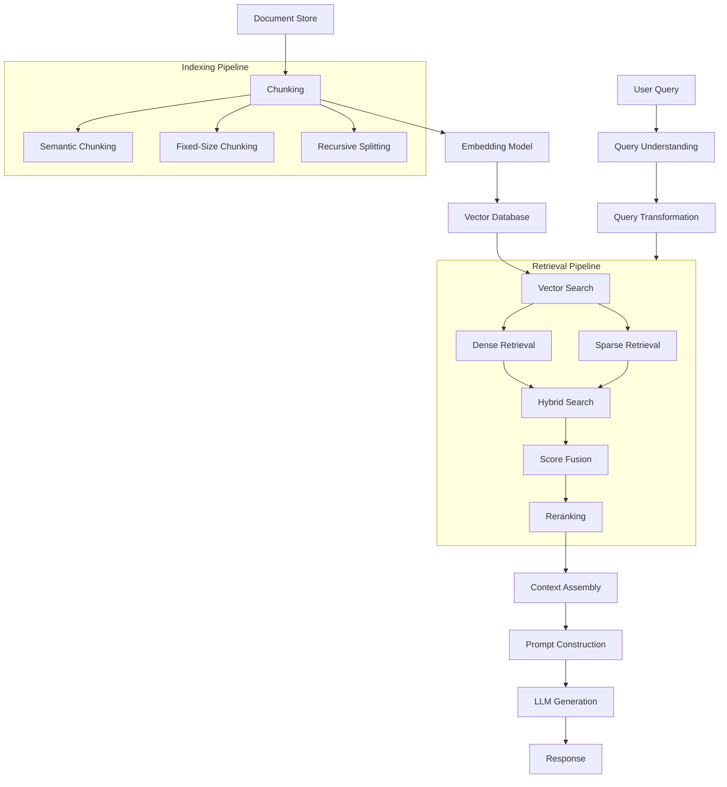

# RAG (Retrieval-Augmented Generation) Architecture



## What is RAG?

Retrieval-Augmented Generation (RAG) is a technique that enhances LLM outputs by retrieving relevant information from external knowledge sources before generating a response. Instead of relying solely on the model's parametric knowledge, RAG grounds generation in retrieved context.

### Why RAG Was Created

- **Knowledge cutoff**: LLMs have static training data; RAG provides fresh information
- **Hallucination reduction**: Grounding responses in retrieved facts reduces fabrications
- **Domain specificity**: General models lack specialized knowledge; RAG injects it
- **Attribution**: Retrieved documents provide source citations
- **Cost efficiency**: Fine-tuning all knowledge into a model is expensive; RAG is modular

### When to Use RAG

- Customer support chatbots with evolving knowledge bases
- Legal document analysis requiring precise citations
- Medical Q&A systems needing up-to-date research
- Enterprise search over internal documentation
- Code assistants referencing specific codebases

## Chunking Strategies

Chunking splits documents into retrievable units. The quality of chunking directly impacts retrieval accuracy.

### Fixed-Size Chunking

```python
def fixed_size_chunk(text, chunk_size=512, overlap=128):
    chunks = []
    start = 0
    while start < len(text):
        end = start + chunk_size
        chunk = text[start:end]
        chunks.append(chunk)
        start += chunk_size - overlap
    return chunks
```

### Semantic Chunking

```python
from sentence_transformers import SentenceTransformer
import numpy as np

def semantic_chunk(text, model_name="all-MiniLM-L6-v2", threshold=0.5):
    model = SentenceTransformer(model_name)
    sentences = text.split(". ")
    embeddings = model.encode(sentences)
    
    chunks = []
    current_chunk = [sentences[0]]
    
    for i in range(1, len(sentences)):
        sim = np.dot(embeddings[i-1], embeddings[i]) / (
            np.linalg.norm(embeddings[i-1]) * np.linalg.norm(embeddings[i])
        )
        if sim < threshold:
            chunks.append(". ".join(current_chunk))
            current_chunk = [sentences[i]]
        else:
            current_chunk.append(sentences[i])
    
    chunks.append(". ".join(current_chunk))
    return chunks
```

### Recursive Character Splitting

```python
def recursive_split_chunk(text, separators=["\n\n", "\n", ".", " "], chunk_size=512):
    if len(text) <= chunk_size:
        return [text]
    
    for sep in separators:
        segments = text.rsplit(sep, 1)
        if len(segments[0]) <= chunk_size:
            left = segments[0]
            right = segments[1]
            return [left] + recursive_split_chunk(right, separators, chunk_size)
    
    return [text[:chunk_size]] + recursive_split_chunk(text[chunk_size:], separators, chunk_size)
```

### Chunking Best Practices

| Strategy | Use Case | Chunk Size |
|---|---|---|
| Fixed-size | General purpose | 256-1024 tokens |
| Semantic | Story/document with clear breaks | Variable |
| Recursive | Code, markdown | 512-2048 tokens |
| Sentence-based | Factoid Q&A | 1-3 sentences |
| Paragraph | Article retrieval | 1-3 paragraphs |

## Embedding Models

Embeddings convert text into dense vectors capturing semantic meaning.

### Popular Embedding Models

```python
from sentence_transformers import SentenceTransformer
from openai import OpenAI
import cohere

# Sentence Transformers (local, free)
model = SentenceTransformer("all-MiniLM-L6-v2")
embedding = model.encode("Hello world")

# OpenAI embeddings
client = OpenAI()
response = client.embeddings.create(
    model="text-embedding-3-small",
    input="Hello world"
)

# Cohere embeddings
co = cohere.Client("api-key")
response = co.embed(
    texts=["Hello world"],
    model="embed-english-v3.0",
    input_type="search_query"
)
```

### Embedding Model Comparison

| Model | Dimensions | Cost | Performance |
|---|---|---|---|
| text-embedding-3-small | 1536 | $0.02/1M tokens | Good |
| text-embedding-3-large | 3072 | $0.13/1M tokens | Best |
| all-MiniLM-L6-v2 | 384 | Free | Good (English) |
| cohere-embed-v3 | 1024 | Paid | Excellent |

## Retrieval Pipeline

The retrieval pipeline transforms a query into relevant context chunks.

### Basic Retrieval

```python
import numpy as np
from typing import List, Tuple

class BasicRetriever:
    def __init__(self, embeddings, documents):
        self.embeddings = embeddings
        self.documents = documents
        self.index = np.array(embeddings)
    
    def retrieve(self, query_embedding: np.ndarray, k: int = 5) -> List[Tuple[str, float]]:
        scores = np.dot(self.index, query_embedding)
        top_k_indices = np.argsort(scores)[-k:][::-1]
        
        results = []
        for idx in top_k_indices:
            results.append((self.documents[idx], scores[idx]))
        return results
```

### Hybrid Search

```python
class HybridSearch:
    def __init__(self, dense_retriever, sparse_retriever, alpha=0.5):
        self.dense = dense_retriever
        self.sparse = sparse_retriever
        self.alpha = alpha
    
    def search(self, query, k=10):
        dense_results = self.dense.search(query, k)
        sparse_results = self.sparse.search(query, k)
        
        all_docs = set()
        scores = {}
        
        for doc, score in dense_results:
            all_docs.add(doc)
            scores[doc] = self.alpha * score
        
        for doc, score in sparse_results:
            all_docs.add(doc)
            scores[doc] = scores.get(doc, 0) + (1 - self.alpha) * score
        
        ranked = sorted(all_docs, key=lambda d: scores[d], reverse=True)
        return [(doc, scores[doc]) for doc in ranked[:k]]
```

### Reranking

```python
from sentence_transformers import CrossEncoder

class Reranker:
    def __init__(self, model_name="cross-encoder/ms-marco-MiniLM-L-6-v2"):
        self.model = CrossEncoder(model_name)
    
    def rerank(self, query: str, candidates: List[str], top_k: int = 5):
        pairs = [[query, doc] for doc in candidates]
        scores = self.model.predict(pairs)
        
        scored = list(zip(candidates, scores))
        ranked = sorted(scored, key=lambda x: x[1], reverse=True)
        
        return ranked[:top_k]
```

## Advanced RAG Techniques

### RAG Fusion

```python
from typing import List
import numpy as np

def reciprocal_rank_fusion(results: List[List[str]], k=60):
    fusion_scores = {}
    
    for rank_list in results:
        for rank, doc in enumerate(rank_list):
            fusion_scores[doc] = fusion_scores.get(doc, 0) + 1 / (k + rank)
    
    return sorted(fusion_scores.items(), key=lambda x: x[1], reverse=True)

class RAGFusion:
    def __init__(self, retriever, llm):
        self.retriever = retriever
        self.llm = llm
    
    def search(self, query: str, k: int = 5):
        generated_queries = self._generate_queries(query)
        
        all_results = []
        for q in generated_queries:
            results = self.retriever.search(q, k)
            all_results.append([doc for doc, _ in results])
        
        fused = reciprocal_rank_fusion(all_results)
        return fused[:k]
    
    def _generate_queries(self, query: str) -> List[str]:
        prompt = f"Generate 3 different search queries for: {query}"
        response = self.llm.generate(prompt)
        queries = response.split("\n")
        return [query] + [q.strip() for q in queries if q.strip()]
```

### Self-Querying Retrieval

```python
from typing import Dict, List

class SelfQueryRetriever:
    def __init__(self, retriever, llm):
        self.retriever = retriever
        self.llm = llm
    
    def retrieve(self, query: str):
        filter_dict = self._extract_filters(query)
        rewritten_query = self._rewrite_query(query)
        
        results = self.retriever.search(
            rewritten_query, 
            metadata_filter=filter_dict
        )
        return results
    
    def _extract_filters(self, query: str) -> Dict:
        prompt = f"""Extract metadata filters from this query as JSON.
Query: {query}
Filters: year, author, category, date. Return empty JSON if none."""
        response = self.llm.generate(prompt)
        return eval(response)
    
    def _rewrite_query(self, query: str) -> str:
        prompt = f"Rewrite this query to remove filter terms: {query}"
        return self.llm.generate(prompt)
```

### Multi-Modal RAG

```python
class MultiModalRAG:
    def __init__(self, text_encoder, image_encoder, retriever, llm):
        self.text_encoder = text_encoder
        self.image_encoder = image_encoder
        self.retriever = retriever
        self.llm = llm
    
    def process(self, query: str, image_path: str = None):
        query_vec = self.text_encoder.encode(query)
        
        if image_path:
            image_vec = self.image_encoder.encode(image_path)
            combined = (query_vec + image_vec) / 2
            results = self.retriever.search(combined, k=5)
        else:
            results = self.retriever.search(query_vec, k=5)
        
        context = "\n".join([doc for doc, _ in results])
        prompt = f"Context: {context}\nQuery: {query}\nAnswer:"
        return self.llm.generate(prompt)
```

## Complete RAG Pipeline

```python
class RAGPipeline:
    def __init__(self, embedding_model, vector_store, llm, reranker=None):
        self.embedding_model = embedding_model
        self.vector_store = vector_store
        self.llm = llm
        self.reranker = reranker
    
    def index_documents(self, documents, chunk_size=512):
        chunks = []
        for doc in documents:
            chunks.extend(fixed_size_chunk(doc, chunk_size))
        
        embeddings = self.embedding_model.encode(chunks)
        self.vector_store.add(embeddings, chunks)
    
    def query(self, user_query, k=5, use_reranker=True):
        query_vec = self.embedding_model.encode([user_query])[0]
        results = self.vector_store.search(query_vec, k=k * 2)
        
        if use_reranker and self.reranker:
            candidates = [doc for doc, _ in results]
            results = self.reranker.rerank(user_query, candidates, top_k=k)
        
        context = "\n\n".join([doc for doc, _ in results])
        sources = [doc for doc, _ in results]
        
        prompt = f"""Use the following context to answer the question.

Context:
{context}

Question: {user_query}

Answer the question based only on the provided context."""
        
        response = self.llm.generate(prompt)
        
        return {
            "answer": response,
            "sources": sources,
            "context": context
        }
```

## Cost Considerations

| Component | Cost Factor | Optimization |
|---|---|---|
| Embedding API | $0.02-0.13/1M tokens | Cache, use smaller model |
| Vector DB | $0.10-2.00/GB/month | Use pod type, index tuning |
| LLM Generation | $0.01-0.15/1K tokens | Prompt caching, shorter generations |
| Reranking | $0.01-0.05/1K pairs | Only rerank top candidates |
| Embedding compute | GPU hours | Batch processing |

## Best Practices

1. **Chunk wisely**: Match chunk size to your use case (factoid=small, summarization=large)
2. **Metadata filtering**: Always filter before vector search when possible
3. **Multi-stage retrieval**: Retrieve more candidates, then rerank
4. **Query transformation**: Rewrite queries for better retrieval
5. **Context window**: Leave room for the answer in the LLM context
6. **Evaluation**: Use RAGAS or ARES to measure retrieval quality
7. **Caching**: Cache common queries and their results
8. **Monitoring**: Track retrieval hit rate and answer relevance

## Interview Questions

1. Explain how RAG reduces hallucination in LLM outputs
2. Compare dense vs sparse retrieval methods
3. What chunking strategy would you use for legal documents?
4. How does hybrid search combine vector and keyword search?
5. Explain the RAG fusion technique and its benefits
6. How would you handle multi-modal RAG (text + images + tables)?
7. What metrics would you use to evaluate a RAG system?
8. How do you handle document updates in a RAG pipeline?
9. Compare reranking vs filtering in retrieval
10. How would you design a RAG system for low-latency applications?

## Real Company Usage Examples

| Company | Use Case | Tech Stack |
|---|---|---|
| **Glean** | Enterprise search | Custom embeddings, hybrid search |
| **Notion AI** | Q&A over notes | OpenAI, Pinecone |
| **Perplexity** | Search + answer | Custom RAG pipeline |
| **Bloomberg** | Financial analysis | Domain-specific embeddings |
| **Rippling** | HR/payroll support | LangChain + RAG |
| **GitHub Copilot** | Code generation | Code-aware retrieval |
| **Google** | Search augmentation | MUM + RAG patterns |
