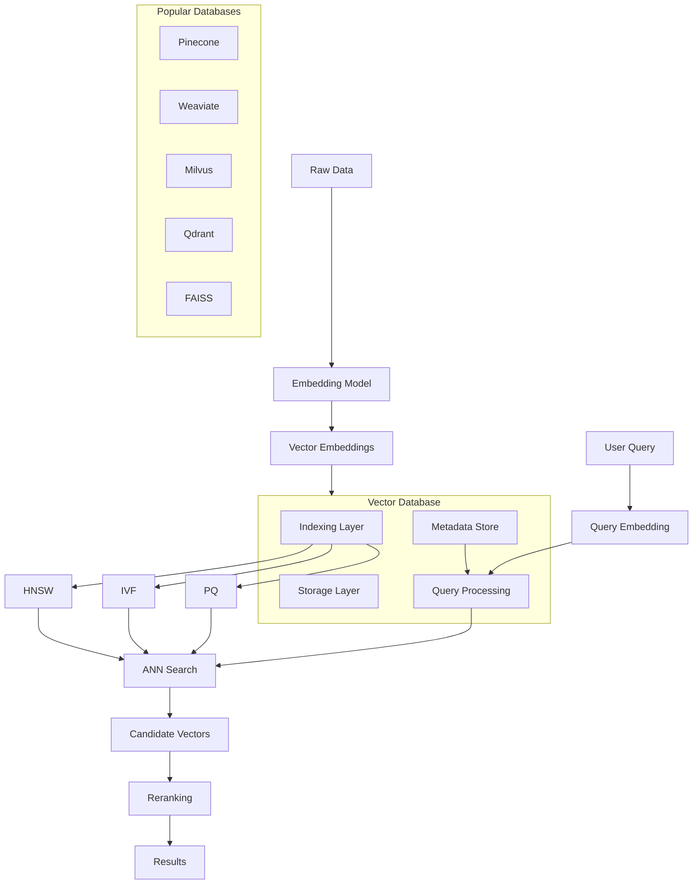

# Vector Databases



## What is a Vector Database?

A vector database stores, indexes, and searches high-dimensional vector embeddings for similarity search. It is the backbone of modern RAG systems, recommendation engines, and semantic search.

### Why Vector Databases Were Created

- **ANN search**: Exact nearest neighbor is O(n*d) and doesn't scale
- **Metadata filtering**: Traditional databases can't efficiently search vectors
- **Hybrid search**: Need to combine vector similarity with structured filters
- **Real-time updates**: ML embeddings change; need mutable indexes
- **Scale**: Billions of vectors require distributed indexing

### When to Use a Vector Database

- Semantic search over documents
- Recommendation engines ("find similar items")
- RAG context retrieval
- Image/audio similarity search
- Anomaly detection
- Deduplication

## Indexing Algorithms

### HNSW (Hierarchical Navigable Small World)

HNSW builds a multi-layer graph for logarithmic-time search.

```python
import faiss
import numpy as np

def create_hnsw_index(dimension=384, n_vectors=10000):
    index = faiss.IndexHNSWFlat(dimension, 32)
    index.hnsw.efConstruction = 200
    
    data = np.random.random((n_vectors, dimension)).astype(np.float32)
    index.add(data)
    
    return index

def search_hnsw(index, query, k=10, ef_search=50):
    index.hnsw.efSearch = ef_search
    distances, indices = index.search(query.reshape(1, -1), k)
    return distances[0], indices[0]
```

### IVF (Inverted File Index)

IVF partitions the vector space into cells for coarse-to-fine search.

```python
def create_ivf_index(dimension=384, n_centroids=256):
    quantizer = faiss.IndexFlatL2(dimension)
    index = faiss.IndexIVFFlat(quantizer, dimension, n_centroids)
    index.nprobe = 10
    
    data = np.random.random((10000, dimension)).astype(np.float32)
    index.train(data)
    index.add(data)
    
    return index

def search_ivf(index, query, k=10, nprobe=20):
    index.nprobe = nprobe
    distances, indices = index.search(query.reshape(1, -1), k)
    return distances[0], indices[0]
```

### Product Quantization (PQ)

PQ compresses vectors by splitting into sub-vectors and quantizing each.

```python
def create_pq_index(dimension=384, n_subquantizers=16):
    index = faiss.IndexPQ(dimension, n_subquantizers, 8)
    
    data = np.random.random((10000, dimension)).astype(np.float32)
    index.train(data)
    index.add(data)
    
    return index

def create_ivfpq_index(dimension=384, n_centroids=256, n_subquantizers=16):
    quantizer = faiss.IndexFlatL2(dimension)
    index = faiss.IndexIVFPQ(quantizer, dimension, n_centroids, n_subquantizers, 8)
    
    data = np.random.random((10000, dimension)).astype(np.float32)
    index.train(data)
    index.add(data)
    
    return index
```

### Algorithm Comparison

| Algorithm | Search Speed | Memory Usage | Recall | Index Build Time |
|---|---|---|---|---|
| Flat (Brute Force) | Slowest | Highest | 100% | None |
| IVF | Fast | High | 95-99% | Fast |
| HNSW | Fastest | High | 98-100% | Slow |
| PQ | Very Fast | Very Low | 85-95% | Moderate |
| IVFPQ | Fast | Low | 90-97% | Moderate |

## Vector Database Solutions

### FAISS (Facebook AI Similarity Search)

```python
import faiss
import numpy as np

class FAISSVectorStore:
    def __init__(self, dimension=384, index_type="flat"):
        self.dimension = dimension
        self.index_type = index_type
        self.index = self._create_index()
        self.documents = []
        self.metadata = []
    
    def _create_index(self):
        if self.index_type == "flat":
            return faiss.IndexFlatL2(self.dimension)
        elif self.index_type == "hnsw":
            index = faiss.IndexHNSWFlat(self.dimension, 32)
            index.hnsw.efConstruction = 200
            return index
        elif self.index_type == "ivfpq":
            quantizer = faiss.IndexFlatL2(self.dimension)
            return faiss.IndexIVFPQ(quantizer, self.dimension, 256, 16, 8)
    
    def add(self, vectors, documents, metadata=None):
        vectors = np.array(vectors).astype(np.float32)
        
        if hasattr(self.index, 'is_trained') and not self.index.is_trained:
            self.index.train(vectors)
        
        self.index.add(vectors)
        self.documents.extend(documents)
        if metadata:
            self.metadata.extend(metadata)
    
    def search(self, query_vector, k=10):
        query_vector = np.array([query_vector]).astype(np.float32)
        distances, indices = self.index.search(query_vector, k)
        
        results = []
        for i, idx in enumerate(indices[0]):
            if idx < len(self.documents):
                results.append({
                    "document": self.documents[idx],
                    "score": float(distances[0][i]),
                    "metadata": self.metadata[idx] if self.metadata else {}
                })
        return results
    
    def save(self, path):
        faiss.write_index(self.index, f"{path}.index")
    
    def load(self, path):
        self.index = faiss.read_index(f"{path}.index")
```

### Pinecone

```python
from pinecone import Pinecone, ServerlessSpec

pc = Pinecone(api_key="your-api-key")

index = pc.create_index(
    name="rag-index",
    dimension=384,
    metric="cosine",
    spec=ServerlessSpec(cloud="aws", region="us-east-1")
)

index.upsert(
    vectors=[
        {"id": "doc1", "values": [0.1, 0.2, ...], "metadata": {"title": "Doc 1"}},
        {"id": "doc2", "values": [0.3, 0.4, ...], "metadata": {"title": "Doc 2"}},
    ]
)

results = index.query(
    vector=[0.1, 0.2, ...],
    top_k=5,
    include_metadata=True,
    filter={"title": {"$regex": "Doc.*"}}
)
```

### Weaviate

```python
import weaviate
import weaviate.classes as wvc

client = weaviate.connect_to_local()

try:
    collection = client.collections.create(
        name="Documents",
        vectorizer_config=wvc.config.Configure.Vectorizer.none(),
        properties=[
            wvc.config.Property(name="title", data_type=wvc.config.DataType.TEXT),
            wvc.config.Property(name="content", data_type=wvc.config.DataType.TEXT),
            wvc.config.Property(name="created_at", data_type=wvc.config.DataType.DATE),
        ]
    )
    
    collection.data.insert({
        "title": "Doc 1",
        "content": "Some content here",
    }, vector=[0.1, 0.2, ...])
    
    response = collection.query.near_vector(
        near_vector=[0.1, 0.2, ...],
        limit=5,
        return_metadata=wvc.query.MetadataQuery(distance=True)
    )
finally:
    client.close()
```

### Qdrant

```python
from qdrant_client import QdrantClient
from qdrant_client.models import VectorParams, Distance, PointStruct

client = QdrantClient(host="localhost", port=6333)

client.create_collection(
    collection_name="documents",
    vectors_config=VectorParams(size=384, distance=Distance.COSINE),
)

client.upsert(
    collection_name="documents",
    points=[
        PointStruct(id=1, vector=[0.1, 0.2, ...], payload={"title": "Doc 1"}),
    ]
)

results = client.search(
    collection_name="documents",
    query_vector=[0.1, 0.2, ...],
    limit=5,
    query_filter=None
)
```

### Milvus

```python
from pymilvus import connections, Collection, FieldSchema, CollectionSchema, DataType

connections.connect(host="localhost", port="19530")

fields = [
    FieldSchema(name="id", dtype=DataType.INT64, is_primary=True),
    FieldSchema(name="embedding", dtype=DataType.FLOAT_VECTOR, dim=384),
    FieldSchema(name="title", dtype=DataType.VARCHAR, max_length=512),
]

schema = CollectionSchema(fields, "Document collection")
collection = Collection("documents", schema)

index_params = {
    "index_type": "IVF_FLAT",
    "metric_type": "L2",
    "params": {"nlist": 128}
}
collection.create_index("embedding", index_params)

collection.insert([
    [1],  # id
    [[0.1, 0.2, ...]],  # embedding
    ["Doc 1"]  # title
])

collection.load()

results = collection.search(
    data=[[0.1, 0.2, ...]],
    anns_field="embedding",
    param={"metric_type": "L2", "params": {"nprobe": 10}},
    limit=5,
    output_fields=["title"]
)
```

## Hybrid Search & Metadata Filtering

```python
class HybridVectorSearch:
    def __init__(self, vector_store, keyword_store):
        self.vector_store = vector_store
        self.keyword_store = keyword_store
    
    def hybrid_search(self, query_vector, keyword_query, alpha=0.5, k=10, filters=None):
        vector_results = self.vector_store.search(
            query_vector, 
            k=k * 2,
            filters=filters
        )
        
        keyword_results = self.keyword_store.search(
            keyword_query,
            k=k * 2,
            filters=filters
        )
        
        return self._fusion(vector_results, keyword_results, alpha, k)
    
    def _fusion(self, vector_results, keyword_results, alpha, k):
        combined = {}
        
        for i, (doc, score) in enumerate(vector_results):
            combined[doc["id"]] = {
                "score": alpha * score,
                "doc": doc
            }
        
        for i, (doc, score) in enumerate(keyword_results):
            if doc["id"] in combined:
                combined[doc["id"]]["score"] += (1 - alpha) * score
            else:
                combined[doc["id"]] = {
                    "score": (1 - alpha) * score,
                    "doc": doc
                }
        
        ranked = sorted(combined.values(), key=lambda x: x["score"], reverse=True)
        return [item["doc"] for item in ranked[:k]]
```

## Indexing Strategies

### Strategy 1: Freshness-First

```python
def tiered_indexing(documents, hot_threshold=7, warm_threshold=30):
    return {
        "hot": [d for d in documents if d.age < hot_threshold],
        "warm": [d for d in documents if hot_threshold <= d.age < warm_threshold],
        "cold": [d for d in documents if d.age >= warm_threshold]
    }

# Hot: HNSW index, full precision, no PQ
# Warm: IVF index, moderate compression
# Cold: PQ index, high compression
```

### Strategy 2: Multi-Tenant Index

```python
class MultiTenantVectorStore:
    def __init__(self):
        self.tenants = {}
    
    def add_tenant(self, tenant_id, dimension=384):
        index = faiss.IndexHNSWFlat(dimension, 32)
        self.tenants[tenant_id] = {
            "index": index,
            "documents": [],
            "metadata": []
        }
    
    def search(self, tenant_id, query_vector, k=10):
        tenant = self.tenants[tenant_id]
        distances, indices = tenant["index"].search(query_vector, k)
        return [tenant["documents"][i] for i in indices[0]]
```

### Strategy 3: Streaming Index Updates

```python
class StreamingIndex:
    def __init__(self, dimension=384, rebuild_threshold=1000):
        self.main_index = faiss.IndexHNSWFlat(dimension, 32)
        self.buffer_index = faiss.IndexFlatL2(dimension)
        self.buffer = []
        self.rebuild_threshold = rebuild_threshold
    
    def add(self, vector, document):
        self.buffer_index.add(vector.reshape(1, -1))
        self.buffer.append(document)
        
        if len(self.buffer) >= self.rebuild_threshold:
            self._rebuild()
    
    def search(self, query_vector, k=10):
        main_distances, main_indices = self.main_index.search(query_vector, k)
        buffer_distances, buffer_indices = self.buffer_index.search(query_vector, k)
        
        return self._merge_results(
            main_distances, main_indices,
            buffer_distances, buffer_indices,
            k
        )
    
    def _rebuild(self):
        combined = np.vstack([
            faiss.vector_to_array(self.main_index),
            faiss.vector_to_array(self.buffer_index)
        ])
        self.main_index = faiss.IndexHNSWFlat(combined.shape[1], 32)
        self.main_index.add(combined)
        self.buffer_index = faiss.IndexFlatL2(combined.shape[1])
        self.buffer = []
```

## Cost Considerations

| Database | Hosting Cost | Scaling | Free Tier |
|---|---|---|---|
| Pinecone | $0.10-2.00/pod/hour | Auto-scaling | Starter ($0) |
| Weaviate | Self-hosted free / Cloud $$ | Manual | Cloud sandbox |
| Milvus | Self-hosted / Zilliz cloud | Auto-scaling | Zilliz free tier |
| Qdrant | $0.25-4.00/hour | Manual | Free 1GB |
| FAISS | Free (self-hosted) | Your infra | Free |

## Performance Tuning

```python
def tune_hnsw(dimension, n_vectors, ef_construction_range, m_range):
    best_recall = 0
    best_params = {}
    
    for ef in ef_construction_range:
        for m in m_range:
            index = faiss.IndexHNSWFlat(dimension, m)
            index.hnsw.efConstruction = ef
            
            data = np.random.random((n_vectors, dimension)).astype(np.float32)
            index.add(data)
            
            queries = np.random.random((100, dimension)).astype(np.float32)
            index.hnsw.efSearch = ef
            
            _, indices = index.search(queries, 10)
            recall = _compute_recall(indices, queries, data)
            
            if recall > best_recall:
                best_recall = recall
                best_params = {"ef_construction": ef, "m": m}
    
    return best_params

def _compute_recall(indices, queries, data):
    correct = 0
    total = 0
    for i in range(len(queries)):
        exact = faiss.IndexFlatL2(data.shape[1])
        exact.add(data)
        _, exact_indices = exact.search(queries[i:i+1], 10)
        correct += len(set(indices[i]) & set(exact_indices[0]))
        total += 10
    return correct / total
```

## Best Practices

1. **Choose index by workload**: HNSW for high-recall, PQ for memory-constrained
2. **Pre-filter then search**: Filter metadata before vector search when possible
3. **Shard by tenant** for multi-tenant systems
4. **Monitor indexing latency** - rebuild during off-peak
5. **Use hybrid search** for better result quality
6. **Right-size dimensions**: 384 or 768 for most use cases
7. **Batch inserts**: 100+ vectors per batch for throughput
8. **Use quantization** when memory is constrained (PQ, SQ)
9. **Set ef_search adaptively** based on recall requirements
10. **Backup indexes** - rebuilding is expensive

## Interview Questions

1. How does HNSW work and what are its trade-offs?
2. Compare IVFPQ vs HNSW for a 1B vector use case
3. How would you implement metadata filtering during vector search?
4. What is the curse of dimensionality and how does it affect vector search?
5. How would you handle real-time vector updates at scale?
6. Compare dense vs sparse vector representations
7. How do you choose between cosine, L2, and dot product distance?
8. Explain product quantization and its impact on recall
9. How would you design a hybrid search system?
10. What happens to search quality as dimension increases beyond 1024?

## Real Company Usage Examples

| Company | Use Case | Database |
|---|---|---|
| **Notion** | Semantic search | Pinecone |
| **GitHub** | Code search embeddings | Custom FAISS |
| **Netflix** | Content recommendation | Milvus |
| **Uber** | Trip similarity | Custom HNSW |
| **Spotify** | Music recommendation | Annoy (Spotify's own) |
| **Shopify** | Product similarity | Weaviate |
| **Snapchat** | Lens/AR search | Qdrant |
