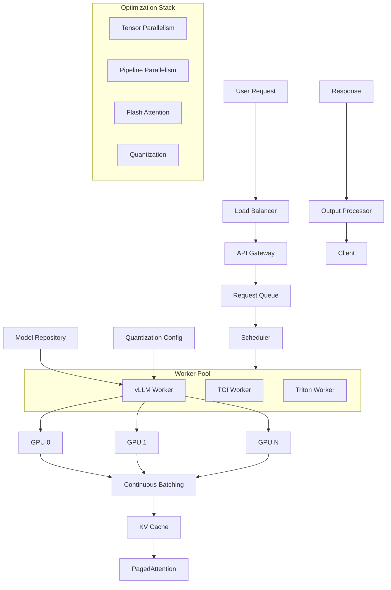

# Model Serving Infrastructure



## What is Model Serving Infrastructure?

Model serving infrastructure manages the deployment, scaling, and optimization of ML models in production. For LLMs specifically, specialized inference engines handle the unique challenges of transformer-based models including memory management, batching, and latency optimization.

### Why Model Serving Infrastructure Was Created

- **GPU memory limits**: LLMs are hundreds of GB; need efficient memory management
- **Latency requirements**: Users expect sub-second responses
- **Throughput demands**: Thousands of concurrent requests
- **Cost optimization**: GPU time is expensive; maximize utilization
- **Hardware diversity**: Different GPUs need different optimization strategies

### When to Use Specialized Serving Infra

- Serving any LLM (GPT, LLaMA, Mistral, etc.) at scale
- Real-time chatbot applications
- Code generation assistants
- High-throughput batch processing
- Multi-model serving on shared infrastructure

## vLLM (PagedAttention)

vLLM revolutionizes LLM serving with PagedAttention, which manages the KV cache in fixed-size blocks.

```python
# vLLM server startup
# pip install vllm

from vllm import LLM, SamplingParams

# Initialize model
llm = LLM(
    model="meta-llama/Llama-2-7b-hf",
    tensor_parallel_size=2,
    gpu_memory_utilization=0.9,
    max_model_len=4096,
    enforce_eager=False,
)

sampling_params = SamplingParams(
    temperature=0.7,
    top_p=0.9,
    max_tokens=512,
    stop=["</s>"],
)

outputs = llm.generate(
    ["What is the capital of France?", "Explain quantum computing"],
    sampling_params
)

for output in outputs:
    print(output.outputs[0].text)
```

### vLLM Server with OpenAI-compatible API

```bash
# Start vLLM server
python -m vllm.entrypoints.openai.api_server \
    --model meta-llama/Llama-2-7b-hf \
    --tensor-parallel-size 2 \
    --gpu-memory-utilization 0.9 \
    --max-model-len 4096 \
    --port 8000

# Query via API
curl http://localhost:8000/v1/completions \
    -H "Content-Type: application/json" \
    -d '{
        "model": "meta-llama/Llama-2-7b-hf",
        "prompt": "What is the capital of France?",
        "max_tokens": 100,
        "temperature": 0.7
    }'
```

### vLLM Configuration

```python
from vllm.config import ModelConfig, CacheConfig, ParallelConfig

config = {
    "model": "meta-llama/Llama-2-7b-hf",
    
    # Memory management
    "gpu_memory_utilization": 0.90,
    "max_model_len": 4096,
    "block_size": 16,
    "swap_space": 4,
    "sliding_window": None,
    
    # Parallelism
    "tensor_parallel_size": 2,
    "pipeline_parallel_size": 1,
    
    # Batching
    "max_num_seqs": 256,
    "max_num_batched_tokens": 4096,
    
    # Optimization
    "enforce_eager": False,
    "quantization": None,
    "dtype": "float16",
}
```

## TGI (Text Generation Inference)

Hugging Face's optimized inference server.

```bash
# Start TGI server with Docker
docker run --gpus all \
    -e HF_TOKEN=$HF_TOKEN \
    -p 8080:80 \
    ghcr.io/huggingface/text-generation-inference:latest \
    --model-id meta-llama/Llama-2-7b-hf \
    --num-shard 2 \
    --max-total-tokens 4096 \
    --max-input-length 3072 \
    --max-batch-prefill-tokens 4096

# Query TGI
curl http://localhost:8080/generate \
    -X POST \
    -H "Content-Type: application/json" \
    -d '{
        "inputs": "What is deep learning?",
        "parameters": {
            "max_new_tokens": 100,
            "temperature": 0.7,
            "top_p": 0.9
        }
    }'
```

### TGI Configuration

```python
# tgi_config.yaml
model:
  id: meta-llama/Llama-2-7b-hf
  revision: main
  
server:
  port: 8080
  max_concurrent_requests: 128
  
batching:
  max_batch_size: 64
  max_batch_prefill_tokens: 4096
  
optimization:
  num_shard: 2
  max_input_length: 3072
  max_total_tokens: 4096
  quantize: "bitsandbytes"
  trust_remote_code: false
```

## Triton Inference Server

NVIDIA's production-grade inference server supporting multiple frameworks.

```python
# triton_config.pbtxt
name: "llama_model"
backend: "tensorrtllm"
max_batch_size: 64

input [
  {
    name: "input_ids"
    data_type: TYPE_INT32
    dims: [-1]
  }
]

output [
  {
    name: "output_ids"
    data_type: TYPE_INT32
    dims: [-1, -1]
  }
]

instance_group [
  {
    count: 2
    kind: KIND_GPU
  }
]

dynamic_batching {
  preferred_batch_size: [1, 4, 8, 16, 32]
  max_queue_delay_microseconds: 100
}
```

```python
import tritonclient.http as httpclient
import numpy as np

client = httpclient.InferenceServerClient(url="localhost:8000")

inputs = httpclient.InferInput("input_ids", [1, 128], "INT32")
inputs.set_data_from_numpy(np.random.randint(0, 32000, (1, 128), dtype=np.int32))

outputs = httpclient.InferRequestedOutput("output_ids")

results = client.infer(model_name="llama_model", inputs=[inputs], outputs=[outputs])
output_ids = results.as_numpy("output_ids")
```

## TensorRT-LLM

NVIDIA's optimized LLM inference engine with kernel fusion and quantization.

```python
# Build TRT-LLM engine
# python convert_checkpoint.py --model_dir llama-7b --output_dir trt-llm-checkpoint

# trt-llm-build command
trtllm-build \
    --checkpoint_dir trt-llm-checkpoint \
    --output_dir trt-llm-engine \
    --gemm_plugin float16 \
    --max_batch_size 64 \
    --max_input_len 3072 \
    --max_output_len 512 \
    --max_num_tokens 4096 \
    --use_fp8 \
    --workers 2
```

## ONNX Runtime

Cross-platform inference optimization.

```python
import onnxruntime as ort
import numpy as np

class ONNXLLMInference:
    def __init__(self, model_path):
        providers = [
            "CUDAExecutionProvider",
            "CPUExecutionProvider"
        ]
        self.session = ort.InferenceSession(model_path, providers=providers)
    
    def generate(self, input_ids, max_length=100):
        outputs = input_ids
        for _ in range(max_length):
            ort_inputs = {self.session.get_inputs()[0].name: outputs}
            logits = self.session.run(None, ort_inputs)[0]
            next_token = np.argmax(logits[:, -1, :], axis=-1)
            outputs = np.concatenate([outputs, next_token.reshape(-1, 1)], axis=1)
        return outputs
```

## Continuous Batching

Continuous batching dynamically adds/removes sequences from the running batch.

```python
class ContinuousBatchingScheduler:
    def __init__(self, max_batch_size=64, max_tokens=4096):
        self.max_batch_size = max_batch_size
        self.max_tokens = max_tokens
        self.running_sequences = []
        self.waiting_queue = []
    
    def add_request(self, sequence):
        self.waiting_queue.append(sequence)
    
    def schedule(self):
        available_slots = self.max_batch_size - len(self.running_sequences)
        
        for seq in self.waiting_queue[:available_slots]:
            self.running_sequences.append(seq)
        
        self.waiting_queue = self.waiting_queue[available_slots:]
        
        completed = []
        still_running = []
        
        for seq in self.running_sequences:
            if seq.is_complete():
                completed.append(seq)
            else:
                still_running.append(seq)
        
        self.running_sequences = still_running
        return completed
    
    def step(self):
        batch = self.running_sequences
        
        if not batch:
            return []
        
        completed = self.schedule()
        
        for seq in batch:
            token = self._forward(seq)
            if self._should_stop(seq, token):
                completed.append(seq)
        
        return completed
    
    def _forward(self, sequence):
        pass
    
    def _should_stop(self, sequence, token):
        return token in sequence.stop_tokens or len(sequence.tokens) >= sequence.max_tokens
```

## Tensor Parallelism

```python
class TensorParallelInference:
    def __init__(self, model, num_gpus=2):
        self.num_gpus = num_gpus
        self.model = model
        
    def shard(self):
        for layer in self.model.layers:
            qkv_weight = layer.self_attn.qkv_proj.weight
            shard_size = qkv_weight.shape[0] // self.num_gpus
            
            for i in range(self.num_gpus):
                shard = qkv_weight[i * shard_size:(i + 1) * shard_size]
                layer.self_attn.qkv_proj.weight_shards[i] = shard
    
    def forward(self, input_ids, gpu_id=0):
        local_input = input_ids.chunk(self.num_gpus, dim=-1)[gpu_id]
        local_output = self.model(local_input, gpu_id=gpu_id)
        
        return self._all_reduce(local_output)
    
    def _all_reduce(self, tensor):
        pass
```

## Quantization Techniques

### GPTQ (Post-Training Quantization)

```python
# pip install auto-gptq
from auto_gptq import AutoGPTQForCausalLM
from transformers import AutoTokenizer

model = AutoGPTQForCausalLM.from_quantized(
    "TheBloke/Llama-2-7B-GPTQ",
    device="cuda:0",
    use_triton=False,
    quantize_config=None,
)

tokenizer = AutoTokenizer.from_pretrained("TheBloke/Llama-2-7B-GPTQ")

prompt = "What is machine learning?"
inputs = tokenizer(prompt, return_tensors="pt").to("cuda:0")

outputs = model.generate(**inputs, max_new_tokens=100)
print(tokenizer.decode(outputs[0]))
```

### AWQ (Activation-Aware Weight Quantization)

```python
# pip install awq
from awq import AutoAWQForCausalLM
from transformers import AutoTokenizer

# Quantize a model
model = AutoAWQForCausalLM.from_pretrained(
    "meta-llama/Llama-2-7b-hf"
)
tokenizer = AutoTokenizer.from_pretrained(
    "meta-llama/Llama-2-7b-hf"
)

quant_config = {
    "zero_point": True,
    "q_group_size": 128,
    "w_bit": 4,
    "version": "GEMM"
}

model.quantize(tokenizer, quant_config=quant_config)
model.save_quantized("llama-7b-awq")
```

### Bitsandbytes (8-bit / 4-bit)

```python
from transformers import AutoModelForCausalLM, BitsAndBytesConfig
import torch

quantization_config = BitsAndBytesConfig(
    load_in_4bit=True,
    bnb_4bit_compute_dtype=torch.float16,
    bnb_4bit_use_double_quant=True,
    bnb_4bit_quant_type="nf4",
)

model = AutoModelForCausalLM.from_pretrained(
    "meta-llama/Llama-2-7b-hf",
    quantization_config=quantization_config,
    device_map="auto",
)
```

### Quantization Comparison

| Method | Bits | Memory Reduction | Quality Loss | Speed |
|---|---|---|---|---|
| FP16 | 16 | 1x | None | Fast |
| INT8 | 8 | 2x | Minimal | Fast |
| GPTQ 4-bit | 4 | 4x | Small | Very Fast |
| AWQ 4-bit | 4 | 4x | Small | Very Fast |
| NF4 (bnb) | 4 | 4x | Small | Fast |
| INT4 | 4 | 4x | Moderate | Very Fast |
| FP4 | 4 | 4x | Moderate | Fast |

## Serving Architecture Comparison

| Feature | vLLM | TGI | Triton | TensorRT-LLM |
|---|---|---|---|---|
| PagedAttention | Native | No | No | No |
| Continuous Batching | Yes | Yes | Yes | Yes |
| Tensor Parallelism | Yes | Yes | Yes | Yes |
| Pipeline Parallelism | No | No | Yes | Yes |
| FP8 Support | Yes | No | Yes | Native |
| LoRA Serving | Yes | Yes | No | Yes |
| OpenAI Compatible | Yes | Yes | Via proxy | Via proxy |
| Multi-Model | No | No | Yes | No |

## Cost Considerations

| Engine | Cost Profile | Best For |
|---|---|---|
| vLLM | Free, OSS | High-throughput LLM serving |
| TGI | Free, OSS | HF ecosystem integration |
| Triton | Free (NVIDIA) | Multi-model, enterprise |
| TensorRT-LLM | Free (NVIDIA) | Maximum GPU perf |
| ONNX Runtime | Free, OSS | Cross-platform, CPU |

## Best Practices

1. **Match engine to workload**: vLLM for pure LLM, Triton for multi-model
2. **Use tensor parallelism** for models > 13B parameters
3. **Right-size batch**: Large batches improve throughput but increase latency
4. **Quantize strategically**: 4-bit for chat, 8-bit for accuracy-critical
5. **Monitor GPU memory**: KV cache grows linearly with sequence length
6. **Pre-fill and decode separation**: Optimize each phase differently
7. **Use speculative decoding** for latency-sensitive applications
8. **Warm up models** with dummy requests before production traffic

## Interview Questions

1. How does PagedAttention improve GPU memory utilization?
2. Explain continuous batching and why it matters for LLMs
3. Compare tensor parallelism vs pipeline parallelism
4. How does quantization affect model quality and throughput?
5. What is the KV cache and how does it impact serving?
6. Design a serving architecture for 100k concurrent users
7. How would you handle model updates without downtime?
8. Compare GPTQ vs AWQ quantization techniques
9. How does speculative decoding improve latency?
10. What metrics would you use to monitor LLM serving performance?

## Real Company Usage Examples

| Company | Engine | Models Served |
|---|---|---|
| **Perplexity** | vLLM, TGI | LLaMA, Mistral |
| **Character.ai** | vLLM | Custom models |
| **Github Copilot** | TensorRT-LLM | Codex |
| **Microsoft** | Triton + TRT-LLM | Phi, LLaMA |
| **Anthropic** | Custom | Claude |
| **Together.ai** | vLLM | Multi-model |
| **Databricks** | vLLM | Open-source models |
| **Hugging Face** | TGI | Hub models |
