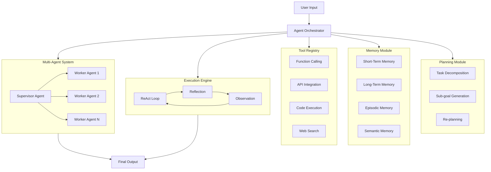

# AI Agent Architectures



## What are AI Agent Architectures?

AI agents are autonomous systems that perceive their environment, reason about goals, execute actions using tools, and learn from feedback. They go beyond simple LLM calls by incorporating planning, memory, and multi-step execution.

### Why Agent Architectures Were Created

- **Autonomy**: LLMs generate text; agents take action in the world
- **Complex task completion**: Single prompts can't handle multi-step workflows
- **Tool use**: Agents can call APIs, databases, code interpreters
- **Memory**: Agents remember past interactions and learn
- **Collaboration**: Multiple agents can solve problems together

### When to Use AI Agents

- Automated research and analysis
- Customer support triage and resolution
- Code generation and debugging
- Data pipeline automation
- Personal assistants
- Multi-step business workflows

## Agent Loop Architecture

```python
from typing import Dict, List, Any, Optional
import json

class Agent:
    def __init__(self, llm, tools: List[Dict], max_iterations=15):
        self.llm = llm
        self.tools = {t["name"]: t for t in tools}
        self.max_iterations = max_iterations
        self.memory = []
    
    def run(self, task: str) -> Dict[str, Any]:
        context = self._build_context(task)
        
        for i in range(self.max_iterations):
            response = self.llm.generate(context, max_tokens=500)
            action = self._parse_action(response)
            
            self.memory.append({"iteration": i, "action": action})
            
            if action["type"] == "final":
                return {
                    "success": True,
                    "output": action["output"],
                    "iterations": i + 1,
                    "memory": self.memory
                }
            
            result = self._execute_action(action)
            context += f"\nObservation: {result}\n"
        
        return {
            "success": False,
            "output": "Max iterations reached",
            "iterations": self.max_iterations,
            "memory": self.memory
        }
    
    def _build_context(self, task):
        tool_descriptions = "\n".join([
            f"{name}: {tool['description']}"
            for name, tool in self.tools.items()
        ])
        
        return f"""You are an AI agent. Available tools:
{tool_descriptions}

Task: {task}

Respond with:
Action: tool_name(input)
or
Action: final(output)

"""
    
    def _parse_action(self, response):
        try:
            lines = response.strip().split("\n")
            for line in lines:
                if line.startswith("Action:"):
                    content = line[7:].strip()
                    if content.startswith("final("):
                        output = content[6:-1]
                        return {"type": "final", "output": output}
                    else:
                        name = content.split("(")[0]
                        args = "(".join(content.split("(")[1:])[:-1]
                        return {"type": "tool", "tool": name, "input": args}
        except Exception:
            pass
        
        return {"type": "final", "output": response}
    
    def _execute_action(self, action):
        if action["type"] == "tool":
            tool = self.tools.get(action["tool"])
            if tool:
                try:
                    return tool["fn"](action["input"])
                except Exception as e:
                    return f"Error: {str(e)}"
            return f"Unknown tool: {action['tool']}"
        return "No action to execute"
```

## Tool Use & Function Calling

```python
from openai import OpenAI
import json

class FunctionCallingAgent:
    def __init__(self, api_key: str):
        self.client = OpenAI(api_key=api_key)
        self.functions = []
    
    def register_tool(self, name: str, description: str, parameters: dict, fn):
        self.functions.append({
            "type": "function",
            "function": {
                "name": name,
                "description": description,
                "parameters": parameters
            }
        })
        self._tool_fns[name] = fn
    
    def run(self, messages: List[Dict]) -> str:
        response = self.client.chat.completions.create(
            model="gpt-4",
            messages=messages,
            functions=[f["function"] for f in self.functions],
            function_call="auto"
        )
        
        message = response.choices[0].message
        
        if message.function_call:
            fn_name = message.function_call.name
            fn_args = json.loads(message.function_call.arguments)
            
            result = self._tool_fns[fn_name](**fn_args)
            
            messages.append(message)
            messages.append({
                "role": "function",
                "name": fn_name,
                "content": json.dumps(result)
            })
            
            return self.run(messages)
        
        return message.content

# Example usage
agent = FunctionCallingAgent("api-key")

def search_web(query: str) -> str:
    return f"Search results for: {query}"

agent.register_tool(
    name="search",
    description="Search the web for information",
    parameters={
        "type": "object",
        "properties": {
            "query": {
                "type": "string",
                "description": "The search query"
            }
        },
        "required": ["query"]
    },
    fn=search_web
)

result = agent.run([
    {"role": "user", "content": "Find the latest AI news and summarize it"}
])
```

## Memory Systems

```python
from typing import List, Dict, Optional
from datetime import datetime
import numpy as np

class MemorySystem:
    def __init__(self, embedding_model, max_short_term=100):
        self.embedding_model = embedding_model
        self.max_short_term = max_short_term
        self.short_term = []
        self.long_term = []
        self.episodic_memory = []
    
    def add(self, entry: Dict):
        entry["timestamp"] = datetime.now().isoformat()
        entry["embedding"] = self.embedding_model.encode([entry["content"]])[0]
        
        self.short_term.append(entry)
        if len(self.short_term) > self.max_short_term:
            self._consolidate()
    
    def _consolidate(self):
        important = sorted(
            self.short_term,
            key=lambda x: x.get("importance", 0),
            reverse=True
        )[:10]
        self.long_term.extend(important)
        self.short_term = self.short_term[-20:]
    
    def retrieve(self, query: str, k=5):
        query_embedding = self.embedding_model.encode([query])[0]
        
        all_entries = self.short_term + self.long_term
        scores = [
            np.dot(e["embedding"], query_embedding)
            for e in all_entries
        ]
        
        top_indices = np.argsort(scores)[-k:][::-1]
        return [all_entries[i] for i in top_indices]
    
    def remember_episode(self, task, result, success):
        self.episodic_memory.append({
            "task": task,
            "result": result,
            "success": success,
            "timestamp": datetime.now().isoformat()
        })

class ShortTermMemory:
    def __init__(self, max_tokens=4000):
        self.buffer = []
        self.max_tokens = max_tokens
    
    def add(self, content: str, role="assistant"):
        self.buffer.append({"role": role, "content": content})
        self._trim()
    
    def _trim(self):
        while self._token_count() > self.max_tokens and len(self.buffer) > 1:
            self.buffer.pop(0)
    
    def _token_count(self):
        return sum(len(m["content"].split()) for m in self.buffer)
    
    def get_context(self):
        return [{"role": "system", "content": "You are a helpful assistant"}] + self.buffer

class LongTermMemory:
    def __init__(self, storage_path="agent_memory.json"):
        self.storage_path = storage_path
        self.entries = []
    
    def save(self, entry: Dict):
        self.entries.append(entry)
        with open(self.storage_path, "w") as f:
            json.dump(self.entries, f)
    
    def search(self, tags=None, limit=10):
        results = self.entries
        if tags:
            results = [e for e in results if any(t in e.get("tags", []) for t in tags)]
        return results[-limit:]
```

## Multi-Agent Systems

```python
from typing import List, Dict
import asyncio

class AgentMessage:
    def __init__(self, sender, receiver, content, msg_type="text"):
        self.sender = sender
        self.receiver = receiver
        self.content = content
        self.msg_type = msg_type

class SupervisorAgent:
    def __init__(self, llm):
        self.llm = llm
        self.workers = {}
        self.task_queue = []
    
    def register_worker(self, name, worker):
        self.workers[name] = worker
    
    def assign_task(self, task):
        plan = self._create_plan(task)
        
        results = {}
        for step in plan:
            worker = self.workers.get(step["worker"])
            if worker:
                result = worker.execute(step["instruction"], step["context"])
                results[step["worker"]] = result
        
        return self._synthesize(results)
    
    def _create_plan(self, task):
        prompt = f"Break this task into subtasks and assign to workers: {task}"
        response = self.llm.generate(prompt)
        return self._parse_plan(response)
    
    def _parse_plan(self, plan_text):
        steps = []
        for line in plan_text.split("\n"):
            if ":" in line:
                worker, instruction = line.split(":", 1)
                steps.append({"worker": worker.strip(), "instruction": instruction.strip()})
        return steps
    
    def _synthesize(self, results):
        context = "\n".join([f"{k}: {v}" for k, v in results.items()])
        prompt = f"Synthesize these results into a coherent answer:\n{context}"
        return self.llm.generate(prompt)

class WorkerAgent:
    def __init__(self, name, llm, tools=None):
        self.name = name
        self.llm = llm
        self.tools = tools or {}
    
    def execute(self, instruction, context=""):
        prompt = f"""You are {self.name}.
Context: {context}
Task: {instruction}
Execute this task and return the result."""
        return self.llm.generate(prompt, max_tokens=500)

# Example multi-agent system
class ResearchTeam:
    def __init__(self, llm):
        self.supervisor = SupervisorAgent(llm)
        self.supervisor.register_worker("Researcher", WorkerAgent("Researcher", llm))
        self.supervisor.register_worker("Analyst", WorkerAgent("Analyst", llm))
        self.supervisor.register_worker("Writer", WorkerAgent("Writer", llm))
    
    def research(self, topic):
        return self.supervisor.assign_task(f"Research, analyze, and write about: {topic}")
```

## Planning Module

```python
from typing import List, Dict

class PlanningModule:
    def __init__(self, llm):
        self.llm = llm
    
    def decompose(self, goal: str) -> List[Dict]:
        prompt = f"""Decompose this goal into sequential steps:
Goal: {goal}

Return as numbered steps with dependencies:"""
        response = self.llm.generate(prompt, max_tokens=500)
        return self._parse_steps(response)
    
    def _parse_steps(self, text):
        steps = []
        for line in text.split("\n"):
            if line.strip() and line[0].isdigit():
                steps.append({
                    "id": len(steps) + 1,
                    "description": line.split(".", 1)[1].strip()
                })
        return steps
    
    def re_plan(self, original_plan, failures):
        prompt = f"""Original plan: {original_plan}
Failures encountered: {failures}
Create a revised plan:"""
        return self.llm.generate(prompt, max_tokens=500)
    
    def hierarchical_plan(self, goal, depth=2):
        if depth == 0:
            return [{"action": goal}]
        
        subgoals = self.decompose(goal)
        
        plan = []
        for subgoal in subgoals:
            sub_plan = self.hierarchical_plan(
                subgoal["description"],
                depth - 1
            )
            plan.extend(sub_plan)
        
        return plan
```

## AutoGPT-Style Agent

```python
class AutoGPTAgent:
    def __init__(self, llm, tools, memory=None):
        self.llm = llm
        self.tools = tools
        self.memory = memory or MemorySystem(llm._embedding_model)
        self.task_list = []
        self.completed_tasks = []
    
    def run(self, objective: str):
        self.objective = objective
        self._generate_tasks(objective)
        
        for task in self.task_list[:10]:
            result = self._execute_task(task)
            self.memory.add({"content": f"Task: {task}\nResult: {result}", "importance": 5})
            self.completed_tasks.append({"task": task, "result": result})
            
            new_tasks = self._generate_tasks_from_result(objective, result)
            self.task_list.extend(new_tasks)
        
        return self._summarize()
    
    def _generate_tasks(self, objective):
        prompt = f"""Objective: {objective}
Create a prioritized task list (up to 5 tasks):"""
        response = self.llm.generate(prompt, max_tokens=500)
        self.task_list = [t.strip() for t in response.split("\n") if t.strip() and t[0].isdigit()]
    
    def _execute_task(self, task):
        context = self.memory.retrieve(task, k=3)
        context_str = "\n".join([c["content"] for c in context])
        
        prompt = f"""Objective: {self.objective}
Task: {task}
Context: {context_str}
Execute this task. Use tools if needed."""
        
        response = self.llm.generate(prompt, max_tokens=500)
        action = self._parse_action(response)
        
        if action["type"] == "tool":
            tool = self.tools.get(action["tool"])
            if tool:
                return tool["fn"](action["input"])
        
        return response
    
    def _generate_tasks_from_result(self, objective, result):
        prompt = f"""Objective: {objective}
Last result: {result}
What next tasks should be created? Return numbered list:"""
        response = self.llm.generate(prompt, max_tokens=300)
        return [t.strip() for t in response.split("\n") if t.strip() and t[0].isdigit()]
    
    def _summarize(self):
        prompt = f"""Objective: {self.objective}
Completed tasks: {self.completed_tasks}
Summarize what was accomplished:"""
        return self.llm.generate(prompt, max_tokens=300)
```

## Agent Evaluation

```python
class AgentEvaluator:
    def __init__(self, agent, test_cases):
        self.agent = agent
        self.test_cases = test_cases
    
    def evaluate(self):
        results = []
        for test in self.test_cases:
            result = self.agent.run(test["task"])
            
            score = self._score_result(result, test)
            results.append({
                "task": test["task"],
                "expected": test["expected"],
                "actual": result,
                "score": score,
                "passed": score >= test.get("pass_threshold", 0.7)
            })
        
        return self._aggregate(results)
    
    def _score_result(self, result, test):
        prompt = f"""Task: {test['task']}
Expected outcome: {test['expected']}
Actual outcome: {result['output']}
Score this result from 0.0 to 1.0 based on correctness:"""
        
        score_text = self.agent.llm.generate(prompt, max_tokens=10)
        try:
            return float(score_text.strip())
        except ValueError:
            return 0.0
    
    def _aggregate(self, results):
        total_score = sum(r["score"] for r in results) / len(results)
        pass_rate = sum(1 for r in results if r["passed"]) / len(results)
        
        return {
            "average_score": total_score,
            "pass_rate": pass_rate,
            "results": results
        }
    
    def generate_report(self, evaluation):
        report = f"""# Agent Evaluation Report

## Summary
- Average Score: {evaluation['average_score']:.2%}
- Pass Rate: {evaluation['pass_rate']:.2%}
- Total Tests: {len(evaluation['results'])}

## Results
"""
        for r in evaluation["results"]:
            status = "PASS" if r["passed"] else "FAIL"
            report += f"\n### {status}: {r['task']}\n"
            report += f"Score: {r['score']:.2%}\n"
            report += f"Expected: {r['expected']}\n"
            report += f"Actual: {r['output'][:200]}...\n"
        
        return report
```

## Cost & Performance Considerations

| Factor | Impact | Mitigation |
|---|---|---|
| Token usage per loop | High | Limit iterations, compress context |
| API latency per step | High | Parallelize independent tasks |
| Memory retrieval | Moderate | Optimize embedding search |
| Tool execution | Variable | Async execution, caching |
| Multi-agent communication | High | Structured messages, reduce overhead |

## Best Practices

1. **Limit iterations**: Always set max iterations to prevent runaway costs
2. **Structured memory**: Separate short-term (conversation) from long-term (knowledge)
3. **Tool validation**: Validate tool inputs and outputs before execution
4. **Error recovery**: Agents should handle tool failures gracefully
5. **Human in the loop**: Critical actions require human approval
6. **Log everything**: Full trace of agent reasoning and actions
7. **Test systematically**: Use agent-specific evaluation frameworks
8. **Parallel execution**: Independent agent tasks should run in parallel
9. **Rate limiting**: Respect API rate limits across agent iterations

## Interview Questions

1. How does the ReAct pattern enable agentic behavior?
2. Compare short-term vs long-term memory in agents
3. How would you design a multi-agent system for code review?
4. What strategies prevent agents from entering infinite loops?
5. How do you evaluate agent performance beyond task completion?
6. Explain tool use patterns in LLM agents
7. How would you handle agent memory at scale (millions of users)?
8. Compare AutoGPT-style agents with ReAct agents
9. How do you manage state across distributed agent instances?
10. What security considerations exist for autonomous agents?

## Real Company Usage Examples

| Company | Agent Type | Application |
|---|---|---|
| **OpenAI** | Function calling | GPT Actions, Assistants API |
| **Anthropic** | Tool use | Claude with tools |
| **Microsoft** | Multi-agent | Copilot ecosystem |
| **Cognition AI** | Code agents | Devin |
| **Adept** | Action agents | ACT-1 |
| **AutoGPT** | Autonomous | Task automation |
| **LangChain** | Agent framework | LangGraph agents |
| **CrewAI** | Multi-agent | Collaborative AI teams |
