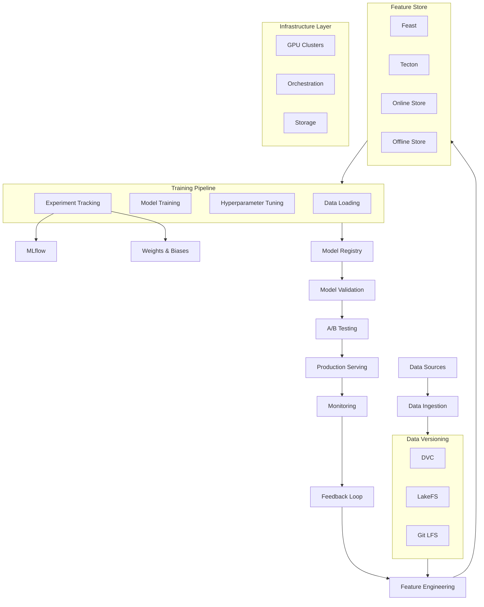

# ML Pipeline Infrastructure



## What is ML Pipeline Infrastructure?

ML pipeline infrastructure is the ecosystem of tools and platforms that manage the end-to-end machine learning lifecycle from data ingestion through model deployment and monitoring. It enables teams to build, train, deploy, and maintain ML systems at scale.

### Why ML Pipeline Infrastructure Was Created

- **Reproducibility**: ML experiments are hard to reproduce without versioned data/code
- **Collaboration**: Multiple data scientists need shared infrastructure
- **Scale**: Manual training doesn't work for enterprise-scale ML
- **Governance**: Models need audit trails, compliance, and validation
- **Iteration speed**: Streamline the path from idea to production

### When to Invest in ML Platform

- Multiple ML models in production
- Team of 3+ data scientists
- Need for experiment reproducibility
- Regulatory requirements for model governance
- High cost of training infrastructure

## Feature Stores

### Feast (Feature Store)

```python
from datetime import datetime, timedelta
from feast import FeatureStore, Entity, FeatureView, FileSource, ValueType

# Define a feature store config
import yaml

config = """
project: my_feature_store
registry: data/registry.db
provider: local
online_store:
  type: redis
  connection_string: localhost:6379
"""

with open("feature_store.yaml", "w") as f:
    f.write(config)

# Define entities
user = Entity(
    name="user_id",
    value_type=ValueType.INT64,
    description="User identifier"
)

# Define feature view
user_features = FeatureView(
    name="user_features",
    entities=["user_id"],
    ttl=timedelta(days=1),
    online=True,
    source=FileSource(
        path="data/user_features.parquet",
        timestamp_field="event_timestamp",
    ),
)

# Apply feature definitions
store = FeatureStore(repo_path=".")
store.apply([user, user_features])

# Get training data
training_df = store.get_historical_features(
    entity_df="SELECT user_id, event_timestamp FROM entity_data",
    features=["user_features:age", "user_features:signup_days"],
).to_df()

# Get online features for serving
feature_vector = store.get_online_features(
    features=["user_features:age", "user_features:signup_days"],
    entity_rows=[{"user_id": 123}],
).to_dict()
```

### Feast Serving API

```python
from feast import FeatureStore
import pandas as pd
import redis

class FeatureServing:
    def __init__(self, repo_path="feature_store"):
        self.store = FeatureStore(repo_path=repo_path)
    
    def get_online_features(self, user_ids, feature_names):
        entity_rows = [{"user_id": uid} for uid in user_ids]
        
        features = self.store.get_online_features(
            features=feature_names,
            entity_rows=entity_rows
        )
        
        return features.to_dict()
    
    def get_batch_features(self, query, feature_names):
        return self.store.get_historical_features(
            entity_df=query,
            features=feature_names
        ).to_df()

# Production serving
serving = FeatureServing()
features = serving.get_online_features(
    user_ids=[1, 2, 3],
    feature_names=["user_features:age", "user_features:last_purchase_days"]
)
```

### Tecton (Enterprise Feature Store)

```python
# Tecton feature definition (hypothetical)
import tecton

@tecton.on_demand_feature_view(
    sources=[transactions, users],
    mode="python"
)
def user_spending_features(transactions, users):
    return {
        "avg_transaction_amount": transactions.amount.mean(),
        "transaction_count_7d": transactions.size,
        "days_since_last_purchase": (datetime.now() - transactions.timestamp.max()).days
    }

# Feature retrieval
features = tecton.get_features(
    entity_id="user_123",
    feature_views=["user_spending_features"],
)
```

## Data Versioning

### DVC (Data Version Control)

```bash
# Initialize DVC
dvc init

# Track data files
dvc add data/train.parquet
dvc add data/test.parquet

# This creates .dvc files tracking the data
git add data/train.parquet.dvc data/test.parquet.dvc .gitignore
git commit -m "Add training data"

# Configure remote storage
dvc remote add -d myremote s3://my-bucket/dvc-store
dvc push

# Switch to different version
git checkout <commit_hash>
dvc checkout

# Create pipeline
dvc stage add -n train \
    -d src/train.py \
    -d data/train.parquet \
    -o models/model.pkl \
    python src/train.py

dvc repro  # Reproduce pipeline

# Compare experiments
dvc params diff
dvc metrics diff
```

### DVC Pipeline Example

```python
# dvc.yaml
stages:
  preprocess:
    cmd: python src/preprocess.py
    deps:
      - data/raw.parquet
      - src/preprocess.py
    params:
      - preprocess.test_split
    outs:
      - data/train.parquet
      - data/test.parquet
  
  train:
    cmd: python src/train.py
    deps:
      - data/train.parquet
      - src/train.py
    params:
      - train.learning_rate
      - train.n_estimators
    outs:
      - models/model.pkl
    metrics:
      - metrics/train_metrics.json:
          cache: false

# params.yaml
preprocess:
  test_split: 0.2
  random_state: 42

train:
  learning_rate: 0.1
  n_estimators: 100
  max_depth: 10
```

### LakeFS

```bash
# LakeFS creates Git-like branches for data

# Create a branch
lakectl branch create \
    --source main \
    my_experiment_branch

# Work on data in the branch
python train.py \
    --data-path lakefs://repo/my_experiment_branch/data/

# Merge if results are good
lakectl merge \
    --from my_experiment_branch \
    --to main

# Rollback if needed
lakectl revert \
    --commit-id abc123
```

## Experiment Tracking

### MLflow

```python
import mlflow
import mlflow.sklearn
from sklearn.ensemble import RandomForestRegressor
from sklearn.metrics import mean_squared_error

# Set tracking URI
mlflow.set_tracking_uri("http://localhost:5000")
mlflow.set_experiment("user_churn_prediction")

with mlflow.start_run(run_name="rf_experiment_1"):
    params = {
        "n_estimators": 100,
        "max_depth": 10,
        "learning_rate": 0.01,
        "min_samples_split": 5
    }
    
    mlflow.log_params(params)
    
    model = RandomForestRegressor(**params)
    model.fit(X_train, y_train)
    
    predictions = model.predict(X_test)
    mse = mean_squared_error(y_test, predictions)
    
    mlflow.log_metric("mse", mse)
    mlflow.log_metric("rmse", mse ** 0.5)
    
    mlflow.sklearn.log_model(model, "model")
    
    mlflow.log_artifact("feature_importance.png")
    mlflow.log_artifact("confusion_matrix.png")

# Register model
mlflow.register_model(
    model_uri="runs:/<run_id>/model",
    name="user_churn_model"
)

# Load model for inference
model = mlflow.pyfunc.load_model("models:/user_churn_model/1")
predictions = model.predict(X_new)
```

### MLflow Registry

```python
from mlflow.tracking import MlflowClient

client = MlflowClient()

# Create registered model
client.create_registered_model("churn_model")

# Register model version
client.create_model_version(
    name="churn_model",
    source="runs:/<run_id>/model",
    run_id="<run_id>"
)

# Transition stages
client.transition_model_version_stage(
    name="churn_model",
    version=1,
    stage="Staging"
)

client.transition_model_version_stage(
    name="churn_model",
    version=1,
    stage="Production"
)

# Get production model
production_model = client.get_latest_versions(
    name="churn_model",
    stages=["Production"]
)
```

### Weights & Biases

```python
import wandb

# Initialize run
wandb.init(
    project="churn-prediction",
    config={
        "learning_rate": 0.01,
        "batch_size": 32,
        "epochs": 10,
        "architecture": "transformer"
    }
)

config = wandb.config

for epoch in range(config.epochs):
    train_loss = train_one_epoch()
    val_accuracy = validate()
    
    wandb.log({
        "epoch": epoch,
        "train_loss": train_loss,
        "val_accuracy": val_accuracy,
        "learning_rate": config.learning_rate
    })

# Log model
wandb.log_artifact("model.pkl", type="model")

wandb.finish()
```

## Training Infrastructure

```python
import ray
from ray import tune
from ray.train import Trainer

@ray.remote(num_gpus=1)
class DistributedTrainer:
    def __init__(self, config):
        self.config = config
    
    def train(self, data_path):
        import torch
        model = self._build_model()
        optimizer = torch.optim.Adam(model.parameters(), lr=self.config["lr"])
        
        for epoch in range(self.config["epochs"]):
            loss = self._train_epoch(model, optimizer)
            tune.report(loss=loss, epoch=epoch)
        
        return model
    
    def _build_model(self):
        pass
    
    def _train_epoch(self, model, optimizer):
        pass

# Hyperparameter tuning with Ray Tune
config = {
    "lr": tune.loguniform(1e-4, 1e-1),
    "batch_size": tune.choice([16, 32, 64]),
    "hidden_size": tune.choice([128, 256, 512])
}

analysis = tune.run(
    lambda config: DistributedTrainer(config).train("data/"),
    config=config,
    num_samples=20,
    resources_per_trial={"gpu": 1},
    metric="loss",
    mode="min"
)

best_config = analysis.get_best_config(metric="loss", mode="min")
```

## Model Registry & Governance

```python
class ModelGovernance:
    def __init__(self):
        self.models = {}
        self.approvals = {}
    
    def register_model(self, name, version, model_path, metadata):
        self.models[f"{name}:{version}"] = {
            "path": model_path,
            "metadata": metadata,
            "status": "registered",
            "created_at": datetime.now().isoformat()
        }
    
    def request_deployment(self, name, version):
        model_key = f"{name}:{version}"
        if model_key not in self.models:
            raise ValueError("Model not registered")
        
        self.models[model_key]["status"] = "pending_review"
        
        return {
            "request_id": f"deploy_{model_key}",
            "status": "pending"
        }
    
    def approve_deployment(self, name, version, reviewer):
        model_key = f"{name}:{version}"
        self.models[model_key]["status"] = "approved"
        self.models[model_key]["reviewer"] = reviewer
        self.models[model_key]["approved_at"] = datetime.now().isoformat()
    
    def rollback(self, name, version):
        model_key = f"{name}:{version}"
        self.models[model_key]["status"] = "rolled_back"
    
    def get_audit_trail(self, name):
        return [
            {k: v for k, v in m.items() if k != "path"}
            for key, m in self.models.items()
            if key.startswith(name)
        ]
```

## A/B Testing Infrastructure

```python
import random
from typing import Dict, Any

class ABTestFramework:
    def __init__(self, traffic_split=0.5):
        self.traffic_split = traffic_split
        self.experiments = {}
    
    def create_experiment(self, name, control_model, treatment_model):
        self.experiments[name] = {
            "control": control_model,
            "treatment": treatment_model,
            "metrics": {"control": [], "treatment": []},
            "start_time": datetime.now().isoformat()
        }
    
    def assign_variant(self, experiment_name, user_id):
        experiment = self.experiments[experiment_name]
        
        # Consistent assignment using hash
        if hash(str(user_id)) % 100 < self.traffic_split * 100:
            return "control"
        return "treatment"
    
    def predict(self, experiment_name, user_id, features):
        experiment = self.experiments[experiment_name]
        variant = self.assign_variant(experiment_name, user_id)
        
        if variant == "control":
            prediction = experiment["control"].predict(features)
        else:
            prediction = experiment["treatment"].predict(features)
        
        return {
            "variant": variant,
            "prediction": prediction
        }
    
    def record_metric(self, experiment_name, variant, metric_name, value):
        experiment = self.experiments[experiment_name]
        experiment["metrics"][variant].append({
            "metric": metric_name,
            "value": value,
            "timestamp": datetime.now().isoformat()
        })
    
    def analyze(self, experiment_name):
        experiment = self.experiments[experiment_name]
        
        import numpy as np
        control_metrics = [m["value"] for m in experiment["metrics"]["control"]]
        treatment_metrics = [m["value"] for m in experiment["metrics"]["treatment"]]
        
        return {
            "control_mean": np.mean(control_metrics),
            "treatment_mean": np.mean(treatment_metrics),
            "lift": (np.mean(treatment_metrics) - np.mean(control_metrics)) / np.mean(control_metrics),
            "control_count": len(control_metrics),
            "treatment_count": len(treatment_metrics)
        }
```

## Cost Considerations

| Component | Typical Cost | Optimization |
|---|---|---|
| Feature Store | $0-10K/month | Feast (free) vs Tecton (paid) |
| Data Versioning | $0-2K/month | Object storage costs |
| Experiment Tracking | $0-1K/month | MLflow self-hosted = free |
| Training Compute | $1-100/hour | Spot instances, preemptible |
| Model Registry | $0-2K/month | MLflow free tier |
| GPU Clusters | $3-32/hour | Reserved instances |

## Best Practices

1. **Feature validation**: Validate features before they enter the store
2. **Training-serving skew**: Use identical feature transformations in both phases
3. **Data lineage**: Track every transformation from source to model
4. **Reproducible runs**: Pin all dependencies and data versions
5. **Gradual rollout**: Canary deployments before full production
6. **Monitoring**: Track data drift, model drift, and feature quality
7. **Cost tagging**: Attribute infrastructure costs to teams/models
8. **CI/CD for ML**: Automated testing for features and pipelines
9. **Documentation**: Auto-generate data catalogs and feature docs
10. **Backup & recovery**: Regular snapshots of feature stores and registries

## Interview Questions

1. How does a feature store solve the training-serving skew problem?
2. Compare Feast vs Tecton for feature management
3. How would you design a data versioning strategy for ML?
4. Explain the role of experiment tracking in ML development
5. How do you implement A/B testing for ML models in production?
6. What is model drift and how would you monitor it?
7. Design a model registry that supports governance and compliance
8. How would you handle data pipeline failures in production?
9. Compare DVC and LakeFS for data versioning
10. How do you ensure reproducibility in ML experiments?

## Real Company Usage Examples

| Company | Tool | Use Case |
|---|---|---|
| **Uber** | Michelangelo | ML platform (internal) |
| **Airbnb** | Bighead | ML pipeline |
| **Netflix** | Metaflow | Data science platform |
| **DoorDash** | Feast | Feature store |
| **Tecton** | Tecton | Enterprise feature store |
| **Waymo** | MLflow | Experiment tracking |
| **OpenAI** | Weights & Biases | Training monitoring |
| **Spotify** | LF | ML platform |
