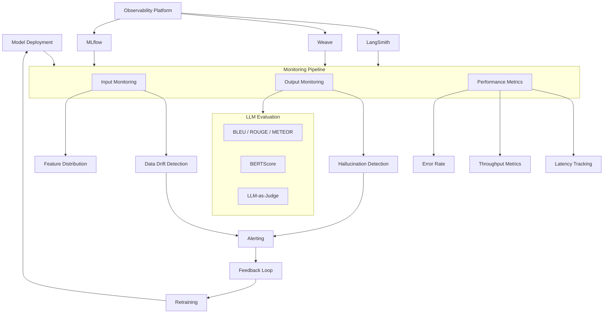

# Model Evaluation & Monitoring



## What is Model Evaluation & Monitoring?

Model evaluation measures how well an ML model performs using quantitative and qualitative metrics. Monitoring tracks model behavior in production to detect degradation, drift, and anomalies.

### Why Evaluation & Monitoring Matter

- **Quality assurance**: Ensure models meet performance baselines
- **Drift detection**: Data and concept drift degrade models over time
- **Safety**: LLMs can hallucinate, produce biased, or harmful outputs
- **Compliance**: Regulated industries require model governance
- **Continuous improvement**: Feedback loops drive model iteration

### When to Invest in Monitoring

- Any model in production serving real users
- LLM-powered applications
- Regulatory compliance requirements (finance, healthcare)
- High-cost failure scenarios
- Models with evolving input distributions

## LLM Evaluation Metrics

### BLEU Score

```python
from nltk.translate.bleu_score import sentence_bleu, SmoothingFunction
import numpy as np

def compute_bleu(reference: str, candidate: str) -> float:
    reference_tokens = reference.split()
    candidate_tokens = candidate.split()
    
    smoothie = SmoothingFunction().method4
    
    score = sentence_bleu(
        [reference_tokens],
        candidate_tokens,
        smoothing_function=smoothie
    )
    
    return score

# BLEU at different n-gram levels
def compute_bleu_variants(reference, candidate):
    ref_tokens = reference.split()
    cand_tokens = candidate.split()
    
    scores = {}
    for n in [1, 2, 3, 4]:
        weights = tuple(1.0 / n if i < n else 0.0 for i in range(4))
        score = sentence_bleu([ref_tokens], cand_tokens, weights=weights)
        scores[f"BLEU-{n}"] = score
    
    scores["BLEU"] = sentence_bleu([ref_tokens], cand_tokens)
    return scores
```

### ROUGE Score

```python
from rouge_score import rouge_scorer

def compute_rouge(reference: str, candidate: str):
    scorer = rouge_scorer.RougeScorer(
        ["rouge1", "rouge2", "rougeL", "rougeLsum"],
        use_stemmer=True
    )
    
    scores = scorer.score(reference, candidate)
    
    return {
        "ROUGE-1": scores["rouge1"].fmeasure,
        "ROUGE-2": scores["rouge2"].fmeasure,
        "ROUGE-L": scores["rougeL"].fmeasure,
        "ROUGE-LSum": scores["rougeLsum"].fmeasure,
    }
```

### METEOR Score

```python
from nltk.translate.meteor_score import meteor_score

def compute_meteor(reference: str, candidate: str) -> float:
    return meteor_score([reference], candidate)
```

### BERTScore

```python
from bert_score import score

def compute_bertscore(references, candidates, model_type="microsoft/deberta-xlarge-mnli"):
    P, R, F1 = score(
        candidates,
        references,
        model_type=model_type,
        verbose=False,
        device="cuda:0"
    )
    
    return {
        "precision": P.mean().item(),
        "recall": R.mean().item(),
        "f1": F1.mean().item(),
    }
```

### LLM-as-Judge

```python
class LLMasJudge:
    def __init__(self, judge_model):
        self.judge = judge_model
    
    def evaluate_quality(self, question, generated_answer, reference_answer=None):
        criteria = [
            "helpfulness",
            "relevance",
            "accuracy",
            "depth",
            "creativity"
        ]
        
        results = {}
        for criterion in criteria:
            score = self._rate_criterion(
                question, generated_answer, reference_answer, criterion
            )
            results[criterion] = score
        
        return results
    
    def _rate_criterion(self, question, generated, reference, criterion):
        prompt = f"""Evaluate the following answer on {criterion} (1-5).

Question: {question}
Generated Answer: {generated}
Reference Answer: {reference or 'N/A'}

{criterion} score:"""
        
        response = self.judge.generate(prompt, max_tokens=10)
        
        try:
            return int(response.strip())
        except ValueError:
            return 3
    
    def pairwise_comparison(self, question, answer_a, answer_b):
        prompt = f"""Compare these answers and choose the better one.

Question: {question}
Answer A: {answer_a}
Answer B: {answer_b}

Which is better? (A or B):"""
        
        response = self.judge.generate(prompt, max_tokens=10)
        return response.strip().upper()
```

## Hallucination Detection

```python
class HallucinationDetector:
    def __init__(self, llm, retriever=None):
        self.llm = llm
        self.retriever = retriever
    
    def check_claim(self, claim: str, context: str = None) -> dict:
        if not context and self.retriever:
            context = self._retrieve_evidence(claim)
        
        prompt = f"""Determine if this claim is supported by the context.

Context: {context or 'No context provided'}

Claim: {claim}

Verdict (SUPPORTED / PARTIALLY / UNSUPPORTED):
Explanation:"""
        
        response = self.llm.generate(prompt, max_tokens=100)
        
        verdict = "UNSUPPORTED"
        explanation = response
        
        if "SUPPORTED" in response:
            verdict = "SUPPORTED"
        elif "PARTIALLY" in response:
            verdict = "PARTIALLY"
        
        return {
            "claim": claim,
            "verdict": verdict,
            "explanation": explanation,
            "confidence": self._confidence_score(verdict)
        }
    
    def _retrieve_evidence(self, claim):
        return ""
    
    def _confidence_score(self, verdict):
        scores = {
            "SUPPORTED": 0.9,
            "PARTIALLY": 0.5,
            "UNSUPPORTED": 0.1
        }
        return scores.get(verdict, 0.0)
    
    def batch_check(self, claims: list, context: str = None) -> list:
        return [self.check_claim(c, context) for c in claims]

class FactualityEvaluator:
    def __init__(self, llm):
        self.detector = HallucinationDetector(llm)
    
    def evaluate_response(self, question, response, knowledge_base=None):
        claims = self._extract_claims(response)
        
        results = []
        for claim in claims:
            evidence = self._find_evidence(claim, knowledge_base) if knowledge_base else None
            result = self.detector.check_claim(claim, evidence)
            results.append(result)
        
        supported = sum(1 for r in results if r["verdict"] == "SUPPORTED")
        total = len(results)
        
        return {
            "factuality_score": supported / total if total > 0 else 0.0,
            "supported_claims": supported,
            "total_claims": total,
            "claim_details": results
        }
    
    def _extract_claims(self, response):
        prompt = f"Extract factual claims from this text, one per line:\n{response}"
        result = self.llm.generate(prompt)
        return [line.strip() for line in result.split("\n") if line.strip()]
    
    def _find_evidence(self, claim, knowledge_base):
        return ""
```

## Drift Monitoring

```python
import numpy as np
from scipy.stats import ks_2samp, wasserstein_distance
from typing import List, Dict

class DriftMonitor:
    def __init__(self, reference_distribution: np.ndarray, threshold=0.05):
        self.reference = reference_distribution
        self.threshold = threshold
        self.alerts = []
    
    def detect_data_drift(self, current_sample: np.ndarray) -> Dict:
        if len(self.reference) == 0 or len(current_sample) == 0:
            return {"drift_detected": False, "reason": "insufficient data"}
        
        ks_stat, p_value = ks_2samp(self.reference, current_sample)
        
        drift_detected = p_value < self.threshold
        
        result = {
            "drift_detected": drift_detected,
            "ks_statistic": float(ks_stat),
            "p_value": float(p_value),
            "wasserstein_distance": float(
                wasserstein_distance(self.reference, current_sample)
            ),
            "sample_size": len(current_sample)
        }
        
        if drift_detected:
            self.alerts.append(result)
        
        return result
    
    def detect_prediction_drift(self, current_predictions, reference_predictions=None):
        if reference_predictions is None:
            reference_predictions = self.reference
        
        current = np.array(current_predictions).flatten()
        reference = np.array(reference_predictions).flatten()
        
        return self.detect_data_drift(reference, current)

class MultiFeatureDriftMonitor:
    def __init__(self, feature_distributions: Dict[str, np.ndarray]):
        self.monitors = {
            name: DriftMonitor(dist)
            for name, dist in feature_distributions.items()
        }
    
    def check_all_features(self, current_data: Dict[str, np.ndarray]) -> Dict:
        results = {}
        for feature_name, monitor in self.monitors.items():
            if feature_name in current_data:
                results[feature_name] = monitor.detect_data_drift(
                    current_data[feature_name]
                )
        return results
    
    def get_drift_report(self):
        drifted_features = [
            name for name, monitor in self.monitors.items()
            if monitor.alerts
        ]
        
        return {
            "total_features": len(self.monitors),
            "drifted_features": len(drifted_features),
            "drift_rate": len(drifted_features) / len(self.monitors),
            "drifted_feature_names": drifted_features,
            "feature_metrics": {
                name: {
                    "alerts": len(monitor.alerts),
                    "latest_p_value": monitor.alerts[-1]["p_value"] if monitor.alerts else 1.0
                }
                for name, monitor in self.monitors.items()
            }
        }
```

## Feedback Loops

```python
from collections import defaultdict
import json

class FeedbackCollector:
    def __init__(self, storage_path="feedback_data.json"):
        self.storage_path = storage_path
        self.feedback = defaultdict(list)
    
    def collect_explicit(self, user_id, prompt, response, rating, comment=None):
        entry = {
            "type": "explicit",
            "user_id": user_id,
            "prompt": prompt,
            "response": response,
            "rating": rating,
            "comment": comment,
            "timestamp": datetime.now().isoformat()
        }
        
        self.feedback["explicit"].append(entry)
        self._persist(entry)
        
        return entry
    
    def collect_implicit(self, user_id, prompt, response, signals):
        entry = {
            "type": "implicit",
            "user_id": user_id,
            "prompt": prompt,
            "response": response,
            "signals": signals,
            "timestamp": datetime.now().isoformat()
        }
        
        self.feedback["implicit"].append(entry)
        self._persist(entry)
        
        return entry
    
    def _persist(self, entry):
        with open(self.storage_path, "a") as f:
            f.write(json.dumps(entry) + "\n")
    
    def get_feedback_for_model(self, model_id, min_rating=4):
        relevant = []
        for entry_list in self.feedback.values():
            for entry in entry_list:
                if entry.get("rating", 0) >= min_rating:
                    relevant.append(entry)
        return relevant
    
    def compute_aggregate_metrics(self):
        explicit = self.feedback.get("explicit", [])
        
        if not explicit:
            return {}
        
        ratings = [e["rating"] for e in explicit if e.get("rating")]
        
        return {
            "average_rating": sum(ratings) / len(ratings) if ratings else 0,
            "total_feedback": len(explicit),
            "rating_distribution": {
                rating: ratings.count(rating) for rating in set(ratings)
            }
        }
```

## Observability for LLMs

### LangSmith

```python
from langsmith import Client
from langsmith.run_helpers import traceable

# Initialize LangSmith
client = Client(api_key="ls-api-key")

# Trace LLM calls
@traceable(run_type="chain", name="rag_pipeline")
def rag_pipeline(question, retriever, llm):
    docs = retriever.retrieve(question)
    context = "\n".join(docs)
    
    @traceable(run_type="llm", name="llm_generate")
    def generate(question, context):
        return llm.generate(f"Context: {context}\nQuestion: {question}")
    
    answer = generate(question, context)
    
    return {"answer": answer, "sources": docs}

# Log evaluation results
def log_evaluation(run_id, metrics):
    client.create_feedback(
        run_id=run_id,
        key="correctness",
        score=metrics["accuracy"],
        comment="Evaluated against test set"
    )

# View traces in LangSmith dashboard
```

### Weave (Weights & Biases)

```python
import weave

# Initialize Weave
weave.init("my-llm-project")

# Track LLM calls
@weave.op()
def call_llm(prompt, model="gpt-4"):
    response = openai_client.chat.completions.create(
        model=model,
        messages=[{"role": "user", "content": prompt}]
    )
    return response.choices[0].message.content

# Track evaluation
@weave.op()
def evaluate_model(test_cases, model):
    results = []
    for case in test_cases:
        response = call_llm(case["prompt"], model)
        score = bleu_score(case["expected"], response)
        results.append({
            "prompt": case["prompt"],
            "response": response,
            "expected": case["expected"],
            "score": score
        })
    
    return {
        "average_score": sum(r["score"] for r in results) / len(results),
        "results": results
    }

# Log to Weave dashboard
evaluation_results = evaluate_model(test_cases, "gpt-4")
```

### Custom Observability Dashboard

```python
class LLMObservability:
    def __init__(self):
        self.logs = []
    
    def log_request(self, request_id, model, prompt, response, latency_ms, tokens_used):
        entry = {
            "request_id": request_id,
            "model": model,
            "prompt_length": len(prompt),
            "response_length": len(response),
            "latency_ms": latency_ms,
            "tokens_used": tokens_used,
            "timestamp": datetime.now().isoformat(),
            "status": "success"
        }
        
        self.logs.append(entry)
        
        if latency_ms > 5000:
            self._alert(f"High latency: {latency_ms}ms for {model}")
        
        if tokens_used > 4000:
            self._alert(f"High token usage: {tokens_used} for {request_id}")
    
    def log_error(self, request_id, model, prompt, error):
        self.logs.append({
            "request_id": request_id,
            "model": model,
            "prompt_length": len(prompt),
            "error": str(error),
            "timestamp": datetime.now().isoformat(),
            "status": "error"
        })
    
    def _alert(self, message):
        print(f"ALERT: {message}")
    
    def compute_metrics(self, window_minutes=60):
        cutoff = (datetime.now() - timedelta(minutes=window_minutes)).isoformat()
        recent = [l for l in self.logs if l["timestamp"] > cutoff]
        
        if not recent:
            return {}
        
        latencies = [l["latency_ms"] for l in recent if "latency_ms" in l]
        tokens = [l["tokens_used"] for l in recent if "tokens_used" in l]
        errors = [l for l in recent if l["status"] == "error"]
        
        return {
            "total_requests": len(recent),
            "error_rate": len(errors) / len(recent),
            "average_latency_ms": sum(latencies) / len(latencies) if latencies else 0,
            "p95_latency_ms": sorted(latencies)[int(len(latencies) * 0.95)] if latencies else 0,
            "average_tokens": sum(tokens) / len(tokens) if tokens else 0,
            "total_tokens": sum(tokens) if tokens else 0
        }
```

## Cost of Monitoring

| Tool | Pricing | Notes |
|---|---|---|
| LangSmith | Free tier + $0.01-0.10/run | Pay per traced run |
| Weave | Free (W&B) | Part of W&B ecosystem |
| MLflow | Free | Self-hosted |
| Custom | Infrastructure cost | Build your own |
| Arize AI | $0-5K/month | ML observability |
| WhyLabs | Free tier + paid | Data drift monitoring |

## Best Practices

1. **Baseline first**: Establish pre-production performance baselines
2. **Multi-metric**: Don't rely on a single evaluation metric
3. **LLM-as-judge sparingly**: Use for qualitative assessment, not all cases
4. **Drift detection on features + predictions**: Monitor both sides
5. **Alert thresholds**: Set meaningful thresholds, not arbitrary ones
6. **Feedback quality > quantity**: Prefer high-quality human feedback
7. **Automated retraining triggers**: Connect monitoring to retraining pipeline
8. **Trace every request**: Full request tracing for debugging
9. **Retention policies**: Store evaluation data with clear TTLs
10. **Blind evaluations**: Use A/B testing without bias

## Interview Questions

1. Compare BLEU, ROUGE, and BERTScore for LLM evaluation
2. How would you detect hallucination in an LLM response?
3. Explain data drift vs concept drift with examples
4. How do you set up a feedback loop for a chatbot?
5. What metrics would you monitor for a deployed LLM?
6. How does LLM-as-judge evaluation work and what are its limitations?
7. Design a monitoring system for a RAG pipeline
8. How would you detect prompt injection attempts in production?
9. What is training-serving skew and how do you detect it?
10. How do you evaluate a model when there's no ground truth?

## Real Company Usage Examples

| Company | Tool | Use Case |
|---|---|---|
| **OpenAI** | Custom | LLM evaluation framework |
| **Anthropic** | Custom | Constitutional AI evaluation |
| **LangChain** | LangSmith | LLM observability |
| **Weights & Biases** | Weave | LLM experiment tracking |
| **Arize AI** | Arize | ML monitoring platform |
| **WhyLabs** | WhyLabs | Data drift detection |
| **Databricks** | MLflow | Model registry + monitoring |
| **Hugging Face** | Evaluate | Open-source evaluation library |
