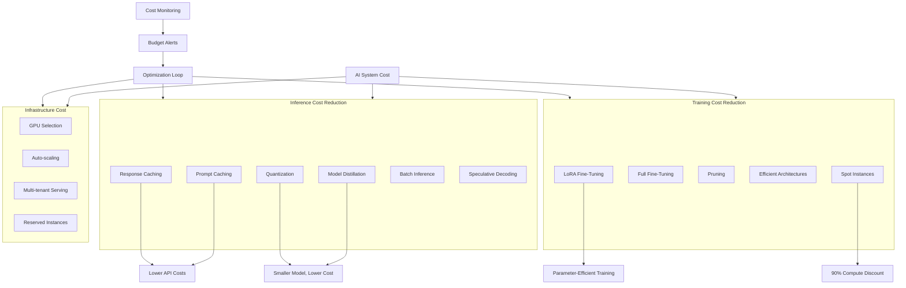

# Cost Optimization for AI



## What is Cost Optimization for AI?

Cost optimization for AI encompasses strategies to reduce the financial footprint of developing, training, and deploying machine learning models, particularly large language models. Given that GPU compute can cost $10-100+/hour, optimization directly impacts business viability.

### Why Cost Optimization Matters

- **GPU scarcity**: High demand makes GPU time expensive and hard to access
- **Model scale**: Costs scale linearly with model size and token count
- **Inference volume**: Production systems run billions of inferences daily
- **Training cost**: single training run can cost $1-10M+
- **ROI**: Systems must deliver value exceeding their compute cost

### When to Focus on Cost

- High-volume production inference (>1M requests/day)
- Large model training (>1B parameters)
- Startup with limited compute budget
- Multi-model serving infrastructure
- Long-running batch inference pipelines

## Inference Cost Reduction

### Prompt Caching

```python
import hashlib
import json
from typing import Dict, Any
from datetime import datetime, timedelta

class PromptCache:
    def __init__(self, max_size=10000, ttl_seconds=3600):
        self.cache: Dict[str, Dict[str, Any]] = {}
        self.max_size = max_size
        self.ttl = ttl_seconds
    
    def _make_key(self, model: str, prompt: str, params: dict) -> str:
        content = f"{model}:{prompt}:{json.dumps(params, sort_keys=True)}"
        return hashlib.sha256(content.encode()).hexdigest()
    
    def get(self, model: str, prompt: str, params: dict) -> str:
        key = self._make_key(model, prompt, params)
        entry = self.cache.get(key)
        
        if not entry:
            return None
        
        if datetime.now() - entry["timestamp"] > timedelta(seconds=self.ttl):
            del self.cache[key]
            return None
        
        entry["hits"] += 1
        return entry["response"]
    
    def set(self, model: str, prompt: str, params: dict, response: str):
        if len(self.cache) >= self.max_size:
            oldest = min(self.cache.items(), key=lambda x: x[1]["timestamp"])
            del self.cache[oldest[0]]
        
        key = self._make_key(model, prompt, params)
        self.cache[key] = {
            "response": response,
            "timestamp": datetime.now(),
            "hits": 0
        }
    
    def get_stats(self):
        total = len(self.cache)
        total_hits = sum(e["hits"] for e in self.cache.values())
        return {
            "cache_size": total,
            "total_hits": total_hits,
            "hit_rate": total_hits / (total_hits + total) if total > 0 else 0
        }

class SemanticCache:
    def __init__(self, embedding_model, similarity_threshold=0.95):
        self.embedding_model = embedding_model
        self.threshold = similarity_threshold
        self.cache = []
    
    def get(self, query: str):
        query_embedding = self.embedding_model.encode([query])[0]
        
        for entry in self.cache:
            similarity = self._cosine_similarity(query_embedding, entry["embedding"])
            if similarity >= self.threshold:
                entry["hits"] += 1
                return entry["response"]
        
        return None
    
    def set(self, query: str, response: str):
        embedding = self.embedding_model.encode([query])[0]
        self.cache.append({
            "query": query,
            "response": response,
            "embedding": embedding,
            "hits": 0
        })
    
    def _cosine_similarity(self, a, b):
        import numpy as np
        return np.dot(a, b) / (np.linalg.norm(a) * np.linalg.norm(b))
```

### Response Caching

```python
class ResponseCache:
    def __init__(self, storage_path="response_cache.json"):
        self.storage_path = storage_path
        self.cache = self._load()
    
    def _load(self):
        import os
        if os.path.exists(self.storage_path):
            with open(self.storage_path) as f:
                return json.load(f)
        return {}
    
    def get(self, request_hash):
        return self.cache.get(request_hash)
    
    def set(self, request_hash, response):
        self.cache[request_hash] = response
        self._save()
    
    def _save(self):
        with open(self.storage_path, "w") as f:
            json.dump(self.cache, f)
    
    def clear_expired(self, max_age_days=30):
        cutoff = (datetime.now() - timedelta(days=max_age_days)).isoformat()
        self.cache = {
            k: v for k, v in self.cache.items()
            if v.get("timestamp", "") > cutoff
        }
        self._save()
```

### Model Distillation

```python
import torch
import torch.nn as nn
import torch.nn.functional as F

class DistillationTrainer:
    def __init__(self, teacher_model, student_model, temperature=2.0, alpha=0.5):
        self.teacher = teacher_model
        self.student = student_model
        self.temperature = temperature
        self.alpha = alpha
    
    def train_step(self, batch, optimizer):
        self.teacher.eval()
        self.student.train()
        
        with torch.no_grad():
            teacher_logits = self.teacher(batch["input_ids"])
        
        student_logits = self.student(batch["input_ids"])
        
        distillation_loss = F.kl_div(
            F.log_softmax(student_logits / self.temperature, dim=-1),
            F.softmax(teacher_logits / self.temperature, dim=-1),
            reduction="batchmean"
        ) * (self.temperature ** 2)
        
        if "labels" in batch:
            ce_loss = F.cross_entropy(student_logits, batch["labels"])
            loss = self.alpha * ce_loss + (1 - self.alpha) * distillation_loss
        else:
            loss = distillation_loss
        
        optimizer.zero_grad()
        loss.backward()
        optimizer.step()
        
        return loss.item()
    
    def distill(self, dataset, epochs=3, batch_size=16):
        optimizer = torch.optim.AdamW(self.student.parameters(), lr=5e-5)
        
        for epoch in range(epochs):
            total_loss = 0
            for batch in dataset:
                loss = self.train_step(batch, optimizer)
                total_loss += loss
            
            print(f"Epoch {epoch}: loss = {total_loss / len(dataset):.4f}")
        
        return self.student

# Cost comparison
DISTILLATION_COST = {
    "teacher": "gpt-4 (175B)",
    "student": "gpt-3.5-turbo (20B)",
    "size_reduction": "8.75x",
    "inference_cost_reduction": "10-20x",
    "quality_loss": "2-5%"
}
```

### Pruning

```python
class ModelPruner:
    def __init__(self, model, pruning_amount=0.3):
        self.model = model
        self.pruning_amount = pruning_amount
        self.masks = {}
    
    def magnitude_prune(self):
        for name, param in self.model.named_parameters():
            if "weight" in name and param.dim() >= 2:
                threshold = torch.quantile(
                    param.abs().flatten(),
                    self.pruning_amount
                )
                
                mask = param.abs() > threshold
                self.masks[name] = mask
                
                param.data *= mask.float()
        
        return self.model
    
    def unstructured_prune(self, param, amount):
        values = param.abs().view(-1)
        threshold = torch.quantile(values, amount)
        mask = param.abs() > threshold
        param.data *= mask.float()
        return param
    
    def structured_prune(self, param, amount, dim=0):
        norms = param.norm(dim=1 if dim == 0 else 0)
        threshold = torch.quantile(norms, amount)
        mask = norms > threshold
        
        if dim == 0:
            param.data = param.data[mask]
        else:
            param.data = param.data[:, mask]
        
        return param, mask
    
    def compute_sparsity(self):
        total_params = 0
        zero_params = 0
        
        for name, param in self.model.named_parameters():
            total_params += param.numel()
            zero_params += (param == 0).sum().item()
        
        return {
            "total_params": total_params,
            "zero_params": zero_params,
            "sparsity": zero_params / total_params
        }
```

### Quantization for Cost

```python
class CostAwareQuantizer:
    def __init__(self):
        self.techniques = {
            "fp16": {"cost_multiplier": 0.6, "quality": 1.0},
            "int8": {"cost_multiplier": 0.35, "quality": 0.99},
            "int4_gptq": {"cost_multiplier": 0.20, "quality": 0.97},
            "int4_awq": {"cost_multiplier": 0.20, "quality": 0.98},
            "nf4": {"cost_multiplier": 0.22, "quality": 0.96}
        }
    
    def recommend_quantization(self, budget_per_token, quality_threshold=0.95):
        viable = [
            (name, info)
            for name, info in self.techniques.items()
            if info["quality"] >= quality_threshold
        ]
        
        if not viable:
            return "fp16"
        
        best = min(viable, key=lambda x: x[1]["cost_multiplier"])
        return best[0]
    
    def cost_savings_report(self, current_technique, target_technique):
        current = self.techniques[current_technique]
        target = self.techniques[target_technique]
        
        savings = (current["cost_multiplier"] - target["cost_multiplier"]) / current["cost_multiplier"]
        
        return {
            "current": current_technique,
            "target": target_technique,
            "cost_savings_pct": savings * 100,
            "quality_loss_pct": (1 - target["quality"] / current["quality"]) * 100
        }
```

## LoRA Fine-Tuning vs Full Fine-Tuning

```python
class LoRAConfig:
    def __init__(self, r=8, alpha=16, dropout=0.05):
        self.r = r
        self.alpha = alpha
        self.scaling = alpha / r
        self.dropout = dropout

class LoRALayer(nn.Module):
    def __init__(self, base_layer, rank=8, alpha=16):
        super().__init__()
        self.base_layer = base_layer
        self.rank = rank
        self.scaling = alpha / rank
        
        in_features = base_layer.in_features
        out_features = base_layer.out_features
        
        self.lora_a = nn.Parameter(torch.randn(in_features, rank) * 0.01)
        self.lora_b = nn.Parameter(torch.zeros(rank, out_features))
    
    def forward(self, x):
        base_output = self.base_layer(x)
        lora_output = (x @ self.lora_a @ self.lora_b) * self.scaling
        return base_output + lora_output

class CostComparison:
    @staticmethod
    def compare(method, base_params, trainable_params, training_tokens, gpu_cost_per_hour):
        if method == "full_finetune":
            return CostComparison._full_finetune_cost(
                base_params, training_tokens, gpu_cost_per_hour
            )
        elif method == "lora":
            return CostComparison._lora_cost(
                base_params, trainable_params, training_tokens, gpu_cost_per_hour
            )
    
    @staticmethod
    def _full_finetune_cost(base_params, tokens, gpu_cost):
        hours = tokens / (100000 * 3600)
        gpu_hours = hours * base_params / 1e9 * 8
        return {
            "method": "Full Fine-Tuning",
            "trainable_params": f"{base_params:,}",
            "estimated_gpu_hours": gpu_hours,
            "estimated_cost": gpu_hours * gpu_cost,
            "storage_per_model": f"{base_params * 2 / 1e9:.1f} GB"
        }
    
    @staticmethod
    def _lora_cost(base_params, lora_params, tokens, gpu_cost):
        hours = tokens / (100000 * 3600)
        gpu_hours = hours * lora_params / 1e9 * 8
        return {
            "method": "LoRA",
            "trainable_params": f"{lora_params:,}",
            "parameter_efficiency": f"{base_params / lora_params:.0f}x",
            "estimated_gpu_hours": gpu_hours,
            "estimated_cost": gpu_hours * gpu_cost,
            "storage_per_adapter": f"{lora_params * 2 / 1e9:.2f} GB"
        }

# Example comparison
comparison = CostComparison.compare(
    method="lora",
    base_params=7_000_000_000,
    trainable_params=4_194_304,
    training_tokens=100_000_000,
    gpu_cost_per_hour=3.00
)
```

## Batch Inference

```python
import asyncio
from typing import List, Dict, Any
from datetime import datetime

class BatchInferenceProcessor:
    def __init__(self, model, max_batch_size=64, max_latency_ms=500):
        self.model = model
        self.max_batch_size = max_batch_size
        self.max_latency_ms = max_latency_ms
        self.queue = []
        self.processing = False
    
    async def submit(self, request):
            future = asyncio.Future()
            self.queue.append({"request": request, "future": future})
            self._schedule_process()
            return await future
    
    def _schedule_process(self):
        if not self.processing and len(self.queue) >= self.max_batch_size:
            asyncio.create_task(self._process_batch())
    
    async def _process_batch(self):
        self.processing = True
        
        while self.queue:
            batch = self.queue[:self.max_batch_size]
            self.queue = self.queue[self.max_batch_size:]
            
            inputs = [item["request"] for item in batch]
            
            start = datetime.now()
            outputs = self.model.batch_generate(inputs)
            elapsed = (datetime.now() - start).total_seconds() * 1000
            
            cost_per_request = self._compute_cost(len(inputs), elapsed)
            
            for item, output in zip(batch, outputs):
                item["future"].set_result({
                    "output": output,
                    "batch_size": len(batch),
                    "latency_ms": elapsed,
                    "cost_per_request": cost_per_request
                })
        
        self.processing = False
    
    def _compute_cost(self, batch_size, latency_ms):
        gpu_seconds = (latency_ms / 1000) * 1
        cost_per_second = 0.0008
        return cost_per_second * gpu_seconds / batch_size

class BatchScheduler:
    def __init__(self, max_batch_size=32, max_wait_ms=200):
        self.max_batch_size = max_batch_size
        self.max_wait_ms = max_wait_ms
        self.pending = []
    
    def add(self, item):
        self.pending.append(item)
        
        if len(self.pending) >= self.max_batch_size:
            return self.flush()
        
        return None
    
    def flush(self):
        batch = self.pending[:self.max_batch_size]
        self.pending = self.pending[len(batch):]
        return batch
    
    def get_stats(self):
        return {
            "pending": len(self.pending),
            "optimal_batch_size": self.max_batch_size,
            "utilization": len(self.pending) / self.max_batch_size
        }
```

## Spot Instance Strategy

```python
class SpotInstanceManager:
    def __init__(self, region="us-east-1"):
        self.region = region
        self.instance_pricing = {
            "p4d.24xlarge": {"on_demand": 32.77, "spot": 9.83},
            "p4de.24xlarge": {"on_demand": 40.96, "spot": 12.29},
            "p5.48xlarge": {"on_demand": 98.32, "spot": 29.50},
            "g5.12xlarge": {"on_demand": 5.67, "spot": 1.70},
            "g5.48xlarge": {"on_demand": 22.68, "spot": 6.80}
        }
    
    def recommend_instance(self, vram_gb=40, hours=100):
        viable = [
            (name, prices)
            for name, prices in self.instance_pricing.items()
        ]
        
        if not viable:
            return None
        
        best = min(viable, key=lambda x: x[1]["spot"])
        
        savings_pct = (
            (best[1]["on_demand"] - best[1]["spot"]) / best[1]["on_demand"] * 100
        )
        
        return {
            "instance": best[0],
            "on_demand_cost": best[1]["on_demand"] * hours,
            "spot_cost": best[1]["spot"] * hours,
            "savings": f"{savings_pct:.0f}%",
            "risk": "Can be interrupted with 2-minute notice"
        }
    
    def cost_comparison(self, instance_type, hours):
        prices = self.instance_pricing.get(instance_type)
        if not prices:
            return None
        
        return {
            "instance": instance_type,
            "on_demand": prices["on_demand"] * hours,
            "spot": prices["spot"] * hours,
            "savings": (1 - prices["spot"] / prices["on_demand"]) * 100
        }

class CheckpointStrategy:
    def __init__(self, interval_minutes=15):
        self.interval = interval_minutes
    
    def estimate_interruption_cost(self, interruption_frequency=0.1):
        avg_work_lost = self.interval / 2
        expected_loss = avg_work_lost * interruption_frequency
        
        return {
            "checkpoint_interval_min": self.interval,
            "avg_work_lost_min": avg_work_lost,
            "expected_loss_per_hour_min": expected_loss * 60,
            "recommendation": "Use spot for training with frequent checkpoints"
        }
```

## Infrastructure Cost Optimization

```python
class InfrastructureOptimizer:
    def __init__(self):
        self.strategies = {
            "gpu_selection": {
                "savings": "40-60%",
                "description": "Use A10G instead of A100 for smaller models",
                "rule": "If model < 13B, use A10G ($3-5/hr vs $30+/hr)"
            },
            "auto_scaling": {
                "savings": "30-70%",
                "description": "Scale to zero during idle periods",
                "rule": "Implement HPA with min=0 replicas"
            },
            "multi_tenant": {
                "savings": "40-60%",
                "description": "Share GPU across multiple models",
                "rule": "Use Triton/vLLM multi-LoRA serving"
            },
            "reserved_instances": {
                "savings": "40-70%",
                "description": "1-year or 3-year commitments",
                "rule": "If predict steady usage >6 months, reserve"
            }
        }
    
    def generate_optimization_plan(self, monthly_budget, current_spend):
        savings_opportunities = []
        
        if current_spend > monthly_budget * 0.3:
            savings_opportunities.append("gpu_selection")
        
        return {
            "current_monthly": current_spend,
            "target_monthly": monthly_budget,
            "overage_pct": (current_spend - monthly_budget) / monthly_budget * 100,
            "recommended_strategies": [
                {
                    "name": s,
                    "details": self.strategies[s],
                    "estimated_savings": self.strategies[s]["savings"]
                }
                for s in savings_opportunities
            ]
        }
```

## Cost Monitoring Dashboard

```python
from collections import defaultdict
from datetime import datetime, timedelta

class CostTracker:
    def __init__(self):
        self.entries = []
    
    def log_inference(self, model, tokens_in, tokens_out, latency_ms):
        cost = self._compute_cost(model, tokens_in, tokens_out)
        self.entries.append({
            "type": "inference",
            "model": model,
            "tokens_in": tokens_in,
            "tokens_out": tokens_out,
            "latency_ms": latency_ms,
            "cost": cost,
            "timestamp": datetime.now().isoformat()
        })
        return cost
    
    def log_training(self, model, gpu_hours, gpu_type="A100"):
        cost = self._compute_training_cost(gpu_hours, gpu_type)
        self.entries.append({
            "type": "training",
            "model": model,
            "gpu_hours": gpu_hours,
            "gpu_type": gpu_type,
            "cost": cost,
            "timestamp": datetime.now().isoformat()
        })
        return cost
    
    def _compute_cost(self, model, tokens_in, tokens_out):
        pricing = {
            "gpt-4": {"input": 0.03, "output": 0.06},
            "gpt-3.5-turbo": {"input": 0.001, "output": 0.002},
            "claude-3": {"input": 0.008, "output": 0.024}
        }
        
        p = pricing.get(model, {"input": 0.01, "output": 0.02})
        return (tokens_in / 1000 * p["input"]) + (tokens_out / 1000 * p["output"])
    
    def _compute_training_cost(self, gpu_hours, gpu_type):
        pricing = {"A100": 3.00, "H100": 8.00, "V100": 1.50}
        return gpu_hours * pricing.get(gpu_type, 3.00)
    
    def daily_report(self):
        today = datetime.now().date().isoformat()
        today_entries = [
            e for e in self.entries
            if e["timestamp"].startswith(today)
        ]
        
        total_cost = sum(e["cost"] for e in today_entries)
        inference_entries = [e for e in today_entries if e["type"] == "inference"]
        
        return {
            "date": today,
            "total_cost": total_cost,
            "inference_count": len(inference_entries),
            "avg_cost_per_inference": (
                sum(e["cost"] for e in inference_entries) / len(inference_entries)
                if inference_entries else 0
            ),
            "total_tokens_in": sum(e.get("tokens_in", 0) for e in inference_entries),
            "total_tokens_out": sum(e.get("tokens_out", 0) for e in inference_entries)
        }
    
    def monthly_forecast(self):
        total = sum(e["cost"] for e in self.entries)
        days = max(
            (datetime.now() - datetime.fromisoformat(self.entries[0]["timestamp"])).days
            if self.entries else 1,
            1
        )
        daily_avg = total / days
        return {
            "total_to_date": total,
            "days_tracked": days,
            "daily_average": daily_avg,
            "projected_monthly": daily_avg * 30,
            "projected_annual": daily_avg * 365
        }
```

## Cost Optimization Decision Matrix

| Scenario | Strategy | Savings | Quality Impact |
|---|---|---|---|
| High-volume chat | Prompt caching + batching | 40-60% | None |
| Real-time API | Quantization (INT8) | 50-65% | <1% |
| Batch processing | Spot instances | 60-70% | None (with checkpoints) |
| Fine-tuning LLM | LoRA | 90-99% params | <5% |
| Multi-model serving | vLLM with LoRA adapters | 70-80% | None |
| Low-latency inference | Distillation | 80-90% cost | 2-5% quality |
| Prototyping | Smaller model + CoT | 90%+ | Minimal |
| Production training | Reserved instances | 40-70% | None |

## Best Practices

1. **Cache aggressively**: Semantic caching for similar queries
2. **Right-size model**: Use smallest model that meets quality bar
3. **Batch everything**: Combine independent requests
4. **Monitor costs per user**: Track cost by feature/customer
5. **Use spot/preemptible**: For training and batch inference
6. **Quantize appropriately**: 4-bit for chat, 8-bit for accuracy-critical
7. **Explore distillation**: Smaller models often reach 95%+ of larger ones
8. **Set budgets and alerts**: Prevent cost overruns automatically
9. **Optimize prompts**: Fewer tokens = lower cost
10. **Review unused resources**: Idle GPUs and orphaned resources

## Interview Questions

1. How would you reduce inference costs for a chatbot serving 1M users/day?
2. Compare LoRA vs full fine-tuning from a cost perspective
3. How does prompt caching reduce costs in an LLM application?
4. Explain the economics of model distillation
5. How would you design a batch inference system for cost efficiency?
6. What are the trade-offs between spot and on-demand GPU instances?
7. How does quantization reduce cost and what are the quality impacts?
8. Design a cost monitoring system for an AI platform
9. When would you choose a smaller model over a larger one?
10. How do you calculate the ROI of cost optimization investments?

## Real Company Usage Examples

| Company | Strategy | Savings |
|---|---|---|
| **OpenAI** | Prompt caching | Significant |
| **Anthropic** | Longer context caching | Major |
| **Character.ai** | vLLM + PagedAttention | 2-3x throughput |
| **Jasper AI** | Model cascade (small→large) | 40-60% |
| **GitHub Copilot** | Caching + batching | Major |
| **Replit** | Spot instances | 60%+ |
| **Grammarly** | LoRA fine-tuning | Efficient |
| **Midjourney** | Quantization | 2x speed |
