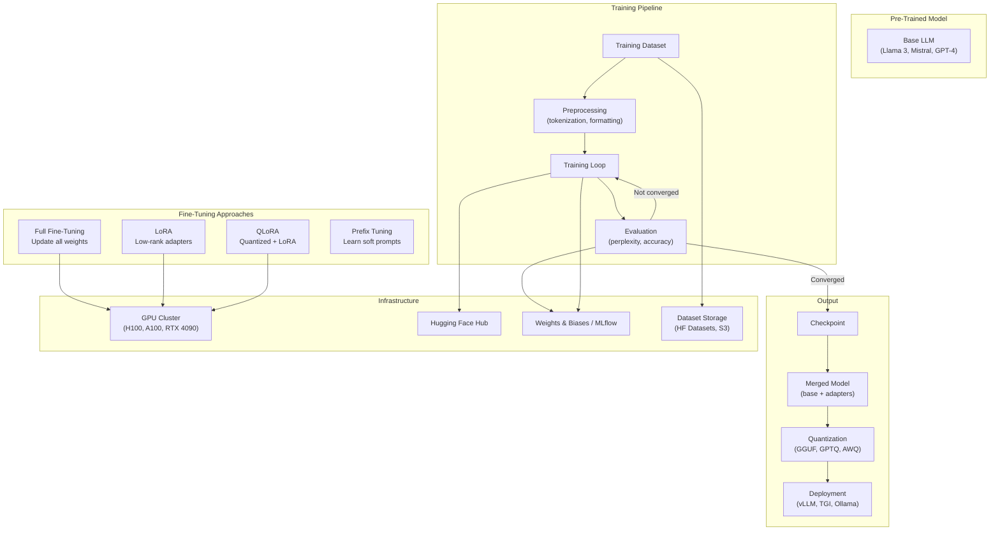

# LLM Fine-Tuning

> Fine-tuning adapts a pre-trained LLM to a specific task or domain by updating its weights on a curated dataset. Parameter-efficient fine-tuning (PEFT) methods like LoRA and QLoRA make this feasible on consumer GPUs — enabling domain adaptation without full model retraining.

## Architecture at a Glance



## What is Fine-Tuning?

Fine-tuning takes a pre-trained LLM and further trains it on a domain-specific dataset to improve performance on a target task. Full fine-tuning updates all model parameters — expensive and memory-intensive. PEFT methods (LoRA, QLoRA) freeze the base model and insert small trainable adapters, reducing memory requirements by 10-100x while retaining most quality gains.

## When to Fine-Tune vs RAG vs Prompt Engineering

| Approach | When to Use | Quality | Cost | Maintenance |
|----------|------------|---------|------|-------------|
| **Prompt Engineering** | Simple tasks, quick prototypes, no training data | Low-Medium | $0 | Easy — just update prompts |
| **RAG** | Knowledge-intensive tasks, evolving data, citation needed | Medium-High | $$ (retrieval + generation) | Medium — update vector DB |
| **Fine-Tuning** | Specific format, style, or domain; consistent behavior | High | $$$ (training + serving) | High — retrain on data shifts |
| **Pre-Training** | New language/domain from scratch | Highest | $$$$$ | Very high |

## LoRA vs QLoRA vs Full Fine-Tuning

| Aspect | Full FT | LoRA | QLoRA |
|--------|---------|------|-------|
| Memory (7B model) | ~56 GB | ~16 GB | ~6 GB |
| Memory (70B model) | ~560 GB | ~160 GB | ~48 GB |
| Trainable params | 100% | ~0.1-1% | ~0.1-1% |
| Training speed | 1x | ~1.5x (fewer gradients) | ~2x (quantized) |
| Quality (vs Full FT) | Baseline | ~95-99% | ~90-95% |
| GPU requirement | A100 80GB+ | RTX 3090 24GB+ | RTX 4090 24GB |
| Best for | Maximum quality, no constraints | Balanced quality/efficiency | Consumer GPUs, budget |

## Hands-on Example: Fine-Tuning with LoRA

**Installation:**
```bash
pip install transformers datasets peft accelerate bitsandbytes trl
```

**Training script (QLoRA):**
```python
import torch
from transformers import (
    AutoModelForCausalLM, AutoTokenizer, BitsAndBytesConfig,
    TrainingArguments
)
from peft import LoraConfig, get_peft_model, prepare_model_for_kbit_training
from trl import SFTTrainer
from datasets import load_dataset

# Quantization config — 4-bit NF4
bnb_config = BitsAndBytesConfig(
    load_in_4bit=True,
    bnb_4bit_quant_type="nf4",
    bnb_4bit_compute_dtype=torch.bfloat16,
    bnb_4bit_use_double_quant=True,
)

# Load base model in 4-bit
model = AutoModelForCausalLM.from_pretrained(
    "meta-llama/Meta-Llama-3-8B",
    quantization_config=bnb_config,
    device_map="auto",
    trust_remote_code=True,
)

# LoRA adapter config
lora_config = LoraConfig(
    r=16,              # Rank — higher = more capacity, more memory
    lora_alpha=32,     # Scaling factor
    target_modules=["q_proj", "k_proj", "v_proj", "o_proj"],
    lora_dropout=0.05,
    bias="none",
    task_type="CAUSAL_LM",
)

model = prepare_model_for_kbit_training(model)
model = get_peft_model(model, lora_config)
model.print_trainable_parameters()  # ~0.1% of params

# Load dataset
dataset = load_dataset("json", data_files="domain_data.jsonl")

# Training
trainer = SFTTrainer(
    model=model,
    train_dataset=dataset["train"],
    args=TrainingArguments(
        per_device_train_batch_size=4,
        gradient_accumulation_steps=4,
        num_train_epochs=3,
        learning_rate=2e-4,
        fp16=True,
        logging_steps=10,
        evaluation_strategy="steps",
        save_strategy="steps",
        output_dir="./lora-checkpoints",
        report_to="wandb",
    ),
    tokenizer=tokenizer,
    max_seq_length=2048,
)

trainer.train()

# Save only LoRA adapters (~20 MB for 8B model)
trainer.save_model("./lora-adapters")
```

**Inference with loaded adapters:**
```python
from peft import PeftModel

# Load base model + LoRA adapters
base_model = AutoModelForCausalLM.from_pretrained(
    "meta-llama/Meta-Llama-3-8B",
    device_map="auto",
)
model = PeftModel.from_pretrained(base_model, "./lora-adapters")

# Merge adapters into base model for faster inference
model = model.merge_and_unload()
model.save_pretrained("./merged-model")
```

## Dataset Requirements

| Quality | Quantity | Recommends |
|---------|----------|------------|
| Minimum viable | 100-500 examples | Specific classification, simple format conversion |
| Good | 1,000-10,000 | Instruction following, tool use, code generation |
| Excellent | 10,000-100,000 | Domain adaptation, complex reasoning |
| Production | 100,000+ | Full capabilities, competitive quality |

**Dataset format (Alpaca-style):**
```jsonl
{"instruction": "Summarize the following technical article.",
 "input": "Kubernetes is an open-source container orchestration platform...",
 "output": "Kubernetes automates deployment, scaling, and management of containerized applications."}
```

## Evaluation Metrics

| Metric | What It Measures | When to Use |
|--------|-----------------|-------------|
| Perplexity | Model confidence on test set | Quick sanity check |
| Accuracy / F1 | Task-specific correctness | Classification, extraction |
| BLEU / ROUGE | Text overlap with reference | Translation, summarization |
| GPT-4 evaluation | Quality assessment via judge LLM | Open-ended generation |
| Human evaluation | Actual user satisfaction | Final quality gate |

## Interview Questions

**Q1: You need to fine-tune a 70B model on domain-specific legal text. You have 4xA100 80GB GPUs. What approach do you use?**
QLoRA with 4-bit NF4 quantization. On 70B: 4-bit reduces memory to ~35GB for the base model. LoRA adapters add ~2GB. With 4 GPUs, use FSDP (Fully Sharded Data Parallel) to split the model across GPUs. Train for 3 epochs on 10K+ legal documents. This fits within the 4xA100 budget.

**Q2: Your fine-tuned model has memorized training data and outputs verbatim text. How do you fix this?**
The model is overfit. Solutions: 1) Add more training data with diverse phrasing, 2) Use deduplication before training, 3) Add dropout or weight decay, 4) Reduce training epochs, 5) Use differential privacy training (DP-SGD) to bound memorization, 6) Add an output filter that flags high-n-gram overlap with training data.

**Q3: How do you decide between LoRA and full fine-tuning for a customer service chatbot?**
Start with LoRA (r=16-32) on 5K customer conversations. Evaluate on a held-out test set. If LoRA quality matches or exceeds the baseline by 10%+ on key metrics (accuracy, hallucination rate), ship LoRA. Only consider full FT if LoRA plateaus below quality targets and you have budget for A100 80GB GPUs. In practice, LoRA matches full FT for most domain adaptation tasks.

## Best Practices

- **Start with high-quality data over quantity** — 1K excellent examples beat 100K noisy ones
- **Use chat template** — format training data exactly like the model's expected chat format
- **Validate on diverse examples** — test on edge cases, not just similar distribution
- **Monitor for catastrophic forgetting** — evaluate on general benchmarks after fine-tuning
- **Keep adapters separate** — don't merge unless necessary; adapters let you switch domains
- **Set up human eval** — LLM-as-judge augments but doesn't replace human evaluation

## Real Company Usage

| Company | Fine-Tuning Strategy |
|---------|---------------------|
| **GitHub Copilot** | Fine-tuned Codex on public code repos + GitHub-specific patterns. LoRA adapters for language variants (Python, JS, Go) |
| **Bloomberg** | BloombergGPT — full fine-tune on 50B tokens of financial data. LoRA for sub-domain tasks (M&A reports, earnings summaries) |
| **Replit** | Fine-tuned Code Llama on Replit's code corpus. QLoRA on consumer GPUs for weekly model updates |
| **Writer** | Palmyra models — fine-tuned on enterprise writing data; LoRA per customer domain (legal, marketing, technical) |