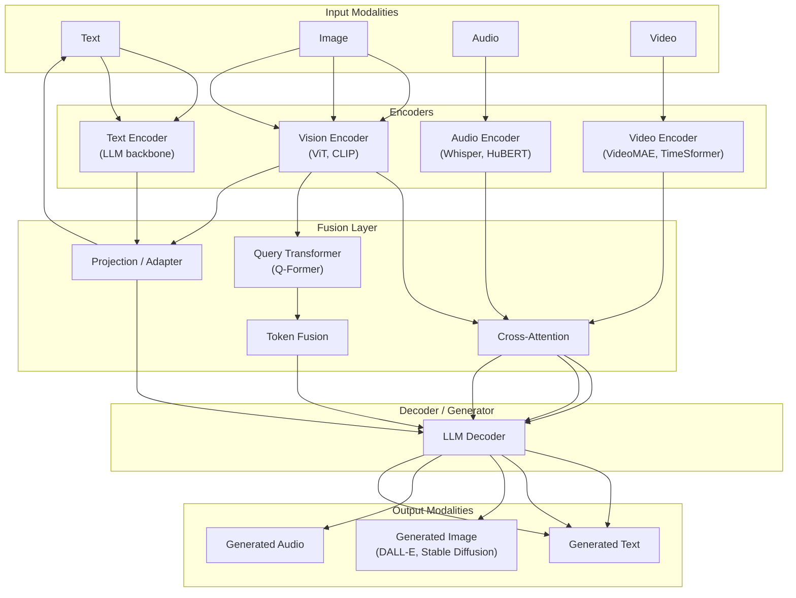

# Multimodal Models

> Multimodal models process and generate content across multiple data modalities — text, images, audio, video, and code. Models like GPT-4V, Gemini, LLaVA, and CLIP bridge the gap between understanding visual content and natural language, enabling applications from image captioning to video understanding.

## Architecture at a Glance



## What are Multimodal Models?

Multimodal models extend LLMs to understand and generate across multiple data types. They typically use modality-specific encoders (vision encoder for images, audio encoder for speech) connected to an LLM decoder via fusion layers. The key architectural challenge is aligning representations across modalities — ensuring the model understands that a "red apple" in text matches the same concept in an image.

## Multimodal Architecture Families

| Architecture | Fusion Approach | Example Models | Strengths |
|-------------|----------------|----------------|-----------|
| **Cross-Attention** | Modality encoders feed cross-attention layers in the LLM | Flamingo, LLaVA, GPT-4V | Strong understanding, good on VQA |
| **Q-Former** | Query Transformer bridges encoder and LLM | BLIP-2, InstructBLIP | Efficient, good image-to-text alignment |
| **Early Fusion** | Embed all modalities into a common token space | Gemini, GPT-4o | Native multi-turn with any modality |
| **Joint Embedding** | Contrastive learning on shared embedding space | CLIP, SigLIP | Excellent for retrieval, zero-shot classification |

## Key Models

| Model | Modalities | Key Innovation | Open Source |
|-------|-----------|----------------|-------------|
| **GPT-4V / GPT-4o** | Text + Image + Audio | Unified token space; real-time audio vision | No |
| **Gemini** | Text + Image + Audio + Video | Native multimodal from scratch | No |
| **Claude 3.5** | Text + Image | Vision understanding + document analysis | No |
| **LLaVA 1.6** | Text + Image | Simple CLIP + linear projection → LLM | Yes |
| **BLIP-2** | Text + Image | Q-Former bridges frozen encoders | Yes |
| **Flamingo** | Text + Image + Video | Gated cross-attention on frozen LLM | Yes |
| **ImageBind** | Text + Image + Audio + Depth + Thermal | Single embedding space for 6 modalities | Yes |

## Application: Image Captioning with LLaVA

```python
from transformers import LlavaProcessor, LlavaForConditionalGeneration
from PIL import Image
import torch

model = LlavaForConditionalGeneration.from_pretrained(
    "llava-hf/llava-1.5-7b-hf",
    torch_dtype=torch.float16,
    device_map="auto",
)
processor = LlavaProcessor.from_pretrained("llava-hf/llava-1.5-7b-hf")

image = Image.open("diagram.png")
prompt = "USER: <image>\nExplain this system architecture diagram.\nASSISTANT:"

inputs = processor(text=prompt, images=image, return_tensors="pt").to("cuda")
output = model.generate(**inputs, max_new_tokens=200)
print(processor.decode(output[0], skip_special_tokens=True))
```

## Application: Visual QA with Batch Processing

```python
def batch_visual_qa(images: list[Image.Image], question: str):
    """Answer a question across multiple images."""
    prompts = [f"USER: <image>\n{question}\nASSISTANT:" for _ in images]
    
    inputs = processor(
        text=prompts, images=images,
        return_tensors="pt", padding=True
    ).to("cuda")
    
    outputs = model.generate(
        **inputs,
        max_new_tokens=100,
        do_sample=False,
        num_beams=1,
    )
    
    return [
        processor.decode(out, skip_special_tokens=True)
        for out in outputs
    ]
```

## RAG with Multimodal Models

Multimodal RAG extends traditional RAG by retrieving both text and images:


## Video Understanding

For video, models process sampled frames rather than raw video:

```python
import cv2
from transformers import VideoLlavaProcessor, VideoLlavaForConditionalGeneration

# Sample 8 frames evenly from a video
cap = cv2.VideoCapture("demo.mp4")
total_frames = int(cap.get(cv2.CAP_PROP_FRAME_COUNT))
frame_indices = [int(i * total_frames / 8) for i in range(8)]

frames = []
for idx in frame_indices:
    cap.set(cv2.CAP_PROP_POS_FRAMES, idx)
    ret, frame = cap.read()
    if ret:
        frames.append(frame)
cap.release()

# Process with Video-LLaVA
prompt = "USER: <video>\nSummarize what happens in this video.\nASSISTANT:"
inputs = processor(text=prompt, videos=frames, return_tensors="pt").to("cuda")
output = model.generate(**inputs, max_new_tokens=200)
```

## Evaluation Metrics

| Task | Metric | What It Measures |
|------|--------|-----------------|
| Image captioning | CIDEr, SPICE, BLEU | Semantic alignment of caption to image |
| Visual QA | Accuracy, VQA score | Correct answer to visual question |
| Text-to-image | FID, CLIP score, Human eval | Image quality + text alignment |
| Visual grounding | IoU, Recall@K | Spatial understanding |
| Multimodal retrieval | Recall@K, mAP | Cross-modal ranking quality |

## Interview Questions

**Q1: How does GPT-4V process images? Does it use pixels or tokens?**
GPT-4V splits images into patches (roughly 256×256 pixel tiles), encodes each patch with a vision transformer, and projects the patch embeddings into the LLM's token embedding space. Each patch becomes a sequence of visual tokens in the transformer's context window. Higher-resolution images use more patches/tokens. The model can handle multiple images and interleaved text-image sequences.

**Q2: Design a system that lets users search a product catalog by uploading a photo of what they want.**
Use a multimodal embedder (CLIP/SigLIP) to encode both the uploaded photo and all product images into a shared embedding space. Store product embeddings in a vector DB (Pinecone, Weaviate). On query: embed the photo → nearest-neighbor search → return top-K products. Optionally: pass retrieved products to an LLM for explanation ("This looks like the 'Summit Hiking Boots' in brown").

**Q3: Your multimodal model confuses similar objects in images (e.g., wolf vs husky). How do you improve?**
1) Fine-tune the vision encoder on domain-specific labeled data, 2) Add LoRA adapters tuned on high-quality examples of the confusing pairs, 3) Use a multimodal RAG approach — retrieve visual exemplars of each class alongside the query image, 4) Ensemble with a specialized classifier for the confusing classes, 5) Collect more diverse training data for the under-represented class.

## Best Practices

- **Use CLIP/SigLIP for retrieval** — best open-source multimodal embedding; SigLIP is more efficient
- **Prefer Q-Former architectures for efficiency** — BLIP-2 quality with much less compute
- **Chunk video inputs** — process keyframes, not every frame; 1-2 fps is sufficient for most tasks
- **Align modalities before fusion** — modality gap causes hallucinations; projector layers are critical
- **Evaluate human preference** — automated metrics don't capture multimodal quality well
- **Consider latency** — vision encoders add 50-200ms per image; batch or cache where possible

## Real Company Usage

| Company | Multimodal Application |
|---------|----------------------|
| **Google** | Gemini — native multimodal for search (Lens), YouTube understanding, Maps AR |
| **OpenAI** | GPT-4V/4o — image analysis in ChatGPT, code from screenshots, document understanding in enterprise |
| **Meta** | LLaVA, ImageBind — content understanding across Facebook/Instagram; AR glasses scene understanding |
| **Shopify** | CLIP-based product search — "find products visually similar to this photo" in Shop app |