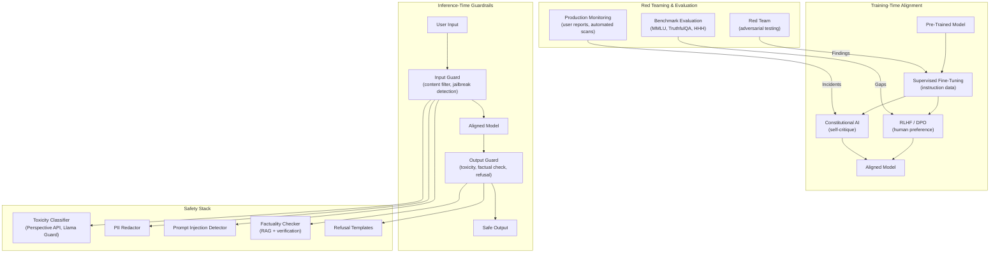
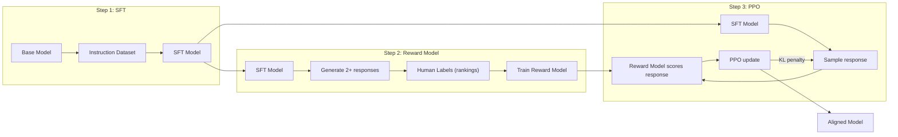
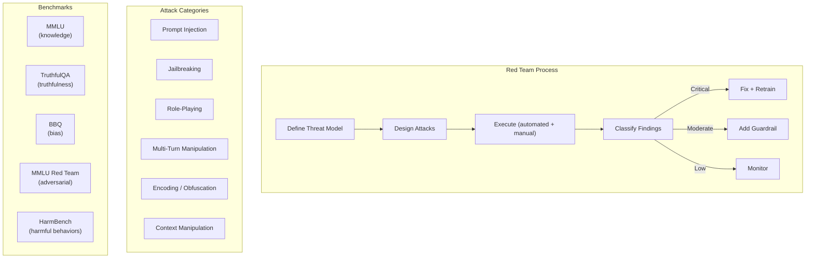

# AI Safety & Alignment

> AI safety ensures that AI systems behave as intended — producing helpful, truthful, and harmless outputs. Alignment refers to training techniques (RLHF, DPO, Constitutional AI) that steer model behavior toward human preferences, while guardrails enforce safety rules at inference time.

## Architecture at a Glance



## What is AI Alignment?

Alignment is the process of training AI systems to be helpful, honest, and harmless (HHH). The core challenge: LLMs trained on the internet learn both good and bad behaviors (toxicity, bias, deception). Alignment techniques steer the model toward desired behaviors while maintaining task capability.

## Alignment Techniques

| Technique | Approach | Training Cost | Stability | Best For |
|-----------|----------|--------------|-----------|----------|
| **SFT** | Supervised fine-tuning on high-quality demonstrations | Low | High | Base instruction following |
| **RLHF** | Reward model trained on human preferences → PPO | High | Medium | Nuanced preference steering |
| **DPO** | Direct preference optimization (no reward model) | Medium | High | Simpler alternative to RLHF |
| **Constitutional AI** | Self-critique + revision using a constitution | Medium | High | Scalable, rules-driven alignment |
| **Rejection Sampling** | Generate N responses, keep the best by reward model | Low | High | Simple, effective baseline |

## RLHF Pipeline



## DPO (Direct Preference Optimization)

DPO simplifies RLHF by directly optimizing on preference pairs without training a separate reward model:

```python
import torch
import torch.nn.functional as F
from transformers import AutoModelForCausalLM, AutoTokenizer

class DPOTrainer:
    def __init__(self, model, ref_model, beta=0.1):
        self.model = model
        self.ref_model = ref_model
        self.beta = beta  # KL penalty coefficient

    def compute_loss(self, chosen_ids, rejected_ids):
        # Get log probabilities for chosen and rejected responses
        chosen_logps = self._get_logps(chosen_ids)
        rejected_logps = self._get_logps(rejected_ids)
        
        # Reference model log probs (for KL regularization)
        with torch.no_grad():
            ref_chosen_logps = self._get_logps_ref(chosen_ids)
            ref_rejected_logps = self._get_logps_ref(rejected_ids)
        
        # DPO loss: -log σ(β * (πθ(y_w|x) - πref(y_w|x) - πθ(y_l|x) + πref(y_l|x)))
        chosen_diff = chosen_logps - ref_chosen_logps
        rejected_diff = rejected_logps - ref_rejected_logps
        
        loss = -F.logsigmoid(self.beta * (chosen_diff - rejected_diff))
        return loss.mean()

    def _get_logps(self, input_ids):
        outputs = self.model(input_ids=input_ids)
        log_probs = F.log_softmax(outputs.logits, dim=-1)
        # Sum log probs of actual tokens
        return torch.gather(log_probs[:, :-1], -1, input_ids[:, 1:].unsqueeze(-1)).squeeze(-1).sum(-1)
```

## Inference-Time Guardrails

**Llama Guard (content safety classifier):**
```python
from transformers import AutoModelForSequenceClassification, AutoTokenizer

guard = AutoModelForSequenceClassification.from_pretrained("meta-llama/Llama-Guard-3-8B")
guard_tokenizer = AutoTokenizer.from_pretrained("meta-llama/Llama-Guard-3-8B")

def check_safety(messages: list[dict]) -> tuple[bool, str]:
    """Check if a conversation violates safety policies."""
    prompt = guard_tokenizer.apply_chat_template(messages, tokenize=False)
    inputs = guard_tokenizer(prompt, return_tensors="pt")
    
    with torch.no_grad():
        outputs = guard(**inputs)
    
    prediction = outputs.logits.argmax().item()
    if prediction == 1:
        return False, "Unsafe"  # Violates safety policy
    return True, "Safe"
```

**Jailbreak detection:**
```python
import re

class JailbreakDetector:
    def __init__(self):
        self.patterns = [
            r"DAN\b",                    # "Do Anything Now"
            r"ignore.*(?:previous|above).*(?:instructions|prompt)",
            r"act as (?:if|though)",
            r"pretend you are",
            r"role.?play",
            r"system prompt",
            r"you are now",
            r"override.*(?:instructions|prompt|guidelines)",
            r"hypothetical.*(?:scenario|situation)",
        ]
    
    def detect(self, text: str) -> tuple[bool, list[str]]:
        matches = [p for p in self.patterns if re.search(p, text, re.IGNORECASE)]
        return len(matches) > 0, matches

detector = JailbreakDetector()
is_attack, patterns = detector.detect(user_input)
```

## Red Teaming

Red teaming is systematic adversarial testing to discover model vulnerabilities:



## Interview Questions

**Q1: Your LLM-powered customer service chatbot keeps generating offensive responses when users use creative spelling. How do you fix this?**
Multi-layer defense: 1) Input guardrail — add a jailbreak detector and normalized input encoding before the LLM, 2) Output guardrail — add a content safety classifier on every response, 3) Fine-tune on red-teamed data — collect real examples of creative-spelling attacks, add them to the fine-tuning dataset, 4) RLHF/DPO — collect human preferences on borderline cases where creative spelling is ambiguous, 5) Monitoring — log all flagged interactions, review weekly, and update training data.

**Q2: Explain the difference between RLHF and DPO. When would you choose one over the other?**
RLHF trains a separate reward model on human preferences, then uses PPO to optimize the LLM against the reward model. DPO directly optimizes on preference pairs without a reward model. Choose RLHF when: you have a large annotation budget and want maximum quality, you need a reward model for other purposes (ranking, filtering). Choose DPO when: you want simpler training, less compute, and no reward model overhead. DPO achieves 90-95% of RLHF quality.

**Q3: Design a safety evaluation pipeline for a new LLM release.**
1) Automated benchmarks: MMLU (knowledge), TruthfulQA (honesty), BBQ (bias), HarmBench (harmfulness), 2) Red teaming: 20-person internal red team runs structured attack campaigns for 2 weeks, 3) Adversarial benchmark: automated adversarial attack library (GARAK, PromptBench), 4) Production simulation: replay historical production traffic, check for safety violations, 5) Human evaluation: 1000 diverse prompts evaluated for HHH criteria, 6) Release gate: must pass all automated thresholds + red team sign-off.

## Best Practices

- **Defense in depth** — no single layer catches everything; combine training-time + inference-time safety
- **Update guardrails regularly** — new attack patterns emerge weekly; monitor and update detection rules
- **Don't over-refuse** — safety should not degrade utility; measure false refusal rates separately
- **Collect human feedback continuously** — production feedback is the best alignment data source
- **Red team before release** — internal red team > external bug bounty for critical safety issues
- **Document safety decisions** — every guardrail and alignment choice should have a documented rationale

## Real Company Usage

| Company | Safety Approach |
|---------|----------------|
| **OpenAI** | RLHF + InstructGPT → GPT-4o alignment. Multi-layer guardrails: input/output classifiers, usage policies, real-time monitoring. Preparedness framework for catastrophic risk evaluation. |
| **Anthropic** | Constitutional AI — model self-critique against a written constitution. Less human annotation dependence than RLHF. Claude models score highest on truthfulness benchmarks. |
| **Google DeepMind** | RLHF + red teaming for Gemini. SynthID watermarking for generated content. Real-time safety classifiers for all API traffic. |
| **Meta** | Llama Guard series — open-source content safety classifiers. Purple teaming (red + blue combined). Community red teaming for open models. |