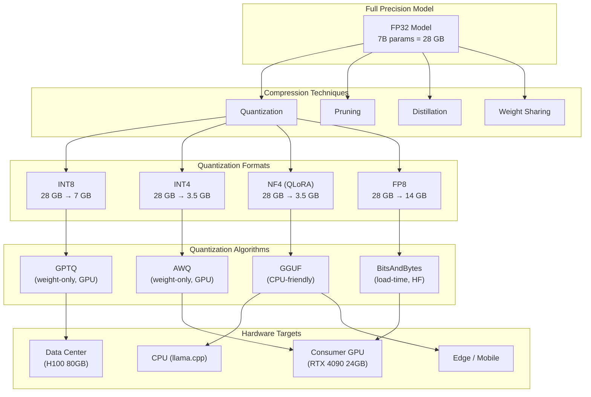

# Model Compression & Quantization

> Model compression reduces the size and inference cost of LLMs without catastrophic quality loss. Quantization, pruning, distillation, and weight-sharing techniques enable running 70B+ parameter models on consumer hardware — making LLM inference practical at scale.

## Architecture at a Glance



## What is Model Compression?

Model compression reduces the memory footprint and compute requirements of neural networks. For LLMs, the key techniques are quantization (reducing numerical precision), pruning (removing unimportant weights), distillation (training a smaller "student" model from a larger "teacher"), and architectural optimizations like KV-cache quantization.

## Quantization Datatypes

| Type | Bits | Memory (7B) | Memory (70B) | Quality Loss | Hardware |
|------|------|-------------|---------------|--------------|----------|
| FP32 | 32 | 28 GB | 280 GB | None | Any |
| FP16 / BF16 | 16 | 14 GB | 140 GB | None (training) | GPU |
| INT8 | 8 | 7 GB | 70 GB | Minimal | GPU / CPU |
| FP8 | 8 | 7 GB | 70 GB | Minimal (training) | H100/H200 |
| INT4 | 4 | 3.5 GB | 35 GB | Slight | GPU |
| NF4 | 4 | 3.5 GB | 35 GB | Minimal (normal) | GPU (QLoRA) |
| INT2 | 2 | 1.75 GB | 17.5 GB | Significant | Research |

## Quantization Algorithms

**GPTQ (GPU-optimized, weight-only):**
```python
from transformers import AutoModelForCausalLM, AutoTokenizer
from auto_gptq import AutoGPTQForCausalLM, BaseQuantizeConfig

# Quantize a model with GPTQ
quantize_config = BaseQuantizeConfig(
    bits=4,                  # 4-bit quantization
    group_size=128,          # Group size for quantization
    desc_act=True,           # Activate desc_act (gains 0.5-1% perplexity)
    damp_percent=0.1,        # Damping for numerical stability
)

model = AutoGPTQForCausalLM.from_pretrained(
    "meta-llama/Meta-Llama-3-8B",
    quantize_config,
    device_map="auto",
)

# Calibrate with a small dataset (128-256 samples)
model.quantize(
    tokenizer=tokenizer,
    calib_dataset=calibration_dataset,  # ~128 samples
)

# Save quantized model
model.save_quantized("./llama-3-8b-4bit-gptq")
```

**AWQ (Activation-aware Weight Quantization):**
```python
from awq import AutoAWQForCausalLM

model = AutoAWQForCausalLM.from_pretrained(
    "meta-llama/Meta-Llama-3-8B",
    device_map="auto",
)

# AWQ quantizes based on activation magnitude
# Important weights (high activation) kept at higher precision
model.quantize(
    tokenizer=tokenizer,
    quant_config={"zero_point": True, "q_group_size": 128, "w_bit": 4, "version": "GEMM"},
)

model.save_quantized("./llama-3-8b-4bit-awq")

# Inference
model = AutoAWQForCausalLM.from_quantized("./llama-3-8b-4bit-awq", fuse_layers=True)
```

**GGUF (CPU/edge-optimized):**
```bash
# Convert to GGUF format (for llama.cpp)
python convert.py model/ --outfile model.gguf --outtype q4_K_M

# Quantize to different levels
./quantize model.gguf model-q4_K_M.gguf q4_K_M
./quantize model.gguf model-q5_K_M.gguf q5_K_M
./quantize model.gguf model-q8_0.gguf q8_0
```

```python
# Inference with llama.cpp Python bindings
from llama_cpp import Llama

llm = Llama(
    model_path="./llama-3-8b-q4_K_M.gguf",
    n_ctx=8192,
    n_gpu_layers=-1,  # Offload all layers to GPU
    n_threads=8,
    verbose=False,
)

output = llm("Q: What is quantization?\nA:", max_tokens=100)
```

## Pruning

**Unstructured pruning (remove individual weights):**
- Reduces model size but requires sparse hardware support
- Typical sparsity: 30-50% without significant quality loss

**Structured pruning (remove attention heads / layers):**
- Direct performance improvement (faster + smaller)
- SliceBERT, LLM-Pruner — remove redundant layers (up to 25% removed with <1% quality loss)

**Pruning + Quantization combined:**
```
7B FP32 (28 GB)
  → 50% pruning (14 GB)
  → 4-bit quantization (1.75 GB)
  → Quality: ~95% of original
```

## Knowledge Distillation

```
Teacher Model (70B) ──→ Student Model (7B)
                         Trained to match teacher outputs
                         using soft labels (logits) + hard labels (ground truth)
```

Distillation loss: `L = α * KL(teacher_logits || student_logits) + (1-α) * CE(student_logits, labels)`

**When to use distillation:**
| Scenario | Recommendation |
|----------|---------------|
| Same architecture, smaller size | Structured pruning is more efficient |
| Different architecture | Distillation (e.g., LLaMA → Phi-2) |
| Maintaining specific capabilities | Distillation + task-specific fine-tuning |
| Maximum compression | Pruning + quantization + distillation |

## KV-Cache Quantization

KV-cache is the largest memory consumer during long-context inference:

| Context Length | KV Cache (FP16, 7B) | KV Cache (FP16, 70B) | KV Cache (INT8) |
|---------------|---------------------|---------------------|-----------------|
| 4K tokens | ~2 GB | ~20 GB | ~1 GB |
| 32K tokens | ~16 GB | ~160 GB | ~8 GB |
| 128K tokens | ~64 GB | ~640 GB | ~32 GB |

KIVI (KV-cache INT4 quantization): reduces KV-cache memory by 4x with <0.5% quality loss.

## Compression Strategy Decision Tree

```
Is latency critical?
├─ Yes → Is GPU available?
│  ├─ Yes → AWQ 4-bit (GPU-optimized)
│  └─ No → GGUF Q4_K_M (CPU-optimized)
└─ No → Is maximum quality required?
   ├─ Yes → FP16 with KV-cache INT8
   └─ No → GPTQ 4-bit (best quality/size trade-off)
```

## Interview Questions

**Q1: Your production LLM (70B) runs on A100 80GB GPUs, serving 4K tokens per request. How many concurrent requests per GPU can you handle?**
70B FP16 = 140 GB → needs 2x A100 80GB with tensor parallelism. KV-cache at 4K tokens = ~20 GB per request. With 2x A100 80GB = 160 GB total: 140 GB for weights, 20 GB for KV-cache per request. That's 0 requests — no space. Solution: quantize to INT4 (35 GB weights) + INT8 KV-cache (10 GB per request). Now: 35 GB weights + 10 GB KV-cache. Fits on one A100 with ~3 concurrent requests (35 + 3*10 + overhead ≈ 80 GB).

**Q2: Compare GPTQ vs AWQ vs GGUF for a production deployment on NVIDIA A100 GPUs.**
For A100s, GPTQ and AWQ are both GPU-optimized. AWQ typically wins: 0.3-0.5 perplexity better than GPTQ at 4-bit, same inference speed, better hardware utilization. GGUF is designed for CPU/edge — not optimal for A100. Recommendation: AWQ 4-bit with group_size=128 + KV-cache INT8.

**Q3: Your quantized model shows a quality drop on code generation tasks. How do you recover?**
1) Calibrate the quantization on code-specific data (not general text), 2) Use higher-bit quantization for specific layers (attention layers are more sensitive; keep at INT8), 3) Apply mixed-precision quantization (AWQ can keep important weights at higher precision), 4) Post-quantization fine-tuning with QLoRA to recover lost quality.

## Best Practices

- **Always calibrate on task-specific data** — quantization quality depends on calibration distribution
- **Evaluate before deploying** — perplexity is a proxy; measure task-specific metrics (accuracy, pass@k)
- **Mixed precision** — keep first/last layers at higher precision; they're more sensitive
- **KV-cache is the bottleneck** — for long-context, quantize KV-cache before weights
- **Benchmark on your hardware** — theoretical speedups don't always translate; measure throughput
- **Combine techniques** — pruning + quantization + distillation gives 10x+ compression

## Real Company Usage

| Company | Compression Strategy |
|---------|---------------------|
| **Anthropic** | Uses INT8/FP8 quantization for Claude API inference on TPUs; custom low-precision formats for their training infrastructure |
| **Google** | Gemini uses INT8 quantization for inference; TPU-native INT8 is 2x faster than FP16. Custom quantization-aware training |
| **Meta** | Llama models released in multiple quantized formats (AWQ, GPTQ, GGUF). Meta research on FP8 training and quantization |
| **Apple** | On-device LLMs use INT4 quantization + structured pruning. Apple Silicon's ANE supports low-precision matrix operations natively |
| **Microsoft** | BitsAndBytes library integrated into Transformers. Phi models optimized for INT4 on consumer hardware |