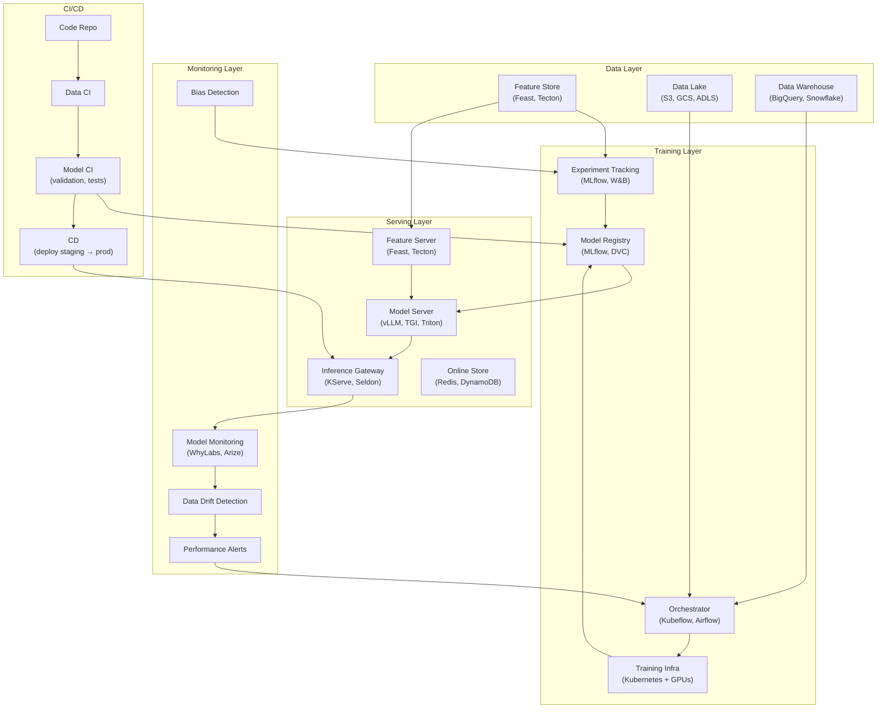

# MLOps & ML Platform

> MLOps (Machine Learning Operations) applies DevOps principles to machine learning — automating the lifecycle from data preparation and training through deployment, monitoring, and retraining. An ML platform standardizes tooling, infrastructure, and workflows across an organization's ML teams.

## Architecture at a Glance



## What is MLOps?

MLOps is the practice of applying CI/CD, automated testing, monitoring, and infrastructure management to ML systems. An ML platform provides shared services (feature store, model registry, experiment tracking, monitoring) so individual ML teams don't reinvent infrastructure for every model.

## Why MLOps Matters

Studies show 87% of ML projects never reach production. The #1 reason is infrastructure complexity — not model accuracy. MLOps addresses the operational gaps that kill ML projects:

- Data pipelines break silently → stale features → model degradation
- No experiment tracking → can't reproduce results → wasted effort
- Manual deployment → configuration drift → production failures
- No monitoring → models decay → undetected business impact

## ML Platform Components

| Component | Purpose | Tools |
|-----------|---------|-------|
| **Feature Store** | Centralized feature management, serving online & offline | Feast, Tecton, SageMaker Feature Store |
| **Experiment Tracker** | Log metrics, params, artifacts; compare runs | MLflow, Weights & Biases, Neptune |
| **Model Registry** | Version, approve, and deploy models | MLflow Model Registry, DVC, Hugging Face Hub |
| **Orchestrator** | Schedule and monitor ML pipelines | Kubeflow, Airflow, Prefect, Dagster |
| **Training Infrastructure** | GPU cluster management, scaling | K8s + GPUs, SageMaker, Vertex AI |
| **Inference Platform** | Model serving, scaling, A/B testing | KServe, Seldon Core, BentoML, vLLM |
| **Monitoring** | Data drift, model decay, bias detection | WhyLabs, Arize, Evidently, Fiddler |

## Feature Store (Feast)

```python
from feast import FeatureStore
import pandas as pd

# Offline feature retrieval (training)
store = FeatureStore(repo_path="./feature_repo")

# Get training data with point-in-time correctness
training_df = store.get_historical_features(
    entity_df=entity_df,  # User events with timestamps
    features=[
        "user_features:age_group",
        "user_features:signup_week",
        "transaction_features:avg_7d_spend",
        "transaction_features:num_7d_transactions",
    ],
).to_df()

# Online feature retrieval (inference)
feature_vector = store.get_online_features(
    features=[
        "user_features:age_group",
        "transaction_features:avg_7d_spend",
    ],
    entity_rows=[{"user_id": "user-123"}],
).to_dict()
```

## Experiment Tracking (MLflow)

```python
import mlflow
from sklearn.ensemble import RandomForestRegressor
from sklearn.metrics import mean_absolute_error

mlflow.set_experiment("price-prediction-v2")

with mlflow.start_run() as run:
    # Log parameters
    mlflow.log_params({
        "model_type": "RandomForest",
        "n_estimators": 500,
        "max_depth": 12,
        "feature_count": 45,
    })
    
    # Train model
    model = RandomForestRegressor(n_estimators=500, max_depth=12)
    model.fit(X_train, y_train)
    
    # Log metrics
    predictions = model.predict(X_test)
    mlflow.log_metrics({
        "mae": mean_absolute_error(y_test, predictions),
        "mse": mean_squared_error(y_test, predictions),
        "r2": r2_score(y_test, predictions),
    })
    
    # Log model (with signature and input example)
    mlflow.sklearn.log_model(
        model,
        "model",
        signature=mlflow.models.infer_signature(X_train, y_train),
        input_example=X_train.iloc[0:1],
    )
    
    # Log artifacts (feature importance plot, confusion matrix)
    mlflow.log_artifact("feature_importance.png")
    mlflow.log_artifact("confusion_matrix.png")
    
    # Register model in registry
    mlflow.register_model(
        f"runs:/{run.info.run_id}/model",
        "price-prediction-model"
    )
```

## Model Promotion Pipeline

```yaml
# CI/CD for ML models
name: Model Training and Promotion
on:
  schedule:
    - cron: '0 2 * * 0'  # Weekly retraining
  workflow_dispatch:       # Manual trigger

jobs:
  train:
    runs-on: [self-hosted, gpu]
    steps:
      - uses: actions/checkout@v4
      - name: Data Validation
        run: dbt test  # Validate feature quality
      - name: Train Model
        run: python train.py --experiment weekly-training
      - name: Model Validation
        run: |
          python validate.py \
            --min-mae 15.0 \
            --max-latency 100ms \
            --max-size 500MB
      - name: Promote to Staging
        if: success()
        run: |
          mlflow models stage \
            --model price-prediction-model \
            --version ${{ github.run_number }} \
            --stage Staging
      - name: Deploy Staging Canary
        run: |
          ksve apply -f deploy/staging.yaml
      - name: Smoke Tests
        run: python smoke_test.py --endpoint staging-canary
      - name: Promote to Production
        if: success()
        run: |
          mlflow models stage \
            --model price-prediction-model \
            --version ${{ github.run_number }} \
            --stage Production
      - name: Deploy Production
        run: |
          ksve apply -f deploy/production.yaml
```

## Model Monitoring

```python
from evidently.metrics import DataDriftTable, RegressionQualityMetric
from evidently.report import Report
import pandas as pd

# Detect data drift between reference (training) and current (production)
reference_data = pd.read_parquet("training_data.parquet")
current_data = load_production_batch()

drift_report = Report(metrics=[
    DataDriftTable(),
    RegressionQualityMetric(),
])

drift_report.run(reference_data=reference_data, current_data=current_data)
drift_report.save_html("drift_report.html")

# Check for significant drift (> 5% of features drifted)
drift_results = drift_report.as_dict()
drifted_features = [
    f["feature_name"] for f in drift_results["data_drift"]["data"]["drift_by_columns"]
    if f["drift_detected"]
]

if len(drifted_features) > 5:
    trigger_retraining_pipeline()
    send_alert(
        f"Data drift detected on {len(drifted_features)} features: {drifted_features[:5]}"
    )
```

## ML Platform Maturity Levels

| Level | Characteristics | Automation | Reliability |
|-------|----------------|------------|-------------|
| **0 — Manual** | Jupyter notebooks, manual data prep, no tracking | None | Low |
| **1 — DevOps** | Code in Git, basic CI, manual deployment | Test automation | Medium |
| **2 — Automated** | Feature store, experiment tracking, A/B testing | Pipelined training | High |
| **3 — Proactive** | Auto-retraining, drift detection, canary | Self-healing | Very High |
| **4 — Autonomous** | Auto-ML architecture search, self-optimizing | Full lifecycle automation | Maximum |

## Interview Questions

**Q1: Design an ML platform for a company with 10 ML teams building different types of models.**
Shared infrastructure: 1) Feature store (Feast) — centralized features reusable across teams, 2) Experiment tracker (MLflow) — shared instance for visibility and reproducibility, 3) GPU Kubernetes cluster with namespace quotas per team, 4) Model registry with staging → production promotion gates, 5) Inference platform (KServe) with auto-scaling and A/B testing, 6) Monitoring (Evidently + WhyLabs) across all production models. Each team manages their own code repo, training pipelines, and deployment config — but uses shared platform components.

**Q2: How do you handle data drift detection for a model that runs 1000 predictions/second?**
Sample predictions for monitoring: store 1% of inputs and predictions in a time-series DB (ClickHouse). Run drift detection every hour on a batch of 10K recent samples vs the training data distribution. Use statistical tests: PSI (Population Stability Index) for numerical features, Jenson-Shannon divergence for categorical. Alert if >5% of features show significant drift. Trigger auto-retraining if drift persists for 24 hours.

**Q3: Your feature store has a 50ms latency SLA for online serving. How do you meet this?**
Local caching on the inference host (Redis/memcached with TTL), pre-fetch features in batch before inference starts, use a CDN-like edge cache for read-heavy features, store frequently accessed features as model-side embeddings (pre-computed). Feast online store backed by Redis cluster for sub-10ms lookups. If latency is still an issue, embed features directly in the model as early features (computed at training time).

## Best Practices

- **Start with a feature store** — it's the most impactful platform investment for ML teams
- **Don't build a platform in year 1** — use managed services (SageMaker, Vertex AI, W&B) before investing in custom platform
- **Treat models as products** — each model needs an owner, SLAs, documentation, and retirement plan
- **Monitor everything** — data drift, model decay, prediction latency, feature freshness
- **Automate retraining** — but always validate with staging canary before full production deployment
- **Reproducibility is non-negotiable** — every model run should be reproducible from commit + dataset hash

## Real Company Usage

| Company | ML Platform |
|---------|-------------|
| **Uber** | Michelangelo — internal ML platform (feature store + training + deployment + monitoring) serving 1000s of models for pricing, ETA, fraud, and recommendations |
| **Netflix** | Metaflow + custom platform — Netflix uses Metaflow for experiment tracking and pipeline orchestration across 100+ ML use cases |
| **Doordash** | Feature store (Feast) + ML platform on Kubernetes — prediction time <10ms for delivery ETA and restaurant ranking models |
| **Airbnb** | Bighead — internal ML platform handling 1000+ models for search ranking, pricing, fraud detection, and guest communication |