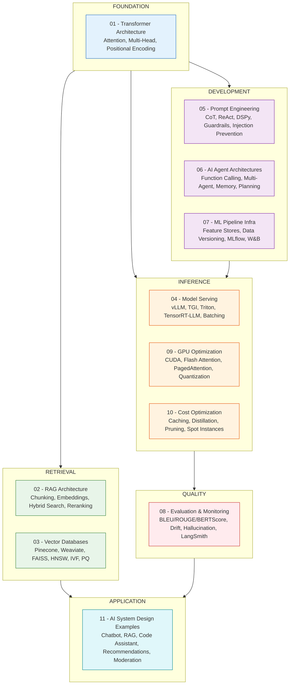

# 22 — AI/ML System Design

> Master the architecture, infrastructure, and patterns for building production-grade AI and machine learning systems — from transformer internals to cost-optimized serving at scale.

## Learning Path

### Phase 1: Foundation
1. **01 - Transformer Architecture** — Self-attention, multi-head attention, positional encoding, encoder-decoder vs decoder-only
2. **02 - RAG Architecture** — Retrieval-Augmented Generation, chunking strategies, hybrid search, reranking, multi-modal RAG
3. **03 - Vector Databases** — FAISS, Pinecone, Weaviate, HNSW, IVF, product quantization, indexing strategies

### Phase 2: Development & Training
4. **05 - Prompt Engineering at Scale** — Few-shot, CoT, ReAct, Tree-of-Thought, DSPy, guardrails, injection prevention
5. **06 - AI Agent Architectures** — Agent loops, tool use, function calling, multi-agent systems, memory, planning
6. **07 - ML Pipeline Infrastructure** — Feature stores (Feast, Tecton), data versioning (DVC, LakeFS), experiment tracking, model registry

### Phase 3: Deployment & Optimization
7. **04 - Model Serving Infrastructure** — vLLM, TGI, Triton, TensorRT-LLM, continuous batching, tensor parallelism
8. **09 - GPU Optimization** — CUDA, kernel fusion, Flash Attention, PagedAttention, speculative decoding
9. **10 - Cost Optimization** — Inference cost reduction, caching, distillation, LoRA, spot instances, quantization

### Phase 4: Quality & Production
10. **08 - Evaluation & Monitoring** — BLEU/ROUGE/METEOR, BERTScore, hallucination detection, drift, LangSmith, Weave
11. **11 - AI System Design Examples** — Chatbot, RAG pipeline, code assistant, recommendation system, content moderation

## Module Index

| # | File | Topics |
|---|---|---|
| 01 | [Transformer Architecture](01-transformer-architecture.md) | Attention, Multi-Head, Positional Encoding, GPT/LLaMA architecture |
| 02 | [RAG Architecture](02-rag-architecture.md) | Chunking, Embeddings, Hybrid Search, Reranking, RAG Fusion, Multi-Modal RAG |
| 03 | [Vector Databases](03-vector-databases.md) | Pinecone, Weaviate, Milvus, FAISS, Qdrant, HNSW, IVF, PQ |
| 04 | [Model Serving](04-model-serving.md) | vLLM, TGI, Triton, TensorRT-LLM, Continuous Batching, Quantization |
| 05 | [Prompt Engineering](05-prompt-engineering-patterns.md) | Few-Shot, CoT, ReAct, ToT, DSPy, Guardrails, Injection Prevention |
| 06 | [AI Agent Architectures](06-ai-agent-architectures.md) | Agent Loops, Tool Use, Multi-Agent, Memory, Planning, AutoGPT |
| 07 | [ML Pipeline Infra](07-ml-pipeline-infra.md) | Feature Stores, DVC, LakeFS, MLflow, W&B, Model Registry |
| 08 | [Evaluation & Monitoring](08-model-evaluation-monitoring.md) | BLEU, ROUGE, BERTScore, LLM-as-Judge, Drift, LangSmith |
| 09 | [GPU Optimization](09-gpu-optimization.md) | CUDA, Flash Attention, PagedAttention, Speculative Decoding |
| 10 | [Cost Optimization](10-cost-optimization.md) | Caching, Distillation, LoRA, Pruning, Quantization, Spot Instances |
| 11 | [System Design Examples](11-ai-system-design-examples.md) | Chatbot, RAG, Code Assistant, Recommendations, Moderation |

## Key Technologies Covered

- **Inference Engines**: vLLM, TGI (Text Generation Inference), Triton Inference Server, TensorRT-LLM, ONNX Runtime
- **Vector Databases**: FAISS, Pinecone, Weaviate, Milvus, Qdrant
- **Feature Stores**: Feast, Tecton
- **Experiment Tracking**: MLflow, Weights & Biases, LangSmith, Weave
- **Quantization**: GPTQ, AWQ, bitsandbytes (NF4), INT8, FP8
- **Training**: Distributed training, LoRA, QLoRA, DeepSpeed, FSDP
- **Orchestration**: Ray, Kubernetes, Docker, Airflow

## Prerequisites

- Basic understanding of neural networks and deep learning
- Familiarity with Python and common ML libraries (PyTorch, Transformers)
- Understanding of system design fundamentals (load balancing, caching, databases)
- Basic knowledge of cloud computing (AWS/GCP/Azure)

---

Previous: [21 — Staff Engineer](../21-Staff-Engineer/README.md)
Next: [23 — API Design](../23-API-Design/README.md)
