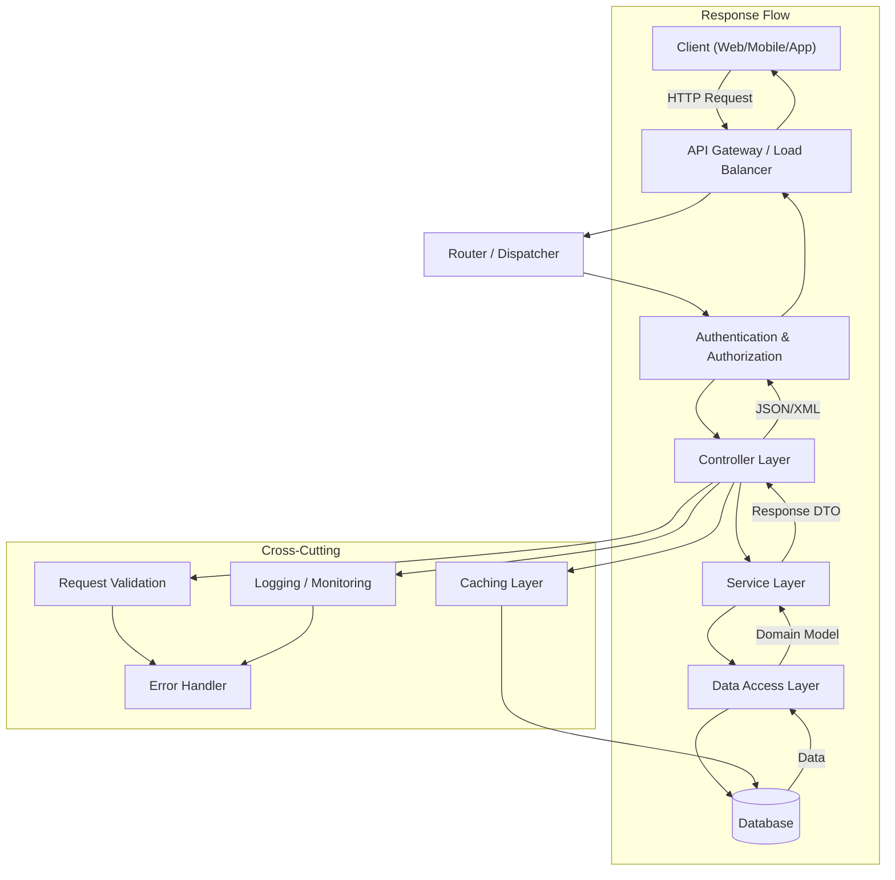

# RESTful API Design

> Representational State Transfer (REST) is an architectural style for designing networked applications. It relies on stateless, client-server communication — typically over HTTP — where resources are manipulated through well-defined operations.

## Architecture at a Glance



## What is REST?

REST (Representational State Transfer) is an architectural style introduced by Roy Fielding in his 2000 doctoral dissertation. It defines six constraints that, when applied, create scalable, performant, and evolvable web services:

- **Uniform Interface** — resources identified in requests, resource manipulation through representations, self-descriptive messages, HATEOAS
- **Stateless** — each request contains all information needed to process it; no client context stored server-side between requests
- **Cacheable** — responses must implicitly or explicitly define themselves as cacheable or non-cacheable
- **Client-Server** — separation of concerns: clients are not concerned with data storage, servers not concerned with UI
- **Layered System** — intermediaries (proxies, gateways, load balancers) can be inserted between client and server
- **Code on Demand (optional)** — servers can extend client functionality by transferring executable code

## Why REST Was Created

Before REST, SOAP (Simple Object Access Protocol) dominated. SOAP was complex, XML-heavy, tightly coupled to WSDL definitions, and often required extensive tooling. REST offered:

- Simplicity — plain HTTP, no special middleware needed
- Scalability — statelessness enables horizontal scaling
- Visibility — HTTP verbs and status codes are universally understood
- Evolvability — loose coupling between client and server
- Performance — caching at HTTP level, lightweight payloads (JSON vs XML)

## When to Use REST

| Use Case | REST Fit |
|----------|----------|
| CRUD-heavy applications | Excellent |
| Public APIs / third-party integrations | Excellent |
| Mobile backends | Good (cacheable, simple) |
| Real-time, low-latency (gaming, streaming) | Poor — prefer WebSocket or gRPC |
| Complex nested queries (multiple resources) | Moderate — multiple roundtrips |
| High-throughput internal microservices | Moderate — gRPC often better |

## Resource Modeling

### Core Principle: Nouns, Not Verbs

Resources are the key abstraction in REST. They represent business entities, not actions.

```
Good:   GET /users / POST /users / DELETE /users/{id}
Bad:    GET /getUsers / POST /createUser / POST /deleteUser?id=1
```

### Resource Hierarchy

```
API Root
├── /users                    Collection resource
│   ├── /users/{id}           Singleton resource
│   ├── /users/{id}/posts     Sub-collection
│   └── /users/{id}/posts/{postId}
├── /posts
│   ├── /posts/{id}
│   └── /posts/{id}/comments
└── /search                   Controller (verb allowed for search)
```

### Resource Representations

```json
{
  "id": "usr_abc123",
  "type": "user",
  "attributes": {
    "name": "Alice Johnson",
    "email": "alice@example.com",
    "createdAt": "2025-01-15T10:30:00Z"
  },
  "relationships": {
    "posts": {
      "links": {
        "self": "/users/usr_abc123/relationships/posts",
        "related": "/users/usr_abc123/posts"
      }
    }
  },
  "links": {
    "self": "/users/usr_abc123"
  }
}
```

## HTTP Methods

| Method | CRUD | Idempotent | Safe | Cacheable |
|--------|------|------------|------|-----------|
| GET | Read | Yes | Yes | Yes |
| POST | Create | No | No | Conditional |
| PUT | Replace | Yes | No | No |
| PATCH | Partial Update | No | No | No |
| DELETE | Delete | Yes | No | No |
| HEAD | Headers only | Yes | Yes | Yes |
| OPTIONS | Allowed methods | Yes | Yes | No |

### Method Semantics in Detail

**GET** — Retrieve a resource representation
```http
GET /users/usr_abc123 HTTP/1.1
Accept: application/json
```
- Must not have side effects
- Can return 200 (full representation) or 304 (Not Modified with caching)

**POST** — Create a resource or trigger an action
```http
POST /users HTTP/1.1
Content-Type: application/json

{
  "name": "Bob Smith",
  "email": "bob@example.com"
}
```
- Returns 201 Created with Location header
- Not idempotent — multiple POSTs create multiple resources

**PUT** — Full replacement of a resource
```http
PUT /users/usr_abc123 HTTP/1.1
Content-Type: application/json

{
  "name": "Alice Johnson",
  "email": "alice.j@example.com"
}
```
- Idempotent — same PUT request produces same result
- Returns 200 (updated) or 201 (created at known URL)

**PATCH** — Partial modification
```http
PATCH /users/usr_abc123 HTTP/1.1
Content-Type: application/json

{
  "email": "alice.new@example.com"
}
```
- Use JSON Patch (RFC 6902) or JSON Merge Patch (RFC 7386)
- Not idempotent by default

**DELETE** — Remove a resource
```http
DELETE /users/usr_abc123 HTTP/1.1
```
- Returns 204 No Content on success
- Subsequent DELETEs return 404 (but method is idempotent)

## HTTP Status Codes

### 2xx Success
| Code | Meaning | When |
|------|---------|------|
| 200 OK | Success | GET, PUT, PATCH successful |
| 201 Created | Resource created | POST, PUT |
| 202 Accepted | Accepted for processing | Async operations |
| 204 No Content | Success, no body | DELETE, PUT |

### 3xx Redirection
| Code | Meaning | When |
|------|---------|------|
| 301 Moved Permanently | Resource moved | API migration |
| 304 Not Modified | Use cached version | Conditional GET |
| 307 Temporary Redirect | Temporary location | Load shedding |

### 4xx Client Error
| Code | Meaning | When |
|------|---------|------|
| 400 Bad Request | Malformed syntax | Validation failure |
| 401 Unauthorized | Missing/invalid auth | No token/wrong token |
| 403 Forbidden | Authenticated but denied | Insufficient permissions |
| 404 Not Found | Resource does not exist | Wrong URL or deleted |
| 405 Method Not Allowed | Wrong HTTP method | DELETE on read-only |
| 409 Conflict | State conflict | Duplicate create, stale version |
| 410 Gone | Resource permanently gone | Deletion with history |
| 422 Unprocessable Entity | Semantic error | Valid syntax, invalid semantics |
| 429 Too Many Requests | Rate limit exceeded | Back off |

### 5xx Server Error
| Code | Meaning | When |
|------|---------|------|
| 500 Internal Server Error | Generic error | Unexpected exception |
| 502 Bad Gateway | Upstream invalid response | Proxy/gateway error |
| 503 Service Unavailable | Temporary overload | Maintenance, throttling |
| 504 Gateway Timeout | Upstream timed out | Downstream dependency slow |

## URL Design Conventions

```
https://api.example.com/v2/users?page=1&per_page=20&sort=-created_at&filter[status]=active
|________||______________||_||_||_____________________________||_________________________|
  Scheme       Host        Ver Resource      Pagination                 Filtering & Sort
```

### Plural Nouns
```
/users          ✓
/user           ✗
```

### Lowercase with Hyphens
```
/user-profiles  ✓
/userProfiles   ✗
/user_profiles  ✗
```

### No File Extensions
```
/users/123      ✓
/users/123.json ✗
```

### Query for Filtering, Path for Identity
```
GET /users?role=admin&status=active   Filtering via query params
GET /users/123                         Identity via path param
```

### Controllers (Actions) When Necessary
```
POST /users/123/activate               RPC-style action
POST /emails/send                      Send email action
```

## Pagination

### Cursor-Based Pagination

Best for real-time feeds, infinite scroll, and large datasets:

```http
GET /posts?cursor=eyJpZCI6IjEyMyJ9&limit=20 HTTP/1.1
```

```json
{
  "data": [...],
  "meta": {
    "cursor": "eyJpZCI6IjEyMyJ9",
    "next_cursor": "eyJpZCI6IjE0NSJ9",
    "has_more": true,
    "limit": 20
  }
}
```

**Pros:** Stable across data changes, no page drift, efficient on large data
**Cons:** Cannot jump to arbitrary pages, more complex implementation

### Offset-Based Pagination

Best for UI tables, page number navigation:

```http
GET /users?page=3&per_page=20 HTTP/1.1
```

```json
{
  "data": [...],
  "meta": {
    "page": 3,
    "per_page": 20,
    "total": 156,
    "total_pages": 8
  }
}
```

**Pros:** Simple, allows page jumping, reflects total count
**Cons:** Page drift (items inserted/deleted), inefficient on large offsets

### Pagination Best Practices

- Use cursor-based for dynamic data (feeds, logs, messages)
- Use offset-based for stable, admin-type interfaces
- Default limit of 20-50, enforce maximum (e.g., 1000)
- Return metadata in the response body
- Consider `Link` header for page relations (RFC 5988)

## Filtering and Sorting

### Filtering by Field

```http
GET /users?status=active&role=admin
GET /products?price[gte]=10&price[lte]=100
GET /orders?created_at[gt]=2025-01-01&created_at[lt]=2025-06-01
```

### Multiple Values

```http
GET /users?status[]=active&status[]=pending
GET /users?status=active,pending
```

### Sorting

```http
GET /users?sort=name                        Ascending by name
GET /users?sort=-created_at                 Descending by created_at
GET /users?sort=-created_at,name            Multi-field sort
```

## Idempotency

Idempotency ensures that multiple identical requests produce the same result as a single request.

### Idempotency Key Pattern

```http
POST /payments HTTP/1.1
Idempotency-Key: 7a8b9c0d-1e2f-3a4b-5c6d-7e8f9a0b1c2d
Content-Type: application/json

{
  "amount": 1000,
  "currency": "USD",
  "source": "tok_visa"
}
```

```json
{
  "id": "pay_abc123",
  "status": "succeeded",
  "idempotency_key": "7a8b9c0d-1e2f-3a4b-5c6d-7e8f9a0b1c2d"
}
```

**Implementation:**
1. Client generates a UUID and sends it as the `Idempotency-Key` header
2. Server checks if key was already processed — if yes, return cached response
3. If no, process and cache the response for a window (e.g., 24 hours)
4. Use a lock (Redis lock) to prevent concurrent processing of same key

## HATEOAS (Hypermedia as the Engine of Application State)

HATEOAS enables API discoverability by including links in responses:

```json
{
  "id": "usr_abc123",
  "name": "Alice Johnson",
  "_links": {
    "self": { "href": "/users/usr_abc123" },
    "posts": { "href": "/users/usr_abc123/posts" },
    "friends": { "href": "/users/usr_abc123/friends" },
    "avatar": { "href": "/avatars/usr_abc123.png", "type": "image/png" }
  },
  "_actions": {
    "delete": {
      "href": "/users/usr_abc123",
      "method": "DELETE"
    },
    "update": {
      "href": "/users/usr_abc123",
      "method": "PUT",
      "fields": ["name", "email"]
    }
  }
}
```

## Error Handling Standards

### Consistent Error Format (RFC 7807 Problem Details)

```http
HTTP/1.1 422 Unprocessable Entity
Content-Type: application/problem+json

{
  "type": "https://api.example.com/errors/validation-error",
  "title": "Validation Error",
  "status": 422,
  "detail": "The request body contains invalid fields.",
  "instance": "/users",
  "errors": [
    {
      "field": "email",
      "message": "Email must be a valid email address",
      "code": "INVALID_EMAIL"
    },
    {
      "field": "age",
      "message": "Age must be between 0 and 150",
      "code": "OUT_OF_RANGE",
      "value": 200
    }
  ],
  "trace_id": "abc-123-def-456"
}
```

### Error Response Guidelines

- Use consistent structure across all endpoints
- Include a unique error/trace ID for debugging
- Return actionable error messages
- Never expose stack traces in production
- Distinguish between client (4xx) and server (5xx) errors
- Use appropriate HTTP status codes, not 200 for all responses

## Best Practices

- **Use TLS everywhere** — no exception; encrypt all traffic
- **Version your API** — even if using URI versioning (v1, v2) or headers
- **Use JSON as default** — support XML or other formats via content negotiation
- **Enable compression** — gzip/brotli response compression
- **Rate limit** — protect against abuse and misconfiguration
- **Optimistic locking** — use ETags and If-Match to prevent lost updates
- **Request IDs** — generate a unique ID for every request for tracing
- **CORS configuration** — explicitly allow only trusted origins
- **Minimize payload** — use sparse fieldsets (`?fields=id,name,email`)
- **Provide SDKs** — SDKs (client libraries) reduce integration friction

## Interview Questions

1. What are the six REST constraints? Explain each briefly.
2. When would you use PUT vs PATCH? What are the idempotency implications?
3. Explain cursor-based vs offset-based pagination. When would you choose each?
4. What is HATEOAS and when is it beneficial?
5. How do you handle concurrent modifications to the same resource (race conditions)?
6. Design a REST API for a flight booking system covering search, booking, cancellation.
7. What is the difference between 401 Unauthorized and 403 Forbidden?
8. How do you implement idempotency for payment APIs? What happens if the idempotency key expires?
9. How would you design an API that supports both REST and real-time updates?
10. Describe a REST API versioning strategy that avoids breaking existing clients.

## Real Company Usage

| Company | API | Notes |
|---------|-----|-------|
| **Stripe** | /v1/charges, /v1/customers | Industry gold standard; cursor pagination, idempotency keys, webhooks |
| **GitHub** | /repos/{owner}/{repo}/issues | Offset pagination with Link header; extensive filtering |
| **Twitter/X** | /2/tweets | Cursor pagination (next_token); rate limits per endpoint |
| **Twilio** | /2010-04-01/Accounts/{sid}/Messages | Date-based URI versioning; comprehensive error docs |
| **Atlassian** | /rest/api/3/issue/{issueId} | Jira REST API; complex filtering with JQL |
| **Google** | /v1/{parent=projects/*/locations/*}/datasets | Nested resource design; AIP naming conventions |
