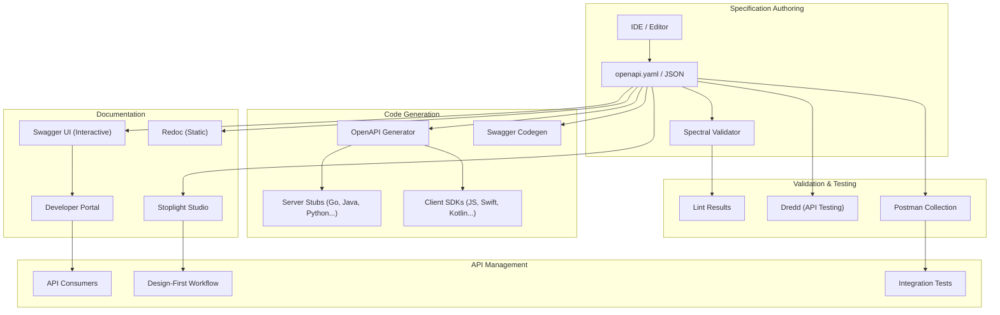

# OpenAPI Specification

> The OpenAPI Specification (formerly Swagger Specification) is a standard, language-agnostic interface for describing HTTP APIs. It enables both humans and computers to understand API capabilities without requiring source code or documentation inspection.

## Architecture at a Glance



## What is OpenAPI?

OpenAPI is a specification for describing RESTful APIs using a structured, machine-readable format (YAML or JSON). It defines endpoints, request/response schemas, authentication methods, parameters, and more. The specification is vendor-neutral and governed by the OpenAPI Initiative under the Linux Foundation.

## Why OpenAPI Was Created

Before OpenAPI, APIs were documented inconsistently — internal wikis, PDFs, informal READMEs, or nothing at all. Swagger (the original name, created by Tony Tam in 2011) introduced a standard way to describe APIs. In 2015, Swagger was donated to the OpenAPI Initiative and renamed OpenAPI. Key drivers:

- **Documentation** — auto-generated, interactive docs (Swagger UI)
- **Consistency** — a single source of truth for API behavior
- **Automation** — code generation, testing, validation from the spec
- **Tooling Ecosystem** — hundreds of tools built around the spec
- **Contract-First** — design APIs before writing code

## When to Use OpenAPI

| Scenario | Recommendation |
|----------|---------------|
| Public REST APIs | Always use OpenAPI |
| Internal microservices | Strongly recommended |
| Contract-first development | Essential |
| API-first organizations | Required |
| gRPC/protobuf APIs | Use protobuf directly |
| GraphQL APIs | Use SDL (Schema Definition Language) |

## OpenAPI 3.1

OpenAPI 3.1, released in 2021, aligns with JSON Schema 2020-12. Key improvements over 3.0:

- Full JSON Schema compatibility (no more OpenAPI-specific schema extensions)
- Webhook support (`webhooks` field)
- Improved security scheme definitions
- Sum types (`oneOf`, `anyOf`, `allOf`) now follow JSON Schema semantics
- `examples` field replaces `example` for multiple examples
- `discriminator` improvements for polymorphic schemas

## OpenAPI Document Structure

```yaml
openapi: "3.1.0"
info:
  title: Payment Processing API
  description: RESTful API for payment processing
  version: "2.1.0"
  contact:
    name: API Support
    email: support@example.com
    url: https://api.example.com/support
  license:
    name: Apache 2.0
    url: https://www.apache.org/licenses/LICENSE-2.0

servers:
  - url: https://api.example.com/v2
    description: Production server
  - url: https://sandbox.api.example.com/v2
    description: Sandbox environment

security:
  - BearerAuth: []

paths:
  /payments:
    get:
      summary: List payments
      description: Returns a paginated list of payments
      operationId: listPayments
      parameters:
        - name: limit
          in: query
          required: false
          schema: { type: integer, minimum: 1, maximum: 100, default: 20 }
      responses:
        "200":
          description: Successful response

components:
  securitySchemes:
    BearerAuth:
      type: http
      scheme: bearer
      bearerFormat: JWT

webhooks:
  payment.completed:
    post:
      summary: Payment completed webhook
      requestBody:
        required: true
        content:
          application/json:
            schema:
              $ref: "#/components/schemas/WebhookPayload"
```

## Path and Parameter Objects

### Path Item Object

```yaml
paths:
  /users/{userId}:
    parameters:
      - name: userId
        in: path
        required: true
        schema: { type: string, pattern: "^usr_" }

    get:
      tags: [Users]
      summary: Get user by ID
      operationId: getUser
      parameters:
        - name: include
          in: query
          description: Related resources to include
          schema:
            type: array
            items: { type: string }
            style: form
            explode: false
      responses:
        "200":
          description: User found
          content:
            application/json:
              schema:
                $ref: "#/components/schemas/User"
        "404":
          $ref: "#/components/responses/NotFound"

    patch:
      tags: [Users]
      summary: Partial update user
      requestBody:
        required: true
        content:
          application/json:
            schema:
              $ref: "#/components/schemas/UserUpdate"
```

## Schema Objects

### Reusable Schemas with $ref

```yaml
components:
  schemas:
    User:
      type: object
      required: [id, name, email]
      properties:
        id:
          type: string
          pattern: "^usr_"
          example: "usr_abc123"
        name:
          type: string
          minLength: 1
          maxLength: 128
        email:
          type: string
          format: email
        status:
          type: string
          enum: [active, inactive, suspended]
        roles:
          type: array
          items:
            $ref: "#/components/schemas/Role"
        createdAt:
          type: string
          format: date-time

    Role:
      type: string
      enum: [admin, editor, viewer]

    UserUpdate:
      type: object
      properties:
        name: { type: string, minLength: 1 }
        email: { type: string, format: email }

    Payment:
      type: object
      required: [id, amount, currency, status]
      properties:
        id: { type: string }
        amount: { type: integer, minimum: 1, maximum: 99999999 }
        currency: { type: string, pattern: "^[A-Z]{3}$" }
        status:
          type: string
          enum: [pending, processing, succeeded, failed, refunded]
        metadata:
          type: object
          additionalProperties: { type: string }
        createdAt: { type: string, format: date-time }
```

### Polymorphism with Discriminator

```yaml
components:
  schemas:
    Pet:
      type: object
      discriminator:
        propertyName: petType
        mapping:
          dog: Dog
          cat: Cat
      required: [petType]
      properties:
        petType: { type: string }

    Dog:
      allOf:
        - $ref: "#/components/schemas/Pet"
        - type: object
          properties:
            barkVolume: { type: integer }

    Cat:
      allOf:
        - $ref: "#/components/schemas/Pet"
        - type: object
          properties:
            huntingSkill: { type: string, enum: [lazy, active] }
```

## Response Modeling

```yaml
paths:
  /payments/{paymentId}:
    get:
      operationId: getPayment
      responses:
        "200":
          description: Payment object
          content:
            application/json:
              schema:
                $ref: "#/components/schemas/Payment"
            application/vnd.api+json:
              schema:
                $ref: "#/components/schemas/Payment"
        "401":
          $ref: "#/components/responses/Unauthorized"
        "404":
          $ref: "#/components/responses/NotFound"
        "429":
          $ref: "#/components/responses/RateLimited"
        default:
          $ref: "#/components/responses/UnexpectedError"

components:
  responses:
    NotFound:
      description: Resource not found
      content:
        application/problem+json:
          schema:
            type: object
            properties:
              type: { type: string }
              title: { type: string }
              status: { type: integer }
              detail: { type: string }
    Unauthorized:
      description: Authentication required
      headers:
        WWW-Authenticate:
          schema: { type: string }
    RateLimited:
      description: Too many requests
      headers:
        Retry-After:
          schema: { type: integer }
```

## Code Generation

### OpenAPI Generator

OpenAPI Generator is the most widely used tool for generating API client libraries, server stubs, and documentation from OpenAPI specs.

```bash
# Generate a Python client
npx @openapitools/openapi-generator-cli generate \
  -i openapi.yaml \
  -g python \
  -o /tmp/python-client

# Generate a Go server stub
npx @openapitools/openapi-generator-cli generate \
  -i openapi.yaml \
  -g go-server \
  -o /tmp/go-server

# Generate TypeScript axios client
npx @openapitools/openapi-generator-cli generate \
  -i openapi.yaml \
  -g typescript-axios \
  -o /tmp/ts-client
```

### Swagger Codegen

The original code generation tool (now maintained under OpenAPI Generator fork):

```bash
# Generate Java Spring Boot server
java -jar swagger-codegen-cli.jar generate \
  -i openapi.yaml \
  -l spring \
  -o /tmp/spring-server

# Generate Swift client
java -jar swagger-codegen-cli.jar generate \
  -i openapi.yaml \
  -l swift5 \
  -o /tmp/swift-client
```

## Documentation Tools

### Swagger UI

The most popular interactive API documentation viewer:

```bash
# Run with Docker
docker run -p 80:8080 \
  -e SWAGGER_JSON=/spec/openapi.yaml \
  -v $(pwd)/openapi.yaml:/spec/openapi.yaml \
  swaggerapi/swagger-ui

# Via npm module
npm install swagger-ui-express
```

```javascript
const swaggerUi = require("swagger-ui-express");
const YAML = require("yamljs");
const swaggerDocument = YAML.load("./openapi.yaml");

app.use("/api-docs", swaggerUi.serve, swaggerUi.setup(swaggerDocument));
```

### Redoc

Redoc generates beautiful, static API documentation:

```bash
docker run -p 80:80 \
  -e SPEC_URL=/spec/openapi.yaml \
  -v $(pwd)/openapi.yaml:/usr/share/nginx/html/spec/openapi.yaml \
  redocly/redoc

# CLI generation
npx redoc-cli bundle openapi.yaml -o docs/api.html
```

### Stoplight

Stoplight provides a visual API design platform with collaborative editing, mocking, and documentation:

- Stoplight Studio — visual OpenAPI editor
- Stoplight Prism — API mock server
- Stoplight Documentation — hosted docs with try-it-out

```bash
# Run Prism mock server
npx @stoplight/prism-cli mock openapi.yaml

# Validate with Spectral
npx @stoplight/spectral lint openapi.yaml
```

## Validation Tools

### Spectral

Spectral is an API linting tool that enforces rules against OpenAPI specs:

```bash
npm install -g @stoplight/spectral

spectral lint openapi.yaml

# Custom rules file: .spectral.yaml
```

```yaml
# .spectral.yaml
extends: ["spectral:oas"]
rules:
  operation-success-response:
    given: $.paths[*][get,post,put,patch,delete]
    then:
      field: responses
      function: truthy
  my-custom-rule:
    message: "Operation IDs must be camelCase"
    given: $.paths[*][*].operationId
    then:
      function: pattern
      functionOptions:
        match: "^[a-z][a-zA-Z0-9]+$"
```

### Other Validation Tools

```bash
# OpenAPI CLI Validator
npx @apidevtools/swagger-cli validate openapi.yaml

# Vacuum (Rust-based, fast)
vacuum lint openapi.yaml

# Prism validation
npx @stoplight/prism-cli validate openapi.yaml
```

## Pricing Model / Cost Considerations

| Tool | Pricing |
|------|---------|
| OpenAPI Generator | Free, open-source |
| Swagger UI | Free, open-source |
| Redoc (open-source) | Free |
| Redoc (Redocly Platform) | Free tier + Team ($15/mo) + Enterprise |
| Stoplight Studio | Free tier + Team ($99/mo/user) + Enterprise |
| Spectral | Free, open-source |
| SwaggerHub | Free tier + Team ($99/mo) + Enterprise |
| Postman | Free tier + Team ($14/mo/user) + Enterprise ($24/mo/user) |

## Best Practices

- **Contract-first** — design the OpenAPI spec before writing implementation code
- **Use consistent naming** — camelCase for properties, PascalCase for schema names
- **Define reusable components** — avoid duplication with `$ref`
- **Include examples** — every schema should have at least one example
- **Use operationId** — unique, meaningful operation IDs for code generation
- **Version the spec** — match API version; maintain separate spec files per version
- **Validate in CI** — run Spectral linting in CI pipeline
- **Use problem+json for errors** — consistent error format across all endpoints
- **Document auth** — clearly specify security schemes per endpoint
- **Limit schema complexity** — avoid deeply nested objects (max 5 levels)
- **Use openapi-tools** — for breaking change detection between spec versions

## Interview Questions

1. What is the difference between OpenAPI 3.0 and 3.1?
2. Explain the `discriminator` field and when you would use it.
3. How do you model a polymorphic response in OpenAPI?
4. What is the difference between `allOf`, `oneOf`, and `anyOf`?
5. How would you version an OpenAPI specification?
6. Describe a CI pipeline that validates OpenAPI specs and generates documentation.
7. What are the advantages and disadvantages of contract-first vs code-first API development?
8. How does OpenAPI handle authentication (OAuth2, API keys, JWT)?
9. What is the purpose of `$ref` and how does JSON Reference resolution work?
10. How do you detect breaking changes between two versions of an OpenAPI spec?

## Real Company Usage

| Company | Usage |
|---------|-------|
| **Stripe** | OpenAPI-based spec for all API versions; public SDKs generated from spec |
| **Google** | uses Discovery Document format (similar principles); API endpoints auto-documented |
| **Twilio** | OpenAPI specs for all services; auto-generated client libraries |
| **GitHub** | OpenAPI 3.0 spec published publicly; community-contributed SDKs |
| **Microsoft** | OpenAPI for Azure services; code generation for .NET, Python, Java |
| **AWS** | uses Smithy (internal) + OpenAPI for select services; API Gateway OpenAPI import |
| **Spotify** | OpenAPI spec for Web API; developer portal with Swagger UI |
| **Uber** | OpenAPI for internal microservices; auto-generated type-safe clients |
