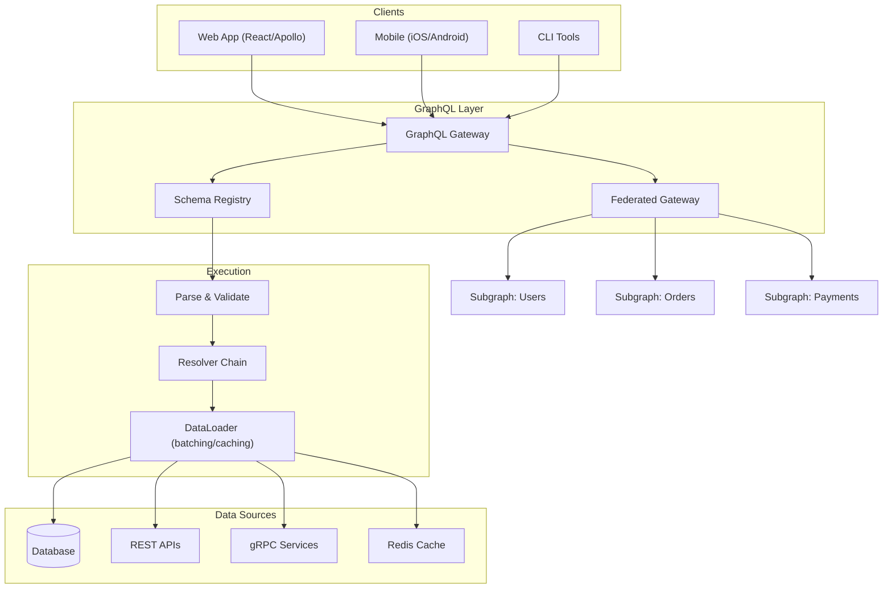

# GraphQL Deep Dive

> GraphQL is a query language and runtime for APIs developed by Facebook in 2012 and open-sourced in 2015. It enables clients to request exactly the data they need, nothing more and nothing less.

## Architecture at a Glance



## What is GraphQL?

GraphQL is a query language for APIs that provides:

- **Declarative data fetching** — clients specify exactly what they need
- **Single endpoint** — typically `/graphql` for all operations
- **Strongly typed schema** — every field has a defined type
- **Introspection** — API can describe itself via queries
- **Real-time** — subscriptions for live updates

## Why GraphQL Was Created

Facebook created GraphQL to solve REST's fundamental problems:

- **Over-fetching** — REST endpoints return fixed structures with unnecessary data
- **Under-fetching** — client needs multiple roundtrips to gather related data
- **Tight coupling** — backend changes break mobile clients
- **Rapid iteration** — mobile teams need flexibility without backend changes
- **N+1 queries** — inefficient data loading in REST

## When to Use GraphQL

| Use Case | GraphQL Fit |
|----------|-------------|
| Mobile apps (bandwidth-constrained) | Excellent |
| Complex UIs (dashboards, feeds) | Excellent |
| Microservices aggregation | Good (federation) |
| Simple CRUD APIs | Overkill — REST is simpler |
| High-throughput, low-latency | Poor — gRPC is better |
| File upload/download | Poor — REST is simpler |
| Real-time (chat, notifications) | Good (subscriptions) |

## Schema Definition

### The Schema Definition Language (SDL)

GraphQL uses a human-readable schema language:

```graphql
type Query {
  user(id: ID!): User
  users(limit: Int, offset: Int): [User!]!
  search(query: String!, type: SearchType): [SearchResult!]!
}

type Mutation {
  createUser(input: CreateUserInput!): User!
  updateUser(id: ID!, input: UpdateUserInput!): User!
  deleteUser(id: ID!): Boolean!
}

type Subscription {
  userCreated: User!
  messageReceived(roomId: ID!): Message!
}
```

### Type System

```graphql
scalar URL
scalar DateTime
scalar JSON

enum Role {
  ADMIN
  EDITOR
  VIEWER
}

type User {
  id: ID!
  name: String!
  email: String
  avatar: URL
  role: Role!
  posts(limit: Int = 10): [Post!]!
  createdAt: DateTime!
}

type Post {
  id: ID!
  title: String!
  content: String!
  author: User!
  comments: [Comment!]!
  tags: [String!]
}

type Comment {
  id: ID!
  text: String!
  author: User!
  createdAt: DateTime!
}
```

### Input Types

```graphql
input CreateUserInput {
  name: String!
  email: String!
  role: Role = VIEWER
}

input UpdateUserInput {
  name: String
  email: String
  role: Role
}

input PaginationInput {
  limit: Int = 20
  cursor: String
}

input PostFilterInput {
  tags: [String!]
  createdAfter: DateTime
  status: PostStatus
}
```

### Interface and Union Types

```graphql
interface Node {
  id: ID!
  createdAt: DateTime!
}

type User implements Node {
  id: ID!
  createdAt: DateTime!
  name: String!
  email: String
}

type Post implements Node {
  id: ID!
  createdAt: DateTime!
  title: String!
  content: String!
}

union SearchResult = User | Post | Comment

type Query {
  search(query: String!): [SearchResult!]!
  node(id: ID!): Node
}
```

## Resolvers

Resolvers are functions that fetch data for each field in the schema:

```javascript
const resolvers = {
  Query: {
    user: (parent, args, context, info) => {
      return context.dataSources.usersAPI.getById(args.id);
    },
    users: (parent, args, context) => {
      return context.dataSources.usersAPI.list(args.limit, args.offset);
    }
  },

  User: {
    posts: (parent, args, context) => {
      return context.dataSources.postsAPI.getByUserId(parent.id, args.limit);
    }
  },

  Mutation: {
    createUser: async (parent, args, context) => {
      const user = await context.dataSources.usersAPI.create(args.input);
      context.pubsub.publish("USER_CREATED", { userCreated: user });
      return user;
    }
  },

  Subscription: {
    userCreated: {
      subscribe: (parent, args, context) => {
        return context.pubsub.asyncIterator("USER_CREATED");
      }
    }
  }
};
```

### Resolver Signature

```
fieldName(parent, args, context, info) => data | Promise<data>
```

- **parent** — the return value of the parent resolver
- **args** — arguments passed to the field
- **context** — shared context (auth, data sources, connections)
- **info** — query metadata (selection set, field names)

## Queries, Mutations, Subscriptions

### Queries (Read)

```graphql
query GetUserWithPosts {
  user(id: "usr_abc123") {
    id
    name
    email
    posts(limit: 5) {
      title
      content
      comments {
        text
        author { name }
      }
    }
  }
}
```

### Mutations (Write)

```graphql
mutation CreateNewUser {
  createUser(input: { name: "Alice", email: "alice@example.com" }) {
    id
    name
    email
    createdAt
  }
}
```

### Subscriptions (Real-time)

```graphql
subscription OnMessageReceived {
  messageReceived(roomId: "room_xyz") {
    id
    text
    sender { name }
    createdAt
  }
}
```

### Fragments and Variables

```graphql
fragment UserFields on User {
  id
  name
  email
  avatar
}

query GetUsers($limit: Int!, $role: Role) {
  users(limit: $limit) {
    ...UserFields
    role
    ... on Admin {
      permissions
    }
  }
}

# Variables JSON:
{ "limit": 20, "role": "ADMIN" }
```

## The N+1 Problem and DataLoader

### The Problem

When resolving `users` → each user's `posts`, a naive implementation makes 1 query for users + N queries for posts:

```javascript
const resolvers = {
  User: {
    posts: (user) => db.query("SELECT * FROM posts WHERE user_id = ?", [user.id])
  }
};
```

With 100 users, this executes 101 SQL queries.

### DataLoader Solution

DataLoader batches and caches database requests within a single request:

```javascript
const DataLoader = require("dataloader");

// Batch function
const postsByUserIds = async (userIds) => {
  const posts = await db.query(
    "SELECT * FROM posts WHERE user_id IN (?) ORDER BY user_id",
    [userIds]
  );
  // DataLoader requires ordered results matching input array
  return userIds.map(id => posts.filter(p => p.user_id === id));
};

// Create per-request loaders
const createLoaders = () => ({
  postsByUser: new DataLoader(postsByUserIds),
  userById: new DataLoader(async (ids) => {
    const users = await db.query("SELECT * FROM users WHERE id IN (?)", [ids]);
    return ids.map(id => users.find(u => u.id === id));
  })
});

// Use in resolvers
const resolvers = {
  User: {
    posts: (user, args, context) => {
      return context.loaders.postsByUser.load(user.id);
    }
  }
};
```

Now 100 users = 2 SQL queries (1 for users, 1 batched for posts).

## Batching and Caching

### Request Batching (Apollo)

```javascript
const httpLink = new ApolloHttpLink({ uri: "/graphql" });

// Batch multiple queries into one HTTP request
const batchLink = new BatchHttpLink({
  uri: "/graphql",
  batchMax: 5,
  batchInterval: 20
});
```

### Response Caching (Apollo Client)

```javascript
import { InMemoryCache } from "@apollo/client";

const cache = new InMemoryCache({
  typePolicies: {
    User: {
      keyFields: ["id"],
      fields: {
        posts: {
          merge(existing = [], incoming) {
            return [...existing, ...incoming];
          }
        }
      }
    }
  }
});
```

### Persisted Queries

```javascript
// Server setup (Apollo Server)
const server = new ApolloServer({
  schema,
  persistedQueries: {
    cache: new RedisCache({ host: "redis.example.com" })
  }
});

// Client sends hash instead of full query
const { data } = await client.query({
  query: "query GetUser($id: ID!) { user(id: $id) { name } }",
  // or use the hash
  persistedQuery: {
    version: 1,
    sha256Hash: "deadbeef..."
  }
});
```

## Federation

Apollo Federation splits a GraphQL schema across multiple services:

```graphql
# Subgraph A: Users Service
type User @key(fields: "id") {
  id: ID!
  name: String!
  email: String
}

extend type Query {
  user(id: ID!): User
  users: [User!]!
}

# Subgraph B: Reviews Service
type Review @key(fields: "id") {
  id: ID!
  body: String!
  author: User! @provides(fields: "name")
  product: Product!
}

extend type User @key(fields: "id") {
  id: ID! @external
  name: String! @external
  reviews: [Review!]!
}

extend type Product @key(fields: "id") {
  id: ID! @external
  reviews: [Review!]!
}
```

### Gateway Configuration

```javascript
const { ApolloGateway } = require("@apollo/gateway");

const gateway = new ApolloGateway({
  serviceList: [
    { name: "users", url: "http://users-service:4001/graphql" },
    { name: "reviews", url: "http://reviews-service:4002/graphql" },
    { name: "products", url: "http://products-service:4003/graphql" }
  ]
});
```

## Security

### Depth Limiting

```javascript
const depthLimit = require("graphql-depth-limit");

const server = new ApolloServer({
  schema,
  validationRules: [depthLimit(7)]
});
```

### Complexity Analysis

```javascript
const { createComplexityLimitRule } = require("graphql-validation-complexity");

const server = new ApolloServer({
  schema,
  validationRules: [
    createComplexityLimitRule(1000, {
      onCost: (cost) => console.log(`Query cost: ${cost}`)
    })
  ]
});

// Assign costs to fields in schema
const typeDefs = gql`
  type Query {
    users: [User!]! @cost(complexity: 10)
    user(id: ID!): User @cost(complexity: 5)
  }

  type User {
    id: ID!
    posts(limit: Int): [Post!]! @cost(complexity: 3, multipliers: ["limit"])
    expensiveField: String @cost(complexity: 50)
  }
`;
```

### Authentication and Authorization

```javascript
const server = new ApolloServer({
  context: async ({ req }) => {
    const token = req.headers.authorization?.replace("Bearer ", "");
    const user = await authenticateToken(token);
    return { user };
  }
});

// Schema directives for auth
const typeDefs = gql`
  directive @auth(requires: Role = ADMIN) on OBJECT | FIELD_DEFINITION

  enum Role {
    ADMIN
    USER
    GUEST
  }

  type Query {
    users: [User!]! @auth(requires: ADMIN)
    me: User @auth(requires: USER)
  }
`;
```

### Query Whitelisting

```javascript
// Only allow persisted queries in production
const server = new ApolloServer({
  persistedQueries: {
    ttl: 900
  },
  gateway: {
    // Reject non-persisted queries
    validate: (document) => {
      if (!document.definitions.some(d => d.operation === "subscription")) {
        return true; // only allow persisted
      }
      return document.kind !== "Document";
    }
  }
});
```

## Pricing Model / Cost Considerations

| Service | Pricing |
|---------|---------|
| Apollo GraphOS | Free tier (1M ops/mo) + Team ($99/mo) + Enterprise |
| Hasura Cloud | Free tier (1GB data) + Pro ($99/mo) + Enterprise |
| AWS AppSync | Pay per query/mutation/subscription (~$4/M queries) |
| Cloudflare GraphQL | Included in Workers plan |
| StepZen (IBM) | Free tier + Enterprise |
| GraphCDN | $0.30/GB cached + $0.80/GB origin |
| OneGraph (Netlify) | Deprecated / migrating |

## Best Practices

- **Use connection types for lists** — follow Relay Connection spec for pagination
- **Implement DataLoader per request** — avoid sharing loaders across requests
- **Limit query depth** — prevent deeply nested abusive queries
- **Rate limit by complexity** — not just by request count
- **Enable persisted queries** — reduce request size in production
- **Use fragments** — reuse field selections across queries
- **Version schemas via federation** — add fields without breaking changes
- **Monitor resolver performance** — trace slow resolvers with Apollo Studio
- **Return null vs error** — non-null fields fail fast; nullable fields allow partial data
- **Use mutations for side effects** — queries should never cause writes
- **Batch subscriptions** — use `@defer` directive for progressive loading

## Interview Questions

1. What is the N+1 problem in GraphQL and how does DataLoader solve it?
2. Explain the difference between a Union and an Interface in GraphQL.
3. How does Apollo Federation work? What are subgraphs vs supergraph?
4. Describe strategies for rate limiting in GraphQL (depth, complexity, query cost).
5. How do you handle file uploads in GraphQL?
6. What are persisted queries and why would you use them?
7. How do subscriptions work under the hood (transport, protocol)?
8. Design a GraphQL schema for a real-time chat application.
9. How does GraphQL compare to gRPC for inter-service communication?
10. What is the `@defer` and `@stream` directive and how do they improve performance?

## Real Company Usage

| Company | Usage |
|---------|-------|
| **GitHub** | Public GraphQL API (v4); replaces REST v3; one of the largest public GraphQL APIs |
| **Shopify** | GraphQL Admin API; REST API deprecated; GraphQL-first since 2016 |
| **Meta (Facebook)** | Invented GraphQL; used across Facebook, Instagram, WhatsApp |
| **Airbnb** | Uses Apollo Federation; migrated from REST to GraphQL in 2018 |
| **Netflix** | Internal GraphQL gateway; federation across microservices |
| **Twitter/X** | GraphQL for mobile apps; migrated from REST for performance |
| **Atlassian** | Jira and Confluence GraphQL APIs |
| **New York Times** | GraphQL for content management; federation across newsroom tools |
