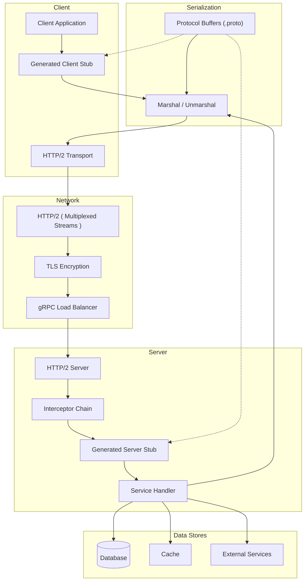

# gRPC Deep Dive

> gRPC is a high-performance, open-source RPC framework developed by Google. It uses HTTP/2 for transport, Protocol Buffers for serialization, and enables bi-directional streaming with strong typing.

## Architecture at a Glance



## What is gRPC?

gRPC is a modern, open-source RPC framework that:

- Uses **Protocol Buffers** for interface definition and serialization
- Runs over **HTTP/2** (multiplexed, bidirectional, compressed)
- Supports **four communication modes** (unary, server-streaming, client-streaming, bidirectional)
- Generates **type-safe client and server code** in 11+ languages
- Built-in **authentication**, **load balancing**, **tracing**, and **health checking**

## Why gRPC Was Created

Google created gRPC (initially internal "Stubby") to address REST's limitations in microservices communication:

- **Performance** — Protobuf serialization is 3-10x faster than JSON
- **Payload size** — Protobuf messages are 30-70% smaller than JSON
- **Streaming** — HTTP/2 bidirectional streaming for real-time use cases
- **Strong typing** — contract-first with generated code eliminates runtime errors
- **Polyglot** — generate clients for 11+ languages from a single .proto file

## When to Use gRPC

| Use Case | gRPC Fit |
|----------|----------|
| Internal microservices | Excellent |
| High-throughput, low-latency systems | Excellent |
| Real-time streaming (IoT, gaming) | Excellent |
| Mobile apps (with bandwidth concerns) | Good |
| Browser-based apps | Poor (limited browser support; use gRPC-Web) |
| Public REST APIs | Poor — prefer REST/GraphQL |
| Simple CRUD operations | Overkill — REST is simpler |

## Protocol Buffers

### The .proto File

```protobuf
syntax = "proto3";

package payment.v1;

option go_package = "payment/v1;paymentv1";
option java_package = "com.example.payment.v1";

import "google/protobuf/timestamp.proto";
import "google/protobuf/wrappers.proto";

// Service definition
service PaymentService {
  // Unary
  rpc GetPayment(GetPaymentRequest) returns (Payment);
  rpc CreatePayment(CreatePaymentRequest) returns (Payment);
  rpc RefundPayment(RefundPaymentRequest) returns (Payment);

  // Server streaming
  rpc StreamPayments(StreamPaymentsRequest) returns (stream Payment);

  // Client streaming
  rpc BatchCreatePayment(stream CreatePaymentRequest) returns (BatchPaymentResponse);

  // Bidirectional streaming
  rpc ProcessPaymentStream(stream PaymentEvent) returns (stream PaymentResult);
}

// Messages
message GetPaymentRequest {
  string payment_id = 1;
  string idempotency_key = 2;
}

message CreatePaymentRequest {
  string amount = 1;    // Decimal string to avoid float issues
  string currency = 2;  // ISO 4217
  string source = 3;
  string description = 4;
  map<string, string> metadata = 5;
  optional string customer_id = 6;
}

message Payment {
  string id = 1;
  string amount = 2;
  string currency = 3;
  PaymentStatus status = 4;
  google.protobuf.Timestamp created_at = 5;
  google.protobuf.Timestamp updated_at = 6;
  string description = 7;
  map<string, string> metadata = 8;
  google.protobuf.StringValue customer_id = 9;
  repeated Transaction transactions = 10;
}

enum PaymentStatus {
  PAYMENT_STATUS_UNSPECIFIED = 0;
  PAYMENT_STATUS_PENDING = 1;
  PAYMENT_STATUS_PROCESSING = 2;
  PAYMENT_STATUS_SUCCEEDED = 3;
  PAYMENT_STATUS_FAILED = 4;
  PAYMENT_STATUS_REFUNDED = 5;
}

message Transaction {
  string id = 1;
  string amount = 2;
  TransactionType type = 3;
  google.protobuf.Timestamp processed_at = 4;
}

enum TransactionType {
  TRANSACTION_TYPE_UNSPECIFIED = 0;
  TRANSACTION_TYPE_CAPTURE = 1;
  TRANSACTION_TYPE_REFUND = 2;
  TRANSACTION_TYPE_REVERSAL = 3;
}
```

### Code Generation

```bash
# Generate Go code
protoc --go_out=. --go_opt=paths=source_relative \
  --go-grpc_out=. --go-grpc_opt=paths=source_relative \
  payment/v1/payment.proto

# Generate Python code
python -m grpc_tools.protoc \
  -I. \
  --python_out=. --grpc_python_out=. \
  payment/v1/payment.proto

# Generate Java code
protoc --java_out=. --grpc-java_out=. \
  payment/v1/payment.proto

# Generate TypeScript (with protobuf-ts)
npx protoc --ts_out=. \
  -I. \
  payment/v1/payment.proto
```

## Four Streaming Modes

### 1. Unary RPC

Simple request-response, identical to REST:

```go
// Server
func (s *paymentServer) GetPayment(ctx context.Context, req *pb.GetPaymentRequest) (*pb.Payment, error) {
    payment, err := s.store.GetPayment(ctx, req.PaymentId)
    if err != nil {
        return nil, status.Errorf(codes.NotFound, "payment %s not found", req.PaymentId)
    }
    return payment, nil
}

// Client
client := pb.NewPaymentServiceClient(conn)
payment, err := client.GetPayment(ctx, &pb.GetPaymentRequest{
    PaymentId: "pay_abc123",
})
```

### 2. Server-Streaming RPC

Server sends multiple responses to a single request:

```go
// Server
func (s *paymentServer) StreamPayments(req *pb.StreamPaymentsRequest, stream pb.PaymentService_StreamPaymentsServer) error {
    payments, err := s.store.ListPayments(stream.Context(), req)
    if err != nil {
        return err
    }
    for _, payment := range payments {
        if err := stream.Send(payment); err != nil {
            return err
        }
    }
    return nil
}

// Client
stream, err := client.StreamPayments(ctx, &pb.StreamPaymentsRequest{Status: pb.PaymentStatus_PAYMENT_STATUS_SUCCEEDED})
for {
    payment, err := stream.Recv()
    if err == io.EOF {
        break
    }
    if err != nil {
        log.Fatal(err)
    }
    log.Printf("Received payment: %s", payment.Id)
}
```

### 3. Client-Streaming RPC

Client sends multiple requests, server responds once:

```go
// Server
func (s *paymentServer) BatchCreatePayment(stream pb.PaymentService_BatchCreatePaymentServer) error {
    var payments []*pb.Payment
    for {
        req, err := stream.Recv()
        if err == io.EOF {
            return stream.SendAndClose(&pb.BatchPaymentResponse{
                Payments: payments,
                Total:    int32(len(payments)),
            })
        }
        if err != nil {
            return err
        }
        payment, err := s.processPayment(stream.Context(), req)
        if err != nil {
            return err
        }
        payments = append(payments, payment)
    }
}

// Client
stream, err := client.BatchCreatePayment(ctx)
for _, req := range createRequests {
    if err := stream.Send(req); err != nil {
        log.Fatal(err)
    }
}
resp, err := stream.CloseAndRecv()
```

### 4. Bidirectional Streaming

Both sides send independent streams concurrently:

```go
// Server
func (s *paymentServer) ProcessPaymentStream(stream pb.PaymentService_ProcessPaymentStreamServer) error {
    for {
        event, err := stream.Recv()
        if err == io.EOF {
            return nil
        }
        if err != nil {
            return err
        }
        result := processEvent(event)
        if err := stream.Send(result); err != nil {
            return err
        }
    }
}

// Client
stream, err := client.ProcessPaymentStream(ctx)
waitc := make(chan struct{})

// Receive in goroutine
go func() {
    for {
        result, err := stream.Recv()
        if err == io.EOF {
            close(waitc)
            return
        }
        if err != nil {
            log.Fatal(err)
        }
        log.Printf("Result: %v", result)
    }
}()

// Send events
for _, event := range events {
    if err := stream.Send(event); err != nil {
        log.Fatal(err)
    }
}
stream.CloseSend()
<-waitc
```

## Interceptors

Interceptors are gRPC's middleware — they intercept RPC calls for cross-cutting concerns.

### Server Interceptors

```go
// Unary interceptor: logging + auth
func loggingInterceptor(ctx context.Context, req interface{}, info *grpc.UnaryServerInfo, handler grpc.UnaryHandler) (interface{}, error) {
    log.Printf("gRPC call: %s", info.FullMethod)

    // Auth check
    token, err := extractToken(ctx)
    if err != nil {
        return nil, status.Errorf(codes.Unauthenticated, "missing token")
    }
    if !validateToken(token) {
        return nil, status.Errorf(codes.PermissionDenied, "invalid token")
    }

    // Add user to context
    ctx = context.WithValue(ctx, "user", getUserFromToken(token))

    // Timer
    start := time.Now()
    resp, err := handler(ctx, req)
    log.Printf("%s took %v", info.FullMethod, time.Since(start))
    return resp, err
}

// Server setup
server := grpc.NewServer(
    grpc.UnaryInterceptor(loggingInterceptor),
    grpc.StreamInterceptor(streamLoggingInterceptor),
)
pb.RegisterPaymentServiceServer(server, &paymentServer{})
```

### Client Interceptors

```go
// Client interceptor: retry + tracing
func retryInterceptor(ctx context.Context, method string, req, reply interface{}, cc *grpc.ClientConn, invoker grpc.UnaryInvoker, opts ...grpc.CallOption) error {
    var err error
    for attempt := 0; attempt < 3; attempt++ {
        if attempt > 0 {
            time.Sleep(time.Duration(attempt*100) * time.Millisecond)
        }
        err = invoker(ctx, method, req, reply, cc, opts...)
        if err == nil {
            return nil
        }
        if !shouldRetry(err) {
            return err
        }
    }
    return err
}

// Client setup
conn, err := grpc.Dial(
    "localhost:50051",
    grpc.WithUnaryInterceptor(retryInterceptor),
    grpc.WithTransportCredentials(insecure.NewCredentials()),
)
```

## Deadlines and Timeouts

```go
// Client: set deadline
ctx, cancel := context.WithTimeout(context.Background(), 5*time.Second)
defer cancel()

payment, err := client.GetPayment(ctx, &pb.GetPaymentRequest{PaymentId: "pay_abc123"})
if status.Code(err) == codes.DeadlineExceeded {
    log.Println("Request timed out")
}

// Server: check deadline
func (s *paymentServer) GetPayment(ctx context.Context, req *pb.GetPaymentRequest) (*pb.Payment, error) {
    deadline, ok := ctx.Deadline()
    if ok {
        remaining := time.Until(deadline)
        log.Printf("Deadline in %v", remaining)
    }

    // Check if we should abort
    select {
    case <-ctx.Done():
        return nil, ctx.Err()
    default:
    }

    return s.store.GetPayment(ctx, req.PaymentId)
}
```

## Error Handling

gRPC uses structured error codes from `google.golang.org/grpc/codes`:

```go
import (
    "google.golang.org/grpc/codes"
    "google.golang.org/grpc/status"
)

// Server: return structured errors
func (s *paymentServer) GetPayment(ctx context.Context, req *pb.GetPaymentRequest) (*pb.Payment, error) {
    if req.PaymentId == "" {
        return nil, status.Error(codes.InvalidArgument, "payment_id is required")
    }

    payment, err := s.store.GetPayment(ctx, req.PaymentId)
    if err == ErrNotFound {
        return nil, status.Errorf(codes.NotFound, "payment %s not found", req.PaymentId)
    }
    if err != nil {
        return nil, status.Errorf(codes.Internal, "failed to get payment: %v", err)
    }

    return payment, nil
}

// Client: handle errors
payment, err := client.GetPayment(ctx, req)
if err != nil {
    st := status.Convert(err)
    switch st.Code() {
    case codes.NotFound:
        log.Printf("Payment not found: %s", st.Message())
    case codes.InvalidArgument:
        log.Printf("Bad request: %s", st.Message())
    case codes.DeadlineExceeded:
        log.Printf("Request timed out")
    default:
        log.Printf("Unexpected error: %v", st)
    }
}
```

### Error Details (Rich Errors)

```protobuf
// error_details.proto
import "google/rpc/error_details.proto";

// Server sends rich error details
st := status.New(codes.InvalidArgument, "validation failed")
details := &errdetails.BadRequest{
    FieldViolations: []*errdetails.BadRequest_FieldViolation{
        {Field: "amount", Description: "must be positive"},
        {Field: "currency", Description: "must be ISO 4217"},
    },
}
st, err := st.WithDetails(details)

// Client extracts details
st := status.Convert(err)
for _, detail := range st.Details() {
    switch d := detail.(type) {
    case *errdetails.BadRequest:
        for _, v := range d.FieldViolations {
            log.Printf("Field %s: %s", v.Field, v.Description)
        }
    case *errdetails.RetryInfo:
        log.Printf("Retry after: %v", d.RetryDelay)
    }
}
```

## Load Balancing

```go
// gRPC client with round-robin load balancing
conn, err := grpc.Dial(
    "dns:///payments.example.com:50051",
    grpc.WithDefaultServiceConfig(`{
        "loadBalancingConfig": [ { "round_robin": {} } ],
        "methodConfig": [{
            "name": [{"service": "payment.v1.PaymentService"}],
            "retryPolicy": {
                "maxAttempts": 3,
                "initialBackoff": "0.1s",
                "maxBackoff": "1s",
                "backoffMultiplier": 2,
                "retryableStatusCodes": ["UNAVAILABLE"]
            }
        }]
    }`),
    grpc.WithTransportCredentials(insecure.NewCredentials()),
)
```

### Client-Side Load Balancing

```go
resolver, err := manual.NewBuilderWithScheme("myresolver")
resolver.InitialState(resolver.State{
    Addresses: []resolver.Address{
        {Addr: "10.0.0.1:50051"},
        {Addr: "10.0.0.2:50051"},
        {Addr: "10.0.0.3:50051"},
    },
})

conn, err := grpc.Dial(
    resolver.Scheme() + ":///",
    grpc.WithResolvers(resolver),
    grpc.WithDefaultServiceConfig(`{"loadBalancingConfig": [{"round_robin": {}}]}`),
)
```

## gRPC Gateway (REST ↔ gRPC)

```protobuf
service PaymentService {
  rpc GetPayment(GetPaymentRequest) returns (Payment) {
    option (google.api.http) = {
      get: "/v1/payments/{payment_id}"
    };
  }

  rpc CreatePayment(CreatePaymentRequest) returns (Payment) {
    option (google.api.http) = {
      post: "/v1/payments"
      body: "*"
    };
  }

  rpc ListPayments(ListPaymentsRequest) returns (ListPaymentsResponse) {
    option (google.api.http) = {
      get: "/v1/payments"
    };
  }
}
```

```bash
# Generate gateway
protoc -I. --grpc-gateway_out=. --grpc-gateway_opt=logtostderr=true \
  payment/v1/payment.proto

# Start gateway server
mux := runtime.NewServeMux()
opts := []grpc.DialOption{grpc.WithTransportCredentials(insecure.NewCredentials())}
err := pb.RegisterPaymentServiceHandlerFromEndpoint(ctx, mux, "localhost:50051", opts)

http.ListenAndServe(":8080", mux)
```

Now clients can call:
```bash
curl http://localhost:8080/v1/payments/pay_abc123
```

## Comparison: gRPC vs REST vs GraphQL

| Feature | gRPC | REST | GraphQL |
|---------|------|------|---------|
| Protocol | HTTP/2 | HTTP/1.1, HTTP/2 | HTTP/1.1, HTTP/2 |
| Serialization | Protobuf (binary) | JSON/XML (text) | JSON (text) |
| Performance | Excellent | Good | Moderate |
| Browser support | Limited (gRPC-Web) | Native | Native |
| Streaming | Native (4 modes) | SSE, WebSocket | Subscriptions |
| Contract | .proto (strict) | OpenAPI (descriptive) | SDL (strict) |
| Code generation | Excellent | Good (OpenAPI Gen) | Good (GraphQL Codegen) |
| Caching | Not built-in | HTTP caching | Client caches |
| Learning curve | Steep | Low | Moderate |
| Tooling ecosystem | Mature but smaller | Largest | Growing fast |

## Best Practices

- **Always set deadlines/timeouts** — prevent cascading failures
- **Use bidirectional streaming for real-time** — more efficient than unary polling
- **Keep proto packages organized** — version in package name: `payment.v1`
- **Never reuse field numbers** — field numbers are permanent once used
- **Use `google.protobuf.Timestamp`** — not string or int64 for dates
- **Prefer unary for simple request-response** — streaming adds complexity
- **Implement health checks** — use gRPC Health Checking Protocol
- **Use connection pooling** — reuse connections; don't create per-request
- **Enable compression** — `grpc.WithDefaultCallOptions(grpc.UseCompressor("gzip"))`
- **Use interceptors** — for auth, logging, metrics, rate limiting

## Interview Questions

1. Explain the four types of gRPC streaming. When would you use each?
2. How does Protocol Buffers handle backward and forward compatibility?
3. What are the advantages of gRPC over REST for internal microservices?
4. How do deadlines and timeouts work in gRPC? How do they prevent cascading failures?
5. Explain the gRPC load balancing mechanisms (client-side vs server-side).
6. How does gRPC-Web work? What are its limitations compared to native gRPC?
7. Describe the gRPC interceptor pattern. How does it compare to REST middleware?
8. How would you design a gRPC service for a real-time multiplayer game?
9. What is the gRPC gateway and when should you use it?
10. How does gRPC handle errors? What are rich error details?

## Real Company Usage

| Company | Usage |
|---------|-------|
| **Google** | Created gRPC; used extensively internally (YouTube, Gmail, Maps, Cloud) |
| **Netflix** | gRPC for inter-service communication; replaced REST for internal APIs |
| **Square** | gRPC for internal microservices; Protobuf for all service contracts |
| **CockroachDB** | gRPC for distributed database node-to-node communication |
| **etcd** | gRPC for distributed key-value store RPC |
| **Docker** | gRPC for Docker Engine API communication |
| **Dropbox** | gRPC for internal service mesh; migrated from REST |
| **Uber** | gRPC for high-throughput microservices; Geobase, pricing services |
