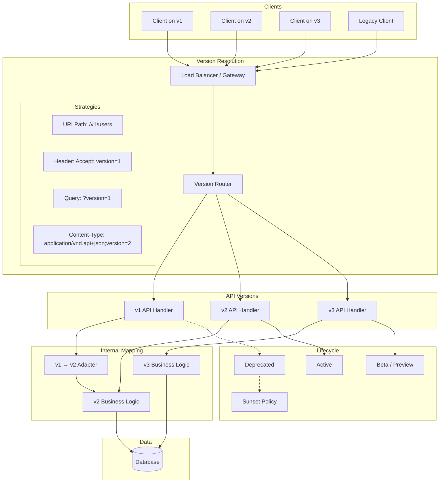

# API Versioning

> API versioning is the practice of managing changes to an API over time. It allows providers to evolve APIs without breaking existing consumers, enabling continuous delivery while maintaining backward compatibility.

## Architecture at a Glance



## What is API Versioning?

API versioning is a strategy for introducing changes to an API while ensuring existing consumers continue to function. APIs must evolve — new features, bug fixes, schema changes, protocol updates — but every change risks breaking someone.

Versioning provides:
- **Backward compatibility** — old clients continue working
- **Migration windows** — consumers have time to upgrade
- **Feature flags at scale** — canary new versions alongside old ones
- **Clear communication** — version identifiers signal change magnitude

## Why API Versioning Matters

Breaking changes happen. Common causes:

- Renaming or removing fields
- Changing field types or constraints
- Adding required fields
- Changing authentication requirements
- Modifying error formats
- Changing pagination behavior
- Altering rate limits or throttling

Without versioning, every breaking change becomes a coordinated deployment between the API provider and all consumers — impossible at scale.

## When to Version

| Scenario | Should You Version? |
|----------|-------------------|
| Public API | Always |
| B2B API with external partners | Always |
| Internal microservices | Often (can coordinate) |
| Monolith frontend-backend | Rarely (same deploy) |
| Private internal library | Sometimes (semver) |
| Experimental/preview API | Yes (alpha/beta) |

## Versioning Strategies

### 1. URI Path Versioning

```
GET /v1/users
GET /v2/users
POST /v2/users
```

**Pros:**
- Most explicit — version is impossible to miss
- Easy to route at the load balancer / gateway
- Most popular strategy (Stripe, GitHub, Twilio)

**Cons:**
- Clutters URLs
- Violates REST purity (version is not a resource identifier)
- Encourages proliferation of code branches
- Can lead to duplicate code across versions

```python
# Flask example
from flask import Blueprint

v1 = Blueprint("v1", __name__)
v2 = Blueprint("v2", __name__)

@v1.route("/users/<user_id>")
def get_user_v1(user_id):
    return {"id": user_id, "name": "..."}

@v2.route("/users/<user_id>")
def get_user_v2(user_id):
    # v2 returns additional fields
    return {"id": user_id, "name": "...", "email": "...", "created_at": "..."}

app.register_blueprint(v1, url_prefix="/v1")
app.register_blueprint(v2, url_prefix="/v2")
```

### 2. Header Versioning

```
Accept: application/vnd.myapi.v2+json
Accept: application/vnd.myapi+json;version=2
X-API-Version: 2
```

**Pros:**
- Clean URLs — version is abstracted from URI
- Content negotiation follows HTTP standards
- Version can be optional with default behavior

**Cons:**
- Less discoverable — version is hidden from casual inspection
- Harder to test and debug (buried in headers)
- Browsers and tools may strip custom headers
- Can cause preflight OPTIONS requests in CORS

```python
# Flask example with header versioning
@app.route("/users/<user_id>")
def get_user(user_id):
    version = request.headers.get("X-API-Version", "1")

    if version == "1":
        return {"id": user_id, "name": "..."}
    elif version == "2":
        return {"id": user_id, "name": "...", "email": "..."}
    else:
        abort(406, "Version not supported")
```

### 3. Query Parameter Versioning

```
GET /users?version=1
GET /users?api_version=v2
```

**Pros:**
- Simple to implement
- Easy to test (just change the URL)
- No special header handling needed

**Cons:**
- Pollutes query parameters
- Can be cached separately (good and bad)
- Versioning logic leaks into application code
- Consumers can accidentally omit or change it

```python
# Flask example with query versioning
@app.route("/users/<user_id>")
def get_user(user_id):
    version = request.args.get("version", "1")

    if version == "1":
        return {"id": user_id, "name": "..."}
    elif version == "2":
        return {"id": user_id, "name": "...", "email": "..."}
```

### 4. Content-Type / Media Type Versioning

```
Accept: application/vnd.myapi.v2+json
Content-Type: application/vnd.myapi.v2+json
```

**Pros:**
- Pure HTTP content negotiation
- Versioning is part of the media type contract
- Multiple representations can coexist

**Cons:**
- Most complex to implement
- Non-standard — few tools understand vendor MIME types
- Client complexity increases

## Backward vs Forward Compatibility

### Backward Compatibility

Older clients work with newer API versions.

| Change | Backward Compatible? |
|--------|---------------------|
| Adding an optional field | Yes |
| Adding an endpoint | Yes |
| Adding a new enum value | Mostly (clients should ignore unknown) |
| Making required field optional | Mostly |
| Removing an optional field | No |
| Renaming a field | No |
| Changing a field type | No |
| Making an optional field required | No |
| Removing an endpoint | No |

### Forward Compatibility

Newer clients work with older API versions (harder to achieve).

- Clients ignore unknown fields
- Clients use defaults for missing fields
- Clients handle new enum values gracefully
- Protocols: Protobuf and Thrift have built-in forward compatibility

## Semantic Versioning for APIs

```
Major.Minor.Patch
   |      |     |
   v      v     v
  Breaking  Additive  Bug fixes
  changes   changes   (no contract change)
```

### Conventional Commits for API Changes

| Commit | Version Bump | Example |
|--------|-------------|---------|
| `feat!:` or `BREAKING CHANGE` | Major | `feat!: remove deprecated fields` |
| `feat:` | Minor | `feat: add email field to user` |
| `fix:` | Patch | `fix: correct error message typo` |
| `docs:` | Patch | `docs: update endpoint description` |
| `chore:` | None | `chore: update linter config` |

## Breaking Change Detection

### OpenAPI Diff Tools

```bash
# oas-diff
npx oas-diff openapi-v1.yaml openapi-v2.yaml

# openapi-diff
npx openapi-diff v1.yaml v2.yaml

# Spectral with change detection
spectral lint --ruleset breaking-change-ruleset.yaml openapi-v2.yaml
```

### Custom Detection Script

```python
def detect_breaking_changes(old_spec, new_spec):
    breaking = []

    # Detect removed paths
    removed_paths = set(old_spec["paths"]) - set(new_spec["paths"])
    for path in removed_paths:
        breaking.append(f"REMOVED: {path}")

    # Detect removed required fields
    for path in new_spec.get("paths", {}):
        old_schema = old_spec.get("paths", {}).get(path, {})
        for method in ["get", "post", "put", "patch", "delete"]:
            if method not in old_schema:
                continue
            old_fields = get_required_fields(old_schema, method)
            new_fields = get_required_fields(new_spec["paths"][path], method)
            removed = old_fields - new_fields
            for field in removed:
                breaking.append(f"REMOVED: {path} {method} required field: {field}")

    # Detect changed field types
    for path in new_spec.get("paths", {}):
        for method in ["get", "post"]:
            old_resp = get_response_schema(old_spec, path, method)
            new_resp = get_response_schema(new_spec, path, method)
            if old_resp and new_resp:
                changed = compare_types(old_resp, new_resp)
                breaking.extend(changed)

    return breaking
```

### CI Integration

```yaml
# .github/workflows/breakcheck.yaml
name: Breaking Change Detection
on:
  pull_request:
    paths:
      - "openapi/**/*.yaml"

jobs:
  check:
    runs-on: ubuntu-latest
    steps:
      - uses: actions/checkout@v3
        with:
          fetch-depth: 0
      - uses: actions/setup-node@v3
      - run: npm install -g @stoplight/spectral oas-diff
      - run: |
          git fetch origin main
          git show origin/main:openapi/latest.yaml > /tmp/old.yaml
          oas-diff /tmp/old.yaml openapi/latest.yaml --breaking-only || exit 1
```

## Sunset Policies

A sunset policy defines how long an API version is supported after a new version is released.

### Stripe's Sunset Policy

```
1. Announce deprecation (email, dashboard, headers)
2. Warning header on every response: Sunset: Sat, 31 Dec 2025 23:59:59 GMT
3. Minimum 6 months from deprecation announcement to sunset
4. One major version supported at a time (n-1)
```

### Sunset Header

```http
HTTP/1.1 200 OK
Sunset: Sat, 31 Dec 2025 23:59:59 GMT
Deprecation: true
Link: </v2/users>; rel="successor-version"
```

### Deprecation Response Headers

```python
@app.after_request
def add_deprecation_headers(response):
    version = request.path.split("/")[1] if request.path.startswith("/v") else "v1"

    if version == "v1":
        response.headers["Deprecation"] = "true"
        response.headers["Sunset"] = "Sat, 31 Dec 2025 23:59:59 GMT"
        response.headers["Link"] = '</v2/users>; rel="successor-version"'

    return response
```

### Communication Timeline

| Phase | Action |
|-------|--------|
| T-12 months | Announce major version release |
| T-9 months | v2 released; v1 enters maintenance |
| T-6 months | Deprecation warning headers added |
| T-3 months | Active outreach to known consumers |
| T-0 | v1 sunset; requests return 410 Gone |
| T+ | Archive code and spec |

## Versioning in Practice

### Google API Design

Google uses a unique approach combining URI versioning with backwards-compatible expansion:

```
https://pubsub.googleapis.com/v1/{project}/topics
https://pubsub.googleapis.com/v2/{project}/topics
```

Key principles:
- Version is a path prefix: `/{version}/...`
- Versions are date-based or incremental (v1, v2, v3)
- New fields are always optional
- Proto-based services use package versioning: `google.pubsub.v1`
- Breaking changes require major version bump

### Meta (Facebook) GraphQL

Meta uses a single GraphQL endpoint with no explicit version:
```
POST /graphql
```

Instead of URI versioning, Meta relies on:
- **Additive schema evolution** — never remove fields, only add new ones
- **Field deprecation** — `@deprecated(reason: "use newField")` directive
- **Client-driven compatibility** — clients specify which fields they need
- **Schema registry** — introspectable to find deprecated fields

### Stripe API Versioning

Stripe uses date-based versioning:

```
https://api.stripe.com/v1/charges
```

```http
Stripe-Version: 2025-01-15
```

Key features:
- Date-based versions (`2025-01-15`, `2024-12-01`) — every API change gets a version
- **Upgrade dashboard** — Stripe shows exactly what changed and how it affects each account
- **Fixed window** — versions are immutable once released
- **Automatic upgrades** — Stripe rolls forward versions on a schedule
- **Webhook versioning** — separate webhook version from API version

Stripe's philosophy: "When we make a breaking change to the API, we create a new version. You can choose when to upgrade."

## Best Practices

- **Version from day one** — even if you don't need it; `/v1/` is a habit
- **Prefer URI versioning** — most explicit, well-understood, easy to route
- **Keep versions small** — maintain at most 2-3 active versions
- **Use deprecation headers** — `Deprecation`, `Sunset`, `Link` headers
- **Automate breakage detection** — CI pipeline must catch breaking changes
- **Audit all consumers** — know who calls each version; contact them before sunset
- **Make new fields optional** — never add required fields to existing resources
- **Consider compatibility layers** — adapters to translate between versions
- **Version webhooks separately** — webhook payloads versioned independently
- **Document migration guides** — old→new field mapping, before/after examples

## Interview Questions

1. Compare URI versioning, header versioning, and query parameter versioning. Which would you choose for a public API and why?
2. How does Stripe handle API versioning? What makes their approach unique?
3. What is the difference between backward and forward compatibility in APIs?
4. How would you communicate a version sunset to thousands of API consumers?
5. Design a versioning strategy for an API that has 100+ partners with different upgrade velocities.
6. What is semantic versioning for APIs? How does it differ from software versioning?
7. How do GraphQL APIs handle versioning without explicit version numbers?
8. What is a breaking change? Provide 5 examples.
9. How would you automate breaking change detection in a CI pipeline?
10. Should you version internal microservice APIs the same way as public APIs? Why or why not?

## Real Company Usage

| Company | Strategy | Details |
|---------|----------|---------|
| **Stripe** | URI + Date header | `/v1/charges`, `Stripe-Version: 2025-01-15`; date-based immutable versions |
| **GitHub** | URI + Accept header | `/v3/`; also `Accept: application/vnd.github.v3+json` |
| **Google** | URI path | `https://{service}.googleapis.com/{version}/{resource}`; v1, v2, v3 |
| **Facebook/Meta** | No version | Single `/graphql` endpoint; additive-only changes; field deprecation |
| **Twilio** | URI date | `/2010-04-01/Accounts/{sid}`; fixed version per API resource |
| **AWS** | Header | `X-Amz-Date: 20250115T000000Z`; version in headers + API-specific |
| **Shopify** | Accept header | `Accept: application/json; api_version=2025-01`; monthly releases |
| **Microsoft** | URI | `https://graph.microsoft.com/v1.0/`; v1.0 and beta |
