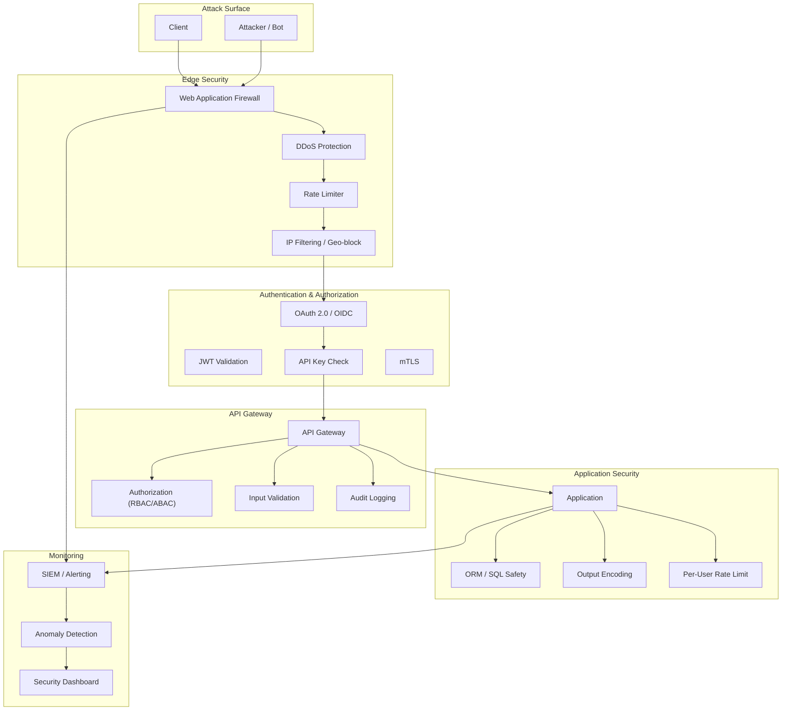
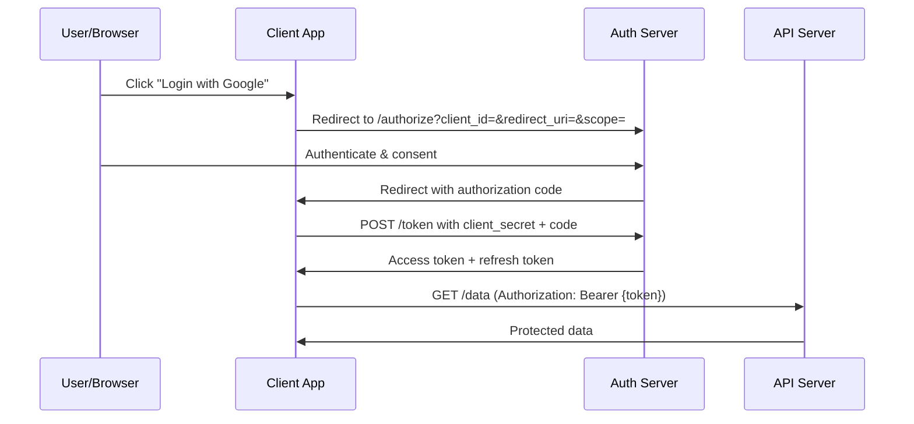

# API Security

> API security encompasses the practices, protocols, and tools used to protect APIs from attacks, unauthorized access, data breaches, and abuse. As APIs become the primary interface for digital services, they also become the primary attack vector.

## Architecture at a Glance



## What is API Security?

API security is a discipline focused on preventing attacks on APIs. Unlike traditional web security (which protects HTML pages), API security must:

- Protect automated, machine-to-machine communication
- Handle non-human traffic patterns
- Secure diverse protocols (REST, GraphQL, gRPC, WebSocket)
- Manage complex authentication flows (OAuth2, JWT, API keys)
- Defend against API-specific attacks (mass assignment, injection, excessive data exposure)

## Why API Security is Critical

- **APIs are the primary attack surface** — 90%+ of web traffic is API traffic
- **Direct data access** — APIs return structured data, not HTML; breaches are more damaging
- **Automated attacks** — bots can probe APIs at scale
- **Business logic abuse** — attackers exploit intended functionality maliciously
- **OWASP API Top 10** — a dedicated security list for API vulnerabilities

## OAuth 2.0 Flows

### Authorization Code Flow (Most Secure)

The gold standard for server-side web applications:



**Implementation:**
```python
from authlib.integrations.flask_client import OAuth

oauth = OAuth(app)
google = oauth.register(
    name="google",
    client_id="GOOGLE_CLIENT_ID",
    client_secret="GOOGLE_CLIENT_SECRET",
    authorize_url="https://accounts.google.com/o/oauth2/auth",
    token_url="https://oauth2.googleapis.com/token",
)

@app.route("/login")
def login():
    return google.authorize_redirect("https://app.example.com/callback")

@app.route("/callback")
def callback():
    token = google.authorize_access_token()
    # token contains access_token, refresh_token, expires_in
    return {"token": token["access_token"]}
```

### Authorization Code Flow with PKCE (Public Clients)

For mobile apps and SPAs that cannot store a client secret:

```
1. Client generates code_verifier (random 43-128 char string)
2. Client generates code_challenge = SHA256(code_verifier)
3. Authorization request includes code_challenge
4. Token request includes code_verifier
5. Auth server verifies SHA256(verifier) matches challenge
```

```javascript
// PKCE in a React SPA
import { createAuthRequest } from "oauth4webapi";

const codeVerifier = crypto.randomUUID();
const codeChallenge = await crypto.subtle.digest(
    "SHA-256",
    new TextEncoder().encode(codeVerifier)
);

const authUrl = new URL("https://auth.example.com/authorize");
authUrl.searchParams.set("client_id", "my-spa-client");
authUrl.searchParams.set("redirect_uri", "https://app.example.com/callback");
authUrl.searchParams.set("response_type", "code");
authUrl.searchParams.set("code_challenge_method", "S256");
authUrl.searchParams.set("code_challenge", btoa(String.fromCharCode(...new Uint8Array(codeChallenge))));

// Later, exchange code for token:
const tokenResponse = await fetch("https://auth.example.com/token", {
    method: "POST",
    body: new URLSearchParams({
        grant_type: "authorization_code",
        code: authorizationCode,
        code_verifier: codeVerifier,
        redirect_uri: "https://app.example.com/callback",
        client_id: "my-spa-client"
    })
});
```

### Client Credentials Flow (Machine-to-Machine)

For server-to-server communication:

```python
import requests

def get_service_token():
    response = requests.post(
        "https://auth.example.com/token",
        data={
            "grant_type": "client_credentials",
            "client_id": "my-service-client",
            "client_secret": "CLIENT_SECRET",
            "scope": "payments:read payments:write"
        }
    )
    return response.json()["access_token"]
```

### Device Code Flow (Input-Constrained Devices)

For smart TVs, CLI tools, IoT devices:

```
1. POST /device/code → device_code, user_code, verification_uri
2. Display: "Go to https://example.com/device and enter ABC-123"
3. Client polls POST /token with device_code
4. User authorizes on browser
5. Client receives access token
```

## OpenID Connect (OIDC)

OIDC extends OAuth 2.0 with an identity layer:

```
OAuth 2.0: "This token lets you access my API"
OIDC:      "This token lets you access my API AND proves who you are"
```

```python
import jwt
from jwt import PyJWKClient

def verify_id_token(id_token):
    # Fetch public keys from issuer
    url = "https://auth.example.com/.well-known/openid-configuration"
    config = requests.get(url).json()
    jwks_client = PyJWKClient(config["jwks_uri"])

    # Verify and decode
    signing_key = jwks_client.get_signing_key_from_jwt(id_token)
    claims = jwt.decode(
        id_token,
        signing_key.key,
        algorithms=["RS256"],
        audience="my-spa-client",
        issuer="https://auth.example.com"
    )
    return claims
# {
#   "sub": "user_abc123",
#   "name": "Alice Johnson",
#   "email": "alice@example.com",
#   "email_verified": true,
#   "iss": "https://auth.example.com",
#   "aud": "my-spa-client",
#   "exp": 1700000000,
#   "iat": 1699996400
# }
```

## JWT (JSON Web Tokens)

### JWT Structure

```
header.payload.signature
```

**Header:**
```json
{
  "alg": "RS256",
  "typ": "JWT",
  "kid": "key-2025-01"
}
```

**Payload (claims):**
```json
{
  "sub": "user_abc123",
  "name": "Alice Johnson",
  "email": "alice@example.com",
  "iat": 1699996400,
  "exp": 1700000000,
  "iss": "https://auth.example.com",
  "aud": "https://api.example.com",
  "scope": "payments:read users:write"
}
```

**Signature:**
```
RSASHA256(
  base64urlEncode(header) + "." + base64urlEncode(payload),
  privateKey
)
```

### JWT Signing and Validation

```python
from datetime import datetime, timedelta
import jwt

# Signing (server-side)
def create_access_token(user_id, role):
    payload = {
        "sub": user_id,
        "role": role,
        "iat": datetime.utcnow(),
        "exp": datetime.utcnow() + timedelta(hours=1),
        "iss": "https://api.example.com",
        "jti": "unique-token-id-123"
    }
    return jwt.encode(payload, PRIVATE_KEY, algorithm="RS256")

# Validation (API server)
def validate_token(token):
    try:
        payload = jwt.decode(
            token,
            PUBLIC_KEY,
            algorithms=["RS256"],
            issuer="https://api.example.com",
            audience=None,  # or specific audience
            options={
                "require": ["sub", "exp", "iat"],
                "verify_exp": True
            }
        )
        return payload
    except jwt.ExpiredSignatureError:
        raise HTTPException(401, "Token expired")
    except jwt.InvalidTokenError as e:
        raise HTTPException(401, f"Invalid token: {e}")

# FastAPI middleware
from fastapi import FastAPI, Depends, HTTPException
from fastapi.security import HTTPBearer, HTTPAuthorizationCredentials

security = HTTPBearer()

@app.get("/api/protected")
def protected_route(credentials: HTTPAuthorizationCredentials = Depends(security)):
    payload = validate_token(credentials.credentials)
    return {"user_id": payload["sub"], "role": payload["role"]}
```

## API Keys

Simple authentication for server-to-server communication:

```python
import hashlib
import hmac

# Generate API key
def generate_api_key():
    import secrets
    return "sk_live_" + secrets.token_hex(32)

# Validate API key (constant-time comparison)
def validate_api_key(request_key, stored_key_hash):
    computed = hashlib.sha256(stored_key_hash.encode()).hexdigest()
    return hmac.compare_digest(
        hashlib.sha256(request_key.encode()).hexdigest(),
        computed
    )
```

## Rate Limiting Algorithms

### Token Bucket

```python
import time
from collections import defaultdict

class TokenBucket:
    def __init__(self, capacity, refill_rate):
        self.capacity = capacity       # Max tokens
        self.refill_rate = refill_rate # Tokens per second
        self.tokens = defaultdict(lambda: capacity)
        self.last_refill = defaultdict(time.time)

    def allow(self, key):
        now = time.time()
        elapsed = now - self.last_refill[key]
        self.tokens[key] = min(
            self.capacity,
            self.tokens[key] + elapsed * self.refill_rate
        )
        self.last_refill[key] = now

        if self.tokens[key] >= 1:
            self.tokens[key] -= 1
            return True
        return False
```

### Sliding Window Log

```python
from collections import defaultdict, deque
import time

class SlidingWindowLog:
    def __init__(self, window_size, max_requests):
        self.window_size = window_size
        self.max_requests = max_requests
        self.logs = defaultdict(deque)

    def allow(self, key):
        now = time.time()
        window_start = now - self.window_size
        log = self.logs[key]

        # Remove old entries
        while log and log[0] < window_start:
            log.popleft()

        if len(log) < self.max_requests:
            log.append(now)
            return True
        return False
```

### Sliding Window Counter

```python
from collections import defaultdict
import time
import math

class SlidingWindowCounter:
    def __init__(self, window_size, max_requests):
        self.window_size = window_size
        self.max_requests = max_requests
        self.counters = defaultdict(lambda: {"current": 0, "previous": 0, "timestamp": 0})

    def allow(self, key):
        now = time.time()
        counter = self.counters[key]

        if now - counter["timestamp"] > self.window_size:
            counter["previous"] = 0
            counter["current"] = 0
            counter["timestamp"] = now
        elif now - counter["timestamp"] > self.window_size / 2:
            # Shift window
            counter["previous"] = counter["current"]
            counter["current"] = 0
            counter["timestamp"] = now

        current_window_start = counter["timestamp"]
        elapsed = now - current_window_start
        previous_weight = 1 - (elapsed / self.window_size)

        estimated = counter["current"] + counter["previous"] * previous_weight
        if estimated >= self.max_requests:
            return False

        counter["current"] += 1
        return True
```

### Rate Limiting Headers

```http
HTTP/1.1 200 OK
X-RateLimit-Limit: 100
X-RateLimit-Remaining: 87
X-RateLimit-Reset: 1700000000
Retry-After: 45

HTTP/1.1 429 Too Many Requests
X-RateLimit-Limit: 100
X-RateLimit-Remaining: 0
Retry-After: 45
{
  "error": {
    "code": "RATE_LIMITED",
    "message": "Rate limit exceeded. Try again in 45 seconds."
  }
}
```

## API Firewalls

```yaml
# Nginx WAF Config
http {
    limit_req_zone $binary_remote_addr zone=api:10m rate=100r/s;

    server {
        listen 443 ssl;
        location /api/ {
            # Rate limiting
            limit_req zone=api burst=50 nodelay;

            # Request size limit
            client_max_body_size 1m;

            # Block SQL injection patterns
            if ($args ~* "(\%27)|(\')\s*OR\s*") {
                return 403;
            }

            # Block path traversal
            if ($uri ~* "\.\./|\.\.\\") {
                return 403;
            }

            proxy_pass http://backend;
        }
    }
}
```

```python
# Custom API Firewall Middleware
class APIFirewall:
    BLOCKED_IP_RANGES = ["10.0.0.0/8", "192.168.0.0/16"]
    SUSPICIOUS_PATTERNS = [
        r"(\%27)|(\')",
        r"(\%24)&",
        r"exec\(|system\(|passthru\(",
        r"\.\./",
    ]

    async def __call__(self, request, call_next):
        # IP blocklist
        client_ip = request.client.host
        if self._in_blocked_range(client_ip):
            return Response(status_code=403, content="Forbidden")

        # Request validation
        body = await request.body()
        for pattern in self.SUSPICIOUS_PATTERNS:
            if re.search(pattern, str(body), re.IGNORECASE):
                await self._log_attack(request, "SUSPICIOUS_PAYLOAD")
                return Response(status_code=403, content="Forbidden")

        # Rate limit check
        if not await self._check_rate_limit(client_ip):
            return Response(status_code=429, content="Too Many Requests")

        return await call_next(request)
```

## CORS (Cross-Origin Resource Sharing)

```python
from fastapi import FastAPI
from fastapi.middleware.cors import CORSMiddleware

app = FastAPI()

app.add_middleware(
    CORSMiddleware,
    allow_origins=["https://app.example.com", "https://admin.example.com"],
    allow_methods=["GET", "POST", "PUT", "DELETE"],
    allow_headers=["Authorization", "Content-Type", "X-Request-ID"],
    allow_credentials=True,
    max_age=600,  # Cache preflight for 10 minutes
)
```

## CSRF (Cross-Site Request Forgery)

For cookie-based auth APIs:

```python
from flask_wtf.csrf import CSRFProtect

csrf = CSRFProtect()
csrf.init_app(app)

# Require CSRF token in non-GET requests
@app.route("/api/transfer", methods=["POST"])
def transfer():
    # CSRF protection is automatic with CSRFProtect
    pass
```

## OWASP API Top 10 (2023)

| Rank | Vulnerability | Mitigation |
|------|--------------|------------|
| API1 | Broken Object Level Authorization | Verify user can access specific resource IDs |
| API2 | Broken Authentication | Strong auth, MFA, lockout policies |
| API3 | Broken Object Property Level Mapping | Whitelist allowed fields; never mass-assign |
| API4 | Unrestricted Resource Consumption | Rate limiting, pagination, request size limits |
| API5 | Broken Function Level Authorization | Role checks per endpoint, not just routing |
| API6 | Unrestricted Access to Sensitive Business Flows | Rate limit specific flows, anti-automation |
| API7 | Server Side Request Forgery (SSRF) | Validate/block redirects, URL allowlisting |
| API8 | Security Misconfiguration | Automated scanning, hardened defaults |
| API9 | Improper Inventory Management | Document all API endpoints; deprecation process |
| API10 | Unsafe Consumption of APIs | Validate upstream responses; timeouts on calls |

### Defending Against Common Vulnerabilities

**Broken Object Level Authorization (API1):**
```python
@app.get("/api/users/{user_id}")
def get_user(user_id: str, current_user: User = Depends(get_current_user)):
    # BAD: No check
    # return get_user_by_id(user_id)

    # GOOD: Verify ownership
    if user_id != current_user.id and current_user.role != "admin":
        raise HTTPException(status_code=403)
    return get_user_by_id(user_id)
```

**Broken Object Property Level Mapping (API3):**
```python
# BAD: Mass assignment
# user.update(request.json())

# GOOD: Whitelist allowed fields
ALLOWED_FIELDS = {"name", "email", "avatar_url"}
update_data = {k: v for k, v in request.json().items() if k in ALLOWED_FIELDS}
user.update(update_data)
```

**Unrestricted Resource Consumption (API4):**
```python
@app.get("/api/search")
def search(q: str, limit: int = 20, current_user: User = Depends(get_current_user)):
    # Enforce maximum
    limit = min(limit, 100)

    # Per-user rate limit
    check_rate_limit(current_user.id, "search", max_per_minute=30)

    results = search_index.query(q, limit=limit)
    return {"results": results, "limit": limit, "total": len(results)}
```

## Best Practices

- **Use HTTPS everywhere** — TLS is non-negotiable
- **Follow least privilege** — only grant scopes/permissions needed
- **Validate everything** — input validation, output encoding, schema validation
- **Rate limit aggressively** — per-user, per-IP, per-endpoint
- **Use short-lived tokens** — access tokens: 15min-1hr; refresh tokens: 24hr-7d
- **Never trust the client** — validate authorizations server-side
- **Implement audit logging** — log all auth decisions, data changes
- **Rotate secrets regularly** — API keys, signing keys, client secrets
- **Use CORS minimally** — explicit origins, not wildcards
- **Scan dependencies** — SCA for known vulnerabilities in libraries
- **API security testing** — DAST, SAST, penetration testing

## Interview Questions

1. Explain the OAuth 2.0 Authorization Code flow with PKCE. Why is PKCE needed?
2. What is the difference between OAuth 2.0 and OpenID Connect?
3. How does JWT work? How do you handle token revocation without server-side sessions?
4. Describe the 4 main rate limiting algorithms. When would you use each?
5. What is the OWASP API Top 10? Describe 3 vulnerabilities and how to prevent them.
6. How do you design a secure API key system? How are keys generated, stored, and validated?
7. What is CORS and how does it work? What are the security implications of wildcard origins?
8. How would you implement API security for a multi-tenant SaaS platform?
9. What is the difference between authentication and authorization? Give API examples.
10. How do you defend against automated attacks (credential stuffing, scraping, DDoS) on APIs?

## Real Company Usage

| Company | Security Implementation |
|---------|------------------------|
| **Stripe** | API keys (pk_live/sk_live), idempotency keys, webhook HMAC signatures, OAuth2 for platforms |
| **GitHub** | OAuth2, PAT (Personal Access Tokens), JWT for GitHub Apps, rate limiting per token |
| **AWS** | Signature V4 (HMAC-SHA256), IAM roles/policies, Cognito for OIDC, STS for temporary creds |
| **Auth0** | OAuth2/OIDC provider; comprehensive auth platform |
| **Okta** | OAuth2/OIDC, adaptive MFA, API access management |
| **Google** | OAuth2 + API keys; API Console with per-project quotas; security scanner |
| **Twilio** | Account SID + Auth Token; webhook signature validation |
| **Slack** | OAuth2 with granular scopes; signed secrets for events API |
