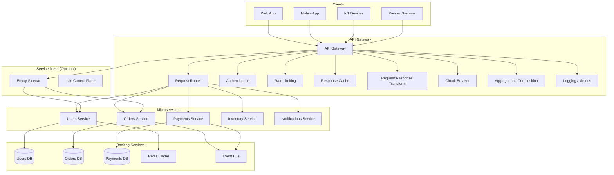
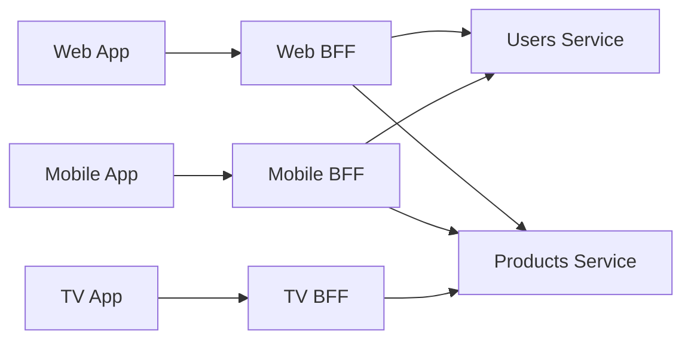
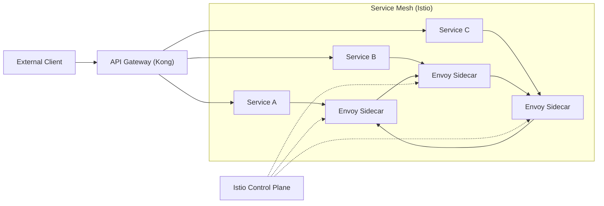

# API Gateway Patterns

> An API Gateway is a server that acts as the single entry point for all API requests. It handles request routing, composition, protocol translation, authentication, rate limiting, and other cross-cutting concerns, freeing individual services to focus on business logic.

## Architecture at a Glance



## What is an API Gateway?

An API Gateway is a reverse proxy that sits between API consumers and backend services. It provides:

- **Single entry point** — all traffic goes through one address
- **Routing** — maps client requests to the appropriate service
- **Cross-cutting concerns** — authentication, rate limiting, logging, caching
- **Protocol translation** — REST → gRPC, HTTP → WebSocket
- **Aggregation** — combine multiple service responses into one
- **Offloading** — removes common logic from individual services

## Why API Gateways Exist

Before API gateways, cross-cutting concerns were duplicated across every service:

```
Without Gateway:
Mobile App → Service A (auth, rate limit, logging, SSL)
Mobile App → Service B (auth, rate limit, logging, SSL)
Mobile App → Service C (auth, rate limit, logging, SSL)

With Gateway:
Mobile App → Gateway (handles auth, rate limit, logging, SSL) → Service A
                                                              → Service B
                                                              → Service C
```

Benefits:
- **Centralized security** — auth logic in one place
- **Reduced client complexity** — clients talk to one endpoint
- **Protocol abstraction** — hide internal service topology
- **Traffic management** — canary deployments, blue-green, A/B testing
- **Team autonomy** — service teams don't implement cross-cutting concerns

## When to Use an API Gateway

| Scenario | Recommendation |
|----------|---------------|
| Microservices architecture | Strongly recommended |
| Public API with multiple consumers | Essential |
| Mobile backend | Essential (BFF pattern) |
| Monolith with gradual migration | Useful (strangler pattern) |
| Single service, no auth | Overkill |
| High-performance, low-latency | Use lightweight gateway (nginx/Envoy) |

## Gateway Patterns

### 1. BFF (Backend for Frontend)

Each client type gets its own gateway:



**When to use:** Multiple client types with different data needs.

```javascript
// Mobile BFF — returns optimized payload for mobile
app.get("/feed", async (req, res) => {
    const [user, posts, notifications] = await Promise.all([
        users.getProfile(req.userId),
        posts.getFeed(req.userId, { limit: 10 }),
        notifications.getUnreadCount(req.userId)
    ]);

    res.json({
        user: { id: user.id, name: user.name, avatar: user.avatar },
        posts: posts.map(p => ({ id: p.id, title: p.title, summary: p.content.slice(0, 100) })),
        notificationCount: notifications.count
    });
});

// Web BFF — returns full data for desktop
app.get("/feed", async (req, res) => {
    const [user, posts] = await Promise.all([
        users.getProfile(req.userId),
        posts.getFeed(req.userId, { limit: 30 })
    ]);

    res.json({
        user,
        posts: posts.map(p => ({
            id: p.id,
            title: p.title,
            content: p.content,
            comments: p.comments,
            author: p.author
        }))
    });
});
```

### 2. Aggregation Gateway

Combines multiple service responses into a single response:

```javascript
// Gateway endpoint that aggregates order data
app.get("/orders/:orderId", async (req, res) => {
    const orderId = req.params.orderId;

    // Fan-out to multiple services in parallel
    const [order, payments, shipping, user] = await Promise.all([
        orders.getOrder(orderId),
        payments.getPaymentByOrder(orderId),
        shipping.getTracking(orderId),
        users.getUserByOrder(orderId)
    ]);

    // Aggregate response
    res.json({
        id: order.id,
        items: order.items,
        total: order.total,
        status: order.status,
        payment: {
            status: payments.status,
            method: payments.method,
            charged: payments.amount
        },
        shipping: {
            carrier: shipping.carrier,
            trackingNumber: shipping.tracking,
            estimatedDelivery: shipping.estimated
        },
        customer: {
            id: user.id,
            name: user.name,
            email: user.email
        }
    });
});
```

### 3. Routing Gateway

Routes requests to different services based on path, headers, or client:

```nginx
# Nginx routing gateway
server {
    listen 443 ssl;

    location /api/v1/users {
        proxy_pass http://users-service:8080;
    }

    location /api/v1/orders {
        proxy_pass http://orders-service:8080;
    }

    location /api/v1/payments {
        proxy_pass http://payments-service:8080;
    }

    # Route mobile traffic to mobile-optimized services
    location /api/ {
        if ($http_user_agent ~* "Mobile|Android|iPhone") {
            proxy_pass http://mobile-bff:8080;
        }
        proxy_pass http://web-bff:8080;
    }
}
```

### 4. Circuit Breaking

Prevents cascading failures when downstream services are slow or down:

```javascript
const CircuitBreaker = require("opossum");

function circuitOptions(name) {
    return {
        name,
        timeout: 5000,              // 5 second timeout
        errorThresholdPercentage: 50, // Open if 50% fail
        resetTimeout: 30000,         // Try again after 30s
        volumeThreshold: 10          // Need 10 requests to evaluate
    };
}

const paymentsCircuit = new CircuitBreaker(
    (paymentId) => payments.getPayment(paymentId),
    circuitOptions("payments-service")
);

paymentsCircuit.fallback(() => ({ status: "unavailable", cached: true }));

// Use in gateway
app.get("/orders/:orderId", async (req, res) => {
    const order = await orders.getOrder(req.params.orderId);

    // If payments is struggling, circuit opens and fallback kicks in
    const payment = await paymentsCircuit.fire(order.paymentId);

    res.json({ order, payment });
});
```

### 5. Authentication Offloading

```javascript
// Gateway handles auth, passes identity to services
app.use("/api/*", async (req, res, next) => {
    const token = req.headers.authorization?.replace("Bearer ", "");

    if (!token) {
        return res.status(401).json({ error: "Missing token" });
    }

    try {
        const payload = await verifyToken(token);
        // Pass verified identity to downstream services
        req.headers["x-user-id"] = payload.sub;
        req.headers["x-user-role"] = payload.role;
        req.headers["x-request-id"] = uuid();
        next();
    } catch (err) {
        return res.status(401).json({ error: "Invalid token" });
    }
});
```

### 6. Request/Response Transformation

```javascript
// Transform JSON request to Protocol Buffers for gRPC backend
app.post("/api/users", async (req, res) => {
    // Transform REST request to gRPC
    const grpcRequest = {
        name: req.body.name,
        email: req.body.email,
        role: req.body.role?.toUpperCase() || "VIEWER"
    };

    // Call gRPC service
    const user = await grpcClient.createUser(grpcRequest);

    // Transform gRPC response back to REST
    res.status(201).json({
        id: user.id,
        name: user.name,
        email: user.email,
        role: user.role.toLowerCase(),
        createdAt: user.createdAt
    });
});
```

## API Gateway vs Service Mesh

| Aspect | API Gateway | Service Mesh |
|--------|-------------|--------------|
| **Layer** | L7 (Application) | L4/L7 (Infrastructure) |
| **Traffic** | External → Internal | Internal → Internal |
| **Deployment** | Standalone server | Sidecar proxy per service |
| **Scope** | Ingress traffic | East-west traffic |
| **Features** | Auth, rate limiting, routing, aggregation | mTLS, retries, traffic shifting, observability |
| **When needed** | Always (entry point) | Large microservices deployments |
| **Example** | Kong, Apigee, AWS API Gateway | Istio + Envoy, Linkerd |

### Working Together



## Popular API Gateway Solutions

### Kong Gateway

```yaml
# Kong declarative config (kong.yml)
_format_version: "3.0"
services:
  - name: users-service
    url: http://users:8080
    routes:
      - name: users-route
        paths:
          - /users
    plugins:
      - name: rate-limiting
        config:
          minute: 100
          hour: 1000
          policy: local
      - name: jwt
        config:
          claims_to_verify:
            - exp
      - name: cors
        config:
          origins:
            - https://app.example.com
          methods:
            - GET
            - POST

  - name: orders-service
    url: http://orders:8080
    routes:
      - name: orders-route
        paths:
          - /orders
    plugins:
      - name: key-auth
      - name: request-transformer
        config:
          add:
            headers:
              - "X-Source:api-gateway"
```

### AWS API Gateway

```yaml
# AWS SAM template for API Gateway + Lambda
AWSTemplateFormatVersion: '2010-09-09'
Resources:
  ApiGateway:
    Type: AWS::ApiGateway::RestApi
    Properties:
      Name: MyAPI
      EndpointConfiguration:
        Types:
          - REGIONAL

  UsersResource:
    Type: AWS::ApiGateway::Resource
    Properties:
      RestApiId: !Ref ApiGateway
      ParentId: !GetAtt ApiGateway.RootResourceId
      PathPart: users

  UsersGetMethod:
    Type: AWS::ApiGateway::Method
    Properties:
      RestApiId: !Ref ApiGateway
      ResourceId: !Ref UsersResource
      HttpMethod: GET
      AuthorizationType: COGNITO_USER_POOLS
      AuthorizerId: !Ref CognitoAuthorizer
      Integration:
        Type: AWS_PROXY
        IntegrationHttpMethod: POST
        Uri: !Sub arn:aws:apigateway:${AWS::Region}:lambda:path/2015-03-31/functions/${GetUsersFunction.Arn}/invocations

  UsagePlan:
    Type: AWS::ApiGateway::UsagePlan
    Properties:
      ApiStages:
        - ApiId: !Ref ApiGateway
          Stage: prod
      Throttle:
        BurstLimit: 100
        RateLimit: 50
      Quota:
        Limit: 100000
        Period: MONTH
```

### Apigee (Google Cloud)

Apigee provides enterprise API management with:

- **API proxies** — decouple backend from frontend
- **OAuth/SAML/JWT** — built-in security policies
- **Monetization** — billing plans per API product
- **Developer portal** — self-service API onboarding
- **Analytics** — traffic patterns, error rates, latency

```xml
<!-- Apigee Proxy Policy -->
<Flow name="GetUser">
    <Request>
        <Step>
            <Name>Verify-API-Key</Name>
        </Step>
        <Step>
            <Name>Rate-Limit-100-per-min</Name>
        </Step>
        <Step>
            <Name>Quota-10000-per-day</Name>
        </Step>
    </Request>
    <Response>
        <Step>
            <Name>Remove-Internal-Fields</Name>
        </Step>
        <Step>
            <Name>Add-CORS-Headers</Name>
        </Step>
    </Response>
    <Target>
        <Step>
            <Name>Set-Target-URL</Name>
        </Step>
    </Target>
</Flow>
```

## Pricing Model / Cost Considerations

| Service | Pricing |
|---------|---------|
| Kong Gateway (OSS) | Free |
| Kong Konnect | $0.13/hr + $0.01/million requests |
| AWS API Gateway | $3.50/million REST + $1.00/million HTTP + data transfer |
| Apigee | Pay-as-you-go ($0.05/hr) + API call costs; Enterprise: contact |
| Azure API Management | Developer ($0.05/hr) → Premium ($4.80/hr) |
| Google Cloud Gateway | $0.35/hr + $0.01/million requests |
| Nginx Plus | $1,500-$5,000/year per instance |
| Envoy (OSS) | Free (self-managed) |
| Istio (OSS) | Free (on Kubernetes) |

## Best Practices

- **Use multiple gateways for different clients** — BFF pattern
- **Keep gateways stateless** — scale horizontally; store session in Redis
- **Implement circuit breakers** — prevent cascading failures
- **Monitor gateway health** — gateway is a single point of failure
- **Use declarative config** — version-controlled gateway configuration
- **Enable request tracing** — propagate trace IDs to backend services
- **Set reasonable timeouts** — don't let slow services hold connections
- **Limit payload sizes** — reject oversized requests at the gateway
- **Use WebSocket upgrades** — gateways should handle WebSocket handoff
- **Cache aggressively** — cache response at the gateway for common requests

## Interview Questions

1. What is the Backend for Frontend (BFF) pattern and why is it important?
2. Compare API Gateway vs Service Mesh. When would you use each?
3. How does an API Gateway handle authentication and pass identity to downstream services?
4. Explain the circuit breaker pattern. How does it prevent cascading failures?
5. Design an API Gateway for a ride-sharing application (Uber/Lyft).
6. How do you handle WebSocket connections through an API Gateway?
7. What is the strangler fig pattern and how does it relate to API gateways?
8. How does Kong compare to AWS API Gateway? When would you choose one over the other?
9. How do you implement rate limiting at the gateway for multi-tenant scenarios?
10. Describe how an API Gateway can help with canary deployments and A/B testing.

## Real Company Usage

| Company | Gateway | Details |
|---------|---------|---------|
| **Netflix** | Zuul + Eureka | Zuul (now Zuul 2) handles routing, resilience, monitoring for 100+ services |
| **Uber** | Custom (Uber Gateway) | BFF pattern per client type; request aggregation |
| **Spotify** | Custom (Apollo) | Service discovery + routing + rate limiting |
| **Shopify** | Custom + Kong | Shopify Gateway for storefront; Kong for partner APIs |
| **Amazon** | AWS API Gateway | Powers thousands of AWS APIs; Lambda integrations |
| **Lyft** | Envoy | Pioneered Envoy; service mesh for all internal traffic |
| **Google** | Apigee | Enterprise API management; used by many Google Cloud customers |
| **Kong** | Kong Gateway | Used by Samsung, Yahoo Japan, Fidelity, WeWork |
