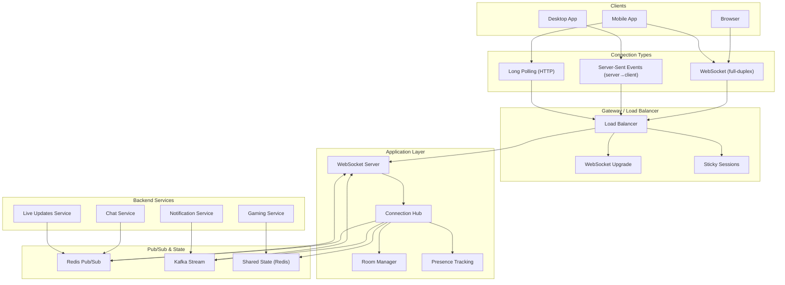

# Real-Time APIs: WebSocket, SSE, and Long Polling

> Real-time APIs enable instant data delivery from server to client — pushing updates as they happen rather than requiring clients to poll. WebSocket, Server-Sent Events, and long polling each address this need with different trade-offs.

## Architecture at a Glance



## What are Real-Time APIs?

Real-time APIs allow servers to push data to clients immediately when events occur, rather than clients repeatedly asking "is there new data?"

Three primary approaches:

- **WebSocket** — Full-duplex, bidirectional communication over a persistent TCP connection
- **SSE (Server-Sent Events)** — One-directional (server→client) HTTP streaming
- **Long Polling** — HTTP request that the server holds open until new data is available

## Why Real-Time APIs Were Created

HTTP was designed for request-response: clients ask, servers answer. But many applications need the server to initiate communication:

- Chat messages need immediate delivery
- Live scores need instant updates
- Collaborative editing needs real-time sync
- Notifications need to arrive without delay
- IoT telemetry streams data constantly

Polling (client repeatedly asking "any updates?") is wasteful and introduces latency. Real-time APIs eliminate polling overhead.

## When to Use Each Approach

| Use Case | Best Approach |
|----------|---------------|
| Chat / instant messaging | WebSocket (bidirectional) |
| Live notifications | SSE (server→client only) |
| Real-time dashboards | SSE |
| Multiplayer gaming | WebSocket |
| Collaborative editing | WebSocket |
| IoT sensor data | WebSocket or SSE |
| Simple one-way updates | SSE (simpler than WebSocket) |
| Legacy browser support | Long Polling (fallback) |
| Video streaming | WebSocket or dedicated protocol |

## WebSocket Protocol

### Handshake

WebSocket upgrade from HTTP:

```http
GET /chat HTTP/1.1
Host: server.example.com
Upgrade: websocket
Connection: Upgrade
Sec-WebSocket-Key: dGhlIHNhbXBsZSBub25jZQ==
Sec-WebSocket-Version: 13
Origin: https://app.example.com
```

```http
HTTP/1.1 101 Switching Protocols
Upgrade: websocket
Connection: Upgrade
Sec-WebSocket-Accept: s3pPLMBiTxaQ9kYGzzhZRbK+xOo=
```

### Frames

WebSocket communicates in frames with opcodes:

| Opcode | Type | Description |
|--------|------|-------------|
| 0x0 | Continuation | Continuation frame |
| 0x1 | Text | UTF-8 text data |
| 0x2 | Binary | Binary data |
| 0x8 | Close | Connection close |
| 0x9 | Ping | Keep-alive ping |
| 0xA | Pong | Pong response |

### WebSocket Server (Node.js + ws)

```javascript
const WebSocket = require("ws");
const server = new WebSocket.Server({ port: 8080 });

const rooms = new Map();

server.on("connection", (ws, req) => {
    const userId = getUserIdFromReq(req);
    ws.userId = userId;
    ws.rooms = new Set();

    ws.on("message", (data) => {
        const msg = JSON.parse(data);

        switch (msg.type) {
            case "join_room":
                const roomId = msg.roomId;
                ws.rooms.add(roomId);
                if (!rooms.has(roomId)) {
                    rooms.set(roomId, new Set());
                }
                rooms.get(roomId).add(ws);
                broadcast(roomId, {
                    type: "user_joined",
                    userId: ws.userId
                }, ws);
                break;

            case "chat_message":
                broadcast(msg.roomId, {
                    type: "new_message",
                    userId: ws.userId,
                    text: msg.text,
                    timestamp: Date.now()
                });
                break;

            case "typing":
                broadcast(msg.roomId, {
                    type: "typing",
                    userId: ws.userId,
                    isTyping: msg.isTyping
                }, ws);
                break;
        }
    });

    ws.on("close", () => {
        for (const roomId of ws.rooms) {
            const room = rooms.get(roomId);
            if (room) {
                room.delete(ws);
                if (room.size === 0) rooms.delete(roomId);
                broadcast(roomId, {
                    type: "user_left",
                    userId: ws.userId
                });
            }
        }
    });

    ws.on("pong", () => {
        ws.isAlive = true;
    });
});

// Heartbeat to detect dead connections
const interval = setInterval(() => {
    server.clients.forEach((ws) => {
        if (ws.isAlive === false) return ws.terminate();
        ws.isAlive = false;
        ws.ping();
    });
}, 30000);

server.on("close", () => clearInterval(interval));

// Broadcast helper
function broadcast(roomId, message, excludeWs = null) {
    const room = rooms.get(roomId);
    if (!room) return;
    const data = JSON.stringify(message);
    room.forEach((client) => {
        if (client !== excludeWs && client.readyState === WebSocket.OPEN) {
            client.send(data);
        }
    });
}
```

### WebSocket Client

```javascript
const ws = new WebSocket("wss://api.example.com/chat");

ws.onopen = () => {
    ws.send(JSON.stringify({ type: "join_room", roomId: "general" }));
};

ws.onmessage = (event) => {
    const msg = JSON.parse(event.data);
    console.log("Received:", msg);
};

ws.onclose = (event) => {
    if (event.code !== 1000) {
        // Unexpected close — reconnect
        reconnect();
    }
};

ws.onerror = (error) => {
    console.error("WebSocket error:", error);
};

// Send message
function sendMessage(roomId, text) {
    ws.send(JSON.stringify({ type: "chat_message", roomId, text }));
}

// Reconnection with exponential backoff
function reconnect(attempt = 0) {
    const delay = Math.min(1000 * Math.pow(2, attempt), 30000);
    setTimeout(() => {
        const ws = new WebSocket("wss://api.example.com/chat");
        ws.onopen = () => {
            // Rejoin rooms
            currentRooms.forEach(room => {
                ws.send(JSON.stringify({ type: "join_room", roomId: room }));
            });
        };
        attempt = 0;
    }, delay);
}
```

## Server-Sent Events (SSE)

SSE is a unidirectional push protocol over HTTP. The server sends a stream of events to the client.

### SSE Server (Node.js)

```javascript
const express = require("express");
const app = express();

// SSE endpoint
app.get("/events/:userId", (req, res) => {
    const userId = req.params.userId;

    res.writeHead(200, {
        "Content-Type": "text/event-stream",
        "Cache-Control": "no-cache",
        "Connection": "keep-alive",
        "Access-Control-Allow-Origin": "*"
    });

    // Send initial connection event
    res.write("event: connected\ndata: {}\n\n");

    // Subscribe to notification service
    const unsubscribe = notificationService.subscribe(userId, (notification) => {
        res.write(`event: ${notification.type}\n`);
        res.write(`data: ${JSON.stringify(notification.payload)}\n\n`);
    });

    // Send keep-alive every 30s to prevent timeout
    const keepAlive = setInterval(() => {
        res.write(": keepalive\n\n");
    }, 30000);

    req.on("close", () => {
        unsubscribe();
        clearInterval(keepAlive);
        res.end();
    });
});

app.listen(3001);
```

### SSE Client

```javascript
const eventSource = new EventSource("https://api.example.com/events/user_abc", {
    withCredentials: true
});

// Named events
eventSource.addEventListener("connected", (event) => {
    console.log("SSE connected");
});

eventSource.addEventListener("notification", (event) => {
    const notification = JSON.parse(event.data);
    showNotification(notification);
});

eventSource.addEventListener("order_update", (event) => {
    const update = JSON.parse(event.data);
    updateOrderStatus(update.orderId, update.status);
});

eventSource.addEventListener("message", (event) => {
    // Fallback for unnamed events
    const data = JSON.parse(event.data);
    console.log("Unnamed event:", data);
});

eventSource.onerror = (error) => {
    console.error("SSE error:", error);
    // Browser auto-reconnects
};

// Cleanup
function disconnect() {
    eventSource.close();
}
```

### SSE Event Stream Format

```
event: notification
data: {"id": "notif_123", "title": "New message", "body": "You have a new message from Alice"}
id: notif_123
retry: 5000

event: order_update
data: {"orderId": "ord_456", "status": "shipped"}
id: ord_456

: This is a comment (used for keep-alive)

data: {"type": "ping"}
```

## Long Polling

The client opens an HTTP request, the server holds it until data is available or a timeout occurs:

```javascript
// Server
app.get("/poll/:userId", async (req, res) => {
    const userId = req.params.userId;
    const timeout = 30000; // 30 seconds

    try {
        // Wait for new events or timeout
        const events = await waitForEvents(userId, timeout);

        if (events.length === 0) {
            // No events — return empty response
            return res.json({ events: [], nextPoll: Date.now() + timeout });
        }

        res.json({ events, nextPoll: Date.now() });
    } catch (err) {
        res.status(500).json({ error: "Internal server error" });
    }
});

async function waitForEvents(userId, timeout) {
    return new Promise((resolve, reject) => {
        const timer = setTimeout(() => {
            cleanup();
            resolve([]);
        }, timeout);

        const handler = (events) => {
            cleanup();
            resolve(events);
        };

        eventEmitter.once(`events:${userId}`, handler);

        const cleanup = () => {
            clearTimeout(timer);
            eventEmitter.off(`events:${userId}`, handler);
        };
    });
}
```

```javascript
// Client — long polling loop
async function startPolling() {
    while (true) {
        try {
            const response = await fetch(`/poll/user_abc`);
            const data = await response.json();

            for (const event of data.events) {
                processEvent(event);
            }
        } catch (err) {
            console.error("Poll error:", err);
            await new Promise(r => setTimeout(r, 5000)); // Back off on error
        }
    }
}
```

## Comparison Table

| Feature | WebSocket | SSE | Long Polling |
|---------|-----------|-----|--------------|
| Direction | Bidirectional | Server → Client | Client → Server |
| Protocol | ws:// / wss:// | HTTP (text/event-stream) | HTTP |
| Browser support | Yes (IE10+) | Yes (Edge 79+, no IE) | Universal |
| Auto-reconnect | No (manual) | Yes (built-in) | No (manual) |
| Binary data | Yes | No (text only) | Yes (any MIME) |
| Multiplexing | No (single connection) | Via multiple connections | No |
| Message overhead | Minimal (frames) | Low (text stream) | High (HTTP headers) |
| Scalability | Complex (stateful) | Moderate | Simple (stateless) |
| Firewall traversal | May require upgrade | Standard HTTP | Standard HTTP |
| Concurrency per client | 1 connection | 6 connections/domain | Unlimited (but costly) |

## Scaling WebSockets

### Challenge

WebSocket connections are stateful — they're long-lived TCP connections tied to a specific server instance. Scaling horizontally requires sharing state across instances.

### Redis Pub/Sub

```javascript
const Redis = require("ioredis");
const WebSocket = require("ws");

// Each server instance
const pub = new Redis();
const sub = new Redis();

// WebSocket connections by room
const connections = new Map();

// Subscribe to Redis channel for cross-instance messaging
sub.subscribe("chat:room:general");
sub.on("message", (channel, message) => {
    if (channel === "chat:room:general") {
        const parsed = JSON.parse(message);
        const roomConnections = connections.get("general");
        if (roomConnections) {
            roomConnections.forEach((ws) => {
                if (ws.readyState === WebSocket.OPEN) {
                    ws.send(message);
                }
            });
        }
    }
});

// When a message comes from a local client
ws.on("message", (data) => {
    const msg = JSON.parse(data);
    // Publish to Redis — all instances will receive and broadcast locally
    pub.publish("chat:room:general", data);
});
```

### Sticky Sessions

Since WebSocket connections are tied to a specific server, load balancers need sticky sessions:

```nginx
upstream websocket_backend {
    # Sticky sessions via IP hash
    ip_hash;

    server ws1.example.com:8080;
    server ws2.example.com:8080;
    server ws3.example.com:8080;
}

server {
    listen 443 ssl;
    location /ws {
        proxy_pass http://websocket_backend;
        proxy_http_version 1.1;
        proxy_set_header Upgrade $http_upgrade;
        proxy_set_header Connection "upgrade";
        proxy_set_header Host $host;
        proxy_read_timeout 86400s;
    }
}
```

### Shared State with Redis

```javascript
// Store connection metadata
async function registerConnection(userId, serverId, roomIds) {
    await redis.sadd(`user:${userId}:connections`, serverId);
    await redis.hset(`connection:${userId}:${serverId}`, {
        rooms: JSON.stringify(roomIds),
        connectedAt: Date.now()
    });
}

async function getUsersInRoom(roomId) {
    // Get all users connected to this room across all instances
    const members = await redis.smembers(`room:${roomId}:members`);
    return members;
}

async function broadcastToUser(userId, message) {
    // Find which server the user is connected to
    const servers = await redis.smembers(`user:${userId}:connections`);
    for (const serverId of servers) {
        // Publish to that server's channel
        await redis.publish(`server:${serverId}:messages`, JSON.stringify({
            userId,
            message
        }));
    }
}
```

## Reconnection Strategies

### Exponential Backoff with Jitter

```javascript
class ReconnectingWebSocket {
    constructor(url, options = {}) {
        this.url = url;
        this.maxAttempts = options.maxAttempts || Infinity;
        this.baseDelay = options.baseDelay || 1000;
        this.maxDelay = options.maxDelay || 30000;
        this.attempts = 0;
        this.connect();
    }

    connect() {
        this.ws = new WebSocket(this.url);
        this.ws.onopen = () => {
            this.attempts = 0;
            this.onreconnect?.();
        };
        this.ws.onclose = (event) => {
            if (event.code !== 1000 && this.attempts < this.maxAttempts) {
                this.scheduleReconnect();
            }
        };
        this.ws.onerror = () => {
            this.ws.close();
        };
    }

    scheduleReconnect() {
        this.attempts++;
        const delay = this.calculateDelay();
        setTimeout(() => this.connect(), delay);
    }

    calculateDelay() {
        // Exponential backoff with jitter
        const exponential = Math.min(
            this.baseDelay * Math.pow(2, this.attempts - 1),
            this.maxDelay
        );
        const jitter = Math.random() * 0.3 * exponential;
        return exponential + jitter;
    }
}
```

### State Reconciliation

After reconnecting, clients need to catch up on missed events:

```javascript
class ChatClient {
    constructor() {
        this.lastEventId = null;
        this.pendingMessages = [];
        this.connect();
    }

    connect() {
        this.ws = new WebSocket("wss://chat.example.com");

        this.ws.onopen = () => {
            // Request missed events
            if (this.lastEventId) {
                this.ws.send(JSON.stringify({
                    type: "catch_up",
                    lastEventId: this.lastEventId
                }));
            }
            // Rejoin rooms
            this.joinedRooms.forEach(roomId => {
                this.ws.send(JSON.stringify({
                    type: "join_room",
                    roomId
                }));
            });
            // Resend failed messages
            this.pendingMessages.forEach(msg => {
                this.ws.send(JSON.stringify(msg));
            });
            this.pendingMessages = [];
        };

        this.ws.onclose = () => {
            setTimeout(() => this.connect(), 1000);
        };
    }
}
```

## Best Practices

- **Use WSS (WebSocket Secure)** — encryption is mandatory
- **Implement heartbeat/ping-pong** — detect dead connections
- **Set connection limits** — max connections per user, per IP
- **Use message buffering** — queue messages for disconnected clients
- **Rate limit messages** — prevent flood attacks
- **Validate all input** — server-side validation on every message
- **Use binary framing for efficiency** — Protobuf or MessagePack over WebSocket
- **Graceful degradation** — SSE → Long Polling → Polling fallback
- **Monitor connection metrics** — active connections, messages/sec, latency
- **Implement backpressure** — slow consumer detection and handling

## Interview Questions

1. Compare WebSocket, SSE, and Long Polling. When would you use each?
2. How does the WebSocket handshake work? Explain the headers involved.
3. How do you scale WebSocket connections across multiple servers?
4. What is Redis Pub/Sub and how does it help in scaling real-time applications?
5. Design a real-time chat system supporting 10M concurrent users.
6. How do you handle reconnection in WebSocket? What is exponential backoff with jitter?
7. What are the limitations of SSE compared to WebSocket?
8. How would you implement presence detection (online/offline) for a real-time app?
9. Explain WebSocket frame types (text, binary, ping/pong, close).
10. How do you handle backpressure in a WebSocket server when a client is slow?

## Real Company Usage

| Company | Technology | Use Case |
|---------|-----------|----------|
| **Slack** | WebSocket (WAMP protocol) | Real-time messaging, presence, typing indicators |
| **Discord** | WebSocket + custom protocol | Voice/chat gaming; 10M+ concurrent connections |
| **Trello** | WebSocket via Socket.IO | Real-time board updates across users |
| **Tradier** | WebSocket | Real-time stock market data streaming |
| **Uber** | WebSocket + SSE | Real-time driver location, trip updates |
| **Coinbase** | WebSocket (FIX/WS) | Real-time cryptocurrency price feed |
| **GitHub** | SSE | Notifications, Actions log streaming |
| **LinkedIn** | SSE | Real-time notifications, feed updates |
| **Cloudflare** | SSE | Workers announcements, D1 database changes |
| **Google Docs** | WebSocket + Operational Transforms | Real-time collaborative editing |
