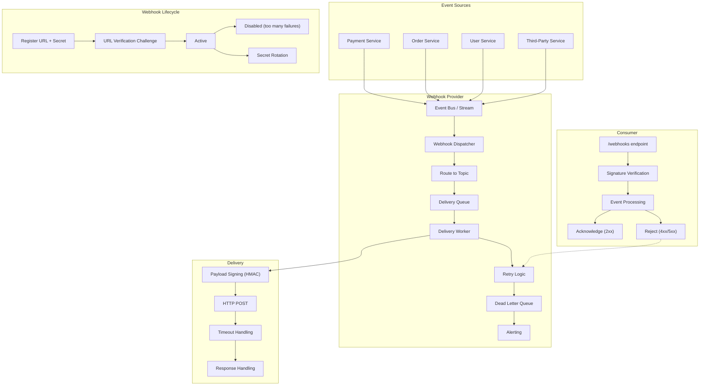

# Webhook Patterns

> Webhooks are user-defined HTTP callbacks that are triggered by specific events. They enable event-driven communication between systems — when something happens, the provider sends an HTTP request to a pre-registered URL with details about the event.

## Architecture at a Glance



## What are Webhooks?

Webhooks (also called "reverse APIs" or "HTTP callbacks") are automated messages sent from an application to other applications when an event occurs. Unlike traditional APIs where clients poll for data, webhooks push data as it happens.

```
Polling:    Client → "Any updates?" → Server → "No"     (repeat every N seconds)
Webhook:    Event happens → Server → Client "Here's the data!" (instant)
```

## Why Webhooks Were Created

Before webhooks, systems had to poll for changes — repeatedly checking for new data on a schedule. This was:

- **Inefficient** — most polls return nothing, wasting bandwidth and compute
- **Delayed** — polling frequency determines update latency
- **Complex** — each integration needed custom polling logic

Webhooks solve this by pushing data when events happen — instant, efficient, and simple.

## When to Use Webhooks

| Use Case | Best Fit |
|----------|----------|
| Payment notifications (succeeded, failed, refunded) | Excellent |
| CI/CD pipeline events (build completed, deploy failed) | Excellent |
| CRM integrations (new lead, updated contact) | Excellent |
| Email/SMS delivery status | Excellent |
| GitHub push / PR events | Excellent |
| Real-time chat or collaboration | Poor — prefer WebSocket |
| High-frequency streaming (stock ticks) | Poor — prefer SSE/WebSocket |
| Server-to-server event processing | Excellent |

## Event Delivery

### Delivery Contract

```json
{
  "id": "wh_evt_abc123",
  "type": "payment.succeeded",
  "api_version": "2025-01-15",
  "created": 1700000000,
  "data": {
    "object": {
      "id": "pay_xyz789",
      "amount": 2999,
      "currency": "usd",
      "status": "succeeded",
      "customer": "cus_456",
      "description": "Premium Plan Monthly"
    }
  },
  "previous_attributes": null,
  "livemode": true
}
```

### HTTP Request Format

```http
POST /webhooks/payment HTTP/1.1
Host: consumer.example.com
Content-Type: application/json
User-Agent: WebhookProvider/1.0
X-Webhook-ID: wh_evt_abc123
X-Webhook-Topic: payment.succeeded
X-Webhook-Delivery-Attempt: 1
X-Webhook-Signature: t=1700000000,v1=abc123def456,v1=789ghi...
Webhook-ID: wh_evt_abc123
Webhook-Signature: sha256=abc123def456

{"id":"wh_evt_abc123","type":"payment.succeeded",...}
```

## Retry Policies

### Exponential Backoff

```javascript
class WebhookDispatcher {
    getRetryDelay(attempt) {
        // Exponential backoff with jitter
        const delays = [10, 60, 300, 1800, 3600, 7200, 14400, 28800]; // seconds
        const index = Math.min(attempt - 1, delays.length - 1);
        const jitter = Math.random() * 0.1 * delays[index]; // 10% jitter
        return (delays[index] + jitter) * 1000;
    }

    async deliver(url, payload, signature, maxAttempts = 8) {
        for (let attempt = 1; attempt <= maxAttempts; attempt++) {
            try {
                const response = await axios.post(url, payload, {
                    headers: {
                        "Content-Type": "application/json",
                        "X-Webhook-Signature": signature,
                        "X-Webhook-Delivery-Attempt": attempt
                    },
                    timeout: 10000 // 10 second timeout
                });

                if (response.status >= 200 && response.status < 300) {
                    return { success: true, attempt };
                }

                // 4xx errors (except 429) are permanent failures
                if (response.status >= 400 && response.status < 500 && response.status !== 429) {
                    return { success: false, permanent: true, status: response.status };
                }
            } catch (err) {
                if (err.code === "ECONNREFUSED" || err.code === "ENOTFOUND") {
                    // Connection errors — retryable
                }
            }

            if (attempt < maxAttempts) {
                await new Promise(r => setTimeout(r, this.getRetryDelay(attempt)));
            }
        }

        return { success: false, permanent: true, reason: "max_attempts_exceeded" };
    }
}
```

### Retry Schedule Example

| Attempt | Delay | Total Elapsed |
|---------|-------|---------------|
| 1 | 0s | 0s |
| 2 | 10s | 10s |
| 3 | 60s | 70s |
| 4 | 5min | ~6min |
| 5 | 30min | ~36min |
| 6 | 1hr | ~1.6hr |
| 7 | 2hr | ~3.6hr |
| 8 | 4hr | ~7.6hr |
| 9 | 8hr | ~15.6hr |

## Idempotency Keys

Webhook delivery is "at least once" — consumers may receive the same event multiple times due to retries.

```javascript
// Consumer: deduplicate via event ID
class WebhookConsumer {
    constructor() {
        this.processedEvents = new Set();
    }

    async handleWebhook(req, res) {
        const eventId = req.headers["x-webhook-id"] || req.body.id;

        // Check for duplicate
        if (this.processedEvents.has(eventId)) {
            return res.status(200).json({ status: "already_processed" });
        }

        // Process event
        try {
            await this.processEvent(req.body);
            this.processedEvents.add(eventId);

            // Cleanup old entries (keep last 24h worth)
            this.cleanupProcessedEvents();

            res.status(200).json({ status: "ok" });
        } catch (err) {
            // Processing error — tell provider to retry
            res.status(500).json({ error: "processing_failed" });
        }
    }
}
```

## Payload Signing (HMAC)

### Provider Side

```javascript
const crypto = require("crypto");

function signPayload(payload, secret) {
    const timestamp = Math.floor(Date.now() / 1000);
    const payloadStr = JSON.stringify(payload);
    const signedPayload = `${timestamp}.${payloadStr}`;
    const signature = crypto
        .createHmac("sha256", secret)
        .update(signedPayload)
        .digest("hex");

    return {
        signature: `t=${timestamp},v1=${signature}`,
        headers: {
            "X-Webhook-Signature": `t=${timestamp},v1=${signature}`
        }
    };
}
```

### Consumer Side (Verification)

```javascript
const crypto = require("crypto");

function verifyWebhookSignature(body, signatureHeader, secret) {
    const payload = JSON.stringify(body);

    // Parse signature header
    const parts = signatureHeader.split(",").reduce((acc, part) => {
        const [key, value] = part.split("=");
        acc[key] = value;
        return acc;
    }, {});

    const timestamp = parts.t;
    const expectedSig = parts.v1;

    if (!timestamp || !expectedSig) {
        throw new Error("Invalid signature format");
    }

    // Prevent replay attacks — timestamps older than 5 minutes
    const now = Math.floor(Date.now() / 1000);
    if (now - parseInt(timestamp) > 300) {
        throw new Error("Signature expired");
    }

    // Recompute signature
    const signedPayload = `${timestamp}.${payload}`;
    const computedSig = crypto
        .createHmac("sha256", secret)
        .update(signedPayload)
        .digest("hex");

    // Constant-time comparison
    if (!crypto.timingSafeEqual(Buffer.from(computedSig), Buffer.from(expectedSig))) {
        throw new Error("Signature mismatch");
    }

    return { valid: true, timestamp };
}

// Express middleware
app.post("/webhooks/payment", express.raw({ type: "application/json" }), (req, res) => {
    const signature = req.headers["x-webhook-signature"];
    const secret = process.env.WEBHOOK_SECRET;

    try {
        verifyWebhookSignature(req.body, signature, secret);
        // Process webhook
        res.status(200).json({ received: true });
    } catch (err) {
        res.status(401).json({ error: "Invalid signature" });
    }
});
```

## Filtering

Allow consumers to subscribe to specific event types:

```
POST /api/webhooks
{
  "url": "https://consumer.example.com/webhooks",
  "events": ["payment.succeeded", "payment.failed"],
  "description": "Payment notifications for accounting system"
}
```

```javascript
// Provider-side filtering
class WebhookEndpoint {
    constructor(event, config) {
        this.url = config.url;
        this.events = config.events; // ["payment.*"] for wildcard
        this.secret = config.secret;
        this.active = true;
    }

    matchesEvent(eventType) {
        return this.events.some(pattern => {
            if (pattern === "*") return true;
            if (pattern.endsWith("*")) {
                return eventType.startsWith(pattern.slice(0, -1));
            }
            return pattern === eventType;
        });
    }
}
```

## Batching

Send multiple events in a single request:

```json
[
  {
    "id": "evt_1",
    "type": "order.created",
    "data": { "order_id": "ord_001" }
  },
  {
    "id": "evt_2",
    "type": "order.created",
    "data": { "order_id": "ord_002" }
  },
  {
    "id": "evt_3",
    "type": "payment.succeeded",
    "data": { "payment_id": "pay_001" }
  }
]
```

```javascript
class BatchingDispatcher {
    constructor(batchSize = 10, batchWindow = 5000) {
        this.batchSize = batchSize;
        this.batchWindow = batchWindow;
        this.queues = new Map(); // url -> events[]
    }

    enqueue(endpoint, event) {
        if (!this.queues.has(endpoint.url)) {
            this.queues.set(endpoint.url, { endpoint, events: [] });
        }

        const batch = this.queues.get(endpoint.url);
        batch.events.push(event);

        if (batch.events.length >= this.batchSize) {
            this.flush(endpoint.url);
        } else if (!batch.timer) {
            batch.timer = setTimeout(() => this.flush(endpoint.url), this.batchWindow);
        }
    }

    async flush(url) {
        const batch = this.queues.get(url);
        if (!batch || batch.events.length === 0) return;

        clearTimeout(batch.timer);
        batch.timer = null;

        const events = batch.events.splice(0);
        await this.sendBatch(batch.endpoint, events);
    }
}
```

## Consumer Verification (URL Challenge)

Webhook providers verify ownership of the callback URL during registration:

```javascript
// Provider sends a verification challenge
app.post("/api/webhooks/register", async (req, res) => {
    const { url, events, secret } = req.body;

    // Send verification challenge
    const challenge = crypto.randomBytes(32).toString("hex");
    try {
        const response = await axios.post(url, {
            challenge,
            type: "url_verification"
        }, {
            headers: { "Content-Type": "application/json" },
            timeout: 5000
        });

        // Consumer must echo back the challenge
        if (response.data.challenge === challenge) {
            const webhook = await saveWebhookEndpoint({ url, events, secret });
            return res.status(201).json(webhook);
        }
    } catch (err) {
        return res.status(400).json({ error: "Verification failed" });
    }
});

// Consumer handles verification
app.post("/webhooks", (req, res) => {
    if (req.body.type === "url_verification") {
        // Echo back the challenge
        return res.json({ challenge: req.body.challenge });
    }

    // Normal webhook processing
    processWebhook(req.body);
    res.status(200).json({ received: true });
});
```

## Dead Letter Queues (DLQ)

Events that fail all delivery attempts are sent to a DLQ for manual inspection:

```javascript
class DeadLetterQueue {
    constructor() {
        this.dlq = []; // In production: SQS, Kafka, or database
    }

    async sendToDLQ(endpoint, event, reason, attempts) {
        const dlqEntry = {
            id: event.id,
            endpoint: endpoint.url,
            topic: event.type,
            payload: event,
            reason,
            attempts,
            failedAt: new Date().toISOString(),
            lastError: reason
        };

        this.dlq.push(dlqEntry);
        await this.notifyAdmin(dlqEntry);
        await this.storeToDatabase(dlqEntry);
    }

    async replay(eventId) {
        const entry = this.dlq.find(e => e.id === eventId);
        if (entry) {
            await this.deliver(entry.endpoint, entry.payload);
        }
    }

    async notifyAdmin(entry) {
        await alertingService.send({
            type: "webhook_dlq",
            severity: "warning",
            data: entry
        });
    }
}
```

## Webhook vs Polling vs Streaming

| Aspect | Webhook | Polling | Streaming (WebSocket/SSE) |
|--------|---------|---------|--------------------------|
| Direction | Server → Client | Client → Server | Bidirectional / Server→Client |
| Latency | Instant (event-driven) | Delay (poll interval) | Instant |
| Efficiency | Best (only when events happen) | Worst (constant requests) | Good (persistent connection) |
| Complexity | Moderate | Simple | High |
| Reliability | At-least-once (retries) | Best-effort | Connection-dependent |
| Consumer requirement | Public HTTP endpoint | Any HTTP client | Persistent connection |
| Firewall | Outbound to consumer | Outbound to provider | Variable |
| Scaling | Easy (stateless) | Easy | Complex (stateful) |
| Use case | Event-driven integrations | Simple status checks | Real-time UIs, chat, live data |

## Best Practices

- **Sign all payloads** — HMAC-SHA256 to verify authenticity
- **Include a unique event ID** — consumers deduplicate via this ID
- **Support filtering** — let consumers choose which events to receive
- **Implement exponential backoff** — don't hammer failing endpoints
- **Set reasonable timeouts** — 10 seconds is generous
- **Provide a dashboard** — monitor delivery status, retries, failures
- **Allow manual replay** — replay from DLQ after fixing consumer issues
- **Rate limit per endpoint** — protect your system from slow consumers
- **Version webhook payloads** — webhook schemas should have their own version
- **Document payload schemas** — publish JSON Schema for each event type
- **Send test webhooks** — let consumers verify their integration

## Interview Questions

1. How do webhooks differ from polling? When would you use each?
2. How do you ensure webhook delivery is secure? Explain HMAC signing.
3. What is a dead letter queue and why is it important for webhooks?
4. Design a webhook system that delivers millions of events per minute.
5. How do you handle webhook idempotency when consumers receive duplicates?
6. Explain exponential backoff with jitter for webhook retries.
7. What is webhook URL verification and why is it necessary?
8. How would you implement webhook batching? What are the trade-offs?
9. Compare webhooks vs WebSocket for real-time event delivery.
10. How do you monitor webhook system health and detect failing consumer endpoints?

## Real Company Usage

| Company | Webhooks | Details |
|---------|----------|---------|
| **Stripe** | Payment webhooks | Industry gold standard; HMAC signing, retry with exponential backoff, dashboard |
| **GitHub** | Repository events | push, pull_request, issues, release; HMAC secret verification |
| **Twilio** | SMS/voice status | Call and message status callbacks; URL verification on registration |
| **Slack** | Events API | Channel messages, app mentions; URL verification challenge |
| **Shopify** | Store events | Orders, products, customers; multiple webhook versions |
| **Square** | Payment webhooks | Payments, orders, inventory; with retry and DLQ |
| **SendGrid** | Email events | Delivered, opened, bounced, spam reports; category filtering |
| **PagerDuty** | Incident webhooks | Incidents created, acknowledged, resolved; custom event transformer |
