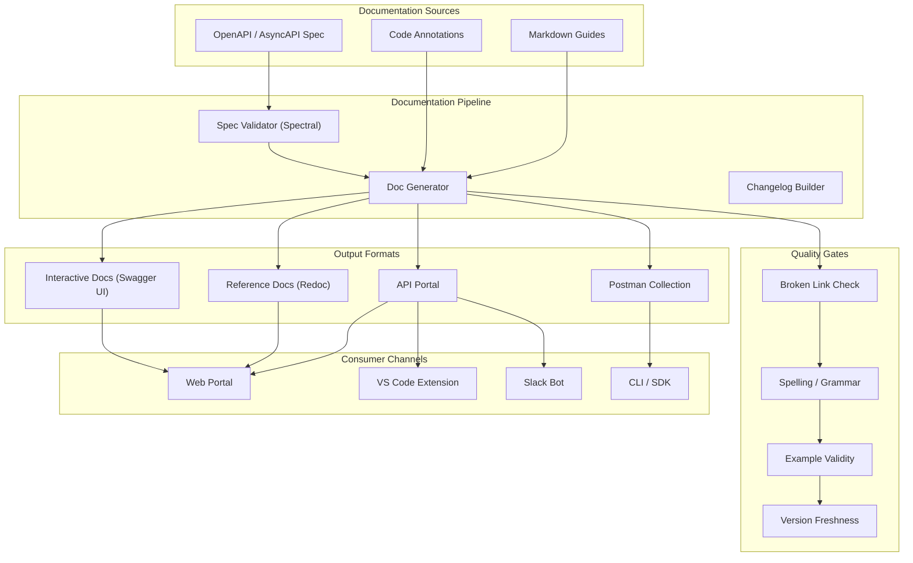

# API Documentation Strategies

> API documentation is the primary interface between your API and its consumers. Great documentation turns a functional API into an adopted one — reducing support burden, accelerating integration, and preventing misuse.

## Architecture at a Glance



## What is API Documentation?

API documentation is the complete set of artifacts that explain how to use an API — specification files, reference docs, tutorials, code examples, changelogs, migration guides, and interactive consoles. The OpenAPI Specification (formerly Swagger) has become the industry-standard format for REST APIs, while AsyncAPI covers event-driven APIs and GraphQL uses its own schema definition language.

## Why API Documentation Matters

APIs are products. Poor documentation is the #1 reason developers abandon an API. Companies like Stripe and Twilio invest heavily in documentation because it directly drives adoption, reduces support tickets (Stripe reports 30% fewer tickets after doc improvements), and enables self-serve integration.

## Documentation Approaches

**Design-First:** Write the OpenAPI spec before implementation. The spec becomes the source of truth; documentation is generated from it. Best for public APIs, developer experience focus.

**Code-First:** Annotate code with decorators/annotations that generate the spec (e.g., Swashbuckle for .NET, SpringDoc for Java, FastAPI for Python). Faster iteration, but spec quality depends on annotation discipline.

**Hybrid:** Design-first for the public contract, code-first for internal endpoints. Requires sync tooling to keep both in alignment.

## Key Tools Compared

| Tool | Purpose | Best For |
|------|---------|----------|
| Swagger UI | Interactive docs from OpenAPI | Quick developer playgrounds |
| Redoc/Redocly | Static reference docs | Clean, searchable reference |
| Stoplight | Full design + docs platform | API-first teams |
| Postman | Collections + monitoring | Integration testing |
| ReadMe | Developer hub | Public API portals |
| Docusaurus | Custom doc sites | Documenting ecosystems |
| Bump.sh | Versioned API docs | API changelog management |

## Hands-on Example: OpenAPI Spec to Swagger UI

```yaml
openapi: 3.1.0
info:
  title: Payment API
  version: 2.4.0
  description: |
    Process payments, manage refunds, and retrieve transaction history.
    See [changelog](./CHANGELOG.md) for recent updates.
  contact:
    name: API Support
    url: https://docs.example.com/support
    email: api-support@example.com
  x-logo:
    url: https://example.com/logo.svg
    backgroundColor: '#1a1a2e'
servers:
  - url: https://api.example.com/v2
    description: Production
  - url: https://api.staging.example.com/v2
    description: Staging
paths:
  /payments:
    post:
      summary: Create a payment
      description: |
        Initiates a payment using the specified payment method.
        Idempotent — send the same `Idempotency-Key` to safely retry.
      operationId: createPayment
      x-codeSamples:
        - lang: cURL
          source: |
            curl -X POST https://api.example.com/v2/payments \
              -H "Authorization: Bearer $API_KEY" \
              -H "Idempotency-Key: 7d54fa32-..." \
              -H "Content-Type: application/json" \
              -d '{
                "amount": 2999,
                "currency": "usd",
                "source": "tok_visa",
                "description": "Pro plan — monthly"
              }'
      parameters:
        - name: Idempotency-Key
          in: header
          required: true
          schema:
            type: string
            format: uuid
          description: Unique key for idempotent retries
      requestBody:
        required: true
        content:
          application/json:
            schema:
              $ref: '#/components/schemas/CreatePaymentRequest'
      responses:
        '201':
          description: Payment created
          headers:
            Request-Id:
              schema:
                type: string
              description: Trace ID for support
          content:
            application/json:
              schema:
                $ref: '#/components/schemas/Payment'
        '409':
          description: Idempotency conflict — same key used with different payload
```

## Documentation Quality Checklist

- [ ] Every endpoint has at least one code example (cURL + at least one SDK)
- [ ] All request/response schemas have descriptions on each field
- [ ] Error responses documented with schema examples
- [ ] Authentication/authorization section explains how to get credentials
- [ ] Rate limiting documented with headers and limits
- [ ] Pagination explained with example responses
- [ ] Changelog maintained with migration guides for breaking changes
- [ ] Search works across all documentation pages
- [ ] Mobile-responsive layout
- [ ] Version badge visible on every page

## API Portal Features to Invest In

| Feature | Impact |
|---------|--------|
| API key self-service | Reduces sign-up friction by 40% |
| Interactive console | Allows try-before-you-integrate |
| SDK snippets auto-gen | Cuts integration time by 60% |
| Webhook simulator | Enables offline testing |
| Status page integration | Builds trust during outages |
| Changelog notifications | Drives API adoption awareness |

## Interview Questions

**Q1: How do you version documentation when the API has multiple versions?**
Use a documentation portal that supports version selectors. Each OpenAPI spec is versioned separately; the portal shows a version dropdown. Mark deprecated versions with sunset banners. Redirect old doc URLs to the latest version.

**Q2: Design a documentation system for a team of 50 microservices.**
Central API portal with a service catalog. Each service publishes its OpenAPI spec to a registry (e.g., Apicurio, Schema Registry). The portal aggregates specs, cross-references schemas, and shows service dependencies. Each service team owns their spec; portal updates on merge to main via CI.

**Q3: How do you ensure documentation stays in sync with implementation?**
Use contract testing as a CI gate. The OpenAPI spec is the source of truth; run Spectral linting on every PR, and use Dredd or Schemathesis to verify the implementation matches the spec. Fail the build if docs drift by more than a configurable threshold.

## Best Practices

- **Treat docs like code** — version control, peer review, CI validation
- **Show, don't tell** — real code examples beat prose every time
- **Design for failure** — document every error code with cause and resolution
- **Maintain a changelog** — consumers need migration paths, not surprises
- **Measure doc effectiveness** — track search queries, page views, support ticket correlation
- **Accessibility matters** — contrast, alt text on diagrams, keyboard-navigable interactive consoles

## Real Company Usage

| Company | Approach |
|---------|----------|
| **Stripe** | Gold standard. Every endpoint has cURL + 7 SDK examples. API reference + guides + playbooks. Docs drive developer experience. |
| **Twilio** | Docs include SDK snippets auto-detected from user agent. Dynamic phone number in examples. |
| **GitHub** | OpenAPI spec with Octokit SDKs. Docs generated via Docusaurus from spec + markdown. |
| **Stripe** | Versioned docs portal: every API version (2015-10, 2020-08, etc.) has its own docs. |