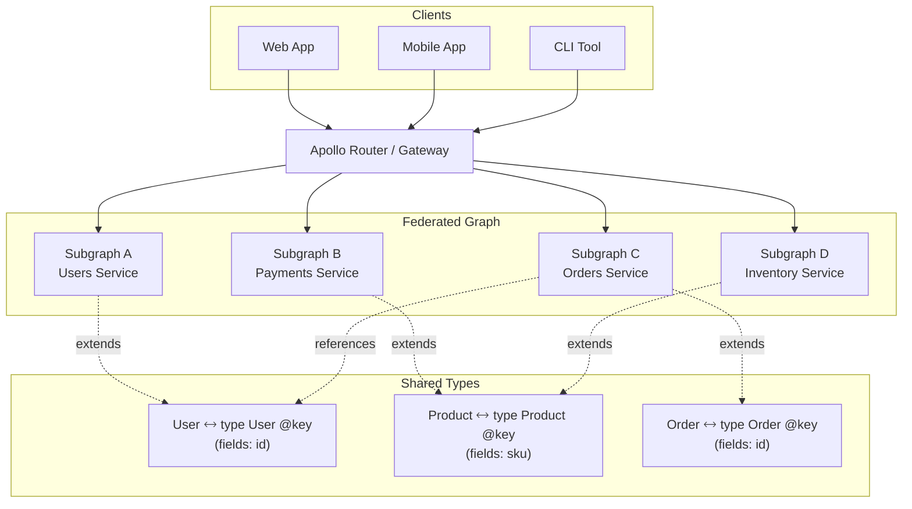

# GraphQL Federation

> Apollo Federation is a distributed GraphQL architecture that lets you compose a single unified graph from multiple subgraphs — each owned by a separate team — enabling autonomous service ownership without sacrificing the benefits of a unified API layer.

## Architecture at a Glance



## What is GraphQL Federation?

Federation is Apollo's approach to splitting a GraphQL schema across multiple services. Each subgraph defines its portion of the schema independently. A supergraph schema (composed from all subgraph schemas) is served by a router/gateway that routes incoming queries to the appropriate subgraphs, merging results transparently.

## Why Federation was Created

Monolithic GraphQL servers become bottlenecks as organizations grow. Multiple teams modifying a single schema leads to merge conflicts, coordinated deployments, and tight coupling. Federation solves this by letting each team own a subgraph — they can deploy independently, choose their own data sources, and evolve their schema without breaking the unified graph.

## Federation vs Monolithic GraphQL vs REST

| Aspect | Monolithic GraphQL | Federation | REST |
|--------|-------------------|------------|------|
| Team autonomy | Low — shared schema | High — per-subgraph ownership | High — per-service ownership |
| Query efficiency | Single resolver chain | Cross-service joins via entities | N+1 requests |
| Schema evolution | Coordinated deploys | Independent subgraph deploys | Per-service versioning |
| Learning curve | Moderate | High (Federation spec) | Low |
| Best for | Small teams, startups | Enterprise, multiple teams | Simple CRUD, public APIs |

## Core Concepts

**Subgraph:** An individual GraphQL service that defines a portion of the supergraph. Each subgraph has its own schema that uses federation directives.

**Entity:** A type that can be referenced across subgraphs. Marked with `@key` and resolved via `__resolveReference`. For example, a `User` type might be defined in the users subgraph but referenced by orders, payments, and reviews subgraphs.

**Supergraph:** The composed schema that the router exposes. Generated by merging all subgraph schemas using the Rover CLI or Apollo GraphOS.

**Router/Gateway:** The runtime component that accepts incoming GraphQL requests, plans query execution across subgraphs, and merges results. Available as Apollo Router (Rust, high-performance) or @apollo/gateway (Node.js).

## Federation Directives

| Directive | Purpose | Example |
|-----------|---------|---------|
| `@key` | Defines an entity's primary key | `type User @key(fields: "id")` |
| `@external` | Field defined in another subgraph | `email: String @external` |
| `@requires` | Subgraph needs fields from another subgraph | `extends type User @requires(fields: "email")` |
| `@provides` | Subgraph can resolve fields without reaching elsewhere | `provides(fields: "name")` |
| `@shareable` | Multiple subgraphs can resolve this field | `name: String @shareable` |
| `@inaccessible` | Field exists in schema but not exposed to clients | `internalId: ID @inaccessible` |
| `@override` | One subgraph takes precedence over another | `field: String @override(from: "LegacySubgraph")` |
| `@tag` | Metadata for routing or cost analysis | `@tag(name: "internal")` |

## Hands-on Example: Two Subgraphs

**Users Subgraph (schema.graphql):**
```graphql
extend schema
  @link(url: "https://specs.apollo.dev/federation/v2.0",
        import: ["@key", "@shareable", "@external"])

type Query {
  users: [User]
  user(id: ID!): User
}

type User @key(fields: "id") {
  id: ID!
  name: String! @shareable
  email: String! @shareable
}
```

**Orders Subgraph (schema.graphql):**
```graphql
extend schema
  @link(url: "https://specs.apollo.dev/federation/v2.0",
        import: ["@key", "@external", "@requires"])

type Query {
  ordersByUser(userId: ID!): [Order]
}

type User @key(fields: "id", resolvable: false) {
  id: ID!
}

type Order @key(fields: "id") {
  id: ID!
  total: Float!
  status: String!
  user: User!
}
```

**Supergraph Composition (Rover CLI):**
```bash
# Publish subgraphs to Apollo GraphOS
rover subgraph publish my-graph@prod \
  --name users \
  --schema ./users/schema.graphql \
  --routing-url http://users-service/graphql

rover subgraph publish my-graph@prod \
  --name orders \
  --schema ./orders/schema.graphql \
  --routing-url http://orders-service/graphql

# Compose locally for development
rover supergraph compose \
  --config ./supergraph.yaml > supergraph.graphql
```

## Best Practices

- **Keep entities coarse** — `@key` on id fields; avoid composite keys unless necessary
- **Minimize cross-subgraph dependencies** — each subgraph should be independently deployable
- **Use `@shareable` judiciously** — only for fields that genuinely make sense from multiple subgraphs
- **Monitor query plan complexity** — federation can produce expensive cross-subgraph joins
- **Prefer Router (Rust) over Gateway (Node.js)** — 10x throughput improvement for high-traffic APIs
- **Implement cost analysis** — prevent runaway queries that span many subgraphs

## Interview Questions

**Q1: How does federation handle a query that needs fields from 4 different subgraphs?**
The router creates a query plan — an ordered execution DAG. First, it fetches the root entities from subgraph A. Then, for each entity, it calls `__resolveReference` on subgraphs B, C, D to populate remaining fields. Results are merged before returning to the client.

**Q2: What happens when an order subgraph needs the user's email but it's defined in the users subgraph?**
The order subgraph marks `email` as `@external` and uses `@requires(fields: "id")` to declare its dependency. The router ensures the users subgraph is queried first for the email field before calling the orders subgraph.

**Q3: How do you migrate from a monolithic GraphQL server to federation?**
Use the `@override` directive. Start by extracting one subgraph (e.g., users) and override its fields from the new subgraph while the monolith still serves them. Gradually move entities, deploy subgraphs independently, then decommission the monolith's portions.

## Real Company Usage

| Company | Federation Approach |
|---------|-------------------|
| **Netflix** | Studio API — federation for content catalog across 100+ microservices |
| **Expedia** | Unified travel graph across hotels, flights, cars, activities |
| **Shopify** | Storefront API federated across catalog, cart, checkout, payments |
| **PayPal** | Checkout graph composed from accounts, payments, risk, and compliance subgraphs |