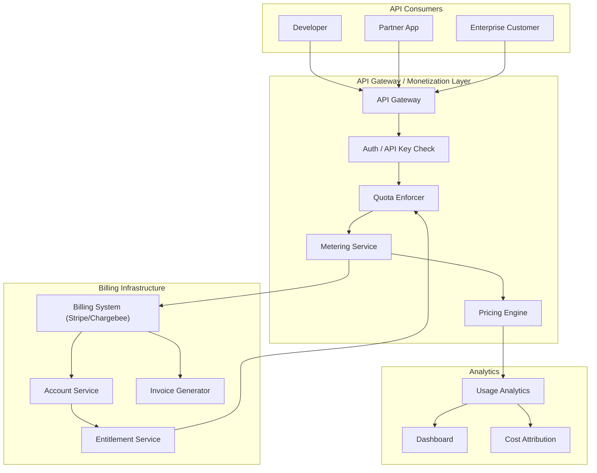

# API Monetization Patterns

> API monetization is the practice of generating revenue from API access. It ranges from simple subscription tiers to usage-based billing, revenue sharing, and API marketplaces — turning a developer interface into a product.

## Architecture at a Glance



## What is API Monetization?

API monetization is the strategy of charging for API access through various pricing models — free tiers, subscription plans, pay-as-you-go, revenue sharing, or marketplace commissions. The approach depends on whether the API is the core product (e.g., Twilio, Stripe) or a channel for an existing product (e.g., Shopify, Salesforce).

## Why API Monetization Matters

APIs are the fastest-growing B2B distribution channel. Public API marketplaces (AWS, Google, RapidAPI) generated over $500B in 2024. A well-designed monetization model aligns pricing with value delivered — charging for throughput, data access, computation, or outcomes — rather than arbitrary per-call fees.

## Pricing Models

| Model | Description | Example Companies | Best For |
|-------|-------------|-------------------|----------|
| **Freemium** | Free tier with limits; paid for more | GitHub API, Google Maps | Developer adoption, top-of-funnel |
| **Tiered** | Fixed plans with bundled usage | Stripe (per-transaction), Twilio | Predictable revenue, segment-based |
| **Usage-based** | Pay per API call/unit | AWS Lambda, OpenAI, Mapbox | Usage alignment, frictionless scale |
| **Credit-based** | Buy credits; consume per operation | Twilio, Vonage | Pre-pay model, budget control |
| **Freemium + Overages** | Free tier + auto-charge beyond limit | SendGrid, Algolia | Low friction, auto-upsell |
| **Revenue Share** | % of transaction value | Stripe, PayPal, Shopify | Platform alignment, zero upfront |
| **Enterprise** | Custom contracts, SLAs | Salesforce, AWS | High-volume, negotiated terms |

## Monetization Stack Components

**Metering Service** — Counts every API call with dimensions (endpoint, user, volume, compute time). Must be accurate within 0.1% tolerance for billing.

**Pricing Engine** — Applies the correct price based on plan, usage tier, and discounts. Supports pro-rata, annual discounts, and volume breaks.

**Quota Enforcer** — Rejects or warns when usage exceeds limits. Implemented at the API gateway for low latency (typically Redis-based counters with <5ms overhead).

**Entitlement Service** — Maps accounts to plan features. Controls which endpoints, rate limits, and data access levels an API key unlocks.

**Billing System** — Generates invoices, handles payment collection, dunning, and reconciliation. Stripe, Chargebee, Recurly, or custom.

## Hands-on Example: Usage-based Pricing with Stripe

**Metering Architecture:**
```
API Gateway logs → Kafka → Flink aggregation → Stripe Metering API → Invoice
```

**Stripe Metering API integration:**
```python
import stripe
from datetime import datetime, timezone

stripe.api_key = "sk_test_..."

def report_usage(api_key: str, customer_id: str, quantity: int = 1):
    """Report API usage to Stripe for metered billing."""
    timestamp = datetime.now(timezone.utc).isoformat()
    
    # Stripe Metering API (Usage Records)
    stripe.billing.MeterEvent.create(
        event_name="api_requests",
        identifier=f"{api_key}_{timestamp}",
        payload={
            "value": str(quantity),
            "stripe_customer_id": customer_id,
        },
        timestamp=timestamp,
    )

def get_current_usage(customer_id: str) -> dict:
    """Get aggregated usage for the current billing period."""
    usage = stripe.billing.MeterEventSummary.list(
        customer=customer_id,
        meter="api_requests",
    )
    return {
        "total_usage": sum(e.aggregated_value for e in usage),
        "billing_period": "current_month",
    }
```

**Quota enforcement at API Gateway (Redis + Lua):**
```lua
-- Rate limit check with sliding window
local key = KEYS[1]        -- "quota:{api_key}:{endpoint}"
local limit = tonumber(ARGV[1])   -- max allowed
local window = tonumber(ARGV[2])   -- time window in seconds
local now = redis.call('TIME')[1]

redis.call('ZREMRANGEBYSCORE', key, 0, now - window)
local count = redis.call('ZCARD', key)

if count >= limit then
    return 0  -- rate limited
end

redis.call('ZADD', key, now, now .. ':' .. math.random())
redis.call('EXPIRE', key, window)
return limit - count - 1  -- remaining
```

## Common Pricing Mistakes

- Underpricing enterprise tier — enterprises will pay 10x for SLAs, support, compliance
- No free tier — kills developer adoption and bottom-up sales
- Opaque pricing — developers don't adopt APIs they can't estimate costs for
- Usage spikes from free tier abuse — set per-IP/anon limits even on free tier
- Sticky pricing changes — grandfather existing customers; version new pricing

## Interview Questions

**Q1: Design a metering system that can handle 100K req/s with <1% accuracy error.**
Use a lightweight in-memory counter per gateway instance, flush to Kafka every 10 seconds. Flink aggregates by customer+endpoint+hour into a time-series DB (ClickHouse). A separate billing pipeline reads aggregated data once per hour for Stripe invoicing. The in-memory layer provides fast quota enforcement; the async pipeline handles billing accuracy.

**Q2: How do you handle billing disputes when the customer claims their API key was compromised?**
Maintain detailed audit logs per API call (timestamp, IP, User-Agent, payload hash). On dispute, replay the suspect events from logs. If key was compromised, refund the disputed charges, rotate the key, and implement key rotation policies. Consider anomaly detection on usage patterns to proactively flag compromise.

**Q3: Your API is growing 20% month-over-month; fixed-tier customers are gaming the system. How do you evolve pricing?**
Introduce a usage-based component on top of the base tier ("base + overages"). Grandfather existing customers on their current plan for 12 months. For new customers, offer only the usage-based plan with a free allocation. Communicate changes 90 days in advance with a pricing calculator showing the impact.

## Best Practices

- **Offer a free tier** — 90% of API evaluations start with free tier; it's marketing spend
- **Pricing page as product** — show clear comparisons, calculator, and "talk to sales" for enterprise
- **Usage alerts** — notify developers at 50%, 80%, 100% of their tier limit
- **Annual discounts** — 15-20% discount for annual commitments improves cash flow
- **Rate limiting is not monetization** — rate limits protect infrastructure, pricing captures value
- **Monitor developer churn** — identify pricing-related churn via exit surveys

## Real Company Usage

| Company | Model | Key Metric |
|---------|-------|------------|
| Twilio | Pay-as-you-go per message/min | $0.0079/SMS — ultra-granular |
| Stripe | Percentage + fixed fee per transaction | 2.9% + $0.30 — value-aligned (more $ = more fee) |
| Mapbox | Monthly active users (MAU) + tile requests | Free 50K MAU; $499/100K MAU |
| Algolia | Search operations + records | Free 10K ops/month; usage-based scaling |
| OpenAI | Token-based billing | $0.15/1M input tokens (GPT-4o mini) |