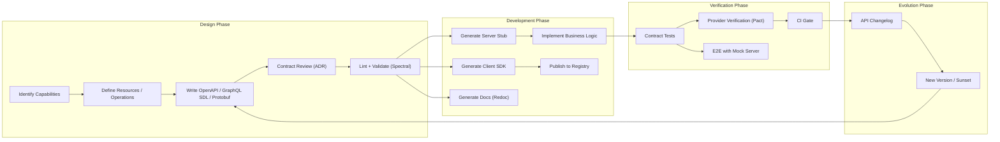

# Design-First API Workflow

> Design-first API development puts the API contract (OpenAPI, GraphQL SDL, Protobuf) before implementation. The contract becomes the source of truth, driving documentation, code generation, testing, and client SDKs — reducing integration friction and preventing contract drift.

## Architecture at a Glance



## What is Design-First API Development?

Design-first (or contract-first) is a methodology where the API contract is written and agreed upon before any implementation code is written. Tools like OpenAPI, GraphQL Schema Definition Language, or Protocol Buffers serve as the single source of truth. Code is generated from the contract, not the other way around.

## Why Design-First vs Code-First

| Aspect | Design-First | Code-First |
|--------|-------------|------------|
| Source of truth | Contract file | Code annotations |
| Collaboration | Product + Eng + Consumers review contract first | Engineering-implementation driven |
| Breaking changes | Detected at design time (before coding) | Detected at integration test time |
| Client generation | Auto-generate from contract | Must use reflection or secondary spec |
| Documentation | Always up-to-date with contract | Drifts if annotations miss updates |
| Speed to first implementation | Slower (contract negotiation) | Faster (code changes only) |
| Best for | Public APIs, B2B integrations, regulated environments | Internal APIs, prototypes, rapid iteration |

## Design-First Toolchain

| Stage | Tool | Purpose |
|-------|------|---------|
| Editing | Stoplight Studio, Insomnia, VS Code | Visual or code-based API contract editing |
| Linting | Spectral | Enforce API style rules, naming conventions, security requirements |
| Mocking | Prism, WireMock | Generate mock servers from contract for parallel frontend development |
| Code Gen | OpenAPI Generator, oapi-codegen, protoc | Generate server stubs, client SDKs, types |
| Validation | Dredd, Schemathesis, Optic | Verify implementation matches contract |
| Registry | Apicurio, Gravitee, Bump.sh | Store, version, and discover API contracts |
| Change Detection | Optic, Bump.sh | Detect breaking changes on every PR |

## Hands-on Example: OpenAPI Contract → Code

**Step 1: Write the contract (payment-api.yaml)**
```yaml
openapi: 3.1.0
info:
  title: Payment API
  version: 1.0.0
  description: Process payments and manage refunds
paths:
  /payments:
    post:
      operationId: createPayment
      summary: Create a payment
      requestBody:
        required: true
        content:
          application/json:
            schema:
              $ref: '#/components/schemas/CreatePayment'
      responses:
        '201':
          description: Payment created
          content:
            application/json:
              schema:
                $ref: '#/components/schemas/Payment'
components:
  schemas:
    CreatePayment:
      type: object
      required: [amount, currency, source]
      properties:
        amount:
          type: integer
          minimum: 50
          description: Amount in cents
        currency:
          type: string
          pattern: '^[a-z]{3}$'
          default: usd
        source:
          type: string
          description: Payment method token
    Payment:
      type: object
      properties:
        id:
          type: string
          format: uuid
        status:
          type: string
          enum: [succeeded, pending, failed]
        amount:
          type: integer
```

**Step 2: Validate and lint**
```bash
# Spectral linting
npx @stoplight/spectral-cli lint payment-api.yaml

# Check for breaking changes (vs previous version)
npx @useoptic/optic ci check payment-api.yaml --base main

# Generate mock server for parallel frontend dev
npx @stoplight/prism-cli mock payment-api.yaml --port 4010
```

**Step 3: Generate code**
```bash
# Go server stub
oapi-codegen -package api -generate server,types payment-api.yaml > internal/api/server.gen.go

# TypeScript client SDK
npx @openapitools/openapi-generator-cli generate \
  -i payment-api.yaml \
  -g typescript-axios \
  -o ./sdk/typescript

# Python client
npx @openapitools/openapi-generator-cli generate \
  -i payment-api.yaml \
  -g python \
  -o ./sdk/python
```

**Step 4: Contract tests in CI**
```yaml
# .github/workflows/api-contract.yml
name: API Contract Validation
on: [pull_request]
jobs:
  validate:
    runs-on: ubuntu-latest
    steps:
      - uses: actions/checkout@v4
      - name: Spectral Lint
        run: npx spectral lint openapi/*.yaml
      - name: Breaking Change Detection
        run: |
          npx optic ci check openapi/*.yaml \
            --base origin/main
      - name: Contract Tests
        run: |
          docker run --rm -v $PWD:/spec schemathesis/schemathesis:stable \
            run --checks all /spec/openapi/*.yaml \
            --base-url http://localhost:8080
      - name: Publish to Registry
        if: github.ref == 'refs/heads/main'
        run: |
          npx bump openapi/*.yaml \
            --token ${{ secrets.BUMP_TOKEN }} \
            --doc payment-api --branch main
```

## Change Detection Strategies

**Breaking vs Non-Breaking Changes:**

| Change | Breaking? | Example |
|--------|-----------|---------|
| Add endpoint | No | `GET /v2/payments` new feature |
| Add optional field | No | `note: string` in response |
| Add required field | Yes | Existing consumers won't send it |
| Remove field | Yes | Consumers reading it will break |
| Rename field | Yes | Consumers reading the old name |
| Narrow type | Yes | `string → enum` values consumers may not expect |
| Widen type | No | `enum{succeeded,failed} → enum{succeeded,failed,pending}` |
| Change HTTP method | Yes | `POST → PUT` idempotency contract broken |
| Add auth requirement | Yes | Existing unauthenticated calls fail |

## Interview Questions

**Q1: Your team wants to move fast with code-first. How do you convince them to adopt design-first?**
Run a pilot: take one new endpoint, do it both ways. Measure: integration time for mobile team, documentation accuracy after 2 weeks, bugs caused by contract drift. Present the data. Typically design-first reduces integration bugs by 40% and cuts documentation maintenance time by 60%.

**Q2: How do you handle API design-first when the consumer doesn't know what they want?**
Use a lightweight RFC process: the API producer drafts an ADR with the proposed contract, 2-3 potential consumers review it. Use mock servers for consumers to prototype against. Iterate the mock until consumers are satisfied before writing production code.

**Q3: Design a CI pipeline that prevents breaking changes from reaching production.**
PR check: 1) Spectral lint for style and security, 2) Optic diff against the base branch's spec to detect breaking changes, 3) Schemathesis fuzz testing against the deployed staging environment, 4) Pact contract tests between provider and consumer. Breaking changes require a major version bump and are flagged for human review.

## Best Practices

- **Version your API contract with the code** — store in the same repo, same branch
- **One small PR per contract change** — large spec diffs hide breaking changes
- **Review contract changes in design review** — before implementation begins
- **Generate mocks automatically** — frontend and mobile teams develop in parallel
- **Publish contracts to a registry** — discoverability for internal teams
- **Include examples in the contract** — examples are worth a thousand words of description

## Real Company Usage

| Company | Approach |
|---------|----------|
| **Stripe** | Design-first with internal API review board. Every endpoint has a written spec before any implementation. |
| **GitHub** | OpenAPI spec is the source of truth; Octokit SDKs generated from it. PRs with API changes require spec updates first. |
| **Uber** | Uses ProtoBuffers as the contract layer across 2200+ microservices. Design reviews start with proto changes. |
| **Microsoft** | Azure API management requires OpenAPI specs; REST API guidelines enforced via Spectral rulesets. |