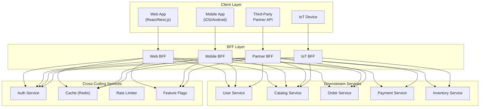

# Backend for Frontend (BFF) Pattern

> The Backend for Frontend (BFF) pattern creates a dedicated backend layer per client type (web, mobile, IoT, etc.) — each optimized for that client's specific UX requirements, data shape, and interaction patterns — rather than forcing all clients through a single general-purpose API.

## Architecture at a Glance



## What is the BFF Pattern?

The BFF pattern, popularized by SoundCloud and Phil Calçado, creates a separate backend service for each client experience. Each BFF owns the client-specific API contract, data aggregation, and UI logic — letting the backend services (users, catalog, orders) remain generic and reusable while each client gets exactly the API it needs.

## Why BFF was Created

Traditional API design forces all clients through one API. Mobile apps need different data shapes than web apps (smaller payloads, fewer round trips, offline support). Web apps need different authentication flows (cookies vs tokens). IoT devices need binary protocols. Without BFF, each client team works around the general API — client-side joins, overfetching, underfetching, and custom middleware — leading to duplicated logic and poor performance.

## BFF vs API Gateway vs GraphQL

| Aspect | BFF | API Gateway | GraphQL |
|--------|-----|-------------|---------|
| Scope | Per-client backend | Cross-cutting proxy | Query language |
| Data shaping | Client-specific aggregation | Routing, auth, rate limiting | Client-specified fields |
| Team ownership | Client team owns BFF | Platform team owns gateway | Either |
| Client coupling | High — optimized per client | Low — generic | Medium — schema shared |
| Response format | REST, gRPC, or GraphQL | REST (HTTP) | GraphQL |
| Caching | Per-BFF cache | Global cache | Per-query (hard) |
| Complexity | Moderate (many small services) | Low (single service) | Moderate |

## When to Use BFF

- **Different client types** (web, iOS, Android, IoT) with different UX requirements
- **Mobile-first** — mobile needs smaller payloads, fewer API calls, offline capability
- **Client team autonomy** — each frontend team owns their backend contract
- **Legacy backend migration** — BFF can translate legacy APIs into modern client-facing contracts
- **Third-party API exposure** — BFF can enforce partner-specific limits, auth, and data scoping

## Hands-on Example: E-Commerce BFF

**Web BFF (Node.js/Express):**
```javascript
const express = require('express');
const app = express();

// Web BFF aggregates for product page
app.get('/api/v1/products/:id', async (req, res) => {
  const [product, reviews, inventory] = await Promise.all([
    catalogService.getProduct(req.params.id),
    reviewService.getReviews(req.params.id, { page: 1, limit: 20 }),
    inventoryService.getStock(req.params.id),
  ]);

  // Web gets full product + reviews + stock
  res.json({
    ...product,
    reviews: reviews.items,
    reviewCount: reviews.total,
    inStock: inventory.available > 0,
    estimatedDelivery: calculateDelivery(inventory.warehouse),
    similarProducts: [],  // populated via separate call
  });
});
```

**Mobile BFF (Node.js/Express):**
```javascript
// Mobile BFF — optimized for small payloads, offline-first
app.get('/api/mobile/v1/products/:id', async (req, res) => {
  const product = await catalogService.getProduct(req.params.id, {
    fields: ['id', 'name', 'price', 'image_url', 'in_stock'],
  });

  // Mobile gets minimal payload — no reviews on product page
  // Reviews are fetched separately when user scrolls
  res.json({
    ...product,
    _links: {
      reviews: `/api/mobile/v1/products/${req.params.id}/reviews`,
      addToCart: `/api/mobile/v1/cart/items`,
    },
  });
});

// Mobile-specific offline sync endpoint
app.post('/api/mobile/v1/sync', async (req, res) => {
  const { lastSyncTimestamp, pendingOperations } = req.body;
  
  const changes = await changeLogService.getChangesSince(lastSyncTimestamp);
  const results = await processPendingOperations(pendingOperations);
  
  res.json({
    serverChanges: changes,
    operationResults: results,
    syncTimestamp: Date.now(),
  });
});
```

**BFF with GraphQL (Apollo Federation):**
```javascript
// Web BFF uses federation to compose from subgraphs
const { ApolloServer } = require('@apollo/server');
const { buildSubgraphSchema } = require('@apollo/subgraph');

const typeDefs = gql`
  extend type Query {
    webProductPage(id: ID!): WebProductPage
  }

  type WebProductPage {
    product: Product
    reviews: [Review]
    stock: StockInfo
    recommendations: [Product]
  }
`;

// Web BFF stitches subgraph data into the exact shape web needs
const resolvers = {
  Query: {
    webProductPage: async (_, { id }, { dataSources }) => {
      const [product, reviews, stock, recs] = await Promise.all([
        dataSources.catalog.getProduct(id),
        dataSources.reviews.getReviews(id),
        dataSources.inventory.getStock(id),
        dataSources.recommendations.getForProduct(id),
      ]);
      return { product, reviews, stock, recommendations: recs };
    },
  },
};
```

## BFF Concerns

| Concern | Mitigation |
|---------|-----------|
| Duplication | Shared libraries for auth, logging, error handling |
| N+1 BFFs | Too many BFFs = maintenance burden. Consolidate when clients are similar |
| BFF becomes a monolith | Split into domain BFFs (search BFF, cart BFF, checkout BFF) |
| Latency stacking | BFFs call downstream services in parallel with Promise.all |
| Deployment coupling | Each BFF deploys independently, owned by the client team |
| Version drift | Shared contract registry; BFFs pin which version of each service they consume |

## Interview Questions

**Q1: Design a BFF strategy for a company with web, iOS, Android, and smart TV clients.**
Four BFFs: Web BFF (REST, cookie auth, SSR-friendly), iOS BFF (GraphQL, token auth, offline-first), Android BFF (GraphQL, token auth, offline-first), TV BFF (HTTP/2 streaming, minimal payload, 10ft UI). Shared libraries for auth and logging. Each BFF owned by the respective client team. Downstream services remain generic.

**Q2: How do you prevent logic duplication across multiple BFFs?**
Extract cross-cutting concerns into shared libraries (auth middleware, error handling, logging, feature flags). Business logic stays in downstream services. BFFs only handle client-specific aggregation and formatting. If three BFFs need the same aggregation, it belongs in a downstream service or a shared library.

**Q3: What's the difference between BFF and API Gateway?**
API Gateway handles cross-cutting infrastructure: routing, auth, rate limiting, request transformation. BFF handles client-specific business logic: data aggregation, response shaping, client-specific features. In practice, BFF often sits behind the API Gateway — the gateway routes `/api/web/*` to the Web BFF, `/api/mobile/*` to the Mobile BFF.

## Best Practices

- **One BFF per distinct client experience** — not per platform. Web and TV might share a BFF if the UX is similar
- **BFF owned by the client team** — the team that builds the UI owns the BFF
- **Shared libraries for cross-cutting** — don't reimplement auth in every BFF
- **Keep BFFs stateless** — state belongs in downstream services or client
- **Monitor BFF metrics separately** — latency, error rate, and traffic per client
- **Deploy BFFs independently** — client teams should not coordinate releases

## Real Company Usage

| Company | BFF Strategy |
|---------|-------------|
| **SoundCloud** | Pioneered the pattern. Web, iOS, Android each have their own BFF. |
| **Netflix** | BFF per device type (TV, mobile, web) — each optimized for the UI surface and network characteristics. |
| **Shopify** | Storefront API is a BFF for web checkout; mobile uses a separate BFF with offline sync. |
| **Spotify** | BFF per platform (Web API, Mobile API, Car Thing API) — each tailored to the interaction model. |