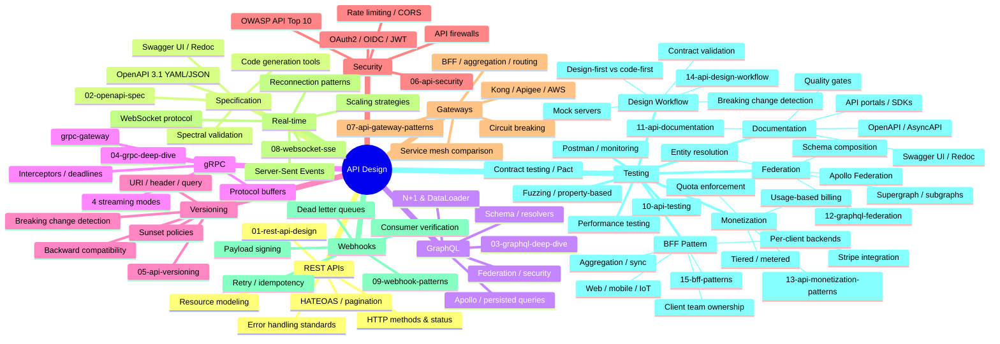
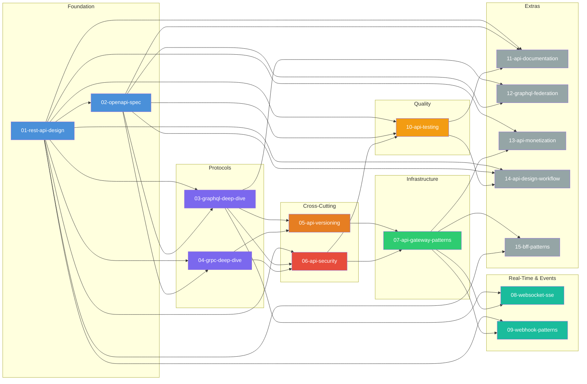

# 23 — API Design

> Master the art and science of designing, building, documenting, securing, and evolving APIs at scale.

## Module Overview

API Design is the backbone of modern distributed systems. This module covers the full spectrum — from RESTful design principles and OpenAPI documentation to GraphQL, gRPC, real-time protocols, security, gateway patterns, testing, and webhooks. Each file dives deep into architecture, hands-on examples, best practices, and real-world usage.

## Learning Path

1. **Start with REST** (01) — it remains the most widely adopted API style and establishes vocabulary (resources, methods, status codes).
2. **Specify with OpenAPI** (02) — learn how to describe REST APIs formally; essential for documentation, code generation, and validation.
3. **Explore Modern Protocols** (03, 04) — GraphQL and gRPC solve different problems; understand when each beats REST.
4. **Manage Change** (05) — API versioning is inevitable; learn strategies that minimize consumer pain.
5. **Secure Everything** (06) — OAuth2, JWT, and OWASP Top 10 are non-negotiable for production APIs.
6. **Scale with Gateways** (07) — API gateways and service meshes handle cross-cutting concerns at the infrastructure layer.
7. **Go Real-Time** (08) — WebSockets and SSE for low-latency, event-driven communication.
8. **Automate with Webhooks** (09) — event-driven callback patterns for async integrations.
9. **Verify Quality** (10) — contract testing, fuzzing, and performance testing ensure API reliability.
10. **Document** (11) — great API docs reduce support tickets and accelerate adoption.
11. **Federate** (12) — GraphQL Federation for distributed schema ownership at scale.
12. **Monetize** (13) — usage-based billing, tiered plans, and metering infrastructure.
13. **Design-First** (14) — contract-first workflow with breaking change detection and mock servers.
14. **Apply BFF** (15) — dedicated backends per client type for optimized mobile, web, and IoT experiences.

---
Previous: [22 — AI/ML System Design](../22-AI-ML-System-Design/README.md)
Next: [24 — Testing & Quality Engineering](../24-Testing-Quality-Engineering/README.md)
